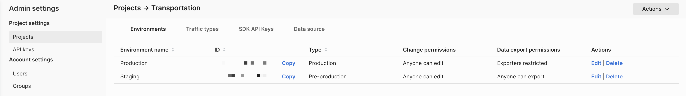
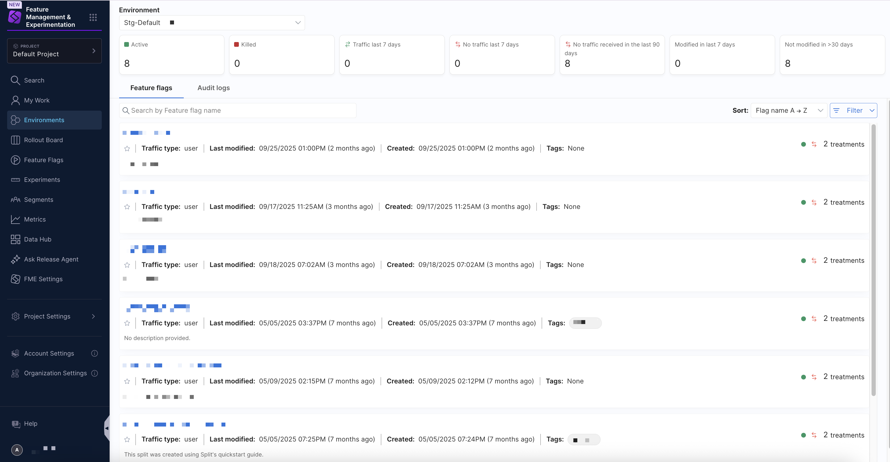
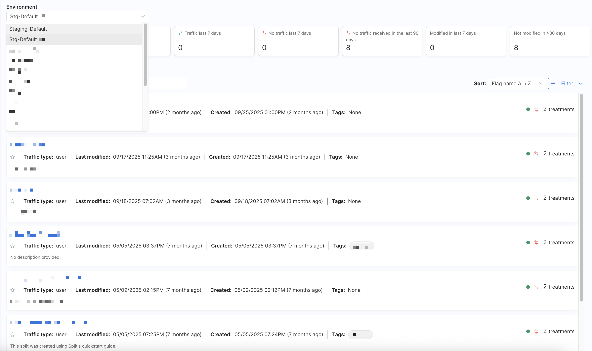
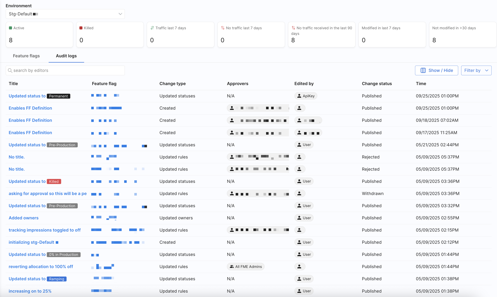
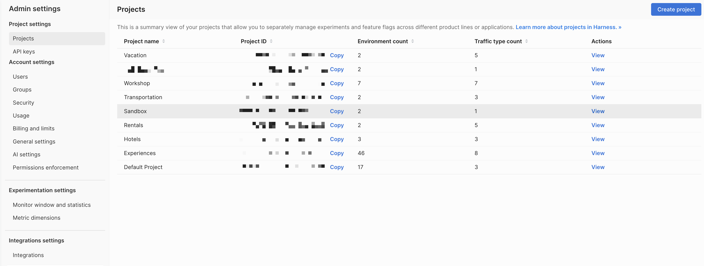
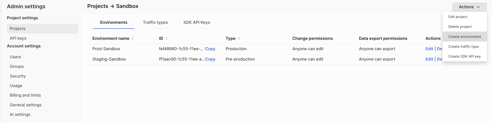
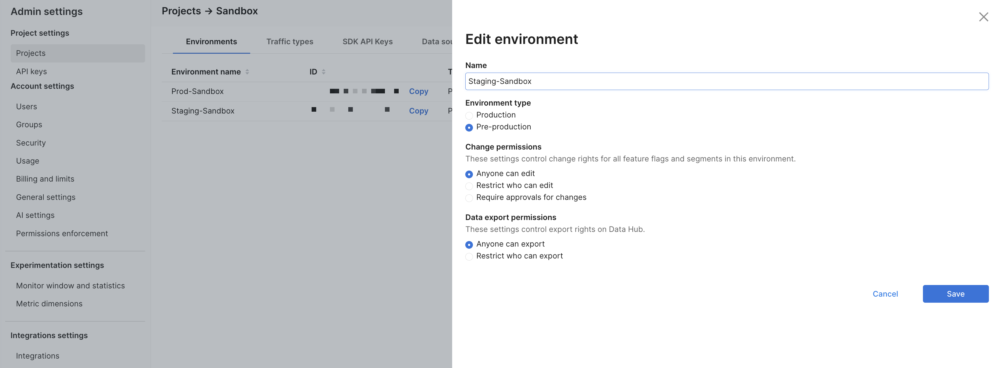

Environments allow you to [manage your feature flags](/docs/category/manage-feature-flags) throughout your development lifecycle, from local development to staging and production. When you create an account in Harness FME, your default project is provided with two environments named `Staging` and `Production` by default. Each environment is set up with its own API keys. These API keys are used to connect the FME SDK to a specific environment.

Each feature flag that you create has its own set of [targeting rules](/docs/feature-management-experimentation/feature-management/setup/define-feature-flag-treatments-and-targeting#targeting-rules) in each environment, allowing you to define different targeting rules in your staging and production environments. For example, you can change the targeting rules for a specific feature flag for quality testing on your staging environment with confidence that the feature flag is not enabled for users on your production environment.

## Localhost environment

A developer can set up a feature flag on their development machine without the SDK requiring network connectivity. This is called the `localhost` environment. This environment does not show up in the user interface because, by definition, that requires network connectivity. 

To configure your SDK for this mode, see the `Localhost mode` section in the [Harness FME SDK documentation](/docs/feature-management-experimentation/sdks-and-infrastructure).

## Manage environments

To manage your environments for a project, navigate to **FME Settings** and select **View** for the specified project.

Use the **Actions** dropdown menu to add environments or click **Edit** on an environment to edit an existing one. Every project in Harness FME has its own environments. 

:::info
Environments typically represent the software delivery lifecycle: **Dev**, **Test**, **Staging**, and **Production**. There's usually no reason to have more than one Harness FME environment per software delivery lifecycle environment unless multiple projects use the same environments. However, there are cases where you might have multiple staging, dev, or even production environments in Harness FME. 

Harness recommends following these best practices:

* Every feature flag should go through all your team's environments (dev, test, staging, and production). Skipping directly to production can lead to bugs showing up directly in production that you might otherwise uncover earlier.
* It's common, and often critical, to have [environment-level permission controls](/docs/feature-management-experimentation/permissions) enabled for production environment(s). New, inexperienced teammates may accidentally edit a feature flag or make a rollout change they did not have the authority to make. For any pre-production environments, permission controls are not as important given the lack of customer impact and the robust auditing capability.
* For any pre-production environments, our guidance is to keep it simple; focus on simple on/off instead of creating complex targeting plans. For most organizations, pre-production environments often have dummy data and just a few hundred customers, and is most often used for testing.
* You don't necessarily need to see metrics in pre-production environments unless, say for example, you're conducting a performance test.

We're cognizant that many organizations have their own unique requirements and Harness is always happy to help define an approach that will work best for you.
:::

## Navigate environments

The **Environments** page on the FME navigation menu provides insights into the feature flags configured in each environment on the **Feature flags** tab and displays audit logs for feature flag changes on the **Audit logs** tab.

Using the **Environment** dropdown menu, you can select an environment to display all configured feature flags along with their current status (`Active` or `Killed`) and recent traffic activity. You can filter feature flags by name in the search bar, use the `Sort` dropdown menu to order flags by name, last modified date, or creation date, in addition to a `Filter` dropdown menu to narrow results by traffic type, tag, status, or traffic activity. 

Summary statistics and these sorting and filtering options make it easy to find and manage the feature flags your team is working with.

## Manage audit logs

The **Audit logs** tab on the **Environments** page provides a history of changes made to feature flags in the selected environment. Each entry in the audit log list includes information about the title, feature flag, change type, approvers, who edited the feature flag, version, change status, and the time. 

You can use the search bar to find changes made by specific editors. Addition filtering and customization is available, including the **Show/Hide** columns which allows you to select which columns to display in the list (including `Title`, `Feature flag`, `Change type`, `Approvers`, `Edited by`, `Version`, `Change status`, and `Time`) and the **Filter by** dropdown menu which applies filters to display only specific types of changes (such as `Created`, `Updated rules`, `Killed`, `Reallocated`, `Customized experiment settings`, `Updated tags`, `Updated owners`, or `Updated statuses`).

Click on an individual audit log entry to open a change summary, which provides additional details about the modification, including:

* **Status**: The current state of the feature flag and the effective time (e.g., `Published`, with a timestamp).
* **Change**: A summary of what changed (or “No changes to display” if there were none).
* **Title**: The title associated with the change, if available.
* **Comments**: Any comments added by the submitter.
* **Approvers**: Selected approvers for the change, if any.
* **Effective time**: Indicates when the change will take effect (immediately or at a scheduled time).

Feature flag audit logs make it easy to track modifications, audit team activity, and review the history of feature flag changes.

## Create environments

import Tabs from '@theme/Tabs';
import TabItem from '@theme/TabItem';

<Tabs>
<TabItem value="Harness FME">

When creating or editing an environment, the following fields are available:

| Field | Description | Options / Notes |
|:---:|:---:|:---:|
| Name | Enter a descriptive environment name. | e.g., `FME-Documentation-Staging` |
| Environment type | Select the type of environment. | - **Production** - **Pre-production** |
| Approvals | Configure approval workflows for feature flags and segments. | **Required approvals for changes**: Toggle on/off to enforce approvals.  **Approval type**: Choose one of the following radio buttons.  - **Let submitters choose their approver(s)** - **Restrict who can approve (select users or groups)** |

All edit/export permissions are enforced through [RBAC Resource Groups and Roles](/docs/feature-management-experimentation/permissions/rbac). This ensures consistent governance across projects and environments.

To create or update an environment:

1. From the FME navigation menu, click **FME Settings** and click **Projects** under **Project settings**.
1. Click **View** under the **Actions** column for the project you want to create an environment in.

   

1. Click on the **Actions** dropdown menu on the **Environments** tab and select **Create environment** or **Edit** for an existing environment.

   

1. In the **Edit environment** section, configure the following settings:
   
   - Enter a name for the environment, such as `Staging`.
   - Select an environment type: **Production** or **Pre-production**.
   - Control who can modify feature flags and segments in the environment:
      - **Anyone can edit**
      - **Anyone can edit**
      - **Require approvals for changes**
   - Control export rights on the Data Hub:
      - **Anyone can export**
      - **Restrict who can export**
1. Click **Save** to apply the changes.
   
   

</TabItem>
<TabItem value="Legacy Split">

When you first create your account, you are provided with two environments. To manage your environments, go to the **Projects** tab in your **Admin settings** page. Select the project that you want to edit environments for. You can: 

* Rename environments to match your deployment process as well update their permissions by clicking **Edit**.
* Add additional environments by clicking **Create environment**.

</TabItem>
</Tabs>