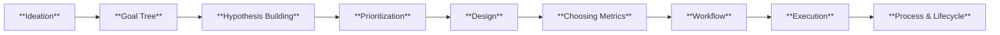
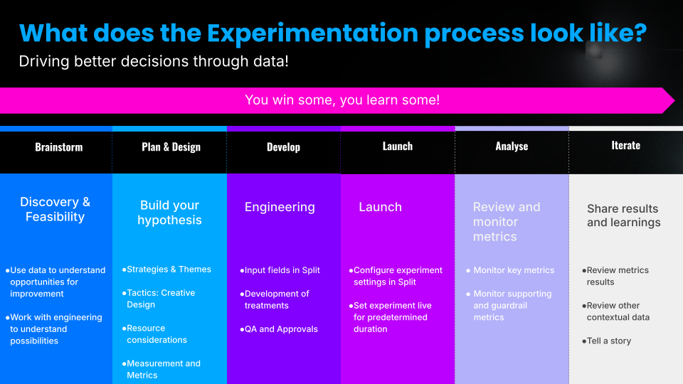
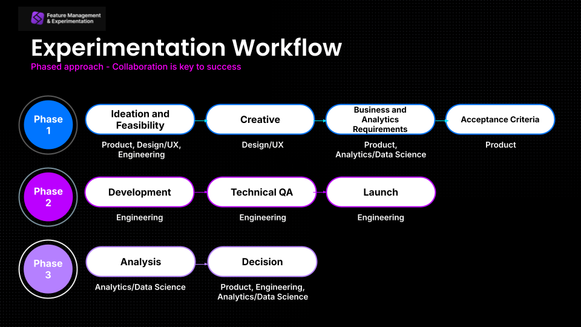
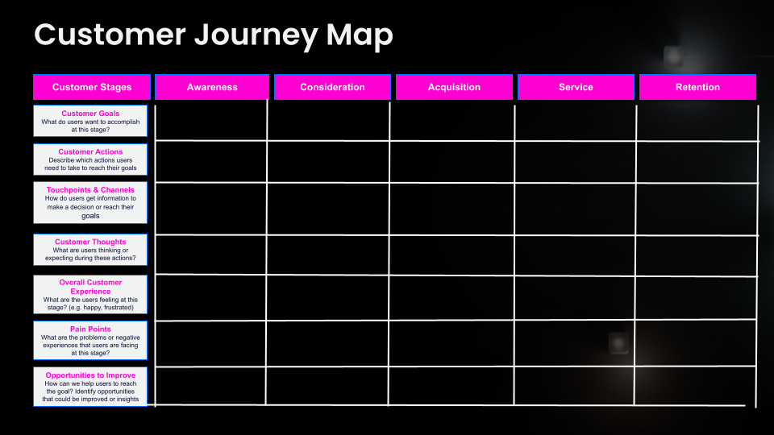
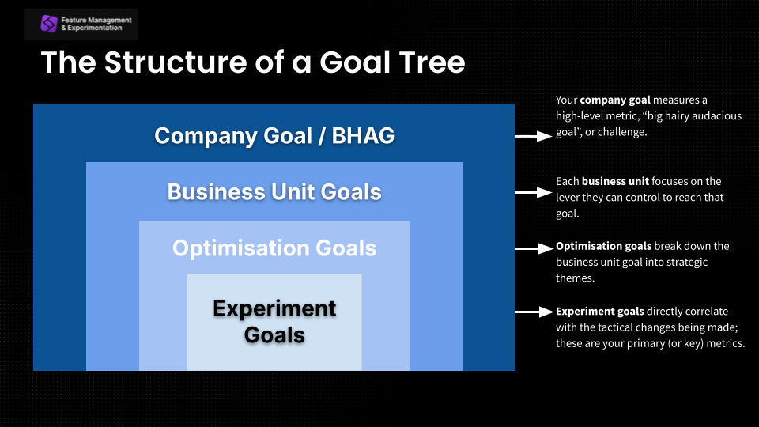
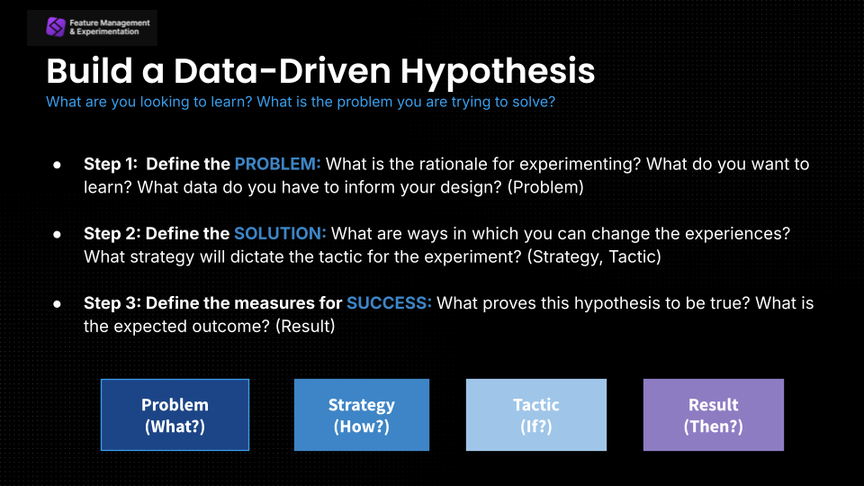
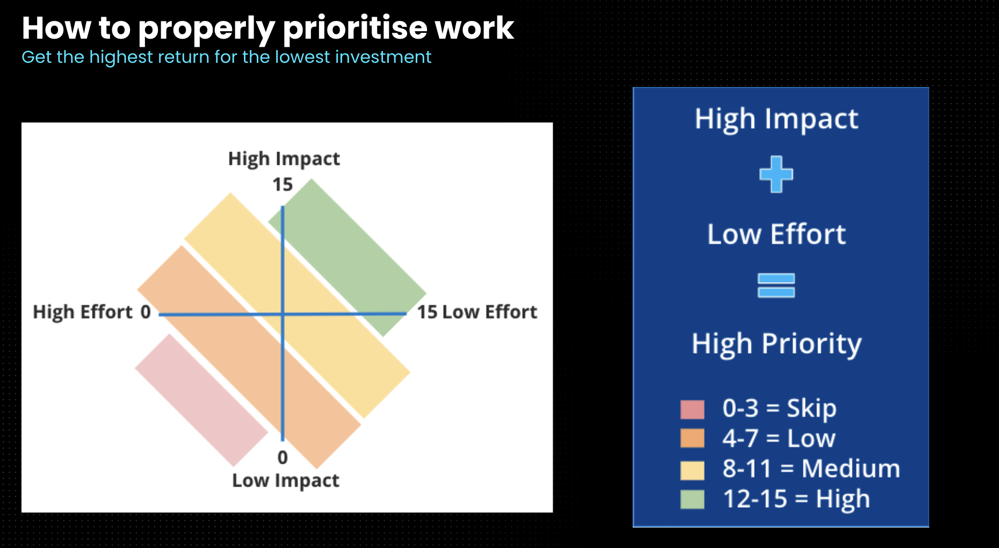
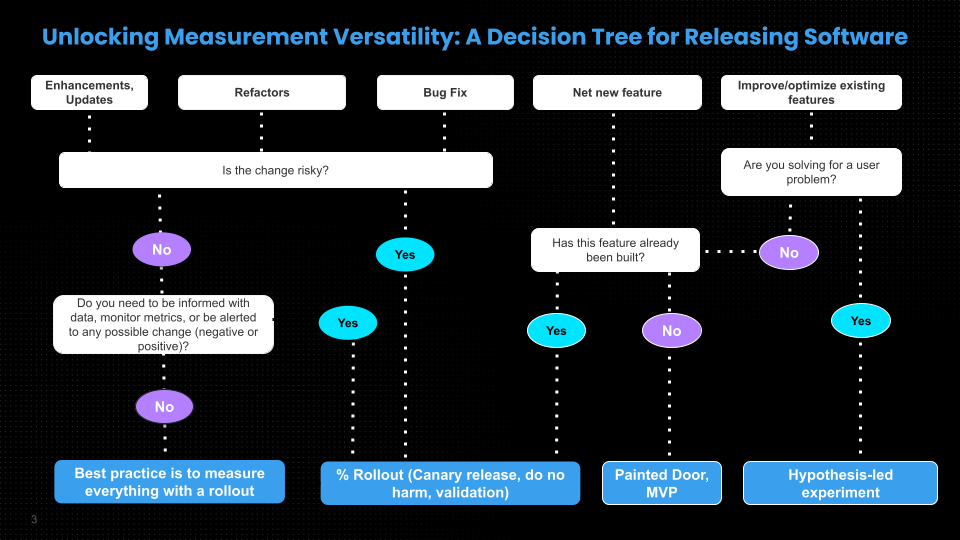

Successful experimentation programs rely on repeatable processes, aligned goals, and clear ways to measure impact. This playbook provides a practical foundation for teams getting started with cloud experimentation in Harness FME, covering the full lifecycle from ideation and planning through execution, analysis, and iteration.

 

Throughout this guide, you’ll find frameworks, templates, and supporting resources to help teams build hypotheses, prioritize opportunities, define metrics, coordinate cross-functional work, and launch experiments with confidence. Whether you are establishing an experimentation practice or scaling an existing one, these resources are designed to help teams make faster, data-informed decisions and create a more consistent experimentation workflow.

Experiment Process & Lifecycle

#### What is it? 

An experiment lifecycle identifies the stages and processes involved in planning and executing an experiment.  The end to end experiment lifecycle has six key steps: **Brainstorm**, **Plan & Design**, **Develop**, **Launch**, **Analyze**, and **Iterate**.

#### Why is it important? 

For any experimentation program to be successful, teams should be able to remain agile and create repeatable steps.  These steps give teams an outline for the who, what, when and where of experimentation.  From conception to iteration, it is important that teams optimize the process itself as they go along, in order to move faster. 

Program leads and individual team owners should consider the following:

- Who is involved with the experiment?
- What are the objectives of the experiment?
- What learnings will you gather from this experiment?
- Is your experiment aligned with the wider company goals? 

Experiment Workflow

[📄 Check out Experiment Workflow](./static/foundations-workflow.pdf) 

#### What is it? 

An experimentation workflow provides a structured, systematic approach to designing, conducting, and analyzing experiments. Beyond standard productivity tools like Jira, Airtable, Trello, ProductBoard, or Excel, this workflow includes an experimental design phase. Often lead by data science, this process allows teams to calculate required sample sizes, anticipate potential outcomes, and predict project timelines before a single test is launched. 

#### Why is it important? 

It ensures teams follow a consistent sequence, reducing errors and facilitating data-driven decisions. By isolating experimental design as a specific step, organizations can reduce bias and improve efficiency throughout the experiment lifecycle. This rigor encourages clear objectives and a culture of continuous learning, allowing teams to iterate quickly, document for reproducibility, and allocate resources effectively.

Ultimately, it fosters cross-functional collaboration and ensures innovations are rigorously tested, leading to more informed, predictable, and successful outcomes. To understand how experimentation workflows connect with ideation, prioritization, design, and execution, see [Understanding Experimentation Platforms](https://www.harness.io/resources/understanding-experimentation-platforms). 

Experiment Execution

[📄 Check out Experiment Build Steps](./static/build-steps.xlsx)

#### What is it? 

Once you have your experiment hypothesis or features to measure, there are a few steps to complete in order to configure your experiment in the Harness FME platform whilst building the code itself.  This is your development and rollout plan.  This could be a document or a series of Jira tickets which details the who, what, when and why for the experiment. 

#### Why is it important? 

In order to get your experiments live as quickly and accurately as possible, it’s important to have a clear process detailing the feature build and QA. 

See the following documentation:

- [Create a Feature Flag](/docs/feature-management-experimentation/feature-management/setup/create-a-feature-flag#create-a-feature-flag)
- [Create a Metric](/docs/feature-management-experimentation/release-monitoring/metrics/setup/#create-a-metric)
- [Edit Treatments](/docs/feature-management-experimentation/feature-management/setup/edit-treatments)
- [Add Targeting Rules](/docs/feature-management-experimentation/feature-management/setup/define-feature-flag-treatments-and-targeting#targeting-rules)
- [Adjust Experiment Settings](/docs/feature-management-experimentation/experimentation/setup/experiment-settings)

Experiment Ideation

[📄 Check out Customer Journey Map](./static/foundations-customer-map.pdf)

#### What is it? 

Behind every digital experience is a creative ideation process.  Ideation is the stage in the ‘design thinking’ process where you concentrate on idea generation through sessions such as brainstorming and creative workshops.  This process brings together the diverse perspectives from each of the teams responsible for optimizing the customer journey.  These teams include, but are not limited to: marketing, data science, analytics, product, engineering, UX, and research.  

#### Why is it important? 

The source of all your experiment ideas should always be from data.  Leverage a mix of qualitative and quantitative data to locate and understand user pain points in the customer journey. 

> *Qualitative data* is a type of data that deals with descriptions, characteristics, and properties that can be observed but not measured with numbers.  Typical examples in the realm of experimentation include user studies, interviews, focus groups, remote user labs, customer research, previous experiment data, competitor analysis etc.    *Quantitative data* is a type of data that is expressed in numerical terms and can be measured and quantified. Typical examples in experimentation include analytics data, heatmaps, session recordings, data warehouse, customer journey data etc. 

A customer journey map lays out all the touchpoints that your customers may have with your brand.  This should include how customers first heard of your brand through social media or advertising, to their direct interactions with your product, website or support team.  It should include all actions your customers take to complete an objective. 

Customer journey maps help teams to visualize what the customer is experiencing in real time and may unveil common pain points or customer challenges that need to be addressed. 

Experiment Goal Tree

[📄 Check out Goal Tree](./static/foundations-goal.pdf)

#### What is it?

A goal tree is a visual representation of the hierarchical structure of goals and objectives within an organization, project, or any complex system.  

A goal tree consists of four buckets:

* **Company Goal**: Measures a high-level metric, “big hairy audacious goal”, or challenge.
* **Business Unit Goals**: Focuses on the lever they can control to reach that goal.
* **Optimization Goals**: Breaks down the business unit goal into strategic themes.
* **Experiment Goals**: Directly correlate with the tactical changes being made.

#### Why are they important? 

Goal trees facilitate alignment across different functions and roles in your organization.  They empower teams to make small, directional changes that visually roll up to the larger company goal.

Choosing Experiment Metrics

[📄 Check out Creating Metrics](./static/foundations-metrics.pdf)

#### What is it?

Experiment metrics are the quantitative measure of success for your experiment hypothesis. They are the specific measurements or data points used to assess the performance of an experiment. These metrics help you determine whether the changes you've made in one variation (often referred to as the "treatment" or "B" version) have had a significant impact compared to the original version (the "control" or "A" version). 

#### Why is it important? 

The choice of experiment metrics is critical because they define what success looks like for your test. Your metrics are important because they will inform how your experiment has performed, and whether you have a winning, losing or inconclusive outcome. Typically, you will have key, supporting, and guardrail metrics for each experiment. 

- [Setting up and using metrics](/docs/feature-management-experimentation/experimentation/metrics/setup/)
- [Creating a metric](/docs/feature-management-experimentation/experimentation/metrics/setup/#create-a-metric)

Hypothesis Building

[📄 Check out Hypothesis Building](./static/foundations-hypothesis.pdf)

#### What is it?

An experimental hypothesis is an educated guess or a prediction about the outcome of an experiment. This is usually formulated from data, information, and insights gathered and includes statements around opportunities and outcomes.

#### Why is it important? 

Hypotheses are important in controlled experiments because they help frame the design and expected outcome. A well-crafted hypothesis is crucial because it provides a clear direction for the experiment and helps you determine whether the results support or refute the hypothesis.

- [Constructing a hypothesis](/docs/feature-management-experimentation/experimentation/setup/experiment-hypothesis)

Experiment Prioritization

[📄 Check out Experiment Prioritization](./static/foundations-priorities.xlsx)

#### What is it?

A prioritization framework is a set of criteria to help teams prioritize a large backlog of experiment ideas and hypotheses. It is a structured approach used by organizations to determine the order in which they should conduct experiments.

#### Why is it important? 

The prioritization framework helps teams decide which experiments to prioritize based on various factors, such as potential impact, resource requirements and effort, and strategic alignment.

Experiment Design

[📄 Check out Experiment Design & Results Template](./static/foundations-experiments.pdf)

#### What is it?

Experiment design centers around turning your user problems and solutions into a data-driven hypothesis, and building creative solutions with clear metrics to measure success.

#### Why is it important? 

Having an experiment design process is important to ensure you will always have insightful experiment outcomes and factor in all considerations to help you plan. 

These might include:

* How long to run your experiment for
* Which stakeholders need to be responsible, accountable, supporting, consulted & informed when it comes to experiment results and other stages 
* Action plan for all outcomes (what to do if it wins, loses or remains inconclusive) 
* All detail for engineers who build the experiment(s)
* Targeting, segments, and metric details (knowing which events and properties need to be sent to Harness FME)

## Learn with Harness University

[Harness University](https://developer.harness.io/university/feature-management-experimentation) provides self-paced training and certifications for teams adopting Feature Management & Experimentation (FME). 

The [Cloud Experimentation certification](https://university-registration.harness.io/fme-level-1-cloud-experimentation-for-product-managers) covers experimentation fundamentals, including lifecycle management, hypothesis development, experiment prioritization, metric design, A/A and A/B testing workflows, experiment settings, and best practices for running data-informed experiments in Harness FME. 

The course is designed primarily for product and business-focused practitioners, but is useful for anyone involved in experiment planning, implementation, analysis, or optimization.

<UniversityAdmonition title="Harness FME self-paced training">
  For an interactive onboarding experience including further use cases and features like **cloud experimentation**, check out the [**Harness Feature Management & Experimentation Cloud Experimentation for Product Managers certification**](https://university-registration.harness.io/fme-level-1-cloud-experimentation-for-product-managers).
</UniversityAdmonition>