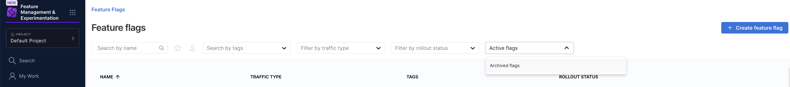
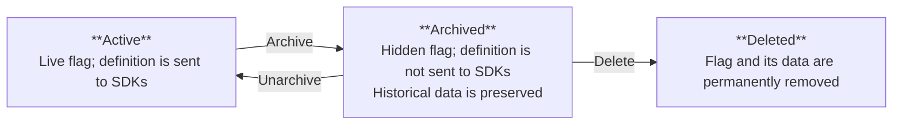
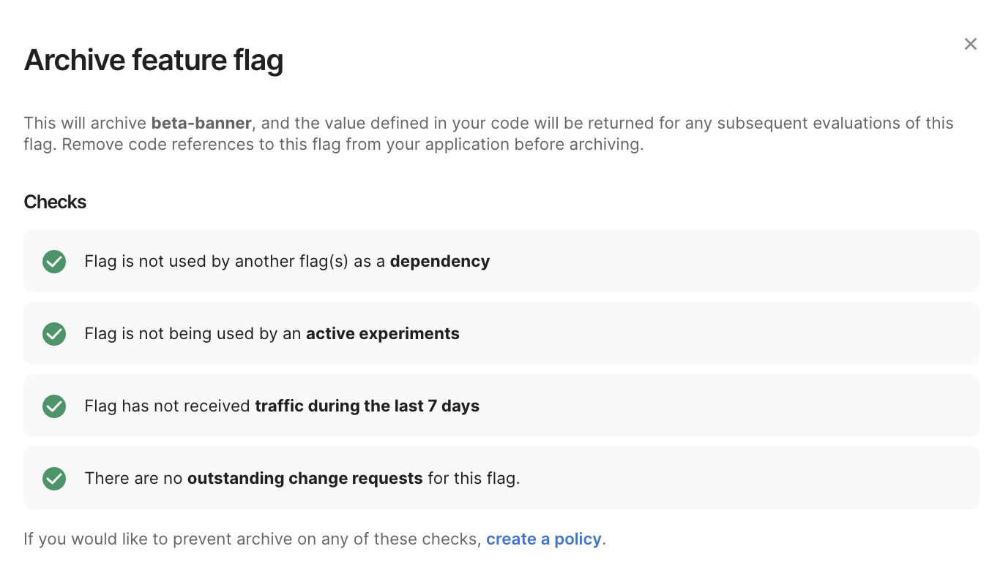
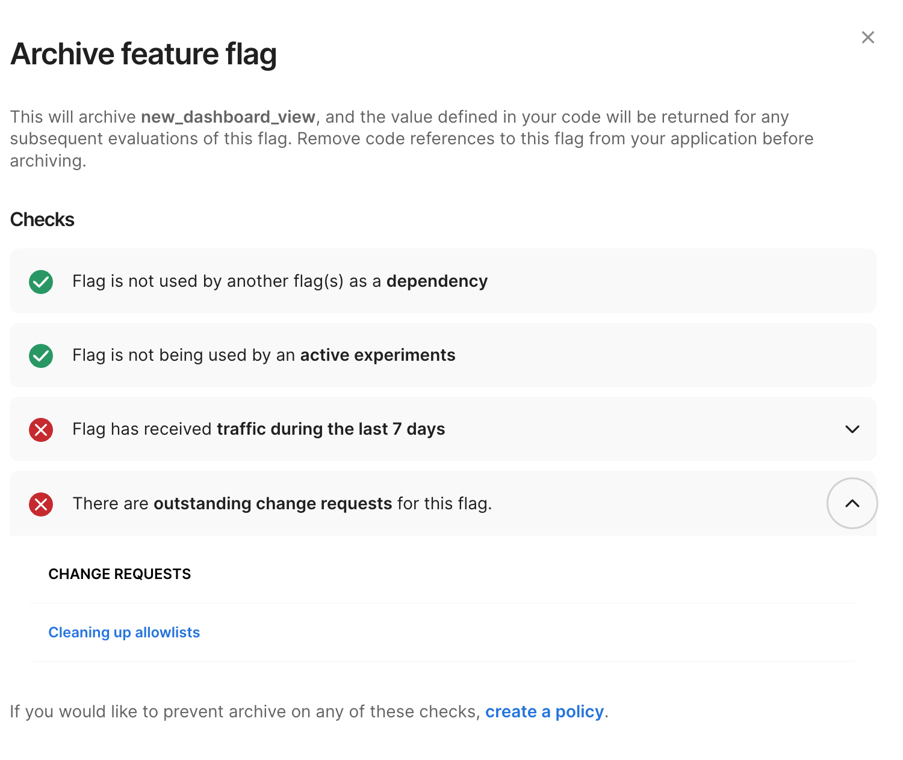
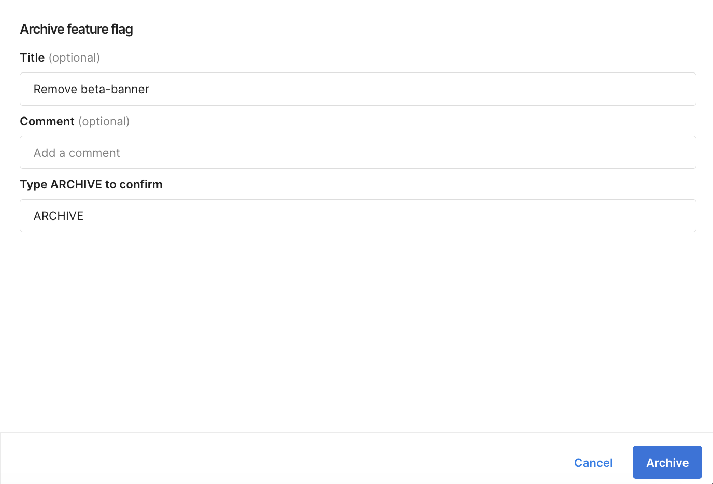
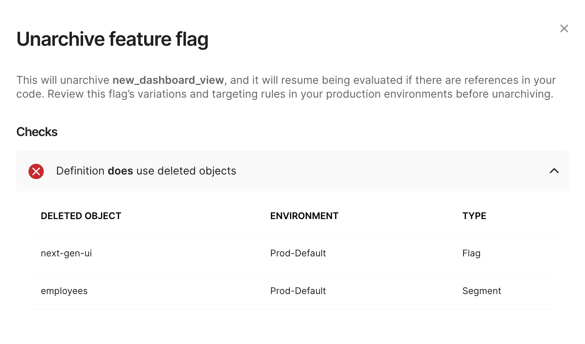
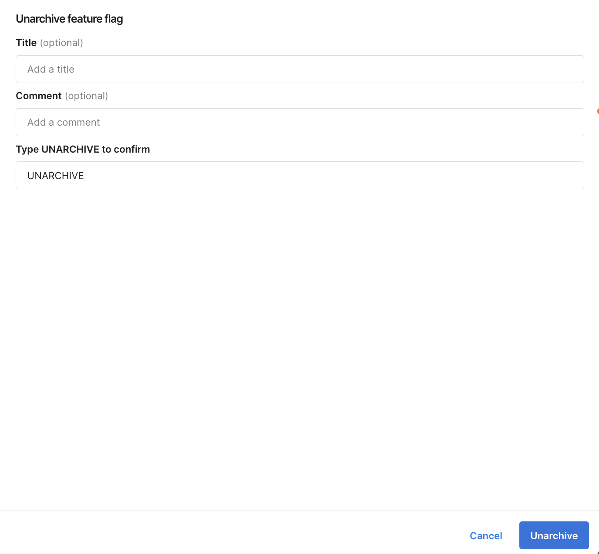

import Tabs from '@theme/Tabs';
import TabItem from '@theme/TabItem';

Archiving lets you retire a feature flag without permanently deleting it. When you archive a feature flag, it is removed from default views, its definition stops being sent to SDKs, and all historical data (including configurations, audit logs, and impressions) is preserved.

Archiving is part of the [feature flag lifecycle](/docs/feature-management-experimentation/getting-started/overview/manage-the-feature-flag-lifecycle). You can archive flags manually on the **Feature Flags** page in Harness FME, programmatically in [Harness pipelines](/docs/feature-management-experimentation/pipelines), or conditionally using [Harness Policy as Code (OPA)](/docs/platform/governance/policy-as-code/harness-governance-overview). 

On the **Feature Flags** page, you can use the `Active flags` dropdown menu to filter on active or archived feature flags. You can also add a [**Archive Feature Flag** step](/docs/feature-management-experimentation/pipelines#archive-feature-flag) to a custom stage in a pipeline. Additionally, you can create policies and policy sets to enforce organization-specific rules and prevent archiving when certain conditions are met.

## Feature flag states

Archiving a feature flag affects its visibility, behavior, and management capabilities. Once you've archived a flag, you cannot create another feature flag with the same name as the archived flag.

### Default views

The feature flag is hidden from most default views in Harness FME, including:

- **Feature Flags list**: The flag is hidden from the default view. To see archived flags, toggle archived flags into view.
- **Environments page**: The flag is hidden from the default view.
- **Rollout board**: The flag is not available on the rollout board.
- **Segments page**: The flag is not displayed on segments that reference it.

The flag remains searchable through global search in Harness FME (the **Search** bar in the FME navigation menu).

### Runtime behavior

- **SDKs**: The flag definition is no longer sent to SDKs. 
- **Evaluations**: Future evaluations return `control` treatments with a "definition not found" label. 
- **Fallbacks**: If fallback treatments are configured in your SDK, those are returned instead.

### Data and history

- **Audit logs**: An audit log event is recorded with the change type "Archived".
- **Historical data**: Configurations, impressions, and audit logs are preserved.

### Workflows

- **Change requests**: All outstanding change requests for the flag are cancelled and are not restored if the flag is later unarchived.
- **Available actions**: Most management actions are disabled while a flag is archived. To manage the flag again, you must first unarchive it.

## Prerequisites

Before you begin, ensure the following:

- You need the **Archive FME Feature Flags** (`fme_fmefeatureflag_archive`) and **Unarchive FME Feature Flags** (`fme_fmefeatureflag_unarchive`) permissions. These permissions are included in the **FME Administrator** role, but not in the **FME Manager** role. For more information, see [Harness RBAC for FME](/docs/feature-management-experimentation/permissions/rbac/#out-of-the-box-roles).
- The feature flag must **not** be used as a dependency by another feature flag. If it is a dependency, you must remove the dependency before archiving.

## Archive a feature flag

:::tip
Archive supersedes [environment-level permissions](/docs/feature-management-experimentation/permissions) and [approvals](/docs/feature-management-experimentation/feature-management/setup/approval-flows/). A user with the **Archive FME Feature Flag** permission can archive a flag regardless of environment edit restrictions. 

To enforce additional governance whenever a feature flag is archived, use [Harness Policy as Code (OPA)](/docs/platform/governance/policy-as-code/sample-policy-use-case/#fme-feature-flag-policies).
:::

To archive a feature flag in Harness FME:

1. From the FME navigation menu, navigate to the **Feature Flags** page and click on a feature flag you want to archive.
2. Click the **Gear** icon next to the feature flag name and select **Archive feature flag**.
3. Review the pre-archive checks:

   | Check | Type | Description |
   |-------|------|-------------|
   | Dependency | **Blocking** | The flag is used as a dependency by another flag. You must remove the dependency before you can archive. |
   | Experiment | **Warning** | The flag is used by an active experiment. |
   | Traffic | **Warning** | The flag has received traffic in the last 7 days. |
   | Change requests | **Warning** | There are outstanding change requests for this flag. You can view the change requests that appear under `Change Requests`. Outstanding change requests are cancelled on archive. |
   
   <Tabs queryString="archive-check">
   <TabItem value="passing" label="Passing Checks">
   
   

   </TabItem>
   <TabItem value="warning" label="Checks with Warnings">
   
   

   </TabItem>
   </Tabs>

4. If there are no blocking checks, type `ARCHIVE` to confirm the archive action and click **Archive**.
   
   

## Unarchive a feature flag

Unarchiving restores a feature flag to [the `Active` state](#feature-flag-states). This is intended as a break-glass operation for cases where a flag was archived prematurely in Harness FME. You need the **Unarchive FME Feature Flags** (`fme_fmefeatureflag_unarchive`) permission to unarchive feature flags.

When you unarchive a flag, the flag's definitions may not function exactly as they did before archiving. FME objects referenced by the flag's targeting rules (like segments, dependent flags, and flag sets) may have been deleted while the flag was archived. Harness FME checks and flags if any referenced objects are missing.

To unarchive a feature flag:

1. From the FME navigation menu, navigate to the **Feature Flags** page and click on an archived feature flag. Optionally, click the `Active feature flags` dropdown menu and select **Archived feature flags** to filter on archived flags.
1. Click the **Gear** icon next to the `Archived` flag status and select **Unarchive feature flag**.
1. Review any warning checks about missing referenced objects.
   
   

1. If there are no blocking checks, type `UNARCHIVE` to confirm the unarchive action and click **Unarchive**.
   
   

## Policy enforcement

You can use [Harness Policy as Code (OPA)](/docs/feature-management-experimentation/policies) to define rules that enforce organization-specific governance on archive and unarchive actions. These rules are grouped into **policy sets**, which are evaluated and executed whenever the action is triggered (from the Harness UI or from a pipeline).

Policy rules do not need to match the default pre-check warnings in Harness FME. You can extend or override these checks in the policy definition to meet your organization’s governance requirements. 

For example, you can define policies that:

- Prevent archiving if the flag is used as a dependency
- Prevent archiving if the flag has received traffic in the last 7 days
- Prevent archiving if the flag status is `Ramping`
- Require additional conditions before allowing unarchive (for example, validating that referenced objects exist)

For additional examples of feature flag policies and feature flag definition policies, see the [Policy samples documentation](/docs/platform/governance/policy-as-code/sample-policy-use-case#fme-feature-flag-policies).

## What's next

After learning how to archive and unarchive feature flags, explore [creating flags in Harness FME](/docs/feature-management-experimentation/feature-management/setup/create-a-feature-flag), using the [kill switch](/docs/feature-management-experimentation/feature-management/manage-flags/use-the-kill-switch), automating actions with [Harness pipelines](/docs/feature-management-experimentation/pipelines), and enforcing governance with [FME permissions](/docs/feature-management-experimentation/permissions) and [Harness Policy as Code (OPA)](/docs/feature-management-experimentation/policies).