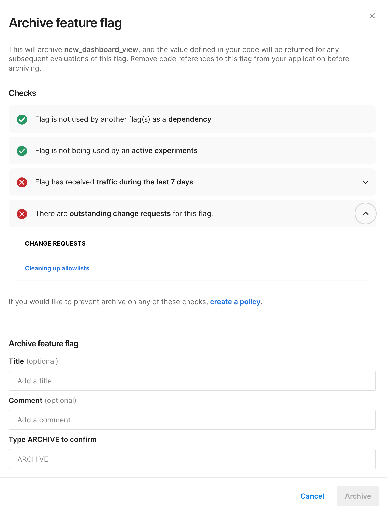
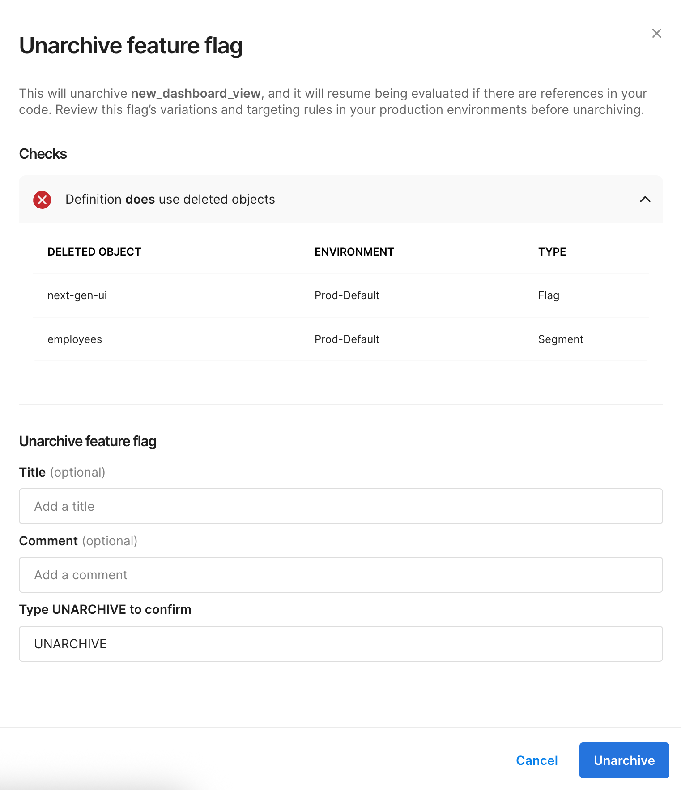

Archiving lets you retire a feature flag without permanently deleting it. When you archive a feature flag, it is removed from default views, its definition stops being sent to SDKs, and all historical data — including configurations, audit logs, and impressions — is preserved.

Feature flags in Harness FME have three states:

- **Active** — The flag is live and its definition is sent to SDKs.
- **Archived** — The flag is hidden from default views and its definition is no longer sent to SDKs. Historical data is preserved.
- **Deleted** — The flag and its data are permanently removed.

## What happens when you archive a feature flag

Archiving a feature flag has the following effects:

- **Feature Flags list** — The flag is hidden from the default view. To see archived flags, toggle archived flags into view.
- **Environments page** — The flag is hidden from the default view.
- **Rollout board** — The flag is not available on the rollout board.
- **Segments page** — The flag is not displayed on segments that reference it.
- **Global search** — The flag is still searchable.
- **SDKs** — The flag definition is no longer sent to SDKs. Future evaluations return `control` treatments with a "definition not found" label. If fallback treatments are configured in your SDK, those are returned instead.
- **Audit logs** — An audit log event is recorded with the change type "Archived".
- **Change requests** — All outstanding change requests for the flag are cancelled and are not restored if the flag is later unarchived.
- **Flag names** — You cannot create a new feature flag with the same name as an archived flag.
- **Available actions** — Most management actions are disabled while a flag is archived. To manage the flag again, you must first unarchive it.

## Before you begin

- You need the **FME Feature Flag: Archive** permission. This permission is included in the built-in FME Administrator role but is not part of the FME Manager role.
- The feature flag must not be used as a dependency by another feature flag. If it is a dependency, you must remove the dependency before archiving.

## Archive a feature flag

1. In **Feature Management**, go to **Feature Flags** and select the feature flag you want to archive.
2. From the **More options** menu, select **Archive**.
3. Review the pre-archive checks:

   
  

   | Check | Type | Description |
   |-------|------|-------------|
   | Dependency | **Blocking** | The flag is used as a dependency by another flag. You must remove the dependency before you can archive. |
   | Experiment | Warning | The flag is used by an active experiment. |
   | Traffic | Warning | The flag has received traffic in the last 7 days. |
   | Change requests | Warning | There are outstanding change requests for this flag. Outstanding change requests are cancelled on archive. |

4. If there are no blocking checks, confirm the archive action.

:::info
Archive supersedes environment-level permissions and approvals. A user with the **FME Feature Flag: Archive** permission can archive a flag regardless of environment edit restrictions. Use Harness Policy as Code (OPA) to enforce additional governance on the archive action.
:::

## Unarchive a feature flag

Unarchiving restores a flag to the active state. This is intended as a break-glass operation for cases where a flag was archived prematurely.

When you unarchive a flag, be aware that the flag's definitions may not function exactly as they did before archiving. Objects referenced by the flag's targeting rules may have been deleted while the flag was archived, including:

- Segments
- Dependent flags
- Flag sets

Harness FME warns you during the unarchive process if any referenced objects are missing.

To unarchive a feature flag:

1. In **Feature Management**, go to **Feature Flags** and toggle archived flags into view.
2. Select the archived feature flag.
3. Select **Unarchive**.
4. Review any warnings about missing referenced objects.
5. Confirm the unarchive action.

   
  

You need the **FME Feature Flag: Unarchive** permission to unarchive a flag.

## Policy enforcement

You can write Harness Policy as Code (OPA) policies to enforce organization-specific rules on the archive action. For example:

- Do not allow archive if the flag is used as a dependency
- Do not allow archive if the flag has received traffic in the last 7 days
- Do not allow archive if the flag status is "Ramping"

Policy rules do not need to match the built-in warnings.

You can also archive feature flags as part of an automated pipeline using the [Archive Feature Flag pipeline step](/docs/feature-management-experimentation/pipelines#archive-feature-flag).

## See also

- [Use the kill switch](/docs/feature-management-experimentation/feature-management/manage-flags/use-the-kill-switch)
- [Create a feature flag](/docs/feature-management-experimentation/feature-management/setup/create-a-feature-flag)
- [Using FME with Harness Pipelines](/docs/feature-management-experimentation/pipelines)
- [FME permissions](/docs/feature-management-experimentation/permissions)
