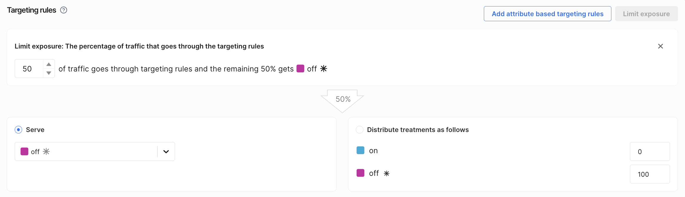

When you [create a feature flag](/docs/feature-management-experimentation/feature-management/setup/create-a-feature-flag), you can control how much traffic is evaluated by its targeting rules using the **Limit exposure** button in the `Targeting rules` section. 

Limiting exposure means only a percentage of users are routed through the flag's targeting rules. The remaining users are excluded from evaluation and receive the [default treatment](/docs/feature-management-experimentation/feature-management/setup/default-treatment), bypassing all targeting logic. This is useful for gradually ramping experiments or safely rolling out features.

1. From the FME navigation menu, navigate to **Feature Flags** and click on a feature flag you want to configure.
1. On the **Definition** tab, click **Initiate Environment** for an environment and go to the `Targeting` section.
1. Click **Limit exposure**.
1. Set the percentage of traffic that should be evaluated by the targeting rules.

### Traffic allocation

Users within the exposure percentage are evaluated against targeting rules and assigned a treatment. Users outside the exposure percentage are not evaluated against targeting rules and receive the default treatment. They are labeled in [impressions](/docs/feature-management-experimentation/feature-management/monitoring-analysis/impressions) as `not in Split`.

Increasing or decreasing the exposure percentage adjusts how many users enter an experiment, but does not change assignment for users already evaluated.

#### Sticky assignment

Once a user is assigned a treatment within the exposed population, that assignment is [sticky](/docs/feature-management-experimentation/experimentation/experiment-results/viewing-experiment-results/randomization-and-stickiness). Increasing exposure does not reshuffle users between treatments.

#### No re-bucketing on ramp

Users are only added to or removed from the evaluated population. Treatment assignment only occurs within the exposed population and does not change when exposure is adjusted.

## Ramp experiment traffic

For multi-treatment experiments, keep treatment distribution stable while ramping exposure.

:::tip
Changing limit exposure or targeting rules creates a new feature version. For analysis, use the latest version once full ramp exposure is reached.
:::

For example, with three treatments, you set the limit exposure to 20%. Treatment distribution is A (control) 33%, B 34%, and C 33%. This results in ~6.6% of total traffic per treatment, with 20% participating in the experiment and 80% receiving the default treatment.

This approach minimizes treatment crossover, prevents users from being reallocated between treatments during ramp-up, and preserves consistent statistical measurement over time. Unallocated traffic still triggers `getTreatment`, but is not part of any targeting rule and should not be used for metric comparisons.