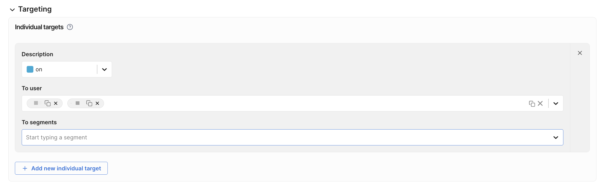
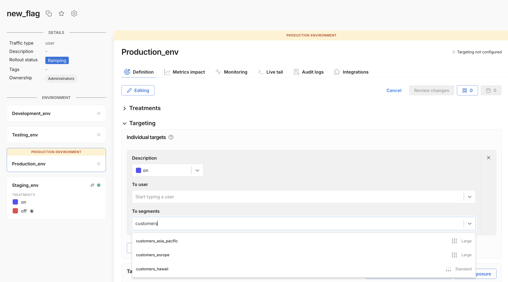
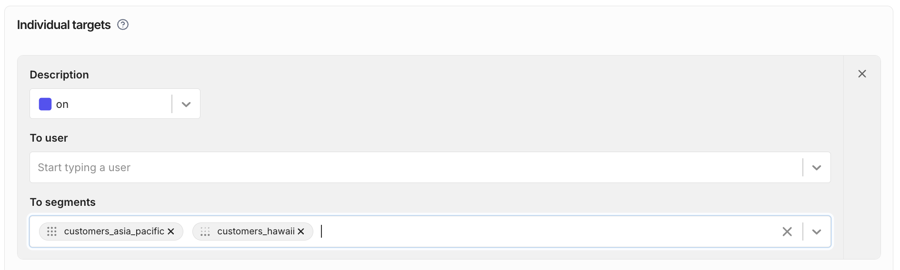
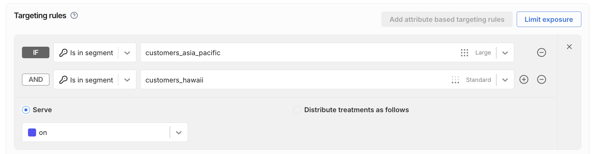
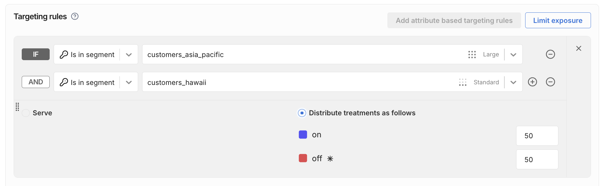

Once you create a feature flag, you can [create feature flag targeting rules](/docs/feature-management-experimentation/feature-management/setup/define-feature-flag-treatments-and-targeting#setting-up-targeting) that target individual user IDs (or user keys), or use segments to target groups of users.

[Segments](/docs/feature-management-experimentation/feature-management/targeting/segments) are lists of user IDs. In a feature flag definition, you can assign treatments to one or more segments in your targeting rules. If a segment does not appear in search, it may not be [defined](/docs/feature-management-experimentation/feature-management/targeting/segments#adding-user-ids-to-a-segment) in the selected FME environment.

:::danger Server-side SDK Support
[Server-side SDKs](/docs/feature-management-experimentation/sdks-and-infrastructure/server-side-sdks/) do not support **Large segments**. Evaluations of feature flags targeting Large segments return `control`.

If you need this capability, contact [Harness Support](/docs/feature-management-experimentation/fme-support) or open a [feature request](https://ideas.harness.io/feature-request).
:::

## Target segments in individual targeting rules

You can target segments in individual targeting rules. These rules assign a treatment to the segment. In the following example, the feature flag will serve **on** to all user IDs in the given segments.

After you select a segment, you can see the segment type indicated by the input pill icon in the To segments field.

## Target segments in attribute-based targeting rules

You can also target Standard, Large, and Rule-based segments in attribute based targeting rules. The following example is equivalent to the individual targeting rule shown above.

You can also use ___percentage distribution___ to randomly distribute treatments among the user IDs in a segment, as shown below.

See [Targeting rules](/docs/feature-management-experimentation/feature-management/setup/define-feature-flag-treatments-and-targeting#targeting-rules) for more information on feature flag targeting, percentage distribution, and rules' evaluation order.
