import Tabs from '@theme/Tabs';
import TabItem from '@theme/TabItem';

<Tooltip id="fme.feature-management.attribute">Attributes</Tooltip> let you create dynamic targeting rules in Harness FME using runtime data passed during feature flag evaluation. You can use custom attributes to target users based on: 

- Rapidly changing or contextual data (for example: time since last login, browser type, app version, or device type)
- Business or customer metadata (for example: subscription tier, purchase amount, or customer status).

Use [segments](/docs/feature-management-experimentation/feature-management/targeting/segments) instead of attributes when group membership changes infrequently or needs to be standardized across your organization (for example: internal users, QA teams, or strategic customer accounts).

### Prerequisites

To manage custom attributes in **FME Settings**, you need the [**FME Administrator** role](/docs/feature-management-experimentation/permissions/rbac).

## Create custom attributes

You can create custom attributes in three ways:

- Directly [within a feature flag targeting rule](#create-custom-attributes-within-feature-flag-targeting-rules)
- In [**FME Settings**](#create-custom-attributes-in-fme-settings) for reuse across a project and traffic type
- [Using the Split API](#create-custom-attributes-or-writing-custom-attribute-values-using-api-endpoints)

Attributes created in [**FME Settings**](#create-custom-attributes-in-fme-settings) or through [the Harness FME API](#store-identity-attributes-for-targeting-workflows) are associated with a project and traffic type, and appear in your feature flag's attribute-based targeting rules as reusable **User Attributes**. On the other hand, attributes created [directly inside an attribute-based targeting rule](#create-custom-attributes-within-feature-flag-targeting-rules) only exist within that feature flag definition and are not reusable across projects or traffic types.

:::info
The labels shown in the **Targeting** section of a feature flag definition depend on the configured traffic type. For example, when creating an attribute-based targeting rule, if a feature flag uses the `account` traffic type, the labels display **Account** and **Account Attributes** instead of **User** and **User Attributes**.
:::

Regardless of how a custom attribute is created, attribute values must still be passed in the SDK evaluation request (for example, `getTreatment`) for targeting rules to evaluate correctly. For implementation examples, refer to the relevant [SDK documentation](/docs/feature-management-experimentation/sdks-and-infrastructure).

### Create custom attributes within feature flag targeting rules

You can create custom attributes directly within a feature flag's targeting rules on the **Definition** tab. Attributes created within a targeting rule become part of that feature flag definition only, and are not associated with a project or traffic type.

To create and use a custom attribute in an attribute-based targeting rule, see [Using custom attributes in feature flag targeting](#use-custom-attributes-in-feature-flag-targeting). You can also create custom attributes that use [SemVer matchers](https://docs.npmjs.com/about-semantic-versioning) for version-based targeting rules.

### Create custom attributes in FME settings

You can define reusable custom attributes for a specific project and traffic type in **FME Settings**.
Attributes created in **FME Settings** appear as reusable **User Attributes** in targeting rules for feature flags that use the same traffic type.

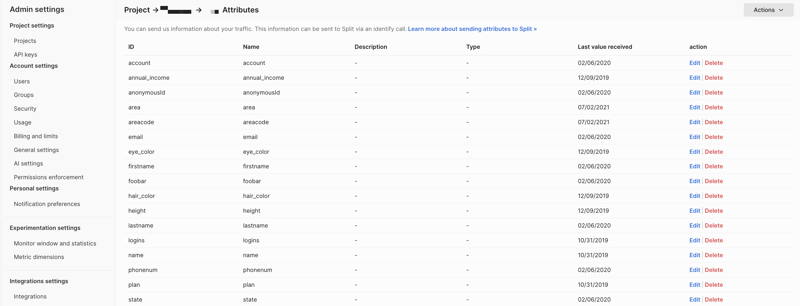

You can create attributes individually or bulk import them using a CSV file. If the CSV file contains attribute IDs that already exist for the selected project and traffic type, the existing attributes are overwritten.

<Tabs queryString="attribute-creation">
<TabItem value="individual" label="Create Individual Attributes">

To create a reusable custom attribute:

1. From the FME navigation menu, navigate to **FME Settings** > **Projects**.
1. Click **View** on the project you want to configure and navigate to the **Traffic types** tab.
1. Click **View/Edit attributes** for the traffic type you want to configure. 
1. Click the **Actions** dropdown menu and select **Create an attribute**.
1. Enter a unique attribute identifier/key (for example, `purchase_amount`) in the `ID` field. Attribute IDs cannot be changed after creation. If you reuse an existing attribute ID, the existing attribute is overwritten.

   :::tip Syntax requirements
   Attribute IDs must start with a letter and can contain letters (`a-z`, `A-Z`), numbers (`0-9`), dashes (`-`), and underscores (`_`).
   :::

1. Enter a descriptive display name in the `Name` field (for example, `Checkout Customer Cart Amount`).
1. Optionally, enter a description.
1. Select an [attribute type](#custom-attribute-types-and-matchers): **String**, **Number**, **Set**, **Datetime**, **Boolean**, or **Semver**. If you select the **String** or **SemVer** attribute type, a **Suggested values** field appears.
   
   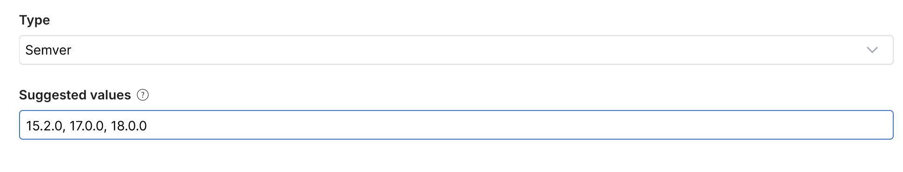

   Suggested values provide predefined values that appear in the targeting rule builder when configuring attribute-based targeting rules. Enter values as a comma-separated list (for example, `enterprise, midmarket, smb`).

1. Click **Create**.

The attribute is now available as a reusable **User Attribute** in attribute-based targeting rules for feature flags with matching traffic types.

</TabItem>
<TabItem value="multiple" label="Create Multiple Attributes">

To bulk import custom attributes:

1. From the FME navigation menu, navigate to **FME Settings** > **Projects**.
1. Click **View** on the project you want to configure and navigate to the **Traffic types** tab.
1. Click **View/Edit attributes** for the traffic type you want to configure. 
1. Click the **Actions** dropdown menu and select **Create multiple attributes**.
1. Upload a CSV file containing comma-separated values. Click **Download CSV template** to access an example file that creates multiple attributes. 

   The CSV file must use the following header row: 

   ```csv title="CSV File"
   ID,Name,Description,Type,SuggestedValues
   ```

   Each row defines a custom attribute using the following fields:

   | Field               | Description                                                                                                                                                                           |
   | ------------------- | ------------------------------------------------------------------------------------------------------------------------------------------------------------------------------------- |
   | **ID**              | Unique attribute identifier used in targeting rules and SDK evaluation requests. The ID cannot be changed after creation.                                                             |
   | **Name**            | Human-readable display name for the attribute.                                                                                                                                        |
   | **Description**     | Optional description of the attribute.                                                                                                                                                |
   | **Type**            | Data type of the attribute. Supported values: `String`, `Number`, `Boolean`, `DateTime`, `Set`.                                                                                       |
   | **SuggestedValues** | Optional comma-separated list of suggested values. Only applies to `String` attributes. Suggested values appear in the targeting rule builder when configuring attribute-based rules. |

1. Click **Save** after the upload completes. 

</TabItem>
</Tabs>

## Store identity attributes for targeting workflows

You can store identity data in Harness FME to improve targeting, debugging, and identity inspection workflows. Stored identity data enables key type-ahead suggestions, identity tooltips that display attribute values, and enriched impression analysis.

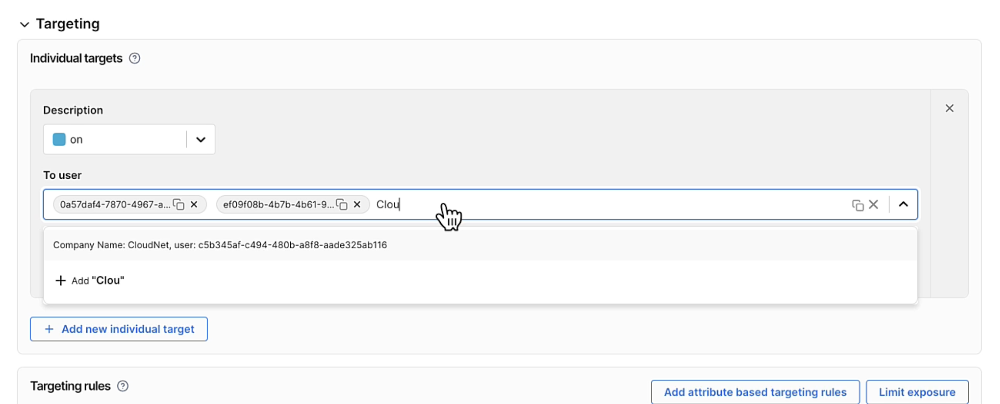

These identity-aware workflows are available in feature flag targeting rules, the **Live Tail** tab of a feature flag after pausing the event stream, and segment definitions when adding individual users.

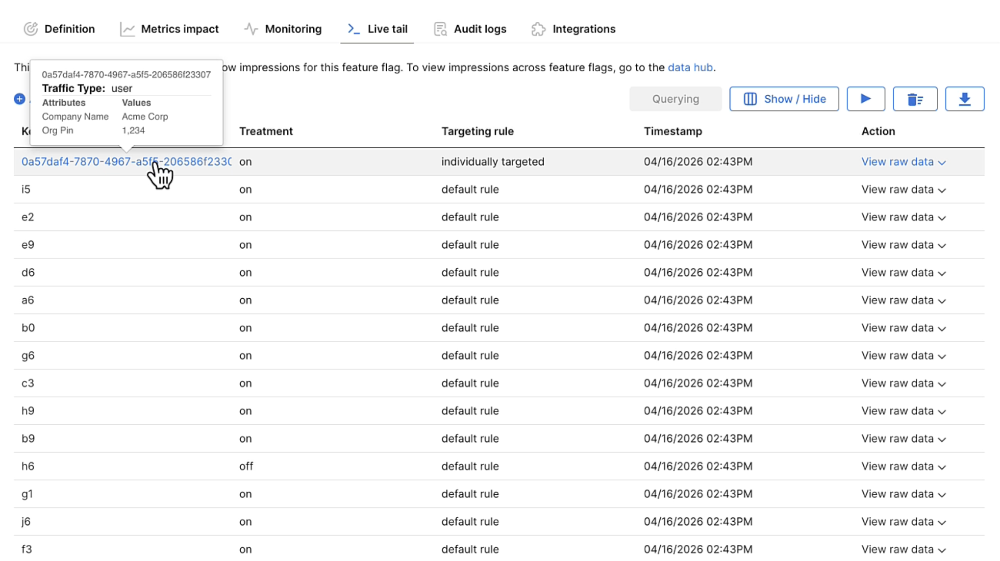

When adding individual keys to targeting rules for a feature flag, you can type the leading characters of an attribute value to see matching <Tooltip id="fme.feature-management.identity">identities</Tooltip> from your uploaded identity data. 

Type-ahead matching is case-sensitive and only matches leading characters.

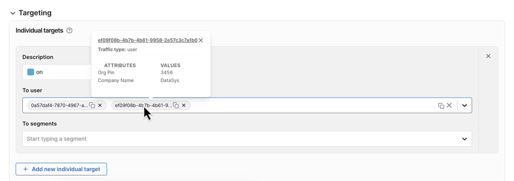

Hover over a user key in the UI to view the attribute values associated with that identity.

:::tip Stored identity attributes vs. runtime targeting attributes
Attributes stored using the [Identities API](https://docs.split.io/reference#identities-overview) are not automatically used during feature flag evaluation or `getTreatment` calls. 

To evaluate targeting rules based on attributes, you must still pass those attributes in the SDK evaluation request. For example, if a targeting rule checks whether `plan=enterprise`, the `plan` attribute must be included in the attributes object passed to `getTreatment`.
:::

### Create identity attributes

Setting up identity attributes requires two steps: 

1. [Define reusable attributes in **FME Settings**](#create-custom-attributes-in-fme-settings) for a project and traffic type.
1. Use the [Identities API endpoints](https://docs.split.io/reference/identities-overview) to upload identity data and associated attribute values.
   
   | Endpoint | Description |
   |---|---|
   | [Save attribute](https://docs.split.io/reference/save-attribute) | Create or update a reusable attribute definition associated with a project and traffic type. |
   | [Save identity](https://docs.split.io/reference/save-identity) | Create or update a single identity record while preserving unspecified attributes. |
   | [Save identities](https://docs.split.io/reference/save-identities) | Bulk create or update multiple identity records and replace attributes for identities included in the request. |

Identity data is stored per [environment](/docs/feature-management-experimentation/environments) in Harness FME. You can upload different identity datasets for development, staging, and production environments.

| Environment | Recommendation |
|---|---|
| `Production` | Upload sanitized production identity data |
| `Staging` | Upload realistic test data |
| `Development` | Upload a smaller sample dataset for testing |

<details>
<summary>Bulk Upload Identity Data with the Helper Tool</summary>

For large identity imports, Harness provides a helper tool (`fme_bulk_identities.py`) that converts CSV data into the required JSON payload format and uploads identities using the Identities API. The helper tool is included in [`fme_identities_upload_tool.zip`](../static/fme-identities-upload-tool.zip). 

1. Create a CSV file.

   ```csv title="FME Identities Example File"
   key,company,short_code,account,region
   00000000-0000-0000-0000-000000000000, Placeholder Name, PLCH, ACC-00000, region-0
   11111111-1111-1111-1111-111111111111, Sample Entity LLC, SAMP, ACC-11111, region-1
   22222222-2222-2222-2222-222222222222, Generic Corp, GENR, ACC-22222, region-2
   ```

1. Create a configuration file that maps CSV columns to reusable attribute identifiers defined in **FME Settings**.

   ```json title="FME Identities Config JSON File"
   {
   "api_base_url": "https://api.split.io/internal/api/v2",
   "traffic_type_id": "user",
   "environment_id": "<YOUR_ENVIRONMENT_ID>",
   "admin_api_key": "<YOUR_API_KEY>",
   "attribute_mapping": {
      "company": "company_name",
      "short_code": "company_short_code",
      "account": "account_number",
      "region": "region"
   }
   }
   ```

1. Run the utility.

   ```bash
   python3 fme_bulk_identities.py \
     --csv identities.csv \
     --config config.json \
     [--batch-size 1000] \
     [--dry-run] \
     [--patch-mode] \
   ```
   
   The following flags are available:

   | Flag           | Description                                                            |
   | -------------- | ---------------------------------------------------------------------  |
   | `--dry-run`    | Preview the generated API payload without uploading data.              |
   | `--batch-size` | Configure the number of identities uploaded per batch.                 |
   | `--patch-mode` | Preserve unspecified attributes by using the `Save identity` endpoint. |
   
By default, bulk uploads replace all attributes for identities included in the request. The `attribute_mapping` object maps CSV column names to the attribute identifiers configured in **FME Settings**.

| CSV column   | FME attribute ID     |
| ------------ | -------------------- |
| `company`    | `company_name`       |
| `short_code` | `company_short_code` |
| `account`    | `account_number`     |
| `region`     | `region`             |

</details>

Stored identity data becomes available throughout Harness FME for key type-ahead suggestions, identity tooltips, targeting workflows, impression analysis, and identity inspection.

## Use custom attributes in feature flag targeting

After you [create a feature flag](/docs/feature-management-experimentation/feature-management/setup/create-a-feature-flag), you can add and use custom attributes in [targeting rules](/docs/feature-management-experimentation/feature-management/setup/define-feature-flag-treatments-and-targeting) to control treatment delivery. 

To add an attribute-based targeting rule:

1. On the feature flag's **Definition** tab, click **Add attribute based targeting rules** in the `Targeting rules` section.

   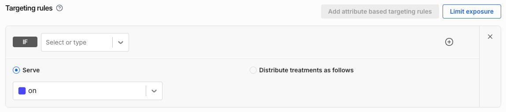

1. Select an existing **User Attribute** from the `IF` dropdown menu or create an attribute directly in the targeting rule by entering an attribute ID.

   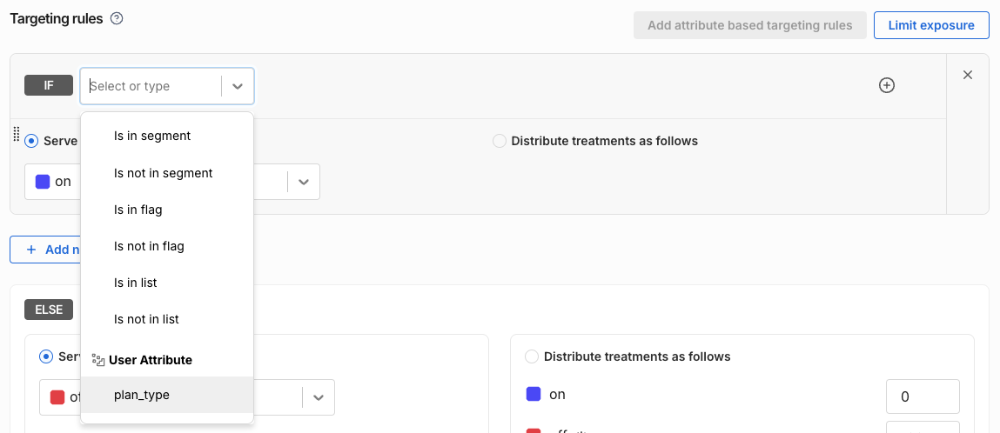

1. Select a [matcher](#custom-attribute-types-and-matchers) to evaluate the attribute values passed in from your source code.

   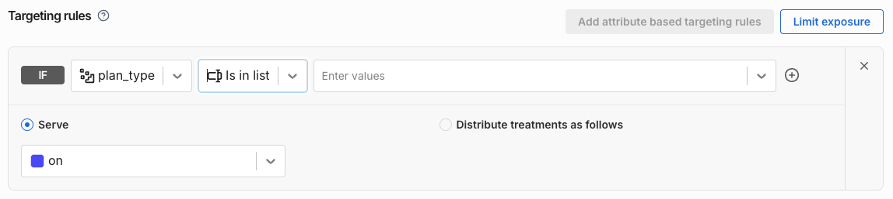

1. Configure the values to match and select the treatment(s) to serve.

    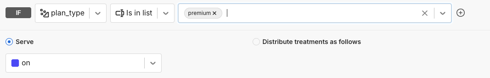

<details>
<summary>Additional Targeting Rule Examples</summary>

Serve the `on` treatment for users with custom attribute `app_version` greater than or equal to 16.0.0:

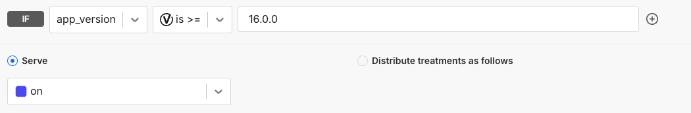

Serve the `on` treatment for users with custom attribute `age` greater than or equal to 20:

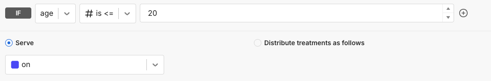

Serve the `on` treatment for users with custom attribute `deal_size` between 500,000 and 10,000,000:

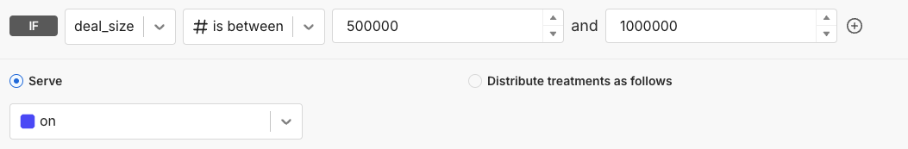

Serve the `on` treatment for users with custom attribute `registered_date` on or after a specified date:

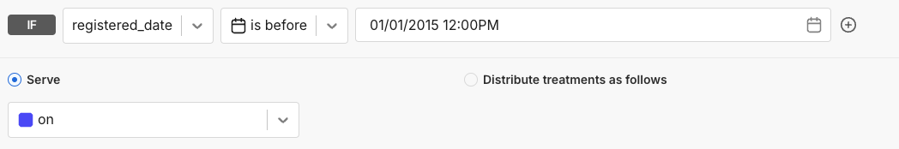

</details>

## Custom attribute types and matchers

Each <Tooltip id="fme.feature-management.attribute">custom attribute</Tooltip> type supports a specific of comparison operators, or matchers, that can be used in attribute-based targeting rules. 

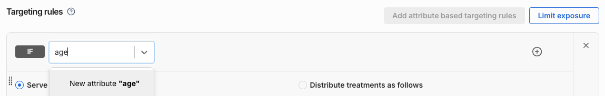

When you select an existing attribute in the targeting rule builder, Harness FME only shows matchers compatible with that attribute type. You can also enter a new attribute ID directly in the `IF` field to create a custom attribute inline while building a targeting rule.

### String attributes

String attributes store text values. Use **String matchers** to create targeting rules based on string comparisons, regular expressions, or lists of string values.

The following matchers are supported:

- `is in list`
- `is not in list`
- `starts with`
- `does not start with`
- `ends with`
- `does not end with`
- `contains`
- `does not contain`
- `matches (regular expression)`
- `does not match (regular expression)`

:::tip Use cases for String Attributes
String attributes work well for targeting based on categorical or label-based data, such as subscription tiers, regions, or customer segments.

For example, use an `subscription_plan` String attribute to target customers on the `Business` or `Enterprise` plan.
:::

### SemVer attributes

SemVer attributes store version strings that follow the [Semantic Version](https://semver.org/) specification. Use **SemVer matchers** to create targeting rules based on application or operating system versions.

The following matchers are supported:

- `is =`
- `is not =`
- `is >=`
- `is <=`
- `is in list`
- `is between (inclusive)`
- `is not between (inclusive)`

SemVer values must include a patch version number. For example, `2.2` is invalid, while `2.2.0` is valid. Pre-release identifiers and build metadata are also supported. 

:::tip Use cases for SemVer attributes
SemVer attributes work well for version-based targeting, such as rolling out features to specific app versions, operating systems, or SDK releases.

For example, use an `os_version` SemVer attribute to enable a feature only for users running version `>= 2.2.0`.
:::

#### Supported SDKs and customer-deployed components for SemVer matcher

SemVer matchers are only supported in specific SDK and customer-deployed component versions. If your SDK or customer-deployed component version does not support SemVer matchers, upgrade to a supported version to ensure targeting rules evaluate correctly. 

If an unsupported SDK evaluates a feature flag containing a SemVer matcher, the SDK returns the `control` treatment and logs a corresponding impression event.

The following versions support SemVer matchers:

<Tabs queryString="semver-support">
  <TabItem value="sdk-suites" label="Client-side SDK Suites">
  
  | **Client-side SDK Suite** | **Version that supports SemVer** |
  |-----------------------|----------------------------------|
  | Android SDK Suite     | 1.2.0 and later                  |
  | Browser SDK Suite     | 1.4.0 and later                  |
  | iOS SDK Suite         | 1.2.0 and later                  |
  
  </TabItem>

  <TabItem value="client-sdks" label="Client-side SDKs">
  
  | **Client-side SDK**   | **Version that supports SemVer** |
  |-----------------------|----------------------------------|
  | Android SDK           | 4.1.0 and later                  |
  | Angular utilities     | 3.0.0 and later                  |
  | Browser SDK           | 0.14.0 and later                 |
  | Flutter plugin        | 0.1.9 and later                  |
  | iOS SDK               | 2.25.0 and later                 |
  | JavaScript SDK        | 10.26.0 and later                |
  | React SDK             | 1.12.0 and later                 |
  | React Native SDK      | 0.9.0 and later                  |
  | Redux SDK             | 1.12.0 and later                 |
  
  </TabItem>

  <TabItem value="server-sdks" label="Server-side SDKs">
  
  | **Server-side SDK**   | **Version that supports SemVer** |
  |-----------------------|----------------------------------|
  | Go SDK                | 6.6.0 and later                  |
  | Java SDK              | 4.12.0 and later                 |
  | .NET SDK              | 7.9.0 and later                  |
  | Node.js SDK           | 10.26.0 and later                |
  | PHP SDK               | 7.3.0 and later                  |
  | PHP Thin Client SDK   | See SplitD version               |
  | Python SDK            | 9.7.0 and later                  |
  | Ruby SDK              | 8.4.0 and later                  |
  
  </TabItem>

  <TabItem value="infra" label="Customer-deployed Components">
  
  | **Component**                 | **Version that supports SemVer** |
  |------------------------------|----------------------------------|
  | Split Daemon                 | 1.4.0 and later                  |
  | Split Evaluator              | 2.6.0 and later                  |
  | Split Synchronizer           | 5.8.0 and later                  |
  | Split Proxy                  | 5.8.0 and later                  |
  | JavaScript synchronizer tools| 0.6.0 and later                  |
  
  </TabItem>
</Tabs>

### Set attributes

Set attributes store lists of string values. Use **Set matchers** to create targeting rules based on membership in multiple values.

The following matchers are supported:

- `is equal to`
- `is not equal to`
- `has any of`
- `does not have any of`
- `has all of`
- `does not have all of`
- `is part of`
- `is not part of`

:::tip Use cases for Set attributes
Set attributes work well for targeting users based on membership in multiple values, such as visited regions, enabled products, permissions, or user interests.

For example, use a `us_states_visited` Set attribute to target users who have visited one or more states on the US West Coast.
:::

### Number attributes

Number attributes store positive or negative whole numbers. Decimal values are not supported. Use **Number matchers** to create targeting rules based on thresholds or ranges.

The following matchers are supported:

- `is =`
- `is >=`
- `is <=`
- `is between (inclusive)`
- `is not between (inclusive)`

:::tip Use cases for Number attributes
Number attributes work well for targeting based on thresholds or ranges, such as purchase amounts, login counts, account age, or usage metrics.

For example, use an `orders_last_quarter` Number attribute to target customers who placed at least 20 orders in the last quarter.
:::

### DateTime attributes

Depending on the SDK you are using, DateTime values must be passed as either `milliseconds since epoch` or `seconds since epoch`. Use **DateTime matchers** to create targeting rules based on time windows.

The following matchers are supported:

- `is on`
- `is not on`
- `is after`
- `is before`
- `is between (inclusive)`
- `is not between (inclusive)`

:::tip Use cases for DateTime attributes
DateTime attributes work well for time-based targeting, such as onboarding periods, contract dates, subscription expirations, or scheduled feature rollouts.

For example, use a `contract_signed` DateTime attribute to keep a legacy feature enabled for customers who signed up before a specific date.
:::

### Boolean attributes

Boolean attributes store either `true` or `false`. Use **Boolean matchers** to create targeting rules based on conditions.

The supported matcher is `is`.

:::tip Use cases for Boolean attributes
Boolean attributes work well for simple yes-or-no targeting conditions, such as account verification status, beta program enrollment, or feature eligibility flags.

For example, use a `homeowner` Boolean attribute to target customers based on home ownership status.
:::

## Use regex with custom attributes

String attributes support [regex-based matching](https://regex101.com/) for advanced targeting scenarios. If your application versions follow semantic versioning, Harness recommends using [SemVer matchers](#semver-attributes) instead of regex whenever possible.

<details>
<summary>Regex Targeting Rule Examples</summary>

#### Target specific app major version

To target users with app version greater than or equal to 4.5 to get the on treatment, this regex could be used for matching the `appVersion` attribute:

```
(\[5-9\]\\.\[0-9\]|\[4\]\\.\[5-9\]).*
```

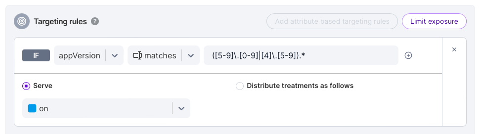

You can use the `matches` operator in the targeting rule editor within the Split user interface to match the value of a passed attribute (such as an app version) to a regular expression and specify treatment assignments for any versions that match the expression.

This approach also works when versions are formatted in `Major.Minor` and you want a specific treatment for versions below a certain threshold (for example, versions below `2.1.0`).

Example of passing the `appVersion` attribute for the JavaScript SDK:

```javascript
var attributes = {appVersion: "4.567.33"};
```

#### Target all population of specific domain of user emails

For this example, to serve the `on` treatment for all employees of split.io, we can use the Regex below for `email` attribute:

```
@split.io$
```

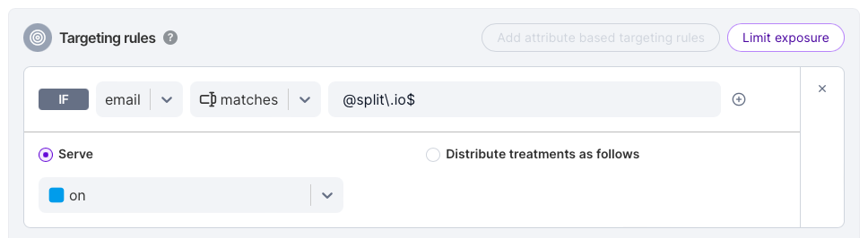

Example of passing the email attribute for the JavaScript SDK:

```
var attributes = {email: "bilal@split.io"};
```

#### Target users on Chrome version 20 and later

This example we are serving the on treatment to Chrome users only. However, we want to only use Chrome versions 20 and later for compatibility reasons. The attribute passed is userAgent:

```
Chrome\/[2-9][0-9]\.
```

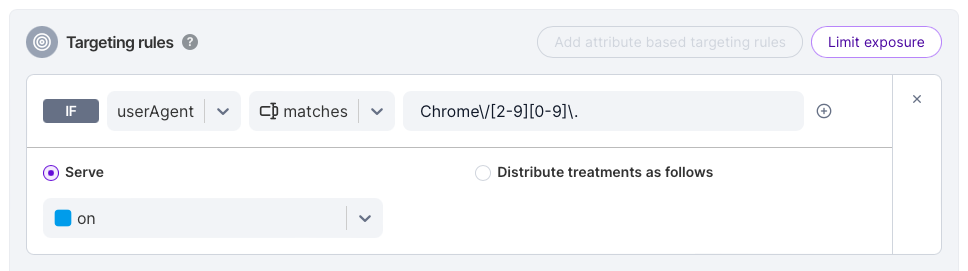

Example for the JavaScript SDK:

```
var attributes = {userAgent: "Mozilla/5.0 (Windows NT 6.2; WOW64) AppleWebKit/537.36 (KHTML, like Gecko) Chrome/27.0.1453.93 Safari/537.36"};
```

#### Target English speaking users world wide

An experiment is designed for English speaking users in any country by detecting the default language setting in the browser, the attribute passed is `navigatorLanguage en-`.

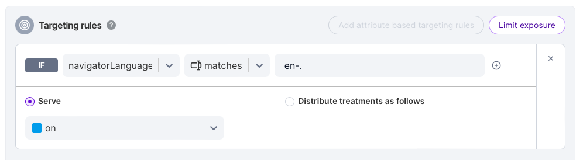

Example for the JavaScript SDK:

```javascript
var attributes = {navigatorLanguage: navigator.language};
```

#### Target specific URL

To target an experiment that applies only to users that land on a specific URL, the extracted URL can be passed as an attribute to the targeting rule:

```
http:\/\/mysite\.com\/my_url
```

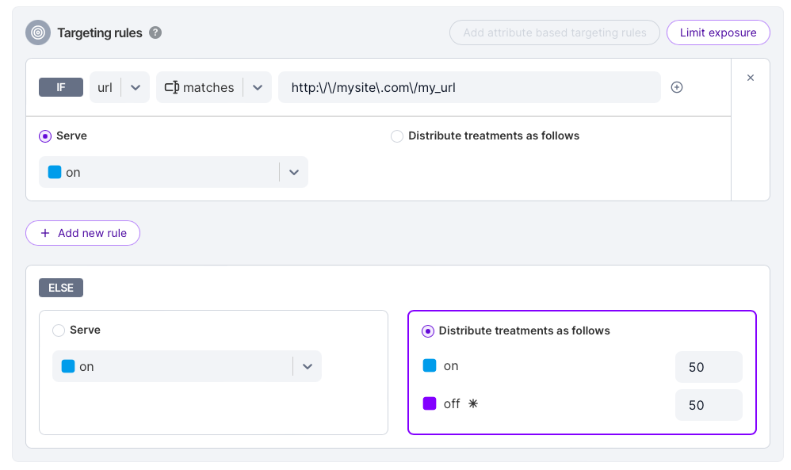

Example for the JavaScript SDK:

```javascript
var attributes = {url: window.location.href};
```

</details>

## Troubleshooting

<details>
<summary>How targeting rules evaluate custom attributes</summary>

Attribute-based targeting rules only evaluate against the attribute values passed during SDK evaluation requests (for example, `getTreatment`). If an attribute is missing or uses the wrong attribute type, the targeting rule does not match.

#### Missing attribute values

If a targeting rule references an attribute that is not included in the SDK evaluation request, the rule evaluates to `false`.

For example:

```text title="Attribute-based Targeting Rule"
if age <= 20 then 100% : on
else 100% : off
```

If the `age` attribute is not included in the attributes object passed to `getTreatment`, the condition `age <= 20` evaluates to `false`, and the `off` treatment is served.

#### Incorrect attribute type

If an attribute value does not match the expected attribute type, the targeting rule evaluates to `false`.

For example:

```text title="Attribute-based Targeting Rule"
if user.plan_type is "basic" then 100% : on
else 100% : off
```

If `plan_type` is passed as a number instead of a string, the condition `user.plan_type is "basic"` evaluates to `false`, and the `off` treatment is served.

</details>