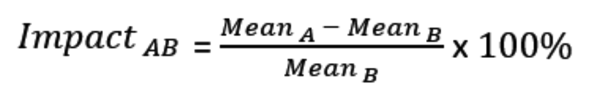

The  metric impact is the percentage increase in the mean value of a metric calculation. It is a comparison of metric results (metric mean values) for two feature flag treatments. The metric impact of treatment A compared to treatment B is calculated using the formula:

