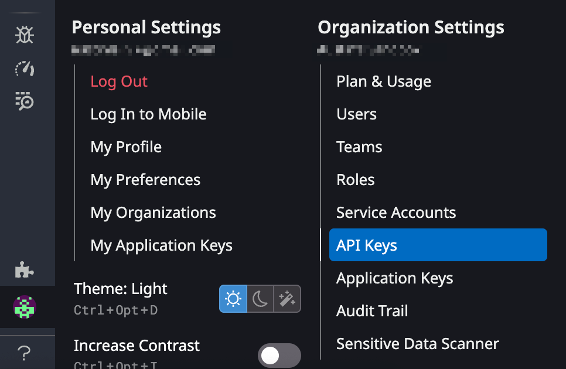
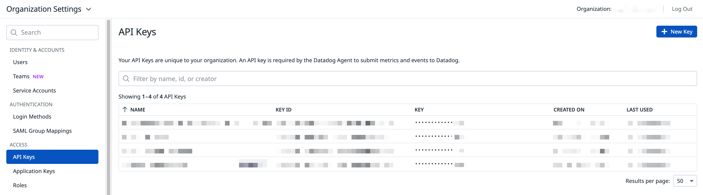
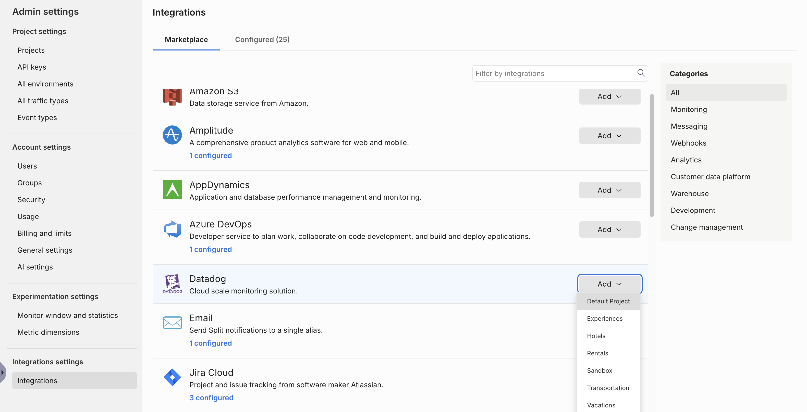

Datadog is a cloud-hosted monitoring and analytics platform for development and operations teams. Integrate Harness FME data into Datadog to monitor and measure the performance impact of Harness FME changes. If you are having trouble completing the integration, contact us at [support@split.io](mailto:support@split.io).

## In Datadog
 
1. From the Datadog navigation menu, go to **Organization Settings** and click **API Keys**.

   

2. Click **+ New Key**.

   

3. Copy the API key that you just created.

## In Harness FME

1. From the FME navigation menu, click **FME Settings** and navigate to the **Integrations** page.
1. Locate the Datadog integration and click **Add**.
1. Select the project for which you would like to configure the integration. 
   
   

1. In the `Environment` field, specify the environment from where you want audit logs sent to Datadog.
1. In the `Site` field, map the integration to a specific [Datadog site](https://docs.datadoghq.com/getting_started/site/).

   :::info 
   If you’re a current Datadog integration user, your integrations will continue to work. However, when you edit the integration, you must select the environments and the URLs again before you save your new setting.
   :::

1. In the API key field, paste the API key that you copied in Step 3 of the Datadog instructions.
1. Click **Save** to save your selections. You have now mapped your integration to your selected site.

Harness FME notifications should now display in Datadog as `"tags:role:split.io"`.

## Using FME with Datadog RUM

This Harness FME integration automatically enriches your RUM data with a feature flag variant. It allows you to correlate feature releases with performance and troubleshoot any issues to ensure safe feature releases. 

To get started, go to [Using Feature Flags](https://docs.datadoghq.com/real_user_monitoring/feature_flag_tracking/using_feature_flags/) and [Split - Rum](https://docs.datadoghq.com/integrations/split-rum/) to set up data collection for your feature flags with this Harness FME integration. You can monitor your feature flags, turn them off, or roll them back, without causing negative user experiences.

:::info[Note]
The Datadog RUM integration has been tested by Harness FME but is owned and maintained by Datadog. For more information, contact Datadog support.
:::