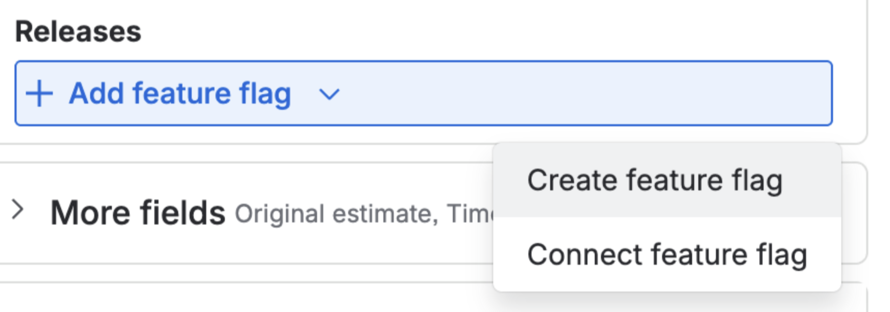
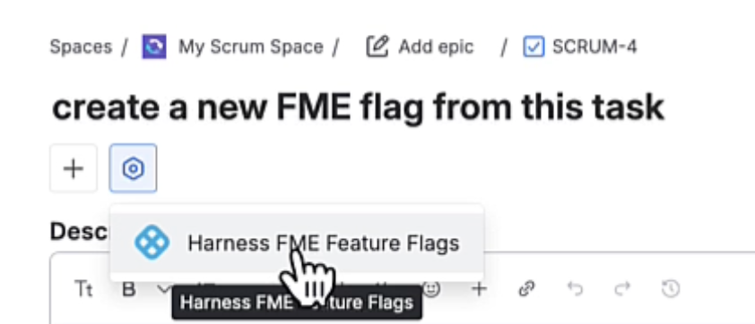
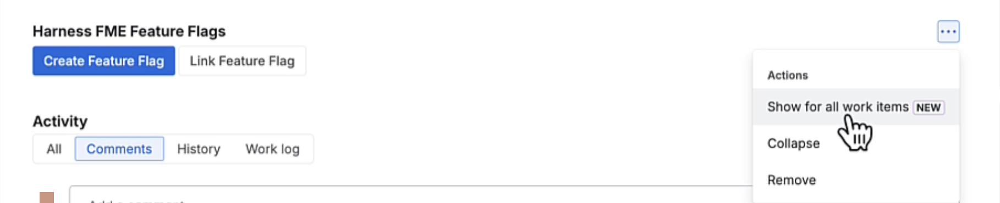

You clicked on a legacy **Create Feature Flag** or **Connect Feature Flag** link in Jira.

  

These links were part of a Jira integration experience that is no longer available. The links may still appear in some Jira instances, but they are no longer the recommended way to create or associate feature flags.

## Use the latest Jira workflow

### One-time set up for a Jira project

To make the Harness FME Feature Flags panel appear across Jira work items:

1. Open or create a Jira work item.
1. Click the **App Actions** icon next to **+** under the issue title.
   
   
  

1. Select **Harness FME Feature Flags**. This adds a Harness FME Feature Flags section under `Linked work items`.
1. In the **Harness FME Feature Flags** section, Click the **...** dropdown menu and select **Show for all work items**. 

   
  

   This ensures that the feature flag panel is displayed across all Jira work items.

### Create or link feature flags

Once the panel has been enabled:

1. Open or create a Jira work item.
1. Locate the **Harness FME Feature Flags** section.
1. Click **Create Feature Flag** to create a new feature flag in Harness FME and associate it with the current Jira work item, or click **Link Feature Flag** to associate an existing feature flag with the current Jira work item.

   
  

## View linked feature flags

After creating or linking a feature flag:

- In Jira, associated feature flags appear under a work item's **Development** > **Releases** section.
- In Harness FME, associated Jira work items appear on the feature flag's **Integrations** tab.

For more information, see the [Jira Cloud integration](/docs/feature-management-experimentation/integrations/jira-cloud).