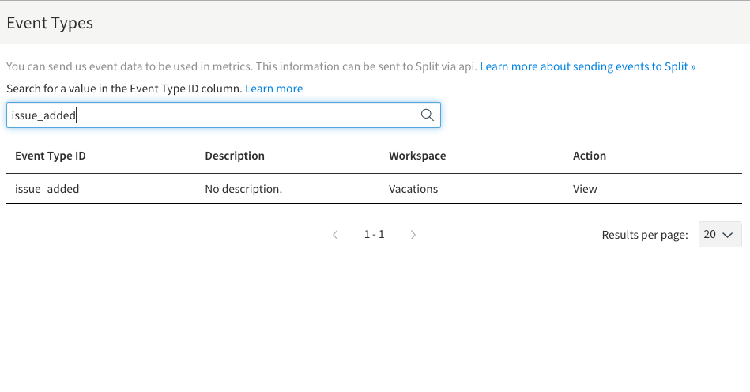
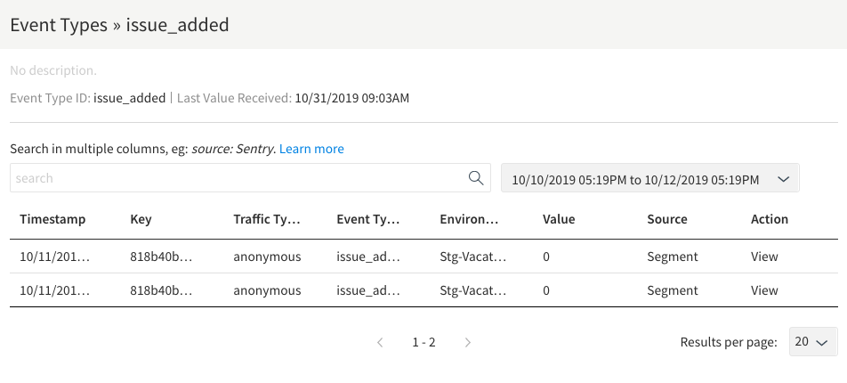
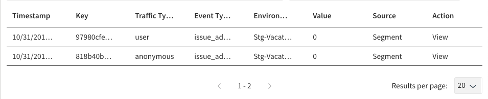

## Overview

This page explains how to verify that you are correctly receiving Segment events in Harness FME after configuring [Harness FME as a segment definition](/docs/feature-management-experimentation/integrations/segment#harness-fme-as-a-destination). Verification is a prudent next step after setting up the integration to ensure the quality of your Harness FME data. 

Do this by crosschecking the events you see from the Segment sources you have connected to your Harness FME destination against the events shown under Harness FME's event types. You need Admin access in your organization to view the events in Harness FME.

## Verifying events of one traffic type

Verifying receipt of every single event type is tedious and unnecessary. For each Segment source that you have connected to your Harness FME destination, checking one or two event types per configured traffic type is sufficient to know that data is correctly flowing. 

In the configuration of Harness FME as a Segment destination in Harness FME, you map Segment's `userId` and `anonymousId` to Harness FME traffic types. So you should check that an event sent with Segment's `analytics.track()` call using an `anonymousId` exists in Harness FME under whatever traffic type you have mapped `anonymousId`, and similarly check events sent with a userId.

For instance, if you see the following `issue_added` event in Segment:

```bash
{
  "anonymousId": "818b40b3-0a01-4ac4-b0c4-3da30ec10128",
  "context": {
    "ip": "71.211.247.135",
    "library": {
      "name": "analytics.js",
      "version": "3.9.0"
    },
    "page": {
      "path": "/IssueTracker/",
      "referrer": "",
      "search": "",
      "title": "JS Issue Tracker",
      "url": "http://kyle/IssueTracker/"
    },
    "userAgent": "Mozilla/5.0 (Macintosh; Intel Mac OS X 10_14_6) AppleWebKit/537.36 (KHTML, like Gecko) Chrome/77.0.3865.90 Safari/537.36"
  },
  "event": "issue_added",
  "integrations": {},
  "messageId": "ajs-773646ec00cd37bc931237eaa739115a",
  "originalTimestamp": "2019-10-11T22:04:14.770Z",
  "receivedAt": "2019-10-11T22:04:14.769Z",
  "sentAt": "2019-10-11T22:04:14.772Z",
  "timestamp": "2019-10-11T22:04:14.767Z",
  "type": "track",
  "userId": null
}
```

In Harness, navigate to the **Event types** tab on the **Data Hub** and search for the event type `issue_added`.



Then, click **View** for the particular event type to see the list of events.



The traffic type and key match what was sent in Segment. To ensure every detail of the event matches what was sent to Segment, click **View** for a specific event.

## Verifying Events of Multiple Traffic Types

When you have Harness FME configured as a Segment destination, events sent to that destination containing both an anonymousId and `userId` will show up in Harness FME as two events: one for the traffic type mapped to `anonymousId` and one for the traffic type mapped to `userId`. You can verify this using the same steps as above. 

For an event in Segment that looks like this:

```bash
{
  "anonymousId": "818b40b3-0a01-4ac4-b0c4-3da30ec10128",
  "context": {
    "ip": "71.33.210.130",
    "library": {
      "name": "analytics.js",
      "version": "3.9.0"
    },
    "page": {
      "path": "/IssueTracker/",
      "referrer": "",
      "search": "",
      "title": "JS Issue Tracker",
      "url": "http://kyle/IssueTracker/"
    },
    "userAgent": "Mozilla/5.0 (Macintosh; Intel Mac OS X 10_14_6) AppleWebKit/537.36 (KHTML, like Gecko) Chrome/77.0.3865.120 Safari/537.36"
  },
  "event": "issue_added",
  "integrations": {},
  "messageId": "ajs-cb646d3c8bdaf4c2303f6ea16ed2a89e",
  "originalTimestamp": "2019-10-31T15:03:38.949Z",
  "receivedAt": "2019-10-31T15:03:38.974Z",
  "sentAt": "2019-10-31T15:03:38.952Z",
  "timestamp": "2019-10-31T15:03:38.971Z",
  "type": "track",
  "userId": "97980cfea0067"
}
```

You should then see the two events with the different traffic types in Harness FME with both the `anonymousId` (`818b40b3-0a01-4ac4-b0c4-3da30ec10128`) and the `userId` (`97980cfea0067`).



## Troubleshooting

If you are not seeing events from Segment in Harness FME as expected, there are a couple things you can check.

- Check that the Harness FME/Segment integration is configured to send the events you are looking for. The configuration page has on/off switches for "Enable Track", "Track Named Pages", and "Track Named Screens". Make sure these are properly enabled for the desired events.
- Check that Segment is not configured to filter the expected events for your Harness FME destination. If you find that events are created in Segment but are not showing up in Harness FME, a possible root cause could be that there are Destination Filters applied to the Harness FME destination in Segment.

  To resolve this:

  1. Log in to your Segment account.
  1. Click on **Destinations**.
  1. Select the **Harness FME Destination**.
  1. Under the **Destination Filters** tab, ensure that there are no filters blocking the events you expect to see in Harness FME.

