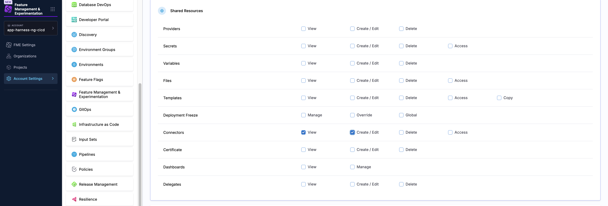

import { Section, supportedModules, supportedWorkflows, supportedDatasources, supportedAdminchanges, supportedCommunity } from '/src/components/Docs/data/fmeIntegrations';

Harness FME integrates across several categories, including messaging, monitoring, issue management, customer data platforms, and analytics. Browse the sections below to find native Harness integrations, workflow and data connectors, and community-contributed integrations for the tools your team already uses.

:::warning Required permissions to configure integrations

To create or edit an integration in Harness FME, you must have **View** and **Create/Edit** permissions on **Connectors** in the **Shared Resources** section at the **Account level** in Harness.

These permissions are not included in the built-in **FME Administrator** role, because Connectors are managed at the Harness platform level outside of FME. If you receive a permissions error when trying to set up an integration, contact your Harness Account Admin to have the required Connector permissions granted. Go to [Manage roles](/docs/platform/role-based-access-control/add-manage-roles) to create a role with the required Connector permissions.
:::

<Section 
  title="Harness Integrations" 
  items={supportedModules} 
  perRow={6} 
  rowSpacing="20px" 
  description="Harness integrations connect Harness FME with the Harness platform and its tools, so you can manage feature flags and experiments within your existing Harness workflows." 
/>

<Section 
  title="Workflow Integrations" 
  items={supportedWorkflows} 
  perRow={6} 
  rowSpacing="20px" 
  description="Workflow integrations allow you to send feature flag changes directly to the tools your team relies on, helping your team act on flag updates in real time." 
/>

<Section 
  title="Data Integrations" 
  items={supportedDatasources} 
  perRow={6} 
  rowSpacing="20px" 
  description="Data source integrations send event data to FME to power experiments, helping you measure the impact of features on metrics derived from your customer data. Data export integrations allow you to send impression data to analytics platforms, data warehouses, or CRM tools to enrich your business intelligence and reporting." 
/>

<Section 
  title="Admin Integrations" 
  items={supportedAdminchanges} 
  perRow={6} 
  rowSpacing="20px" 
  description="Admin integrations let you propagate administrative changes (such as user or configuration updates) to the tools your team uses, keeping your workflows consistent and up-to-date." 
/>

<Section 
  title="Community-supported Integrations" 
  items={supportedCommunity} 
  perRow={6} 
  rowSpacing="20px" 
  description="In addition to native integrations, the Harness FME community has contributed a wide variety of integrations, enabling you to bring feature flag data into additional tools not natively supported, from monitoring dashboards to analytics platforms." 
/>

:::tip Request an Integration
If you're not seeing a tool you need to be connected to Harness FME, you can use the [API](https://docs.split.io/) and [SDKs](/docs/feature-management-experimentation/sdks-and-infrastructure) to connect with the tools your team uses. 

Already built out your own integration or want to request an integration? Contact [Harness Support](/docs/feature-management-experimentation/fme-support). We'd like to feature your work to the entire Harness FME developer community.
:::