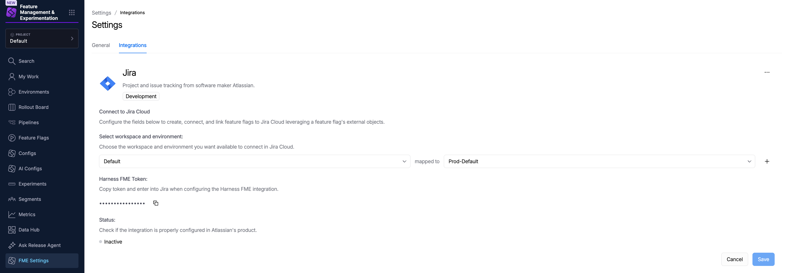
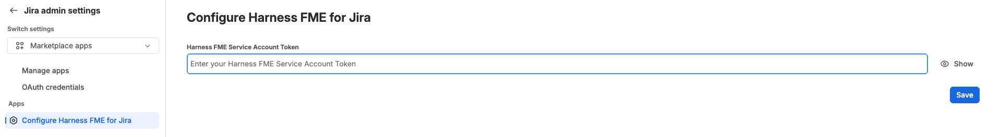
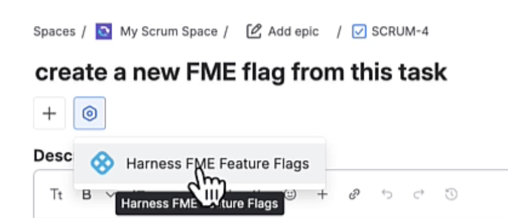
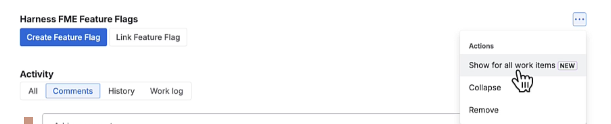
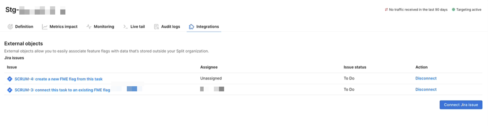
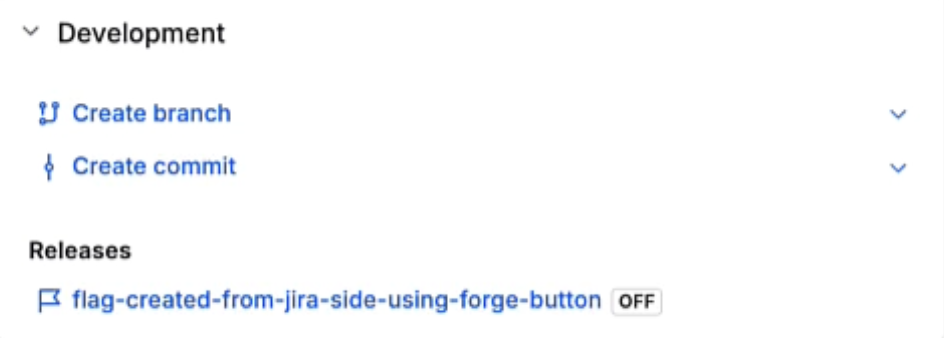

The Harness FME for Jira integration lets you associate feature flags with Jira work items and view those relationships in both Jira and Harness FME.

By linking feature flags to Jira issues, teams can track feature delivery work alongside development activities, navigate between Jira and Harness FME, and maintain visibility into which feature flags are associated with specific work items.

## Setup

:::warning[Jira Cloud only]
This integration only works with Jira Cloud product offerings and does not work with Jira Server. 
:::

### In Harness FME

To set up the integration in Harness FME:

1. From the FME navigation menu, click **FME Settings** and navigate to the **Integrations** page.
1. Locate the Jira Cloud integration and click **Add**.
1. Select the project and associated environments you want to connect to Jira Cloud. You can select multiple projects but only one environment per project. 
1. Click **Save**. 
1. Select the Jira integration you just configured and navigate to the **Harness FME Token** section.
1. Click **Copy** to copy the Harness FME token to the clipboard. You can now use this token to configure the Jira Cloud.

   
  

   
A Jira instance is associated with a single Harness account, and the integration can be configured for multiple Harness projects. 

### In Jira

To set up the integration in Jira:

1. In the [Atlassian Marketplace](https://marketplace.atlassian.com/vendors/1221408/harness-inc), install the Harness FME integration for your Harness account region:

   * For US accounts, use [Harness FME - Standard](https://marketplace.atlassian.com/apps/1723796743/harness-fme-standard).
   * For EU accounts, use [Harness FME - Europe](https://marketplace.atlassian.com/apps/636403565).

1. Within **Apps** in Jira Cloud, open **Harness FME** and click **Configure integration**.
1. Enter the token you copied from Harness FME and click **Save**.
   
   
  

### Enable the feature flag panel on work items

1. Create or open a work item in Jira. 
1. Click the **App Actions** icon next to **+** under the issue title.
1. Select **Harness FME Feature Flags**.
   
   
  

   This adds a `Harness FME Feature Flags` section under **Linked work items**.

1. In the **Harness FME Feature Flags** section, click the **...** menu and select **Show for all work items**.
   
   
  

   This ensures that the Harness FME Feature Flags panel is displayed across all Jira work items.

## Connect feature flags to work items

Once the integration is configured, you can connect feature flags to Jira work items from either Harness FME or Jira. 

import Tabs from '@theme/Tabs';
import TabItem from '@theme/TabItem';

<Tabs queryString="start">
<TabItem value="harness" label="From Harness FME">

Navigate to a feature flag's **Integrations** tab and click **Connect Jira Issue**. Enter the desired issue number.

</TabItem>
<TabItem value="jira" label="From Jira">

In a Jira work item, use the **Harness FME Feature Flags** panel to create a feature flag or connect an existing feature flag.

- **Create feature flag** takes you to Harness FME, where the feature flag creation dialog opens with the current Jira work item entered.
- **Connect feature flag** opens a dialog where you can select an existing feature flag.

</TabItem>
</Tabs>

You can associate multiple feature flags with a Jira issue and multiple Jira issues with a feature flag.

## View your connections

After you create or link a feature flag to a Jira work item, you can view the association from either platform.

### In Harness FME

Navigate to the feature flag's **Integrations** tab to view associated Jira work items. For each connected work item, you can view details such as the issue key, assignee, and issue status. 

Click a work item to open it in Jira, or click **Disconnect** to remove the association.

### In Jira

Navigate to the work item's **Development** section and expand **Releases** to view associated Harness FME feature flags. 

  

Click a feature flag to open it in Harness FME and view its configuration, targeting rules, and rollout details.

## Disconnect a work item

To remove the association between a Jira work item and a feature flag, navigate to the feature flag's **Integrations** tab in Harness FME and click **Disconnect**.