Harness FME supports two Slack integrations for sending notifications to your workspace:

* **[Slack app integration (beta)](#slack-app-integration-beta)**: A newer integration that supports OAuth authentication, Slack commands, configurable subscriptions, and interactive notifications.
* **[Slack webhook integration (legacy)](#harness-fmeslack-webhook-integration-legacy)**: An older incoming webhook-based integration that sends notifications to a Slack channel using a Slack Incoming Webhook URL.

Choose the integration that best fits your organization’s needs.

## Slack app integration (beta)

:::tip[Slack app integration]
The Slack app integration is in beta. To request access, contact [Harness Support](/docs/feature-management-experimentation/fme-support).
:::

The Slack integration allows teams to stay up to date on changes they care about in Harness FME. By combining FME's rollout capabilities with Slack, you can:

* Keep your team notified about feature flag and segment changes
* Subscribe to the changes you care about by filtering notifications by Harness FME project, environment, type (e.g. feature flag and segment), and action (e.g. create, update, delete)

With this integration, as a Slack user, you can subscribe channels to notifications based on filters that they set. Once these filters are set up by that user, any Slack user in that channel can see any event that exists that meets the filter criteria in that channel. In addition, you can see notifications relevant to you, specifically in the Split Slack App on the messages tab.

## Setting up in Harness FME

To set up the Slack app integration in Harness FME:

1. From the FME navigation menu, click **FME Settings** and navigate to the **Integrations** page.
1. Locate the Slack integration and click **Add**.
1. Click **Save**.

   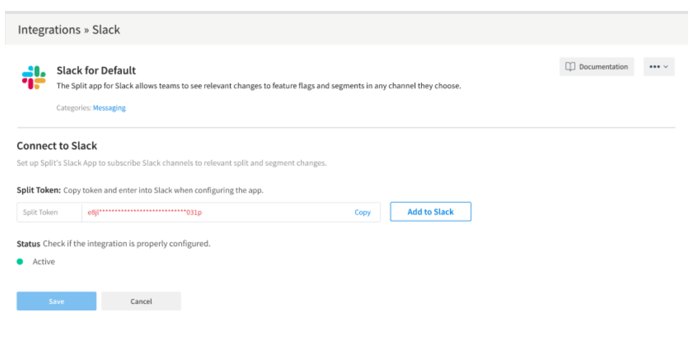

1. Navigate back to the newly created integration. The token and Add to Slack button are displayed. 
1. Click **Add to Slack**. This takes you into the Slack OAuth flow.
1. In the Slack authorization page, you see a page with the message explaining the permissions required by the Split Slack app. 

   Click **Allow**. You’re prompted to open Slack. 

   
 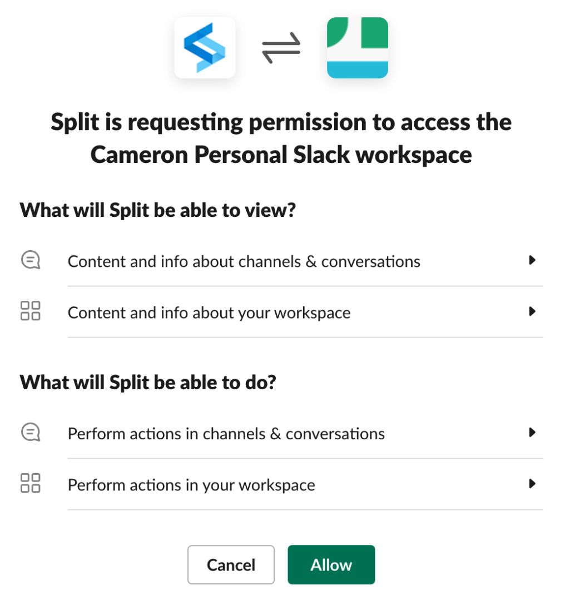 

The Slack installation flow is complete and Slack is now open with a new app installed.

## Setting up in Slack

To set up in Slack, do the following:

1. When you open Slack, a welcome message indicating that you successfully installed the Split app on the Slack workspace appears in the App’s home section:

   
 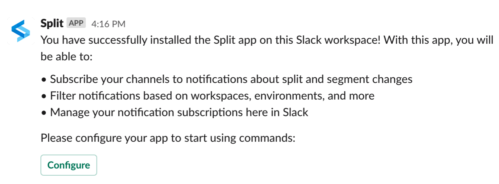 

2. Click the **Configure** button. The Configure Split App modal appears.

   
 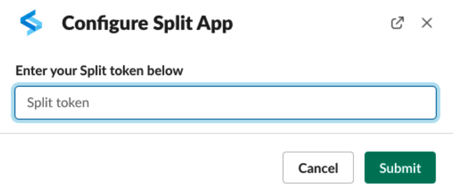 

3. Enter the Harness authentication token that you generated when you set up on the Harness FME side and click the **Submit** button. Slack displays the following:

   
 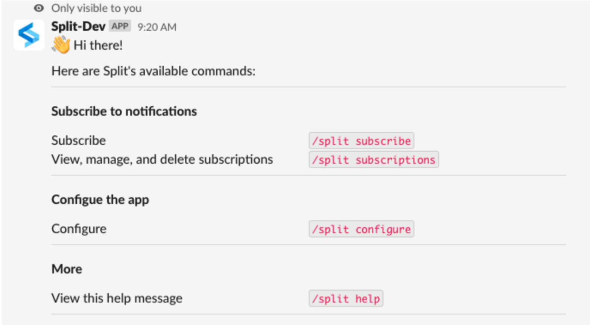 

## Using Split commands

You can interact with the Slack app to initiate initial configuration, subscription management, and help documentation using the following commands:

* `/split configure`
* `/split subscribe`
* `/split subscriptions`
* `/split help`

### Using the configure command

Use the `/split configure` command to display the Configure Split app modal. 

Entering your Harness authentication token here links the Slack app with your Harness account. You only need to use this command if you did not previously click **Configure** in the welcome message.

Only admins have access to the required Harness authentication token. If token validation fails, an error message displays when you click **Submit**.

### Create a channel subscription

Use the `/split subscribe` command to create a channel subscription, which subscribes your Slack channel to Harness FME notifications. The Channel menu list is pre-selected with the current channel. However, a user can select a different channel if desired. Optionally select your desired filter criteria and click **Submit** to create the channel subscription. 

   
 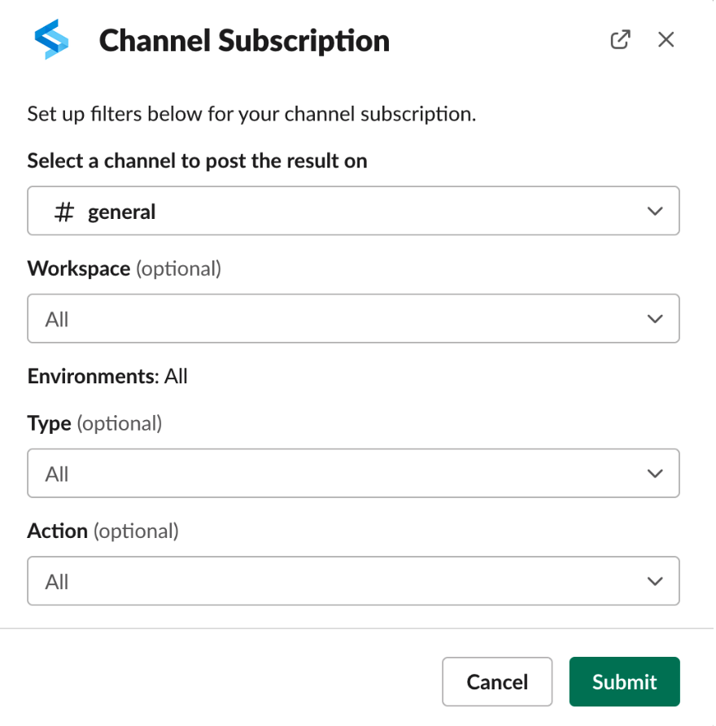 

:::info[Note]
If you select a private channel, you get an error message indicating that the channel is private.
:::

## Managing subscriptions

The `/split subscriptions` command lists out the available subscriptions within the current channel, displaying a filter summary for each, and allows you to edit and delete subscriptions.

### Edit a subscription

To make a change to a subscription, click the **Edit** button next to the desired subscription. The Edit Subscription modal displays pre-populated with the subscription’s filter criteria. Make the desired changes and click the **Submit** button. You get a message indicating that the subscription is updated.

### Delete a subscription

Delete a subscription by clicking the **Delete** button next to a given subscription. You’re prompted with a confirmation message indicating that notification matching the subscription will be removed. Click the **Confirm** button to finish deleting the subscription.

## Harness FME/Slack webhook integration (Legacy)

:::warning[Legacy integration]
This section describes the older Slack webhook integration that uses Slack Incoming Webhooks.

For the newer Slack app experience with subscriptions and Slack commands, use the [Slack app integration above](#slack-app-integration-beta).
:::

Expand for the Slack webhook integration

#### Setting up in Slack
 
1. Go to the Incoming Webhooks page in the Slack App Directory [here](https://slack.com/apps/A0F7XDUAZ-incoming-webhooks). Make sure you're signed into Slack.

2. On this page, if you're an Owner of your Slack Workspace, click the **Add Configuration** button and proceed to step 3.

   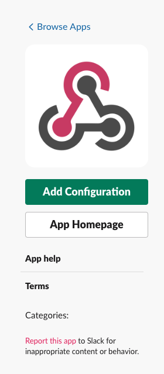

   2a. If you're not an Owner, click the **Request to Install** button and ask your Slack Workspace Owner to follow the rest of the steps in this doc.

     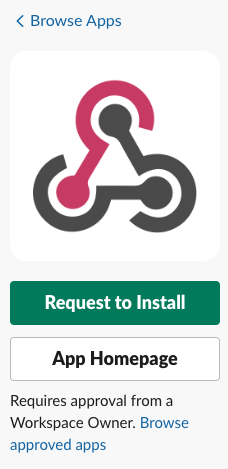

3. Select a channel where you would like the notifications from Harness FME displayed and click the **Add Incoming WebHooks integration** button.

   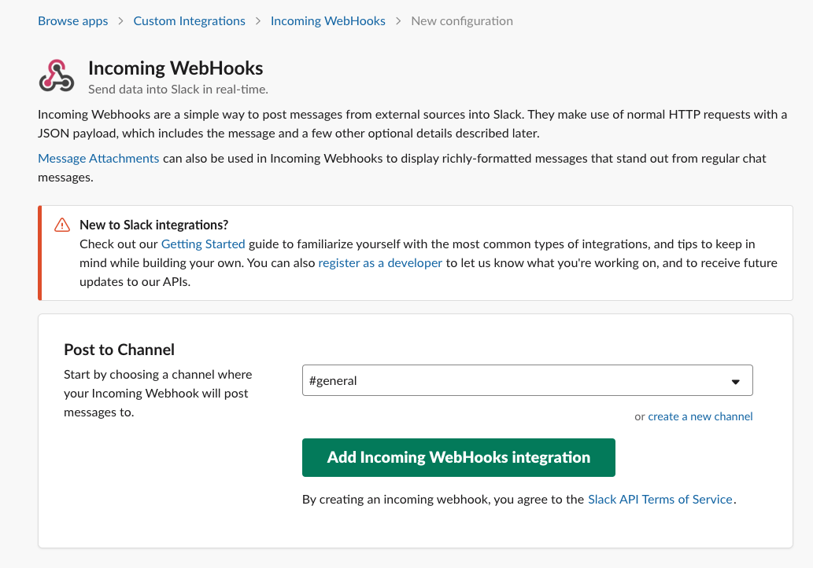

4. On the Setup Instructions page, copy the Webhook URL.

   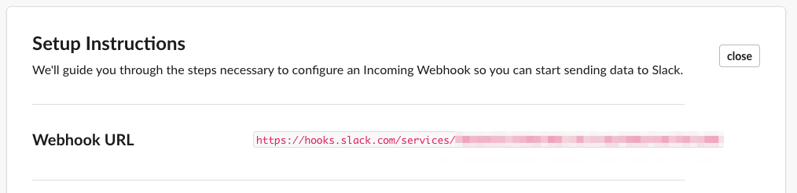

#### Setting up in Harness FME

1. Go to Admin Settings and click **Integrations**.

2. Click **Add** next to Slack.

   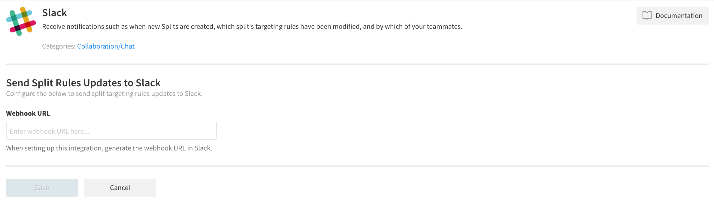

3. Paste the **Webhook URL** you copied in step 4 and click **Save**.

Harness FME notifications should now be flowing into Slack. If you have any issues with this integration, contact [support@split.io](mailto:support@split.io).

