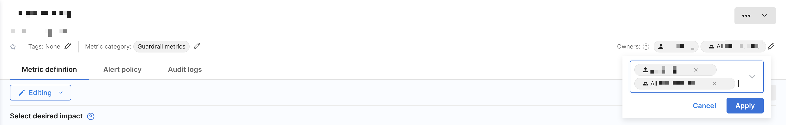
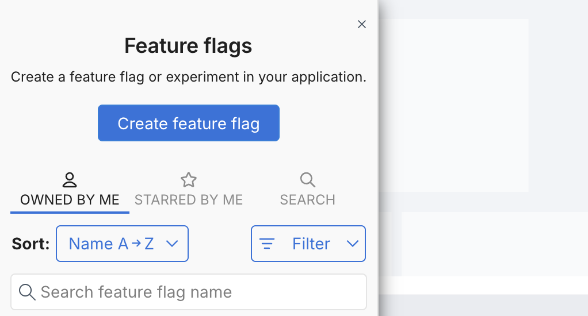

:::danger Owners Permissions Update
Owners are no longer granted edit permissions by default. Owners are treated as metadata to help identify responsible stakeholders and filter FME resources (such as feature flags, segments, and metrics). 

To manage who can edit, use [environment-level permissions](/docs/feature-management-experimentation/permissions) or set explicit editors on a flag, segment, or metric.
:::

## Overview

Owners help identify responsible stakeholders for feature flags, segments, and metrics. They are used to organize and filter resources in Harness FME. 

You can use owners to:

- Filter feature flags, segments, and metrics to those **owned by me**.
- Help teams understand who is responsible for maintaining a resource
- Improve discoverability when searching or browsing

:::tip
Owners **do not** grant edit permissions. Editing access is controlled through RBAC.
:::

To allow a user or resource group to make changes, ensure they have the appropriate permissions:

- [RBAC Resource Groups and Roles](/docs/feature-management-experimentation/permissions/rbac#resource-groups)
- [Approval rules](/docs/feature-management-experimentation/feature-management/setup/approval-flows) configured per [environment](/docs/feature-management-experimentation/environments#navigate-environments)

## Adding or removing owners

:::info
Only current owners can change owners for a feature flag, segment, or metric.
:::

To change the owner for a feature flag:

1. Click the Gear icon next to the feature flag name and select **Edit details**. The **Details** panel appears.
   
   

1. In the **Owners** field, either begin entering to select an existing group or user or use the down arrow to display a list of owners.
1. Select the desired owners and click **Save**.

To change the owner for a segment or a metric:

1. Navigate to a segment or metric.
1. Use the **Owners** field in the top-right or go to the **Definition** tab and click the **Editing** pencil icon.
   
   

1. Select **Restrict who can edit** and add groups or users in the **Owners** field.
1. Click **Apply**.

:::tip
Harness recommends using resource groups as owners to make onboarding smoother for team members.
:::

## Filtering by owners

You can identify the resources that you own by navigating to a feature flag, segment, or a metric and selecting **Owned by me**.

Resources will appear if you are listed as an owner directly or through a resource group.