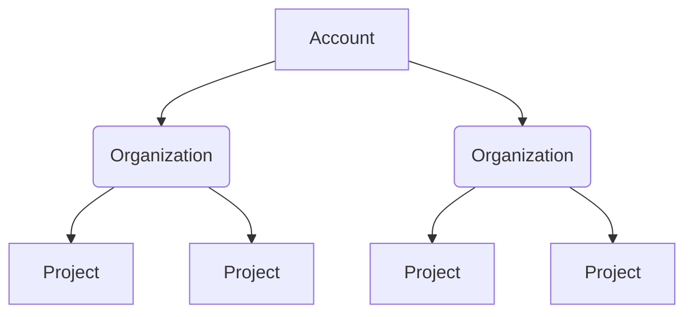
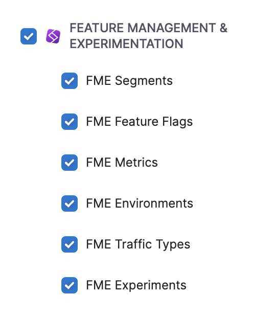
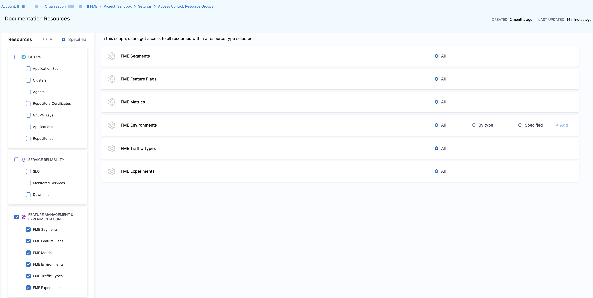
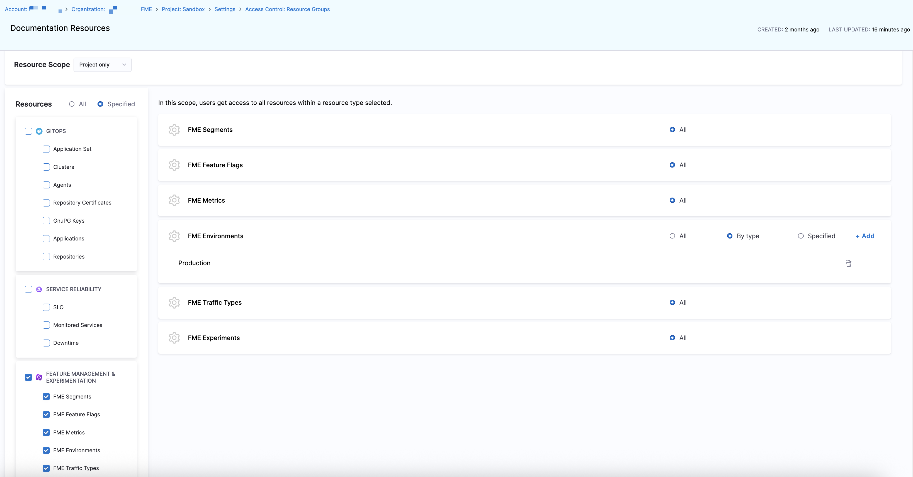
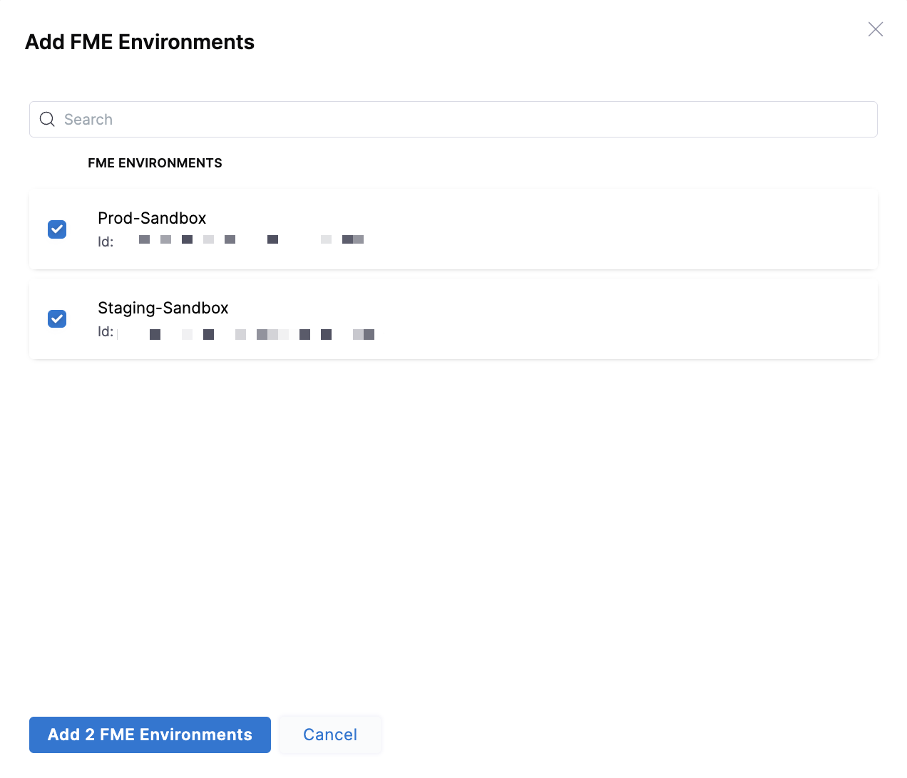
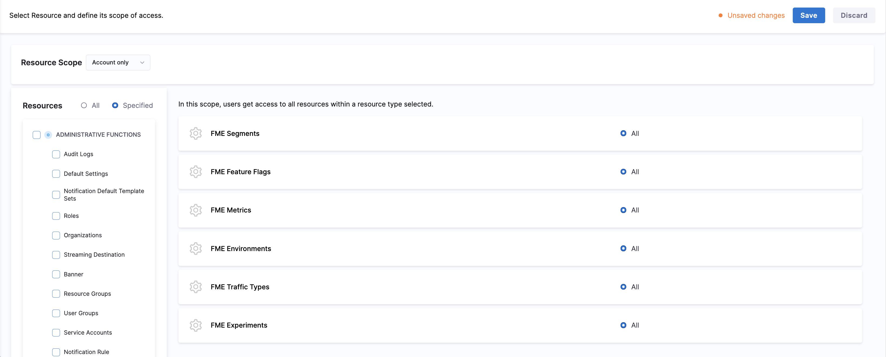
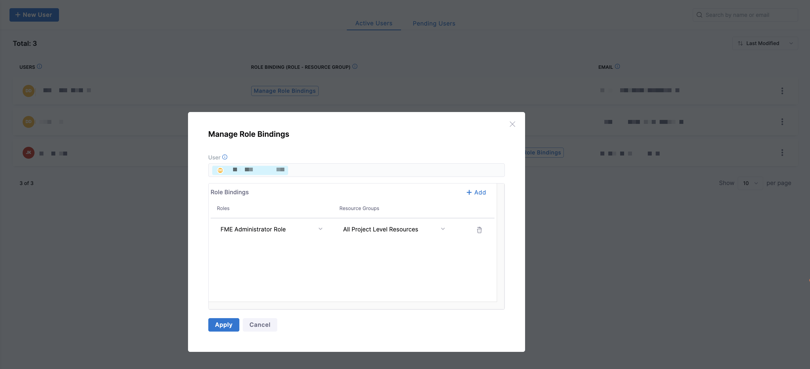

Harness Role-Based Access Control (RBAC) enables administrators to control access for Feature Management & Experimentation (FME) resources within each project.

## Scopes in Harness RBAC

The Harness platform follows a three-level hierarchical structure. Each level (or scope) defines how permissions and resources are inherited and applied:

- **Account Scope**: Includes all organizations and projects within your Harness account. Resources created at the account level are available to all organizations and projects under that account.
- **Organization Scope**: Groups related projects, resources, and users. Resources created at the organization level are available to all projects within that organization but are not visible outside it.
- **Project Scope**: Contains resources specific to a project, such as FME feature flags, segments, metrics, environments, and traffic types. Project-level resources are not shared with other projects or organizations.

RBAC policies assigned to FME resources do not inherit across organizations or accounts. Before configuring RBAC resource groups and roles, ensure FME is enabled on your account. For more information about Harness RBAC, see the [Harness Platform documentation](/docs/platform/role-based-access-control/rbac-in-harness).

## Resources and Scopes

All FME resources are created and governed at the project scope.

| Resource | Scope | Notes |
|----------|-------|------|
| Feature Flags | Project | Includes all flag definitions in the project. |
| Segments | Project | Includes all segment types in the project (standard, large, and rule-based). |
| Metrics | Project | Includes metric definitions and alerts. |
| Environments | Project | Controls access to environment-scoped operations. |
| Traffic Types | Project | All traffic types configured in the project. |
| Experiments | Project | All experiments defined in the project. |

## Out-of-the-box roles

Harness provides two default FME roles with pre-configured permissions:

- **FME Manager Role**: Grants permissions similar to the legacy “Editor” role in Split, enabling users to edit most FME resources.
- **FME Administrator Role**: Grants permissions similar to the legacy “Administrator” role in Split for FME resources.

If you are a Harness FME administrator, you can use Resource Groups to control access to FME resources by specific environment and create custom roles to support granular permissions.

## Resource groups

Resource Groups define which FME resources and environments users can access within a project. Each resource type supports two access controls:

| Access Type | Description |
|---|---|
| **All** | Grants access to all resources for all Harness product modules. |
| **Specified** | Grants access to selected resources and Harness product modules. |

When you click on the **FME Environments** resource, you can set environment-level access with the following:

| Access Type | Description |
|---|---|
| **All** | Grants access to all FME environments. |
| **By type** | Grants access to a specific FME environment type (`Production` or `Pre-Production`). |
| **Specified** | Grants access only to specific FME environments added by name. |

This allows organizations to grant edit permissions only in intended environments, ensuring tighter control over sensitive environments, such as production.

## Create a resource group for environment-level access

To define environment-level permissions in Harness FME:

1. Navigate to **Project Settings** > **Resource Groups**.
1. Click **+ Add Resource Group** to create a new Resource Group.
1. Enter a name such as `Documentation Resources` and optionally, description and tags, then click **Save**.
1. Choose either **All**, which grants access to all resources in all of your available Harness modules, or **Specified** to grant access for each resource and product module next to **Resources**.
1. Select **Feature Management & Experimentation** to enable all FME resources or click the checkbox next to each resource in the **Feature Management & Experimentation** section.
   
   

1. For the **FME Environments** resource, you can select **All**, **By type**, or **Specified** to manage environment-level access.

    - **All**: Grants access to all FME environments.

      

    - **By Type**: Click **+ Add** to grant access to FME environments by type. 

      

      Select **Production** or **Pre-Production**, and click **Add FME Environment Type**.

    - **Specified**: Click **+ Add** to grant access to specific FME environments by name.

      

      Once you've selected the environments you want to grant access for, click **Add FME Environments**.

      

1. Click **Save**.

## Assign a resource group to users

To enforce access defined in a Resource Group:

1. Navigate to **Project Settings** > **Roles**.
1. Edit an existing role or create a new role.
1. Apply the role to users or user groups by clicking **Manage Role Bindings** on the **Users** or **User Groups** page in **Project Settings**.
1. Click **+ Add** to add the resource group to the role.  
1. Select a role from the dropdown menu (for example, the `FME Administrator Role`) and select the resource group you created above.

   

1. Click **Apply** to save this role binding to a user or user group.
   
With roles and resource groups combined, you can ensure only authorized users can view or edit target environments.