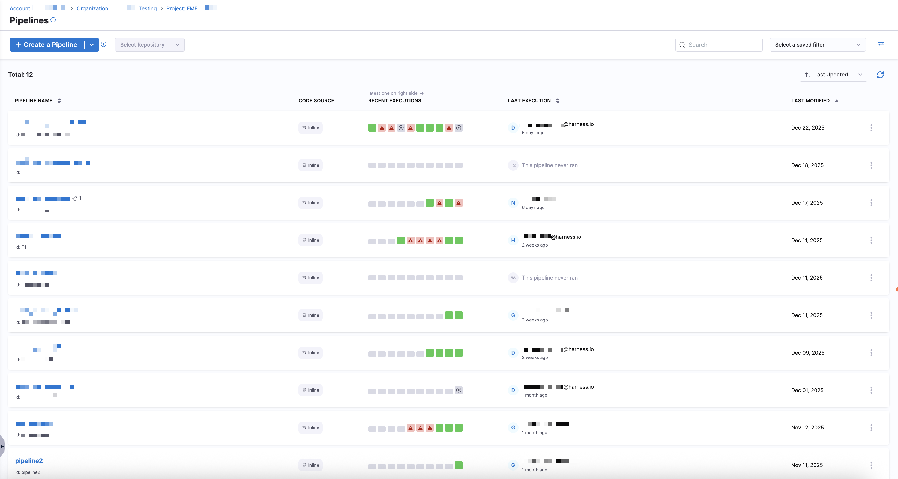
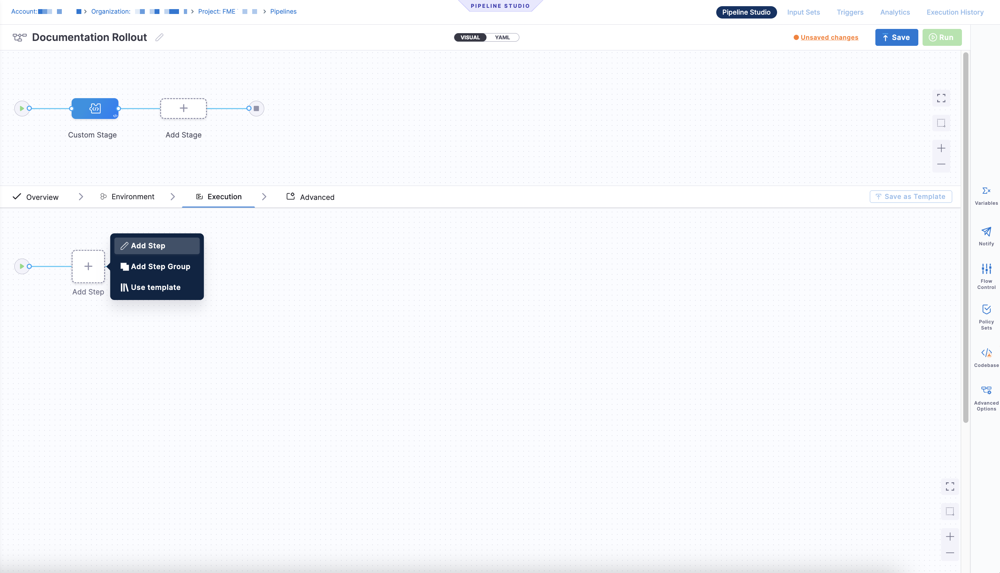
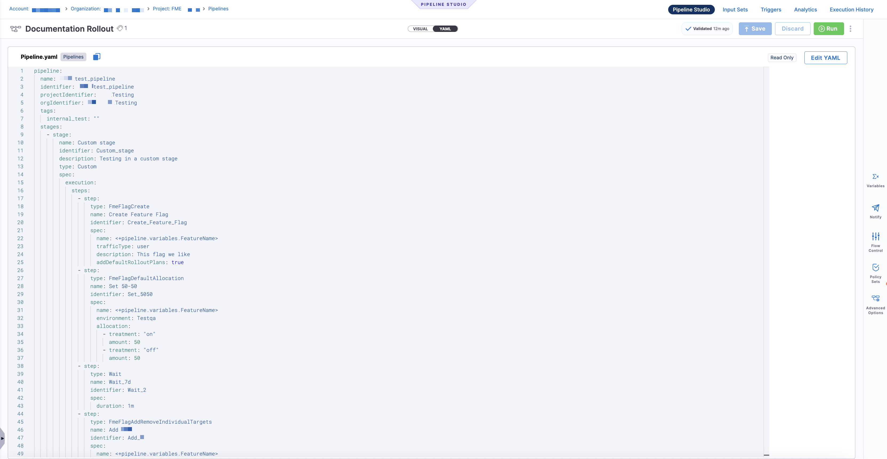
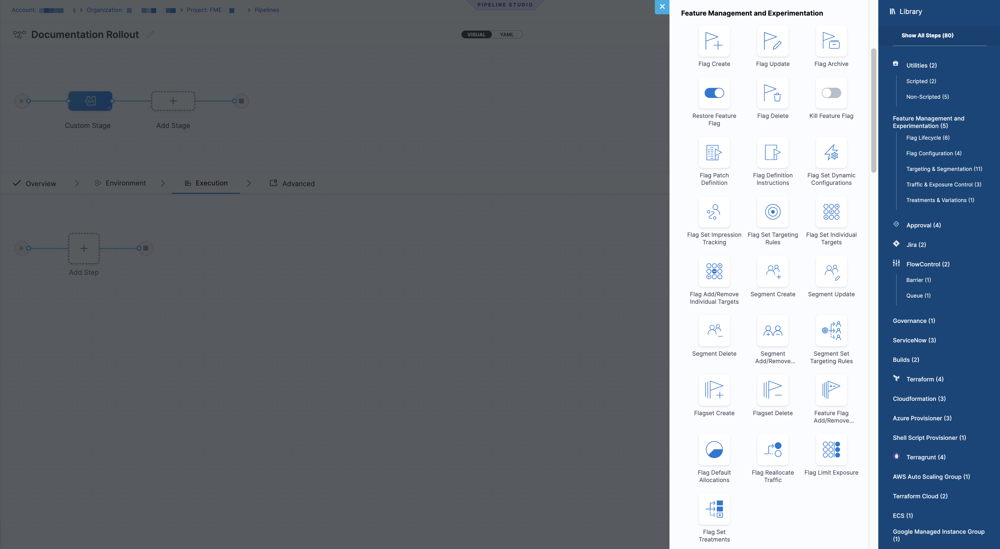
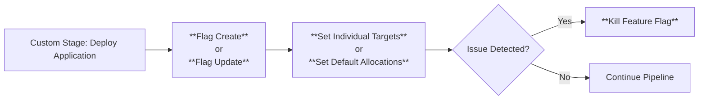
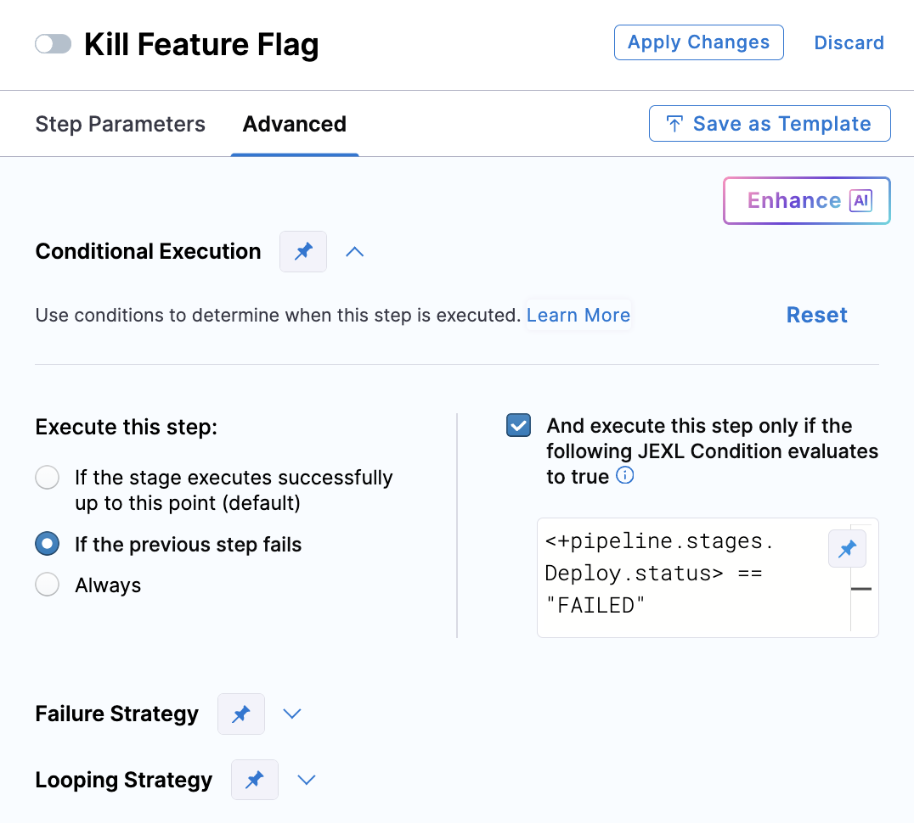

<CTABanner
  buttonText="Request Access"
  title="FME Steps in Pipelines is in beta!"
  tagline="Add Harness Management & Experimentation steps to your Harness pipelines. Available now in beta!"
  link="https://developer.harness.io/docs/feature-management-experimentation/fme-support"
  closable={true}
  target="_self"
/>

Harness Feature Management & Experimentation (FME) integrates with <Tooltip id="fme.pipelines.pipeline">Harness pipelines</Tooltip>, allowing you to include <Tooltip id="fme.pipelines.feature-flag">feature flag logic</Tooltip> directly within your deployment or automation workflows. The **Pipelines** page in Harness FME displays a list of [Harness pipelines](/docs/platform/get-started/key-concepts#pipelines) created in your [project](/docs/feature-management-experimentation/projects). 



## Create a Harness pipeline 

To create a pipeline, click **+ Create a Pipeline**. You can create a pipeline manually in the UI or import one from a Git repository. Clicking on a pipeline opens the Pipeline Studio, where you can design and manage the pipeline using either the **Visual** or **YAML** editor. 

import Tabs from '@theme/Tabs';
import TabItem from '@theme/TabItem';

<Tabs queryString="tab-number">
<TabItem value="visual" label="Visual">

The **Visual** tab lets you configure stages and steps using the UI, including [adding FME steps](#add-fme-steps-to-a-pipeline-stage) supported in <Tooltip id="fme.pipelines.custom-stage">Custom stages</Tooltip>. Add a custom stage and click **Add Step** to open the Step Library.



</TabItem>
<TabItem value="yaml" label="YAML">

The **YAML** tab displays the full pipeline definition as YAML. Click **Edit YAML** to modify the pipeline configuration in code.



</TabItem>
</Tabs>

Both views stay in sync; changes made in the **Visual** editor are reflected in the YAML, and changes made in YAML are reflected back in the **Visual** editor.

When you configure a pipeline, you set it up like any standard pipeline, with the addition of <Tooltip id="fme.pipelines.step">FME steps</Tooltip> at the <Tooltip id="fme.pipelines.stage">stage level</Tooltip>. These steps let you integrate feature flag operations directly into your deployment workflow.

## Permissions

Pipeline permissions are controlled through [Harness RBAC for FME](/docs/feature-management-experimentation/permissions/rbac). Pipeline runs that include FME steps require the same permissions you would need to [edit feature flags in Harness FME](/docs/platform/role-based-access-control/permissions-reference/#feature-management-and-experimentation). 

- You need view (`core_pipeline_view`), create/edit (`core_pipeline_edit`), and execute (`core_pipeline_execute`) [pipeline permissions](/docs/platform/role-based-access-control/permissions-reference/#pipelines). 
- You also need create/edit (`fme_fmefeatureflag_edit`) [permissions for feature flags in any FME environment](/docs/feature-management-experimentation/environments) the pipeline modifies. If a pipeline run tries to update a flag in an environment where you don't have edit access, the step will fail. 

## How FME steps work in Harness pipelines

When you add a <Tooltip id="fme.pipelines.step">step</Tooltip> to a <Tooltip id="fme.pipelines.custom-stage">Custom stage</Tooltip> in the Pipeline Studio, the Step Library includes a **Feature Management & Experimentation** section with FME-specific steps.



Each FME step runs like [any other Harness pipeline step](/docs/platform/pipelines/add-a-stage#steps-available-for-custom-stages) and performs a single, discrete feature flag operation, such as creating a flag, updating metadata, modifying individual targets, or killing a flag. These steps execute in sequence with the rest of your pipeline logic and support standard pipeline capabilities, including [approvals](/docs/platform/approvals/approvals-tutorial), [notifications](/docs/platform/notifications/notification-settings#configure-pipeline-notifications), and [custom failure strategies](/docs/platform/pipelines/failure-handling/define-a-failure-strategy-on-stages-and-steps/).

## How approvals work with FME steps

Approvals can be added in Harness pipelines to prevent the execution from proceeding without approval. An [Approval stage or step](/docs/platform/approvals/approvals-tutorial/) pauses the pipeline and requires an approver to approve or reject before the pipeline continues. For more information about approval stages or steps, see the [Platform documentation](/docs/platform/approvals/approvals-tutorial/).

When using FME steps in pipelines, these Harness approvals control the execution flow. [FME environment-level approval settings](/docs/feature-management-experimentation/environments#create-environments) **do not** apply to pipeline runs. 



<br />

This approach lets teams coordinate automated workflows and feature flag changes within a single, auditable pipeline. By adding FME steps to your pipeline stages, you can: 

- Create and manage feature flags as part of your deployment or promote workflows using **Flag Create** and **Flag Update**, including defining flags across all environments and updating metadata such as status, owners, and tags
- Manage individual targeting lists deterministically with **Set Individual Targets** and **Add/Remove Individual Targets**, allowing you to define or modify explicit target membership during a pipeline run
- Control default rollout behavior using **Set Default Allocations**, configuring how traffic is allocated when no targeting rules apply
- Immediately disable a feature flag with **Kill Feature Flag** as part of an incident runbook

FME steps in Harness pipelines allow feature flag operations to be predictable, reusable, and executed alongside application deployments, helping teams coordinate releases while reducing manual configuration and operational risk.

## Add FME steps to a pipeline stage

FME steps are compatible with the [Custom stage](/docs/platform/pipelines/add-a-stage#add-a-custom-stage) in Harness pipelines.

To add FME steps to a pipeline:

1. Navigate to the **Pipelines** page from the FME navigation menu.
1. Click **+ Create a Pipeline** or click **+Import From Git** to import a pipeline from an existing Git repository.
1. Enter a name for the pipeline. Optionally, add a description and include tags for this pipeline.
1. Click **Inline** to store the pipeline in Harness or **Remote** to store the pipeline in a Git repository. 
1. Click **Start**.
1. Click **Add Stage** and select **Custom Stage**.
1. Click **+ Add Step**. The **Step Library** panel opens on the right.
1. Navigate to the **Feature Management & Experimentation (FME)** section and select a step. 

   | FME step                                   | Primary use case                          | When to use it                                                                                                                                                      |
   | ------------------------------------------ | ----------------------------------------- | ------------------------------------------------------------------------------------------------------------------------------------------------------------------- |
   | [**Flag Create**](#fme-flag-create)                        | Create a new feature flag                 | Use when introducing a new feature flag as part of deployment or feature development. This step instantiates the flag across all environments with default rollout plans.                    |
   | [**Flag Update**](#fme-flag-update)                        | Update flag metadata                      | Use when you need to edit flag properties such as the description, rollout status, owners, or tags without changing targeting or traffic allocation.       |
   | [**Set Individual Targets**](#fme-set-targets)                   | Define the full set of individual targets | Use when you want to deterministically set the complete list of individual targets for a flag in an environment, replacing any existing list.        |
   | [**Add/Remove Individual Targets**](#fme-add-remove-individual-targets) | Incrementally modify targeting            | Use when you need to add or remove specific users or segments without overwriting existing individual target lists. Useful for gradual rollouts or hand-picked targets. |
   | [**Set Default Allocations**](#fme-set-default-allocations)           | Control default rollout percentages       | Use when you want to define how traffic is split across treatments for users who do not match any targeting rules (for example, 50/50, 75/25, or 100% on).              |
   | [**Kill Feature Flag**](#fme-kill-feature-flag)                  | Immediately disable a feature             | Use to kill the flag in the specified environment, serving the [default treatment](/docs/feature-management-experimentation/feature-management/setup/default-treatment).                                                |

1. Configure the step in the **Step Parameters** tab.
1. Optionally, add additional configuration in the **Advanced** tab.
1. Click **Save** to add the step to the stage. 

<details>
<summary>Example Pipeline YAML Configuration</summary>

The following example shows a Harness pipeline that uses multiple <Tooltip id="fme.pipelines.step">FME steps</Tooltip> within a <Tooltip id="fme.pipelines.step">Custom stage</Tooltip> to coordinate feature flag creation, rollout, targeting, and kill actions alongside standard pipeline steps:

```yaml
pipeline:
  name: <PIPELINE_NAME>
  identifier: <PIPELINE_ID>
  projectIdentifier: Default
  orgIdentifier: <ORG_ID>
  tags: {}
  variables:
    - name: flagName
      type: String
      description: "The feature flag name for this feature rollout."
      required: true
      value: <+input>
  stages:
    - stage:
        name: demo_stage
        identifier: demo_stage
        description: "Custom stage with FME steps for this feature rollout."
        type: Custom
        spec:
          execution:
            steps:
              - step:
                  type: FmeFlagCreate
                  name: initial setup
                  identifier: initial_setup
                  spec:
                    name: <+pipeline.variables.flagName>
                    trafficType: user
                    description: live demo flag
                    addDefaultRolloutPlans: true
              - step:
                  type: FmeFlagSetIndividualTargets
                  name: add testers to on
                  identifier: add_testers_to_on
                  spec:
                    flagName: <+pipeline.variables.flagName>
                    environment: Prod-Default
                    treatments:
                      - treatment: "on"
                        keys:
                          - user1
                          - user2
                        segments: []
              - step:
                  type: Wait
                  name: Wait_1
                  identifier: Wait_1
                  spec:
                    duration: 10s
              - step:
                  type: FmeFlagDefaultAllocation
                  name: 50-50 Rollout
                  identifier: _rollout
                  spec:
                    flagName: <+pipeline.variables.flagName>
                    environment: Prod-Default
                    allocation:
                      - treatment: "on"
                        amount: 50
                      - treatment: "off"
                        amount: 50
              - step:
                  type: FmeFlagUpdate
                  name: Change status to ramping
                  identifier: FmeFlagUpdate_1
                  spec:
                    name: <+pipeline.variables.flagName>
                    tags:
                      - demo
                    rolloutStatus: Ramping
                    addDefaultRolloutPlans: true
              - step:
                  type: HarnessApproval
                  name: Harness Manual Approval
                  identifier: Harness_Manual_Approval
                  spec:
                    approvalMessage: Please review the change and approve.
                    includePipelineExecutionHistory: true
                    isAutoRejectEnabled: false
                    approvers:
                      userGroups:
                        - account._fme_admins
                      minimumCount: 1
                      disallowPipelineExecutor: false
                    approverInputs: []
                  timeout: 1d
              - step:
                  type: FmeFlagDefaultAllocation
                  name: Rollout out to everyone
                  identifier: FmeFlagDefaultAllocation_2
                  spec:
                    flagName: <+pipeline.variables.flagName>
                    environment: Prod-Default
                    allocation:
                      - treatment: "on"
                        amount: 100
                      - treatment: "off"
                        amount: 0
        tags: {}
```

</details>

## Configure FME steps

Each FME step is configured at the <Tooltip id="fme.pipelines.stage">stage level</Tooltip> of a CD pipeline. After adding an FME step from the Step Library, you can configure its behavior using the **Step Parameters** tab, and optionally refine execution behavior using the **Advanced** tab.

The following section walks through how to configure each FME step.

### Flag Create

Use this step to create a feature flag and define it across all environments with default rollout plans.

1. In your pipeline stage, click **+ Add Step**.
1. Select **Flag Create** under **Feature Management & Experimentation** in the Step Library.
1. In the **Step Parameters** tab, configure the following:

   - **Name**: Add a step name (such as `Create Feature Flag`).
   - **Feature Flag Name**: Add a name for the feature flag or use a [pipeline variable](/docs/platform/variables-and-expressions/add-a-variable#define-variables) (for example, `<+pipeline.variables.FeatureName>`).
   - **Traffic Type**: Select the traffic type (for example, `user`).
   - **Description**: Optionally, enter a description for the feature flag.
   - **Owners**: Optionally, select one or more owners for the feature flag.
   - **Tags**: Optionally, add tags to help organize and filter feature flags.

1. Click **Apply Changes** to add the step to the pipeline.

### Flag Update

Use this step to update feature flag metadata without changing rollout behavior or targeting.

1. In your pipeline stage, click **+ Add Step**.
1. Select **Flag Update** under **Feature Management & Experimentation** in the Step Library.
1. In the **Step Parameters** tab, configure the following:

   - **Name**: Add a step name (such as `Update Feature Flag`).
   - **Feature Flag Name**: Add a name of the existing feature flag.
   - **Description**: Optionally, update the feature flag description.
   - **Owners**: Optionally, update feature flag ownership.
   - **Tags**: Optionally, add or modify tags.

1. Click **Apply Changes** to add the step to the pipeline.

### Set Individual Targets

Use this step to define the complete set of individual targets for a feature flag in a specific environment. This replaces any existing individual targeting configuration.

1. In your pipeline stage, click **+ Add Step**.
1. Select **Set Individual Targets** under **Feature Management & Experimentation** in the Step Library.
1. In the **Step Parameters** tab, configure the following:

   - **Name**: Add a step name.
   - **Environment**: Specify the environment where targeting should be applied.
   - **Feature Flag**: Add the feature flag name.

1. Under the **Set Individual Targets** section, for the specific configure one or more treatments where you want to override the current individual targets list by clicking **+ Add Treatment**:

   - **For Treatment**: Select a treatment to apply.
   - **Keys**: Optionally, enter individual target keys desired list.
   - **Segments**: Optionally, enter individual segments to include.

1. Click **Apply Changes** to add the step to the pipeline.

### Add/Remove Individual Targets

Use this step to incrementally add or remove individual targets without replacing the existing target list.

1. In your pipeline stage, click **+ Add Step**.
1. Select **Add/Remove Individual Targets** under **Feature Management & Experimentation** in the Step Library.
1. In the **Step Parameters** tab, configure the following:

   - **Name**: Add a step name.
   - **Environment**: Specify the target environment.
   - **Feature Flag**: Add the feature flag name.

1. Under the **Flag Change** section, configure one or more treatments by clicking **+ Add Treatment**:

   - **For Treatment**: Select a treatment to apply.
   - **Add Segments**: Optionally, enter segments to include.
   - **Add Keys**: Optionally, enter individual target keys to include.
   - **Remove Segments**: Optionally, enter segments to remove.
   - **Remove Keys**: Optionally, enter individual keys to remove.

1. Click **Apply Changes** to add the step to the pipeline.

### Set Default Allocations

Use this step to control how traffic is allocated across treatments for users who do not match any targeting rules.

1. In your pipeline stage, click **+ Add Step**.
1. Select **Set Default Allocations** under **Feature Management & Experimentation** in the Step Library.
1. In the **Step Parameters** tab, configure the following:

   - **Name**: Add a step name.
   - **Environment**: Specify the environment.
   - **Feature Flag**: Add the feature flag name.

1. Under the **Flag Change** section, define one or more allocations by clicking **+ Add Allocation**:

   - **Treatment**: Select a treatment to apply.
   - **Allocation Percentage**: Enter the percentage of traffic.

1. Ensure the total allocation equals 100%.
1. Click **Apply Changes** to add the step to the pipeline.

### Kill Feature Flag

Use this step to immediately disable a feature flag in a specific environment.

1. In your pipeline stage, click **+ Add Step**.
1. Select **Kill Feature Flag** under **Feature Management & Experimentation** in the Step Library.
1. In the **Step Parameters** tab, configure the following:

   - **Name**: Add a step name.
   - **Environment**: Specify the environment.
   - **Feature Flag**: Add the feature flag name.

1. Click **Apply Changes** to add the step to the pipeline.

Once you have added FME steps to a Custom stage and designed your pipeline, click **Save** and execute the pipeline by clicking **Run**. 

<details>
<summary>Advanced Pipeline Configuration</summary>

You can also control how an FME step runs or recovers by configuring [conditional execution](/docs/platform/pipelines/step-skip-condition-settings), [failure strategy](/docs/platform/pipelines/failure-handling/define-a-failure-strategy-on-stages-and-steps/), and [looping strategy settings](/docs/platform/pipelines/looping-strategies/looping-strategies-matrix-repeat-and-parallelism/) on the **Advanced** tab of each step.



Conditional execution lets you run or skip FME steps based on [pipeline variables](/docs/platform/variables-and-expressions/add-a-variable#define-variables), expressions, or runtime inputs. For example, you can update a feature flag only in production or configure a flag kill step to run only if the previous deployment step fails.

If both a stage and a step define conditional execution rules, the **step-level condition takes precedence** and overrides the stage-level condition.

</details>

## Pipeline notifications

You can create [notification rules](/docs/continuous-delivery/x-platform-cd-features/cd-steps/notify-users-of-pipeline-events/) to send notifications about events in your pipeline and notify your team using Slack, Microsoft Teams, Email, or PagerDuty as one of the notification channels. 

## Advanced options

To configure how your pipeline executes and behaves under different conditions, click **Advanced Options** in the Pipeline Studio sidebar.

<Tabs queryString="advanced-options">
<TabItem value="timeout" label="Pipeline Timeout Settings">

Set a [timeout for the entire pipeline](/docs/platform/pipelines/pipeline-settings/#pipeline-timeout-and-stage-timeout-execution-time-limits). If a pipeline run exceeds the configured duration, it will automatically fail.

</TabItem>
<TabItem value="execution" label="Stage Execution Settings">

Choose whether to allow selective stage execution. This setting controls whether stages can be run or skipped based on stage-level [execution rules](/docs/continuous-delivery/x-platform-cd-features/executions/step-and-stage-conditional-execution-settings/#stage-conditional-execution-settings).

</TabItem>
<TabItem value="rerun" label="Re-run Settings">

Control whether input data is editable when [re-running a pipeline](/docs/platform/pipelines/re-run-with-no-input-changes). If set to **No**, inputs cannot be modified during reruns.

</TabItem>
</Tabs>