import Tabs from '@theme/Tabs';
import TabItem from '@theme/TabItem';

Harness Policy As Code lets FME administrators define governance rules that are automatically evaluated whenever feature flags or feature flag definitions are created, updated, deleted, or archived. Policies are authored in [Rego](https://www.openpolicyagent.org/docs/latest/policy-language/) and evaluated using [Open Policy Agent (OPA)](https://www.openpolicyagent.org/). 

Harness provides out-of-the-box policies for Feature Management & Experimentation (FME). These policies cover common governance requirements across feature flags, environments, and segments.

| FME Entity               | Out-of-the-box Policies                                   |
| ------------------------ | --------------------------------------------------------- |
| Feature Flags            | Naming Convention, Required Tags, Team Ownership Required |
| Feature Flag Definitions | Validation Rules                                          |
| Environments             | Naming Convention, Production Requires Approvals          |
| Segments                 | Naming Convention                                         |
| Segment Definitions      | Validation Rules, Exclude High Priority Users             |

All policies are evaluated on **On Save** events across these entities. Policies apply across feature flag lifecycle, rollout configuration, targeting logic, and environment governance controls.

### Prerequisites

- Familiarity with [Harness Policy As Code](/docs/platform/governance/policy-as-code/harness-governance-overview) concepts such as policies, policy sets, and enforcement.
- You need the **Governance Policies** and **Governance Policy Sets** permissions to create and enforce policies. The built-in [FME Administrator role](/docs/feature-management-experimentation/permissions/rbac) includes these permissions, or you can assign them through a [custom role](/docs/platform/role-based-access-control/permissions-reference/#policies).
- Policies are written in Rego. If you're new to Rego, see the [Open Policy Agent documentation](https://www.openpolicyagent.org/docs).

### Input payload reference

When a policy is evaluated, Harness sends an input payload to OPA containing the entity data and metadata. The payload structure depends on the entity type.

<details>
<summary>Feature Flag</summary>

```json title="Feature Flag Policy Evaluation Input Payload"
{
  "featureFlag": {
    "name": "enable_dark_mode",
    "status": "ACTIVE",
    "description": "Enable dark mode for end users",
    "trafficTypeName": "user",
    "tags": ["ui", "frontend"],
    "keyMetrics": ["metric_login_success_rate"],
    "supportingMetrics": ["metric_error_rate"],
    "rolloutStatusName": "rollout_in_progress",
    "pendingChangeRequests": 0,
    "hasPendingStatusChange": false,
    "lastTrafficDate": "2025-02-08T00:00:00Z",
    "governanceType": "fmeFeatureFlag"
  },
  "entityMetadata": {
    "actor": {
      "type": "user",
      "name": "Jane Smith"
    },
    "account": {
      "accountId": "abc123",
      "organizationId": "org_456"
    },
    "project": {
      "id": "mobile_shopping_app"
    },
    "owners": [
      {
        "ownerType": "team",
        "ownerId": "team_frontend",
        "ownerName": "Frontend Team"
      }
    ],
    "changeTrigger": "update"
  }
}
```

The following policy denies creating or updating a feature flag if the description is missing or empty. It uses `changeTrigger` to skip validation on delete, so that flags with missing descriptions can still be cleaned up. For more examples, see [FME policy samples](/docs/platform/governance/policy-as-code/sample-policy-use-case#fme-feature-flag-policies).

```rego title="Require a description for feature flags"
package fme_feature_flags

deny[msg] {
  input.entityMetadata.changeTrigger != "delete"
  not input.featureFlag.description
  msg := sprintf(
    "Feature flag '%s' must include a description before it can be saved",
    [input.featureFlag.name]
  )
}

deny[msg] {
  input.entityMetadata.changeTrigger != "delete"
  input.featureFlag.description == ""
  msg := sprintf(
    "Feature flag '%s' must include a non-empty description",
    [input.featureFlag.name]
  )
}
```

</details>

<details>
<summary>Feature Flag Definition</summary>

```json title="Feature Flag Definition Policy Evaluation Input Payload"
{
  "featureFlagDefinition": {
    "name": "enable_dark_mode",
    "environmentName": "Production",
    "status": "ACTIVE",
    "killed": false,
    "trafficTypeName": "user",
    "description": "Enable dark mode for end users",
    "definition": [
      {
        "conditionType": "ROLLOUT",
        "matcherGroup": {
          "combiner": "AND",
          "matchers": [
            {
              "matcherType": "ALL_KEYS",
              "negate": false
            }
          ]
        },
        "partitions": [
          {
            "treatment": "off",
            "size": 100
          }
        ],
        "label": "Default treatment"
      }
    ],
    "treatments": [
      {
        "name": "on",
        "description": "Enable dark mode",
        "baseline": false,
        "defaultTreatment": false
      },
      {
        "name": "off",
        "description": "Keep dark mode disabled",
        "baseline": true,
        "defaultTreatment": true
      }
    ],
    "trafficAllocation": 100,
    "flagSets": []
  },
  "entityMetadata": {
    "actor": {
      "type": "user",
      "name": "Jane Smith"
    },
    "account": {
      "accountId": "abc123",
      "organizationId": "org_456"
    },
    "project": {
      "id": "mobile_shopping_app"
    },
    "owners": [
      {
        "ownerType": "team",
        "ownerId": "team_frontend",
        "ownerName": "Frontend Team"
      }
    ],
    "changeTrigger": "update"
  }
}
```

The following policy ensures that every feature flag definition saved in a production environment belongs to at least one flag set. For additional examples, see [FME Feature Flag Definition policy samples](/docs/platform/governance/policy-as-code/sample-policy-use-case#fme-feature-flag-definition-policies).

```rego title="Require flag sets for production definitions"
package fme_feature_flag_definitions

deny[msg] {
  lower(input.featureFlagDefinition.environmentName) == "production"
  count(input.featureFlagDefinition.flagSets) == 0
  msg := sprintf(
    "Feature flag '%s' in Production must belong to at least one flag set",
    [input.featureFlagDefinition.name]
  )
}
```

</details>

<details>
<summary>Environment</summary>

```json title="FME Environment Policy Evaluation Input Payload"
{
  "fmeEnvironment": {
    "name": "production"
  },
  "entityMetadata": {
    "actor": {
      "type": "user",
      "name": "Jane Smith"
    },
    "account": {
      "accountId": "abc123",
      "organizationId": "org_456"
    },
    "project": {
      "id": "mobile_shopping_app"
    },
    "changeTrigger": "update"
  }
}
```

The following policy enforces naming conventions for FME environments. 

```rego title="Enforce naming conventions for FME environments"
package fme_environments

deny[msg] {
  not regex.match("^[a-z][a-z0-9_]*$", input.fmeEnvironment.name)
  msg := sprintf(
    "FME Environment name '%s' must start with a lowercase letter and contain only lowercase letters, numbers, and underscores",
    [input.fmeEnvironment.name]
  )
}
```

</details>
<details>
<summary>Segment</summary>

```json title="FME Segment Policy Evaluation Input Payload"
{
  "fmeSegment": {
    "name": "beta_users"
  },
  "entityMetadata": {
    "actor": {
      "type": "user",
      "name": "Jane Smith"
    },
    "account": {
      "accountId": "abc123",
      "organizationId": "org_456"
    },
    "project": {
      "id": "mobile_shopping_app"
    },
    "changeTrigger": "update"
  }
}
```

The following policy enforces naming conventions for FME segments. 

```rego title="Enforce naming conventions for FME segments"
package fme_segments

deny[msg] {
  not regex.match("^[a-z][a-z0-9_]*$", input.fmeSegment.name)
  msg := sprintf(
    "FME Segment name '%s' must follow naming conventions",
    [input.fmeSegment.name]
  )
}
```

</details>
<details>
<summary>Segment Definition</summary>

```json title="FME Segment Definition Policy Evaluation Input Payload"
{
  "fmeSegmentDefinition": {
    "name": "beta_users",
    "type": "rule_based",
    "rules": [
      {
        "attribute": "country",
        "operator": "equals",
        "values": ["US"]
      }
    ],
    "excludedSegments": ["high_priority_users"]
  },
  "entityMetadata": {
    "actor": {
      "type": "user",
      "name": "Jane Smith"
    },
    "account": {
      "accountId": "abc123",
      "organizationId": "org_456"
    },
    "project": {
      "id": "mobile_shopping_app"
    },
    "changeTrigger": "update"
  }
}
```

The following policy ensures that rule-based segment definitions exclude the high priority users segment. 

```rego title="Require rule-based segments to exclude high priority users"
package fme_segment_definitions

deny[msg] {
  input.fmeSegmentDefinition.type == "rule_based"
  not "high_priority_users" in input.fmeSegmentDefinition.excludedSegments
  msg := sprintf(
    "Segment '%s' must exclude the high priority users segment",
    [input.fmeSegmentDefinition.name]
  )
}
```

</details>

### Access Harness policies

When you navigate to the **Policies** page from **Project**, **Account**, or **Organization Settings**, you can manage policies, policy sets, and evaluations across the following tabs.

<Tabs queryString="policies-view">
<TabItem value="overview" label="Overview">

The **Overview** tab displays a high-level view of policy health across your project, account, or organization. This includes charts for policy evaluations, summary counts for policy sets and total evaluations, and the total number of policies.

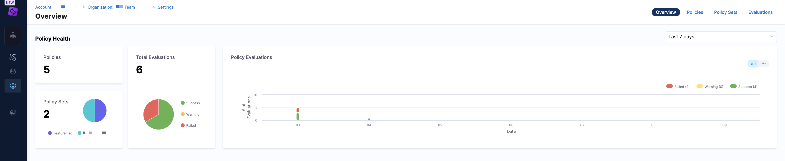

Click the dropdown menu to view the policy health in the `Last 24 hours`, `Last 7 days`, and `Last 30 days`. Use this view to understand how policies are performing and whether violations are increasing or decreasing.

</TabItem>
<TabItem value="policy" label="Policies">

The **Policies** tab displays a list view of individual policies. To create a policy, click **+ New Policy**.

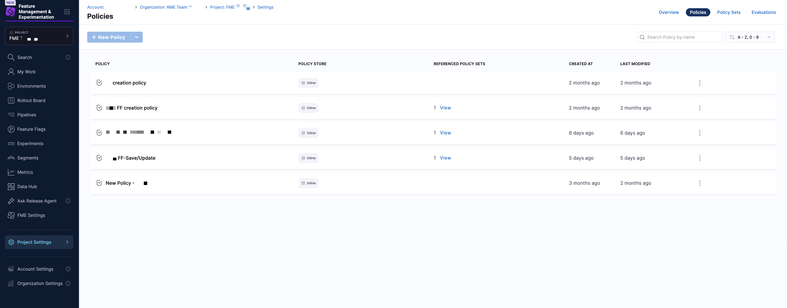

Each row represents a single policy and includes the following information:

| Column                | Description                                      |
|-----------------------|--------------------------------------------------|
| **Policy**                | Name of the policy                               |
| **Policy Store**          | Inline or Remote (Git-backed)                    |
| **Referenced Policy Sets** | Number of policy sets using the policy           |
| **Created At**            | Policy creation timestamp                        |
| **Last Modified**         | Most recent update                               |

Use the search bar to search for policies by name, and the dropdown menu to sort policies using filters such as `Last Updated`, `A-Z, 0-9`, or `Z-A, 9-0`. To manage your policies, click on the kebab menu (⋮) in a policy and select **Edit** or **Delete**.

</TabItem>
<TabItem value="policy-set" label="Policy Sets">

The **Policy Sets** tab shows a list view of policy sets, which group one or more policies and define enforcement behavior. To create a policy set, click **+ New Policy Set**.

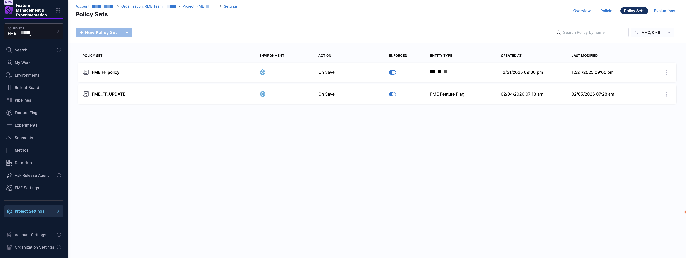

Each row represents a single policy set and includes the following information:

| Column       | Description                                      |
|--------------|--------------------------------------------------|
| **Policy Set**   | Name of the policy set                           |
| **Environment**  | Environment where the policy set applies (for FME, this is `Harness`)         |
| **Action**       | Trigger event (for FME, this is **On Save**)     |
| **Enforced**     | Whether enforcement is enabled                   |
| **Entity Type**  | Type of entity (`Feature Flag`, `Feature Flag Definition`, `Environment`, `Segment`, `Segment Definition` )                                |
| **Created At**   | Creation timestamp                               |
| **Last Modified** | Most recent update                               |

Use the search bar to search for policy sets by name, and the dropdown menu to sort policy sets using filters such as `Last Updated`, `A-Z, 0-9`, or `Z-A, 9-0`. To manage your policy sets, click on the kebab menu (⋮) in a policy set and select **Edit** or **Delete**.

</TabItem>
<TabItem value="evaluations" label="Evaluations">

The **Evaluations** tab provides a list view of individual policy evaluations, allowing you to audit policy enforcement results.

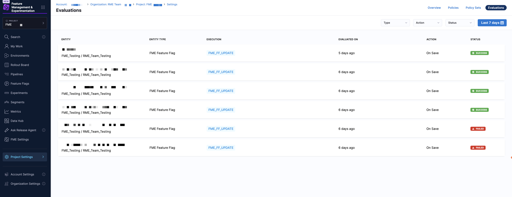

You can filter evaluations using the time range dropdown menu (for example, `Last 7 days`). Each evaluation includes the following information:

| Column        | Description                                      |
|---------------|--------------------------------------------------|
| **Entity**        | Name of the evaluated entity                     |
| **Entity Type**   | Type of entity (`Feature Flag`, `Feature Flag Definition`, `Environment`, `Segment`, `Segment Definition` )   |
| **Execution**     | Internal execution identifier                    |
| **Evaluated On**  | When the evaluation occurred                     |
| **Action**        | Trigger event (for FME, this is **On Save**)     |
| **Status**        | Evaluation result: **Success**, **Failed**, or **Warning** |

This view is useful for troubleshooting failed saves and validating that policies are being enforced as expected.

</TabItem>
</Tabs>

## Create and enforce a policy

To create a policy:

1. From the Harness FME navigation menu, click on **Project**, **Account**, or **Organization Settings**.
1. Under **Security and Governance**, select **Policies**. This directs you to the **Overview** tab which displays overall policy health over a selected time range.
1. Navigate to the **Policies** tab and click **+ New Policy**. Optionally, you can [import a policy from Git](/docs/platform/governance/policy-as-code/configure-gitexperience-for-opa) by clicking the dropdown menu and selecting **Import from Git**.
1. Enter a name for the policy and select the setup option:

   * **Inline** to author the policy in the Harness editor.
   * **Remote** to reference a Rego policy stored in a Git repository. Select a connector, repository, branch, and Rego path, then click **Apply**.

1. This opens the Policy Editor view, where you can author your own policy or use an out-of-the-box sample. 

   

   The editor includes a code editor for writing or modifying Rego, a **Testing Terminal** tab to validate policy behavior, and a **Library** tab containing sample policies.

   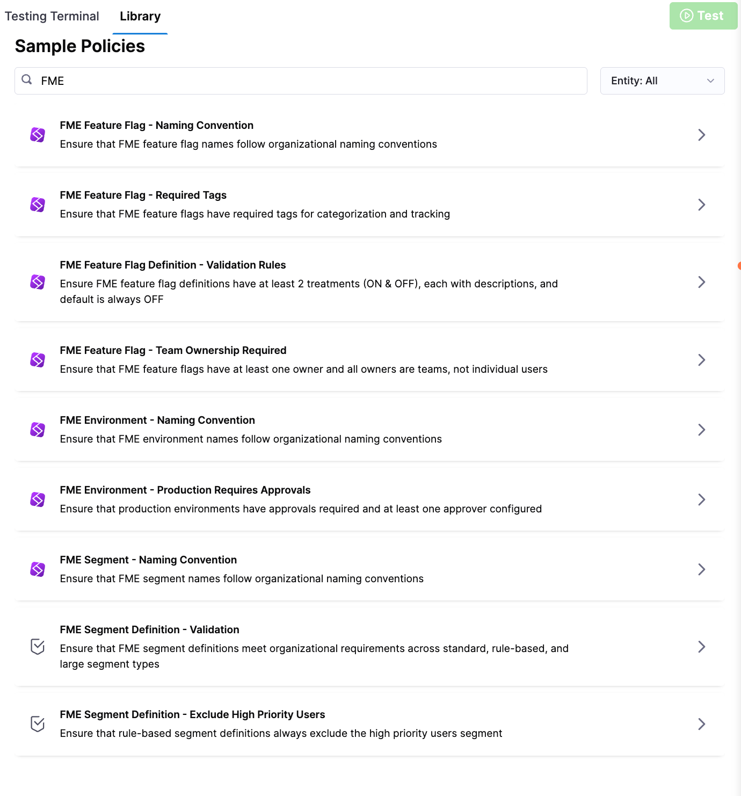

   <Tabs queryString="policy-editor">
   <TabItem value="rego" label="Write Your Rego Policy">

    * In the policy editor, write or paste your Rego logic.
    * Use the **Testing Terminal** to test the policy against sample inputs.
    * Click **Save**.

   </TabItem>
   <TabItem value="library" label="Use the Harness Policy Library">

    * Open the **Library** tab.
    * Type in `FME`.
    * Select a policy to populate the library editor:

      | FME Entity | Policy | Description |
      |------------|--------|-------------|
      | Feature Flag | Naming Convention | Ensures feature flag names follow organizational naming standards. |
      | Feature Flag | Required Tags | Ensures feature flags include required tags for proper categorization and tracking. |
      | Feature Flag | Team Ownership Required | Ensures feature flags have at least one owner and that all owners are teams, not individual users. |
      | Feature Flag Definition | Validation Rules | Ensures feature flag definitions include at least two treatments (`ON` and `OFF`), each with descriptions, and that the default treatment is `OFF`. |
      | Environment | Naming Convention | Ensures environment names follow organizational naming standards. |
      | Environment | Production Requires Approvals | Ensures production environments require approvals and have at least one approver configured. |
      | Segment | Naming Convention | Ensures segment names follow organizational naming standards. |
      | Segment Definition | Validation | Ensures segment definitions meet required structure and validation rules across standard, rule-based, and large segments. |
      | Segment Definition | Exclude High Priority Users | Ensures rule-based segment definitions exclude the high priority users segment. |

    * Click **Test** to validate the policy logic.
    * Click **Use This Sample** to copy the policy into your policy editor.
    * Click **Save**.

    </TabItem>
    </Tabs>

1. Test the policy by opening the **Testing Terminal** tab.
1. Click **Select Input**.
1. Choose the appropriate inputs, including the entity type, organization, project, and action (**On Save**). Then, select an entity from the list of results.

   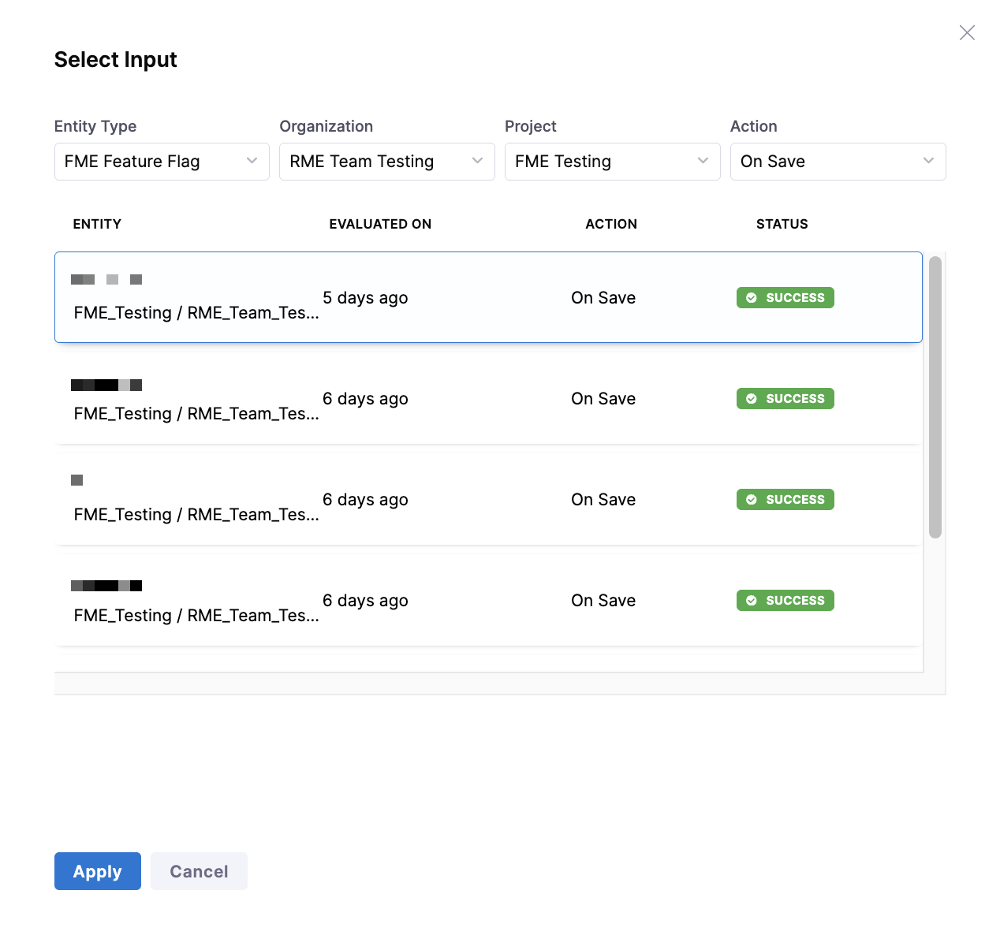

1. Click **Apply**, then click **Test**. Review the output to confirm the policy behaves as expected.
1. Click **Next: Enforce Policy**.
1. Configure the following enforcement settings:

   * **Scope**: Select the appropriate scope, for example: `Account`.
   * **Trigger event**: Select **On Save**.
   * **Severity**:

     * **Warn and Continue**: Violations generate a warning, but the entity is saved.
     * **Error and Exit**: Violations block the save operation.

1. Click **You're all set!** to save and enforce the policy.

:::info Policies do not apply retroactively
Existing FME entities are not automatically evaluated against new policies. A policy runs only when a feature flag or feature flag definition is created, updated, deleted, or archived. To evaluate an existing entity, save it again.
:::

## Add the policy to a policy set

Once you've created an individual policy, you must add it to a policy set before you can apply it to your feature flags. Policy sets allow you to group policies and configure where they will be enforced.

To add a policy set:

1. Navigate to the **Policy Sets** tab.
1. Click **+ New Policy Set**.
1. In the **Overview** section, enter a name and optionally, include a description.
1. Select the entity type that this policy set applies to: **Feature Flag**, **Feature Flag Definition**, **FME Environment**, **FME Segment**, or **FME Segment Definition**.
1. Select **On Save** as the trigger event.
1. Click **Continue**.

   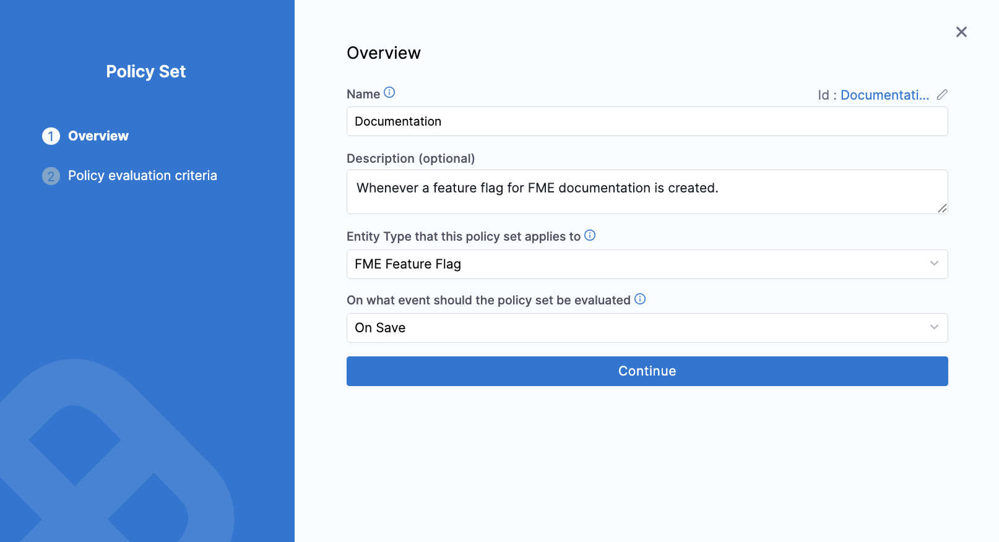

1. In the **Policy evaluation criteria** section, click **+ Add Policy**.
1. Select a policy applicable to the chosen entity type (feature flag, environment, or segment).

   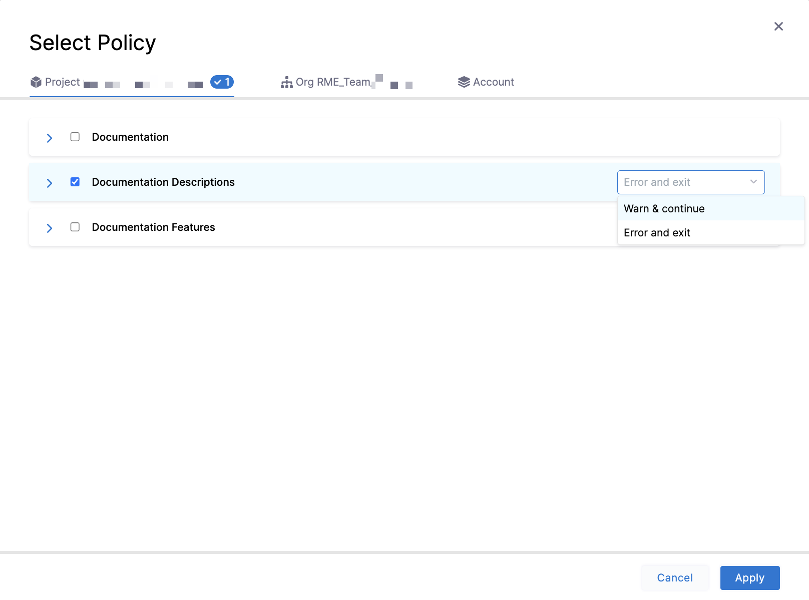

1. To the right of the policy, select **Warn and Continue** or **Error and Exit**.

   - **Warn and Continue**: If a policy isn't met when an entity is evaluated, you receive a warning but the entity is saved.
   - **Error and Exit**: If a policy isn't met when an entity is evaluated, you receive an error and the entity is not saved.

1. Click **Apply**.
1. To add an additional policy, click **+ Add Policy**. When you're done adding policies to a policy set, click **Finish**.

   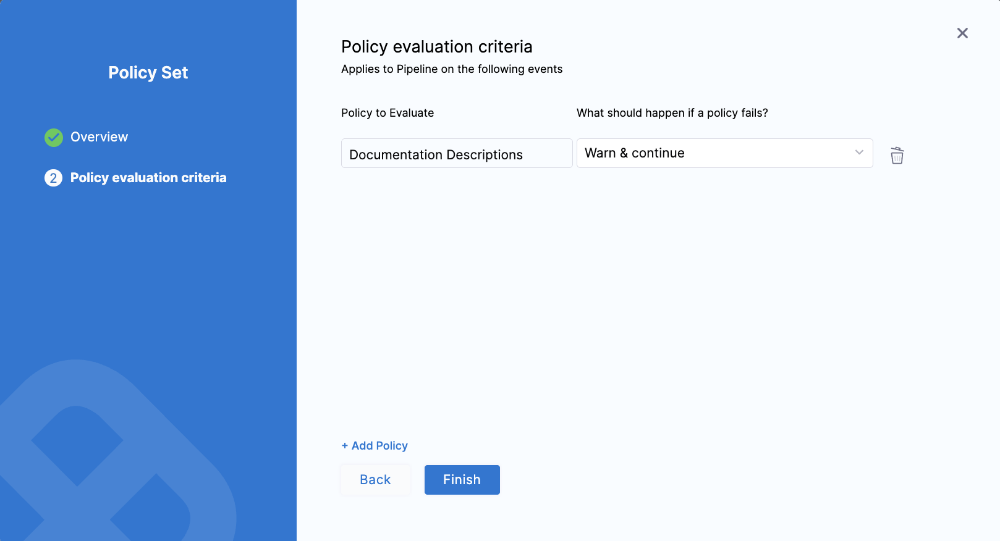

1. In the **Policy Sets** list, click the **Enforced** checkbox for the policy set you created.

   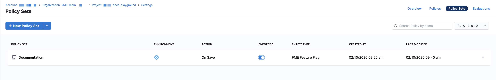

## How policies are evaluated

Policies are evaluated whenever a **Feature Flag**, **Feature Flag Definition**, **FME Environment**, **FME Segment**, or **FME Segment Definition** entity is created, updated, deleted, or archived. The input payload sent to OPA includes an `entityMetadata.changeTrigger` field (`create`, `update`, `delete`, or `archive`) so you can write policies that apply to specific change types.

<Tabs queryString="evaluation-example">
<TabItem value="feature-flag" label="Feature Flag">

An **FME Feature Flag** policy is evaluated when you change a feature flag's metadata. Examples of changes that trigger evaluation:

- Creating a new feature flag
- Updating a flag's name, description, tags, or metrics
- Archiving or deleting a feature flag

</TabItem>
<TabItem value="feature-flag-definition" label="Feature Flag Definition">

An **FME Feature Flag Definition** policy is evaluated when you change a feature flag's targeting configuration in a specific environment. Examples of changes that trigger evaluation:

- Adding or modifying targeting rules
- Changing rollout percentages or traffic allocation
- Updating the default treatment
- Killing or restoring a flag in an environment

</TabItem>
<TabItem value="environment" label="Environment">

An **FME Environment** policy is evaluated when you create or modify environments in **FME Settings**. Examples of changes that trigger evaluation:

- Creating a new environment
- Updating the environment type
- Modifying approval requirements or approvers
- Updating data export permission settings

</TabItem>
<TabItem value="segment" label="Segment">

A **Segment** policy is evaluated when you create or update a segment. Examples of changes that trigger evaluation:

- Creating a new segment
- Updating the segment name
- Modifying segment descriptions, tags, or owners

</TabItem>
<TabItem value="segment-definition" label="Segment Definition">

A **Segment Definition** policy is evaluated when you change a segment's definition or targeting logic. Examples of changes that trigger evaluation:

- Adding or removing users in a segment
- Defining or modifying rule-based conditions

</TabItem>
</Tabs>

On success, the change is applied. On failure, the result depends on the severity you configured:

- **Warn and Continue**: The change is applied, but you receive a warning message.
- **Error and Exit**: The change is blocked, and you receive an error message.

:::tip Use changeTrigger to scope your policies
The `entityMetadata.changeTrigger` field in the input payload lets you target specific operations. For example, you might skip name convention checks on `delete` to avoid blocking cleanup of legacy flags. See the [example policy](#example-require-a-description-for-feature-flags) for a pattern that excludes delete operations.
:::

## Manage policy evaluations

Navigate to the **Evaluations** tab to view all successful, warning, and failed policy set evaluations. Use the **Type** dropdown menu to filter by entities, and the **Action** dropdown menu to filter by **On Save** events.

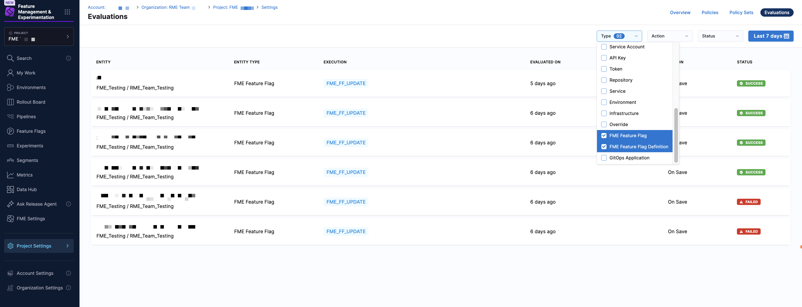

Use the **Status** dropdown menu to filter evaluations by **Success**, **Failed**, or **Warning**. You can also use the time range selector to switch to a custom time range or a preset such as the past week, past month, or past three months.

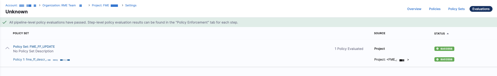

Click on an evaluation in the list to access the policy set that was evaluated. You can then click into the policy set details and see associated policies, or click into the policy definition itself.

<Tabs queryString="evaluations">
<TabItem value="policy-set" label="Policy Set">

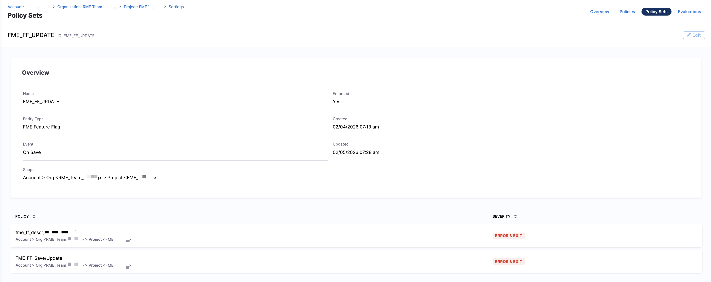

From here, you can review which policies were applied and their evaluation results.

</TabItem>
<TabItem value="policy" label="Policy">

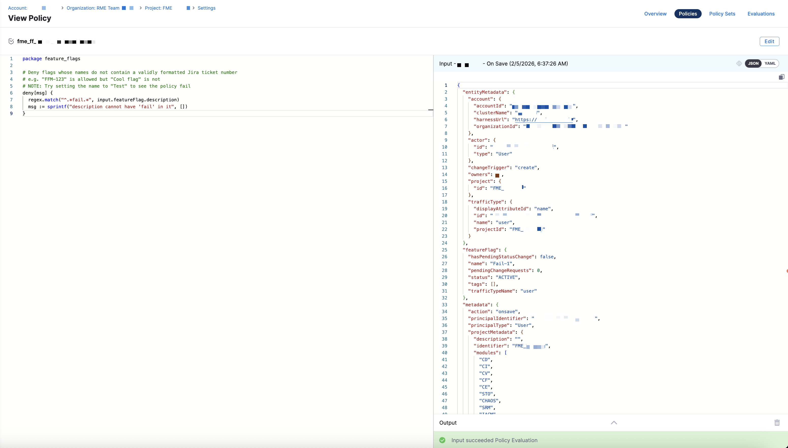

From here, you can review the Rego logic that was evaluated and update it if needed.

</TabItem>
</Tabs>

## See also

- [Harness Policy As Code overview](/docs/platform/governance/policy-as-code/harness-governance-overview)
- [Harness Policy As Code quickstart](/docs/platform/governance/policy-as-code/harness-governance-quickstart)
- [FME Feature Flag policy samples](/docs/platform/governance/policy-as-code/sample-policy-use-case#fme-feature-flag-policies)
- [FME Feature Flag Definition policy samples](/docs/platform/governance/policy-as-code/sample-policy-use-case#fme-feature-flag-definition-policies)
- [Configure Git Experience for OPA](/docs/platform/governance/policy-as-code/configure-gitexperience-for-opa)
