Projects allow you to separately manage your feature flags and experiments across your different business units, product lines, and applications. When you first create your account, you're provided with one project named `Default`. 

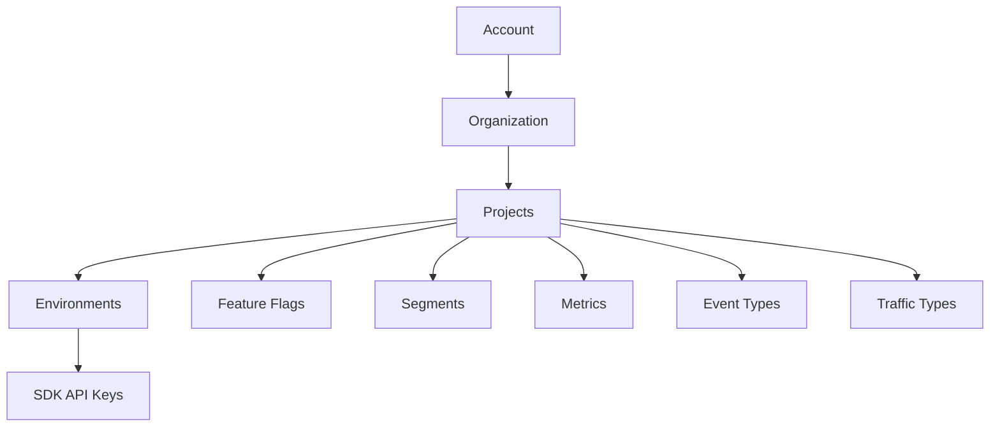

 

This project has two [environments](/docs/feature-management-experimentation/environments) and one [traffic type](/docs/feature-management-experimentation/traffic-types) created underneath it. You can rename and edit these environments and traffic types and add more to the `Default` project. The following objects are also located in a project: 

* [Feature flags](/docs/feature-management-experimentation/feature-management/setup/create-a-feature-flag/)
* [Segments](/docs/feature-management-experimentation/feature-management/targeting/segments)
* [Metrics](/docs/feature-management-experimentation/release-monitoring/metrics/)
* [Event types](/docs/feature-management-experimentation/release-monitoring/events/)
* [API keys](/docs/feature-management-experimentation/api-keys)  

When onboarding different business units to Harness FME, you can add multiple projects within your account to allow each team to have a separated space to manage their feature flags and experiments. 

## Creating a project

Project creation in Harness FME uses the Harness platform [project workflow](/docs/platform/organizations-and-projects/create-an-organization/#create-a-project). After creating a project, return to **FME Settings** to configure FME-specific options.

To create a project: 

1. From the FME navigation menu, click **FME Settings** and select **Projects**. 
1. Click **Create project** at the top right. 
   
   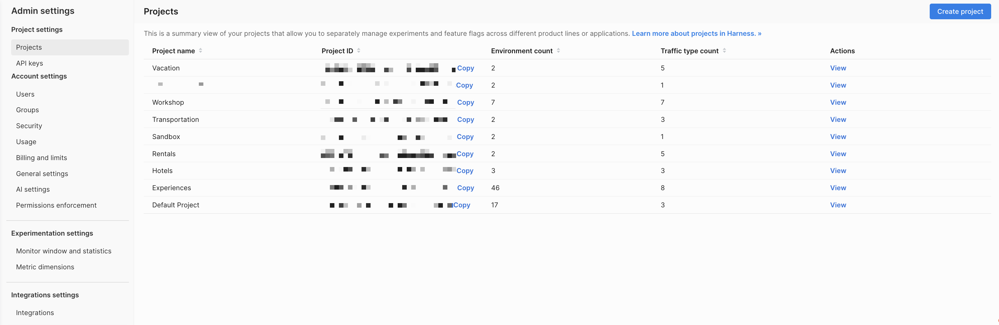

   This opens the **Projects** page under **FME Settings** in the FME navigation menu.
   
    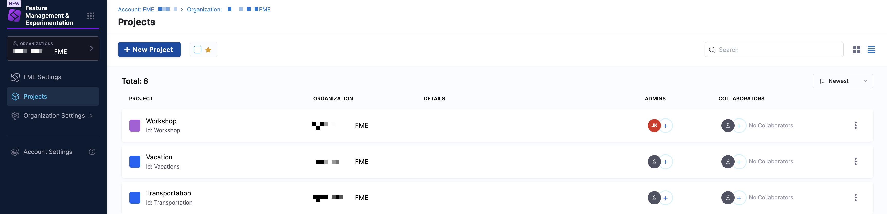

1. Click **+ New Project**.
1. Complete the following details:

   - Enter a name for the project.
   - Select a color option for the project.
   - Optionally, enter a description and add tags.
   
   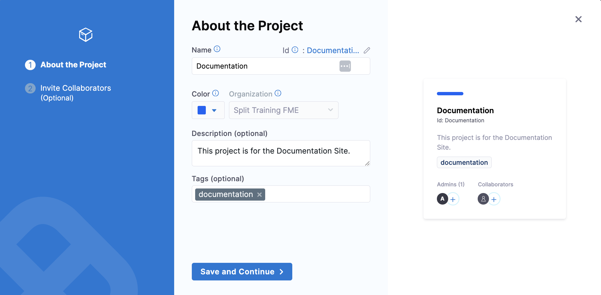

1. Click **Save and Continue**.
1. Optionally, invite people to collaborate in the project by selecting a role from the dropdown menu (like `FME Manager`) and adding collaborators in your organization by email address.
   
   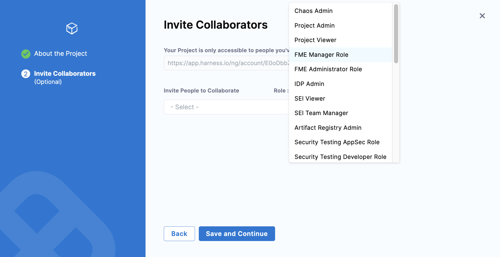

1. Click **Save and Continue**. 
   
   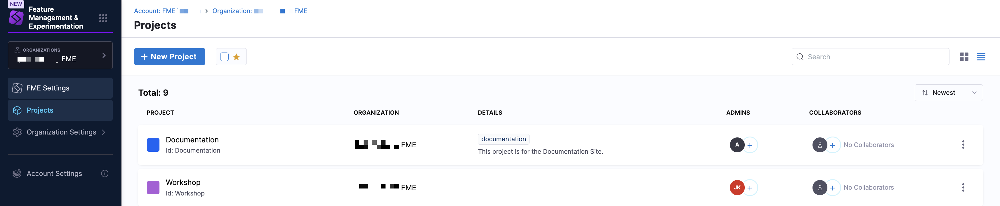

1. Next, click **FME Settings**.
   
   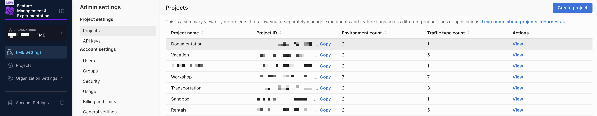

1. Click **View** under **Actions** on the project you created (for example, `Documentation`).
   
   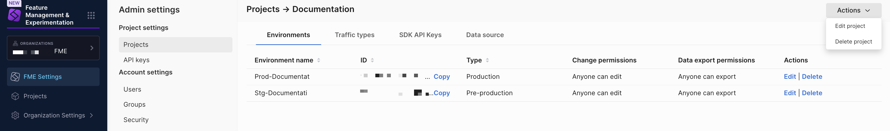

1. Click on the **Actions** dropdown menu and select **Edit project**.

   

1. Select the **Required title and comments comments** toggle to enable requiring titles and comments for feature flags, segments, and metric changes.

   :::info
   You can update this setting at any time by clicking **Actions** > **Edit project** on the top right corner in **Project Settings**.
   :::

1. Click **Save**.

Still using `app.split.io`?

## Setting project permissions

You can set view permissions to your projects or projects you have administrator rights to and any objects within the project. This allows you more granular control over which users, groups, and API keys can access the objects in projects to support access requirements within an account. 

These objects include feature flags, segments, metrics, traffic types, and environments. This also allows you to determine who can see if a certain project exists.

Each Split project has a project permissions setting which you can use to restrict access to that project to specific users, groups, or API keys. If a user, group, or API key is not granted access to a restricted project, they cannot see the project name nor determine whether that project exists.

Project view restrictions can be used to protect sensitive (i.e., confidential) projects, or to improve user experience by showing a small number of relevant projects to each user.

## Viewing or updating project permissions

An Admin can view or edit a project's permissions by following these steps:

1. Navigate to **Admin settings**.
1. On the **Projects** page, click the **View** link for a project.
1. Click the **Actions** button on the top left and select **Edit project**. The **Edit project** pane will appear.
1. On the **Edit project** pane, you can view project permissions. You can also restrict access to the project to some users, groups, and Admin API Keys.

To manage project-level settings:

1. Click **Actions** > **Edit project** in the top right corner of the **Projects** page. 
1. In the **Edit project** pane, enable the **Require comments** toggle to enforce titles and comments for changes to feature flags, segments, and metrics.

   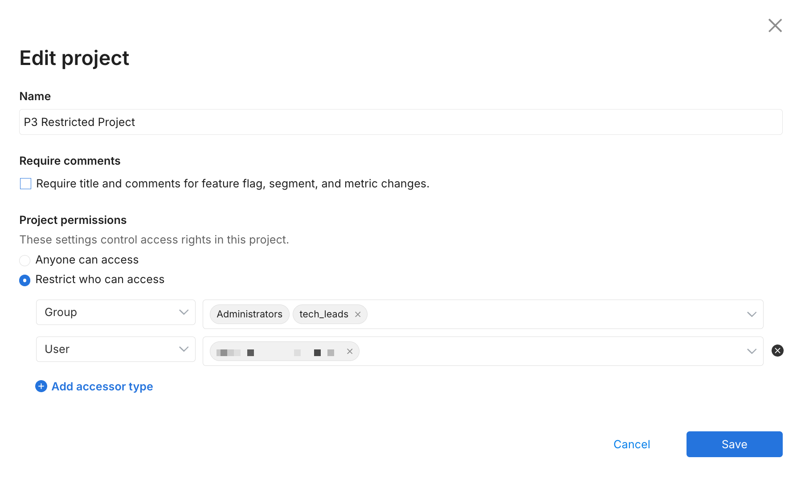
1. In the **Project permissions** section, optionally select the desired control access from the following options:
   * **Anyone has access**. Allows anyone to have access to this particular project.
   * **Restrict who can access**. Allows you to select which users, groups, and admin API keys have access to a particular project.
1. Click **Save**.

## Editing a project

When you are viewing a project, you can edit a project by doing the following:
1. From the left navigation, click on the **profile button** at the bottom.
2. Click **Admin settings**, then **Projects**. A list of projects appears.
3. On the selected project you want to edit, click **View** in the **Actions** column.
4. Click the **Actions** button and then **Edit project** from the menu list. The Edit project page appears. 
   
   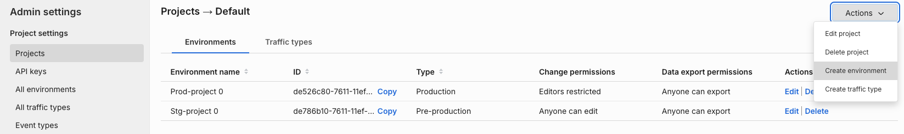

5. In the **Name** field, optionally change the name.
6. Enable the **Require comments** toggle to enforce titles and comments for changes to feature flags, segments, and metric.

   :::info[note]
   When you check this box, it affects the approval flows.
   :::

7. In the **Project permissions** section, optionally select the desired control access from the following options:
   * **Anyone has access**. Allows anyone to have access to this particular project.
   * **Restrict who can access**. Allows you to select which users, groups, and admin API keys have access to a particular project.
8. Click **Save** to save your changes. The changes appear in the admin audit logs.

## Viewing projects

To view projects, do the following:

1. From the left navigation, click on the **profile button** at the bottom.
2. Click **Admin settings**, then **Projects**. A list of projects appears. 
3. Select **View** on the desired project. From here, you can see the environment name, ID, type of project it is, permissions setting, and data export permission settings. 

   

## Requesting access to projects

If you have no access to a project, you need to request access from the administrator of that project. 

## Navigating between projects

You can navigate between projects by doing the following:

1. From the left navigation, click on the **profile button** at the top.
2. **Search or select the project** you would like to switch to. You can see the environments, feature flags, segments, and metrics under that project.

## Managing your projects

To manage your projects, go to the **projects** tab in your **Admin Settings** page. On this page you can:

* See a list of all your existing projects.
* Manage the [environments](/docs/feature-management-experimentation/environments) and [traffic types](/docs/feature-management-experimentation/traffic-types) in a project by clicking **View** in the Actions column for selected projects.

## Deleting a project

To delete a project, follow these steps:

* Make sure all feature flags, segments, and metrics are deleted from the project for all environments.

* To delete a feature flag, delete all the definitions from its environments.

  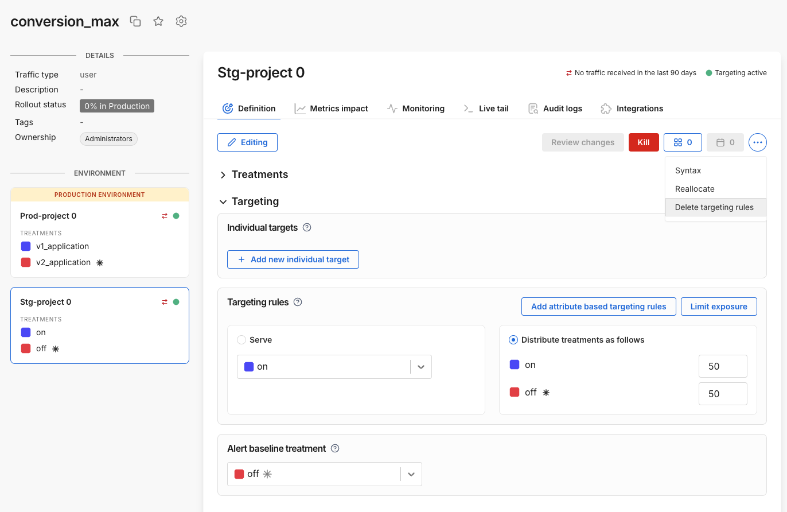

* Then, delete the feature flag.
  
  

* To delete a segment, first select all its keys.
  
  

* Then, delete the keys.
  
  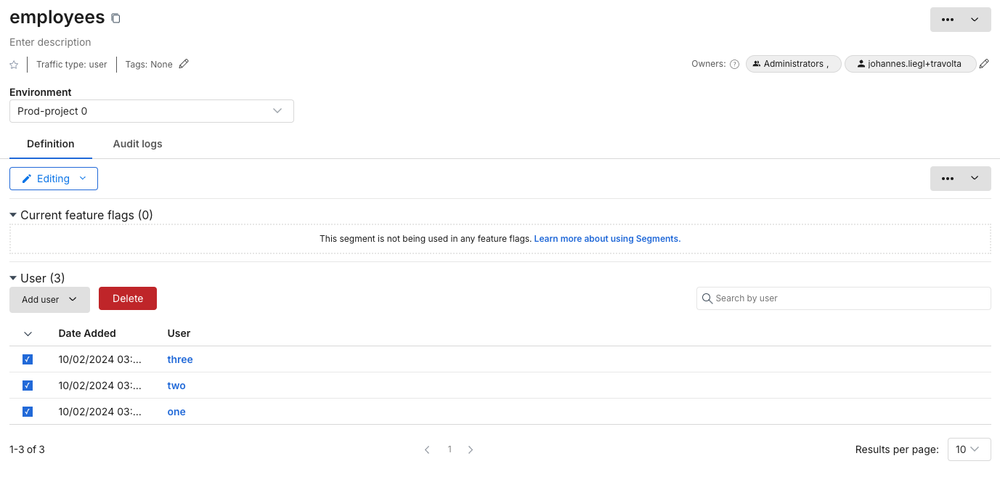

* Then, delete the segment definition and repeat these steps for all environments.
  
  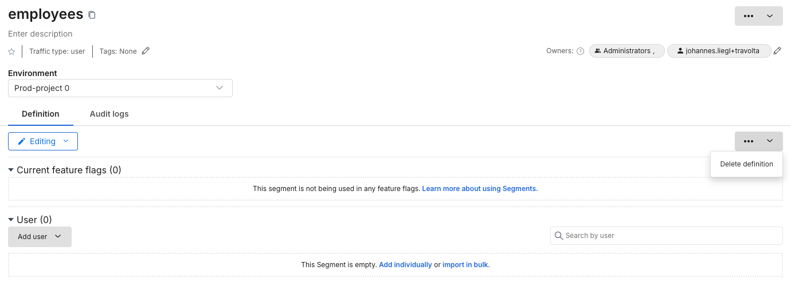

* Finally, delete the segment.
  
  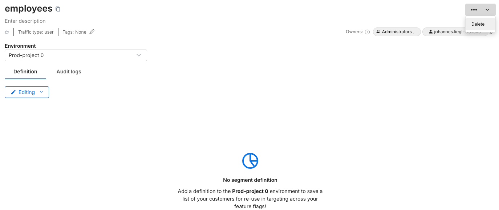

* To delete metrics, click on the upper top right (...) icon to delete it.
  
  

* In the Admin page, under the **API keys** page, Make sure all Admin API and SDK keys are revoked for the project environments. For example the screenshot below shows the SDK API key for the "default" project.
  
  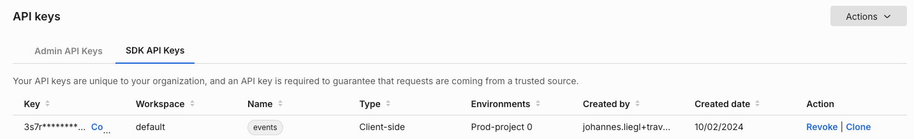

* In Admin settings, in the left menu, click **Projects**.
* In the list of available projects, click the **View** link of the project you want to delete.
  
  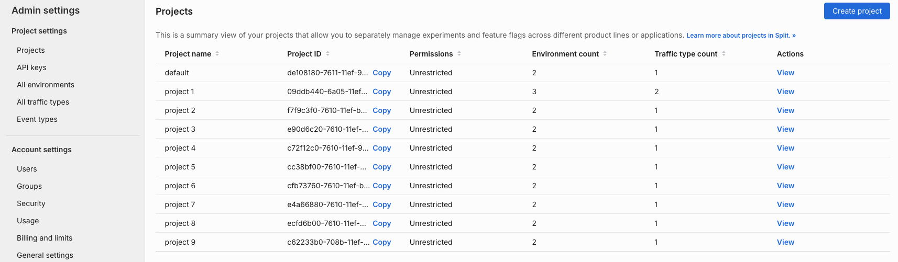

* You will see a list of environments for the selected project, now you can delete each environment using the **Delete** link.
* The user interface will allow you to delete all environments except the last one, as each project is required to have at least one environment.
* Click the **Actions** button in the top right corner and choose the Delete project option, which will allow you to delete it.

  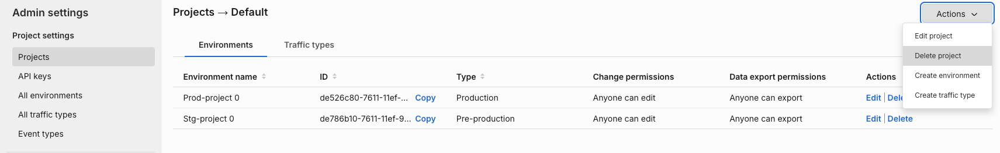

