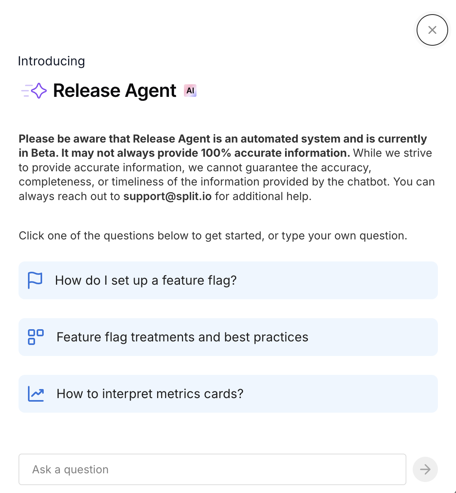
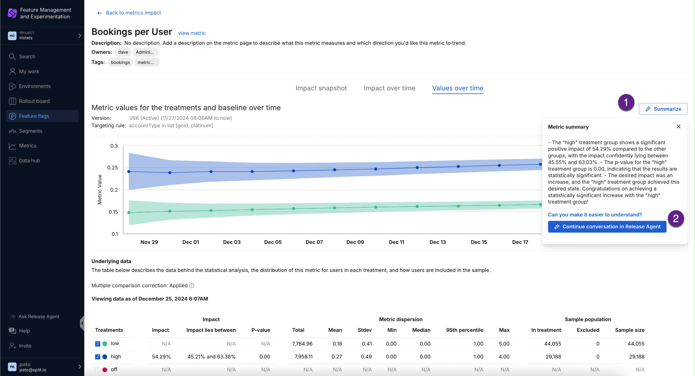
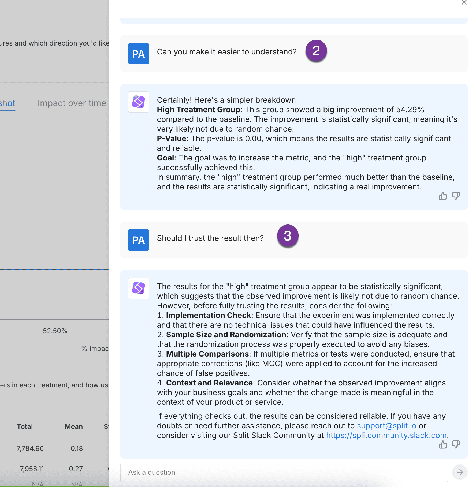
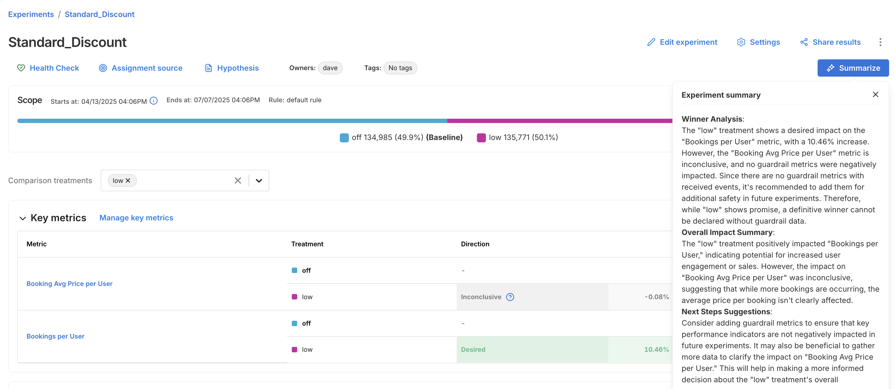
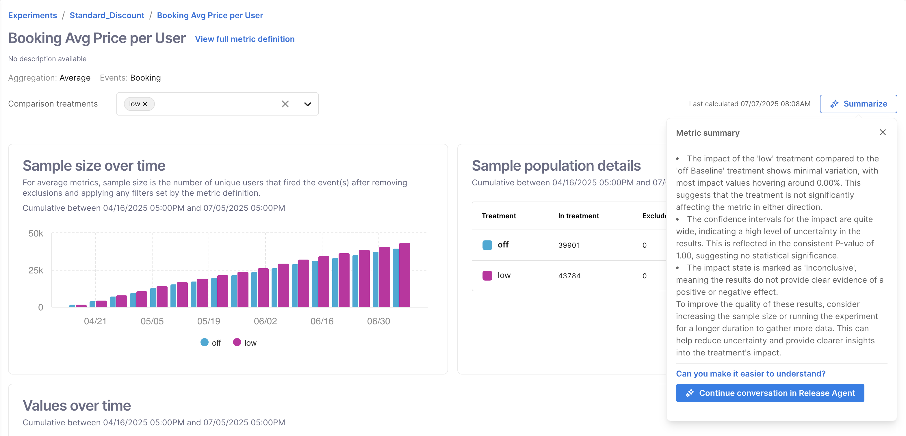
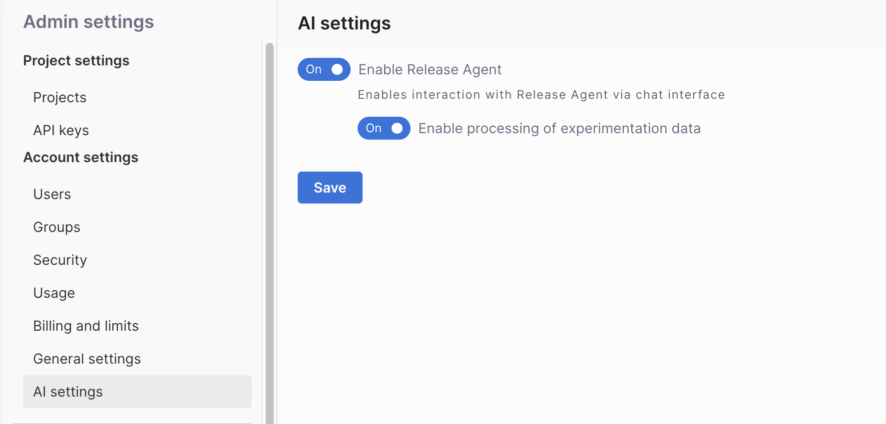

## Overview

Release Agent is an in-app AI chatbot designed to streamline the use of Harness FME. It offers multilingual support, rapid responses, and knowledge-based assistance by utilizing our public documentation and blogs. 

Release Agent makes it easy for all developers to get the help they need, without ever leaving the Harness interface. This documentation provides technical details and guidelines for developers to work with Release Agent effectively.

## Setup

If Release Agent is available to your team, you will find the Release Agent icon in the bottom left.

When you click **Release Agent**, the chat will open on the right side of the screen. You can click on one of the suggested questions to get started or type in your own question.

### Example questions

* How do I set up a JavaScript SDK in my codebase?
* How do I create and manage feature flags in FME?
* How can I integrate FME with my application using the SDK?
* What are the best practices for naming feature flags and events?
* How do I set up an A/B test in Harness FME?
* Can you explain how FME's targeting rules work?
* How can I use segments to target specific groups of users?
* What data types can I track using FME events for measurement?
* How do I interpret the metrics on my experiments' results?
* How do I export data from FME for further analysis?
* What are the implications of feature flag rollout strategies, such as canary releases?
* How do I troubleshoot issues with the FME SDK?
* Can I use FME across multiple environments, and how?
* How does Harness FME handle data privacy and security?
* What are best practices for cleaning up old flags and technical debt?

## AI Summarize

The Release Agent can summarize metric results on a feature flag's Metric details page and experiment results on an experiments' Metric details page.

### Feature flag metrics

To use the **AI Summarize** button on a feature flag's metric:

1. Drill into a metric tile on a feature flag's Metrics impact dashboard and click **Summarize**.
1. After viewing the summary, type your follow-up question and click **Continue conversation in Release Agent**.
1. Continue to ask additional follow-up questions if you would like, including suggestions for next steps.

### Experiment results and metrics

To use the **AI Summarize** button on an experiment's results:

1. Drill into a metric on an experiment's Metrics dashboard and click **Summarize**.
1. After viewing the summary, type your follow-up question and click **Continue conversation in Release Agent**.
1. Continue to ask additional follow-up questions if you would like, including suggestions for next steps.

For more information, see [Viewing experiment results](/docs/feature-management-experimentation/experimentation/experiment-results/viewing-experiment-results/#use-ai-summarize).

## Enable Release Agent for your team

Admins can enable or disable Release Agent in **Admin settings**. 

1. Navigate to **FME Settings** > **AI settings**.
1. Select the **Enable Release Agent** toggle and **Enable processing of experimentation data** toggle to turn these features on or off for your team. When you enable processing of experimentation data, the data is protected by the privacy protections described below.
1. Click **Save**.

## How your data is used

### Accuracy

While we strive to provide accurate information, we cannot guarantee the accuracy, completeness, or timeliness of the information provided by the chatbot. For example, LLMs can struggle with precision and context of numerical information. 

You can always reach out to support@split.io if you have questions or require additional help.

### Privacy

Your data is protected by the [Harness privacy policy](https://www.harness.io/legal/privacy), which has been agreed on by using the product. Release Agent uses OpenAI as a data subprocessor for the data summarization feature, so your data is additionally protected by the [OpenAI Enterprise privacy policy](https://openai.com/enterprise-privacy/). 

Additional ways that your privacy is protected:

* Your data will not be used for training. Neither by Harness nor by OpenAI.
* Harness will send OpenAI the minimal necessary information required to create data summarization.

## Feedback and support

For support inquiries or to report issues with Release Agent, submit a request via support@split.io. 

Provide detailed descriptions and reproduction steps for issues to facilitate expedited troubleshooting. Your feedback is instrumental for the iterative enhancement of Release Agent.