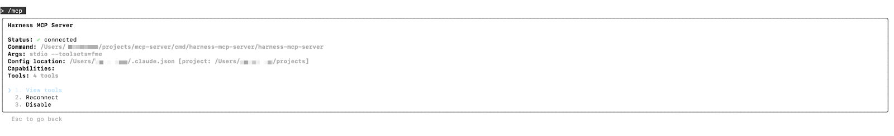
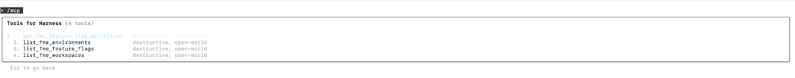

The Harness FME Model Context Protocol (MCP) tools enable developers, product managers, and experimentation teams to discover, inspect, and understand feature flags and experiments using natural language. MCP tools can be accessed in several AI-powered environments, including Claude Code, Windsurf, Cursor, and VS Code.

Harness FME MCP provides a conversational interface for exploring your feature management data in an IDE.

You can:

- Discover [projects](/docs/feature-management-experimentation/management-and-administration/account-settings/projects/), [environments](/docs/feature-management-experimentation/management-and-administration/fme-settings/environments/), and active [feature flags](/docs/feature-management-experimentation/getting-started/overview/create-a-feature-flag/)
- Inspect feature flag definitions, [targeting rules](/docs/feature-management-experimentation/feature-management/setup/define-feature-flag-treatments-and-targeting/#targeting-rules), and [rollout status](/docs/feature-management-experimentation/feature-management/setup/create-a-rollout-plan/)
- Compare configurations across environments for governance and consistency

By providing structured access to FME data through natural language, MCP tools help reduce context switching, accelerate [experimentation setup](/docs/feature-management-experimentation/getting-started/overview/create-an-experiment/), and improve visibility into release safety and governance.

## Installation & Configuration

### Prerequisites

Before you begin, ensure you have the following:

- Go version 1.23 or later
- Claude Code (paid version) or another MCP-compatible AI tool
- Access to the Harness platform with [Feature Management & Experimentation (FME)](/docs/feature-management-experimentation/getting-started/overview) enabled
- A [Harness API key](/docs/platform/automation/api/add-and-manage-api-keys/) for authentication

### Build the MCP Server Binary

1. Clone the [Harness MCP Server GitHub repository](https://github.com/harness/mcp-server).
1. Build the binary from source.
1. Copy the binary to a directory accessible by Claude Code.

### Configure Claude Code

1. Open your Claude configuration file at `~/claude.json`. If it doesn’t exist already, you can create it manually or run `touch claude.json` at the root of your repository.
1. Add the Harness FME MCP server configuration:

   ```json
   {
     ...
     "mcpServers": {
       "harness": {
         "command": "/path/to/harness-mcp-server",
         "args": [
           "stdio",
           "--toolsets=fme"
         ],
         "env": {
           "HARNESS_API_KEY": "your-api-key-here",
           "HARNESS_DEFAULT_ORG_ID": "your-org-id",
           "HARNESS_DEFAULT_PROJECT_ID": "your-project-id",
           "HARNESS_BASE_URL": "https://your-harness-instance.harness.io"
         }
       }
     }
   }
   ```

1. Save the file and restart Claude Code for the changes to take effect.

Go to [Harness MCP Server documentation](/docs/platform/harness-aida/harness-mcp-server/#configuration) to configure additional MCP-compatible AI tools like Windsurf, Cursor, or VS Code. This includes detailed setup instructions for all supported platforms.

### Verify Installation

1. Open Claude Code (or the AI tool that you configured).
1. Navigate to the **Tools**/**MCP** section.

   

1. Verify Harness tools are available.

   

## MCP Tools

The following MCP tools are available:

| Tool | Description | Example Use Case |
|:---:|:---:|:---:|
| `list_fme_workspaces` | Discover available FME projects (also known as workspaces). | Find all projects your organization manages. |
| `list_fme_environments` | Explore environments within a project. | Retrieve environment metadata, such as mappings between environment IDs and names. |
| `list_fme_feature_flags` | List feature flags in a specific project. | View all active and inactive flags. |
| `get_fme_feature_flag_definition` | Get configuration details for a feature flag. | Inspect flag rules, variations, and targeting setup. |

## Usage

The following examples demonstrate how to interact with the Harness FME MCP tools using natural language.

<details>
<summary>Discovery & Organization</summary>

### Listing all projects (workspaces)

> "Show me all FME projects in my Harness account."
**Output**: A list of all available projects with IDs, owners, and linked environments.

### Exploring environments

> "List the environments under the `checkout-service` project." 
**Output**: Displays development, staging, and production environments with deployment contexts.

### Identifying feature flags

> "What feature flags are defined in the `checkout-service` project?"
**Output**: Returns flag details such as name, status, and variation type. The display format depends on the IDE or AI tool you’re using.

</details>
<details>
<summary>Inspection & Understanding</summary>

### Inspecting flag definitions

> "Describe the flag definition for `enable_discount_banner` in the staging environment."
**Output**: Includes flag variations, targeting rules, default values, and rollout strategies.

### Understanding flag configurations

> "Show me the configuration of all flags that are currently active in production."
**Output**: Returns flag keys, current variations, and targeted segments. The display format depends on the IDE or AI tool you’re using.

</details>
<details>
<summary>Analysis & Impact</summary>

### Understanding release safety

> "List feature flags that are safe to remove from code based on current rollout data."
**Output**: Returns flags that have been fully rolled out and can be cleaned up from the codebase. Depending on the AI agent, the prompt can also be extended to automatically remove the flags from the code where safe.

### Environment consistency check

> "Compare flag definitions for `enable_checkout_flow` between staging and production."
**Output**: Diff view showing differences in variations, targeting, and rules across environments.

</details>

## Further Reading

Additional documentation, blog links, and articles:

- [AI-Powered Feature Management with Harness MCP Server and Claude Code](https://www.harness.io/blog/ai-powered-feature-management-with-harness-mcp-server-and-claude-code)