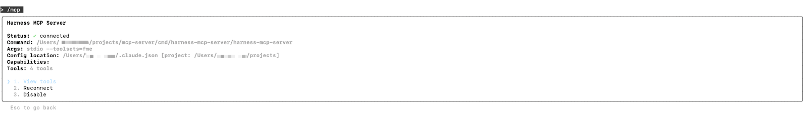
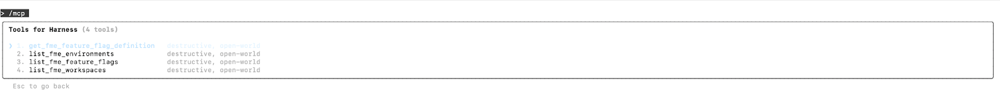

The Harness FME Model Context Protocol (MCP) tools enable developers, product managers, and experimentation teams to discover, inspect, and understand feature flags and experiments using natural language. MCP tools can be accessed in several AI-powered environments, including Claude Code, Windsurf, Cursor, and VS Code.

Harness FME MCP provides a conversational interface for exploring your feature management data in an IDE. You can:

- Discover [projects](/docs/feature-management-experimentation/projects/), [environments](/docs/feature-management-experimentation/environments/), and active [feature flags](/docs/feature-management-experimentation/getting-started/overview/create-a-feature-flag/)
- Inspect feature flag definitions, [targeting rules](/docs/feature-management-experimentation/feature-management/setup/define-feature-flag-treatments-and-targeting/#targeting-rules), and [rollout status](/docs/feature-management-experimentation/feature-management/setup/create-a-rollout-plan/)
- Create and update feature flag definitions, treatments, and targeting rules
- Filter flags by name, tags, or rollout status without listing all flags
- Manage rule-based segment definitions
- Compare configurations across environments for governance and consistency

By providing structured access to FME data through natural language, MCP tools help reduce context switching, accelerate [experimentation setup](/docs/feature-management-experimentation/getting-started/overview/create-an-experiment/), and improve visibility into release safety and governance.

## Installation and configuration

### Prerequisites

Before you begin, ensure you have the following:

- Go version 1.23 or later
- Claude Code (paid version) or another MCP-compatible AI tool
- Access to the Harness platform with [Feature Management & Experimentation (FME)](/docs/feature-management-experimentation/getting-started/overview) enabled
- A [Harness API key](/docs/platform/automation/api/add-and-manage-api-keys/) for authentication

### Build the MCP server binary

1. Clone the [Harness MCP Server GitHub repository](https://github.com/harness/mcp-server).
1. Build the binary from source.
1. Copy the binary to a directory accessible by Claude Code.

### Configure Claude Code for FME

1. Open your Claude configuration file at `~/claude.json`. If it doesn't exist already, you can create it manually or run `touch claude.json` at the root of your repository.
1. Add the Harness FME MCP server configuration:

   ```json
   {
     ...
     "mcpServers": {
       "harness": {
         "command": "/path/to/harness-mcp-server",
         "args": [
           "stdio",
           "--toolsets=fme"
         ],
         "env": {
           "HARNESS_API_KEY": "your-api-key-here",
           "HARNESS_DEFAULT_ORG_ID": "your-org-id",
           "HARNESS_DEFAULT_PROJECT_ID": "your-project-id",
           "HARNESS_BASE_URL": "https://your-harness-instance.harness.io"
         }
       }
     }
   }
   ```

1. Save the file and restart Claude Code for the changes to take effect.

Go to [Harness MCP Server documentation](/docs/platform/harness-ai/harness-mcp-server/#configuration) to configure additional MCP-compatible AI tools like Windsurf, Cursor, or VS Code. This includes detailed setup instructions for all supported platforms.

### Verify the installation

1. Open Claude Code (or the AI tool that you configured).
1. Navigate to the **Tools**/**MCP** section.

   

1. Verify Harness tools are available.

   

## FME resource types

The FME toolset exposes the following resource types through the generic Harness MCP tools (`harness_list`, `harness_get`, `harness_create`, `harness_update`, `harness_delete`, `harness_execute`):

| Resource Type | Operations | Description |
|:---|:---|:---|
| `fme_workspace` | List | Discover available FME projects (workspaces). |
| `fme_environment` | List | Explore environments within a workspace. |
| `fme_feature_flag` | List, Get, Create, Update, Delete, Execute | Full lifecycle management for feature flags. |
| `fme_feature_flag_definition` | List, Get, Create, Update | Environment-level flag configurations (rules, treatments, targeting). |
| `fme_rule_based_segment` | List, Get, Create, Delete | Rule-based segment metadata at the workspace level. |
| `fme_rule_based_segment_definition` | List, Get, Update, Execute | Environment-level segment definitions with targeting rules. |
| `fme_rollout_status` | List | View available rollout status stages for a workspace. |

Use `harness_describe(resource_type='fme_feature_flag')` to see the full operation set and available fields for any resource type.

### Feature flag operations

The `fme_feature_flag` resource type supports:

- **List** with filters (name, tags, rollout status)
- **Get** a specific flag by name
- **Create** a new flag with treatments and traffic type
- **Update** flag metadata (description, tags) via JSON Patch
- **Delete** a flag
- **Execute** lifecycle actions: `kill`, `restore`, `archive`, `unarchive`

### Feature flag definition operations

The `fme_feature_flag_definition` resource type manages the environment-level configuration for a flag:

- **Get** the full definition (treatments, rules, default treatment, traffic allocation)
- **Create** a definition in a new environment
- **Update** treatments, targeting rules, default treatment, baseline treatment, and traffic allocation

## Filter flags

The list operation for `fme_feature_flag` supports filters that narrow results server-side, reducing the number of API calls needed:

| Filter | Description | Example |
|:---|:---|:---|
| `name` | Partial match on flag name | `name='billing'` returns all flags containing "billing" |
| `tags` | Filter by tag value | `tags='enterprise'` returns flags tagged "enterprise" |
| `rollout_status_id` | Filter by rollout status UUID | `rollout_status_id='uuid-here'` |

Example queries:

```text
harness_list(resource_type='fme_feature_flag', workspace_id='ws-123', name='checkout')
harness_list(resource_type='fme_feature_flag', workspace_id='ws-123', tags='q4-launch')
```

:::tip Use tags for discoverability
Populate tags on your flags (for example, `enterprise`, `billing`, `onboarding`) to enable filtered queries. This eliminates the need to list all flags and filter client-side.
:::

## Rate limiting 

The Harness FME Admin API enforces rate limits on all API calls made by the MCP server. The default limit is approximately 20 requests per 10-second window, tracked per organization and per IP address. When a limit is exceeded, the API returns HTTP 429 with a `TOO_MANY_REQUESTS` error code.

Rate limit responses include the following headers: 

- `X-RateLimit-Remaining-Org` 
- `X-RateLimit-Remaining-IP` 
- `X-RateLimit-Reset-Seconds-Org` 
- `X-RateLimit-Reset-Seconds-IP`

The MCP server also enforces a client-side throttle of 10 requests per second, configurable via the `HARNESS_RATE_LIMIT_RPS` environment variable. If the server receives a 429 response, it retries with exponential backoff up to 3 times, controlled by the `HARNESS_MAX_RETRIES` variable.

:::info Production evaluation traffic is unaffected
Rate limits apply only to the Admin API (`api.split.io`). SDK evaluation traffic uses a separate path and is not affected.
:::

Harness recommends the following best practices for AI workflows:

1. Use filters to reduce list sizes. A filtered list call costs one API request, regardless of how many flags match.
1. Cache flag definitions that do not change frequently, as they are stable between deployments.
1. Spread calls across rate limit windows if your workflow requires many individual flag definitions.
1. Monitor `X-RateLimit-Remaining-Org` if you are building custom tooling on top of the MCP server to pace requests appropriately.

## Usage

The following examples demonstrate how to interact with the Harness FME MCP tools using natural language.

<details>
<summary>Discovery & Organization</summary>

### List all projects (workspaces)

> "Show me all FME projects in my Harness account."
**Output**: A list of all available projects with IDs, owners, and linked environments.

### Explore environments

> "List the environments under the `checkout-service` project." 
**Output**: Displays development, staging, and production environments with deployment contexts.

### Identify feature flags

> "What feature flags are defined in the `checkout-service` project?"
**Output**: Returns flag details such as name, status, and variation type. The display format depends on the IDE or AI tool you're using.

### Filter flags by tag

> "Show me all feature flags tagged 'enterprise'."
**Output**: Returns only flags with the `enterprise` tag, avoiding the need to list all flags.

### Filter flags by name

> "Find flags related to billing."
**Output**: Returns flags whose names contain "billing" (partial match).

</details>
<details>
<summary>Inspection & Understanding</summary>

### Inspect flag definitions

> "Describe the flag definition for `enable_discount_banner` in the staging environment."
**Output**: Includes flag variations, targeting rules, default values, and rollout strategies.

### Understand flag configurations

> "Show me the configuration of all flags that are currently active in production."
**Output**: Returns flag keys, current variations, and targeted segments. The display format depends on the IDE or AI tool you're using.

### View targeting rules

> "What targeting rules are set for `premium_checkout_flow` in production?"
**Output**: Returns the complete rule set including attribute matchers, segment references, and percentage splits.

</details>
<details>
<summary>Management & Updates</summary>

### Update flag metadata

> "Add the tag 'deprecated' to the `old_payment_flow` flag."
**Output**: Updates the flag's tags via JSON Patch.

### Update targeting rules

> "Set the default treatment for `enable_new_dashboard` to 'on' in staging."
**Output**: Updates the flag definition's default treatment in the specified environment.

### Kill a flag

> "Kill the `experimental_search` flag in production."
**Output**: Executes the kill action, forcing the flag to serve the off treatment to all users.

### Restore a killed flag

> "Restore the `experimental_search` flag in production."
**Output**: Removes the kill override, returning the flag to its configured targeting rules.

</details>
<details>
<summary>Analysis & Impact</summary>

### Understand release safety

> "List feature flags that are safe to remove from code based on current rollout data."
**Output**: Returns flags that have been fully rolled out and can be cleaned up from the codebase. Depending on the AI agent, the prompt can also be extended to automatically remove the flags from the code where safe.

### Check environment consistency

> "Compare flag definitions for `enable_checkout_flow` between staging and production."
**Output**: Diff view showing differences in variations, targeting, and rules across environments.

### Inspect segments

> "Show me all rule-based segments in the production environment."
**Output**: Returns segment definitions with their targeting rules and conditions.

</details>

## Environment variables

The following environment variables configure FME-specific behavior:

| Variable | Default | Description |
|:---|:---|:---|
| `HARNESS_FME_BASE_URL` | `https://api.split.io` | Base URL for FME API calls. |
| `HARNESS_RATE_LIMIT_RPS` | `10` | Client-side rate limit (requests per second). |
| `HARNESS_MAX_RETRIES` | `3` | Number of retries on 429 responses with exponential backoff. |

## Further reading

Additional documentation, blog links, and articles:

- [AI-Powered Feature Management with Harness MCP Server and Claude Code](https://www.harness.io/blog/ai-powered-feature-management-with-harness-mcp-server-and-claude-code)
- [Harness MCP Server GitHub repository](https://github.com/harness/mcp-server)
- [Harness MCP Server documentation](/docs/platform/harness-ai/harness-mcp-server/)
