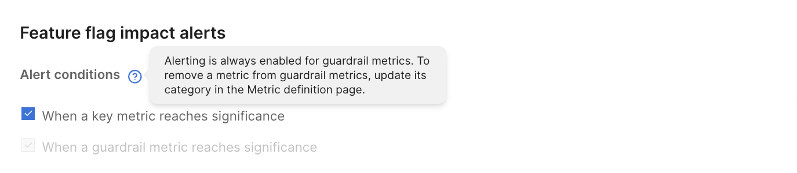

Harness FME provides a flexible alerting system to help teams monitor the impact of feature flags and experiments in real time. By configuring automated alerts on <Tooltip id="fme.release-monitoring.key-metric">key</Tooltip> or <Tooltip id="fme.release-monitoring.guardrail-metric">guardrail metrics</Tooltip>, teams can quickly detect regressions, respond to issues, and protect customer experience during rollouts.

With alerts, you can: 

* Detect when a <Tooltip id="fme.release-monitoring.metric">metric</Tooltip> crosses a critical threshold
* Automatically trigger notifications based on experiment results
* Respond to issues before they escalate

Harness FME alerts are designed to work seamlessly with your existing workflows, ensuring you stay informed and in control during every stage of a release or experiment.

## Determine an alert mechanism

Choose the alert type that matches how you want to detect and respond to metric changes:

| **Alert type**                                        | **How it's triggered**                                     | **Fires on**       | **Configured for**          | **Environment support** | **How to enable** |
|-------------------------------------------------------|------------------------------------------------------------|--------------------|-----------------------------|-------------------------|-------------------|
| **Significance alert (automatic) – Key metric**       | Statistically significant impact detected (threshold = 0). | Good or bad impact | Key metric linked to a flag | Production only         | Mark a metric as a [key metric](/docs/feature-management-experimentation/experimentation/experiment-results/viewing-experiment-results/metrics-impact-cards#actions-you-can-perform) for a feature flag on the **Metrics impact** tab. |
| **Significance alert (automatic) – Guardrail metric** | Statistically significant impact detected (threshold = 0). | Good or bad impact | Guardrail metric            | Production only         | Set a metric category to [`Guardrail`](/docs/feature-management-experimentation/experimentation/setup/metric-selection/guardrail-metrics) in the metric definition. |
| **Manual metric alert policy (any metric)**           | Manually configured threshold is crossed.                  | Degradations only  | Any metric with a policy    | Any environment         | Create a [metric alert policy](/docs/feature-management-experimentation/release-monitoring/metrics/setup/metric-alert-policy) from the metric definition on the **Alert Policy** tab. |

For key metrics, alerts are triggered only when the **When a key metric reaches significance** option is enabled in a [feature flag's alert settings](/docs/feature-management-experimentation/release-monitoring/alerts/automated-alerts-and-notifications/#significance-alerts-feature-flags). Guardrail metric alerts are automatically evaluated.

<Tooltip id="fme.release-monitoring.significance-alert">Significance alerts</Tooltip> are automatic and require no threshold configuration. Use them to detect statistically meaningful changes during feature flag rollouts. These alerts are only evaluated in production environments.

[Metric alert policies](/docs/feature-management-experimentation/release-monitoring/alerts/alert-policies) are manually configured and allow you to define thresholds and recipients. Use them when you:

- Need alerts in non-production environments (for example, staging or preview)
- Want explicit control over thresholds
- Need to customize notification recipients

<Tooltip id="fme.release-monitoring.metric-alert">Manual metric alerts</Tooltip> fire when any metric crosses a defined threshold, regardless of feature flag or experiment.

## Configure alerts

Choose the type of alert you want to configure based on your use case:

- To set up automatic alerts based on statistical significance, see [Automated alerts and notifications](/docs/feature-management-experimentation/release-monitoring/alerts/automated-alerts-and-notifications/#significance-alerts-feature-flags).
- To configure threshold-based alerts with custom conditions or non-production environments, see [Alert policies](/docs/feature-management-experimentation/release-monitoring/alerts/alert-policies/).

### Alert policies

Control how and when alerts trigger by creating an [alert policy](.././alerts/alert-policies). Define thresholds, notification rules, and alert behaviors that match your team's processes.

#### Monitoring window

Set the time window over which metric performance is evaluated for alert policies. [Monitoring windows](.././alerts/alert-policies/monitoring-window) help you tune sensitivity and reduce alert noise by limiting the period during which alerts are automatically triggered based on observed metric degradations.

Harness FME continues to monitor and alert your team of a metric degradation for up to 28 days after a version change. The default monitor window is 24 hours. Administrators can change this in the **Monitor window and statistics** settings.

:::info 
The monitoring window only applies to alert policies. If the monitoring window is set to 24 hours, Harness FME stops evaluating metrics for alerts triggering after 24 hours from the version change. However, significance-based alerts can still trigger later if metrics are recalculated (for example, during deeper analysis or manual recalculation).
::: 

### Alert baseline treatment

Compare metrics against a [baseline treatment](.././alerts/set-the-alert-baseline-treatment) to improve alert accuracy and minimize false positives. This treatment serves as the control group in impact comparisons, allowing Harness FME to evaluate whether changes in a metric are statistically significant when users receive a different treatment.

## Manage alerts

When an alert fires, you can access the [alert details](./view-triggered-alerts) and take action from the **Feature flags** page.

| **Action** | **Description** |
| ---- | ---- | 
| Kill feature flag | If you decide to kill a feature flag due to an alert, the [default treatment](/docs/feature-management-experimentation/feature-management/setup/default-treatment) overrides the existing targeting rules and is returned for all users. |

## Troubleshooting alerts

Fix common configuration or delivery issues, verify metric inputs, and fine tune thresholds for better alert performance. For more information, see [Troubleshooting alerts](./troubleshooting).