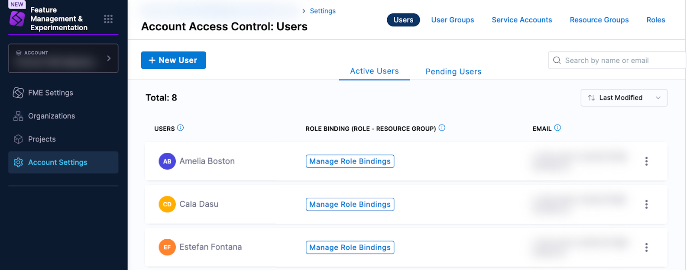
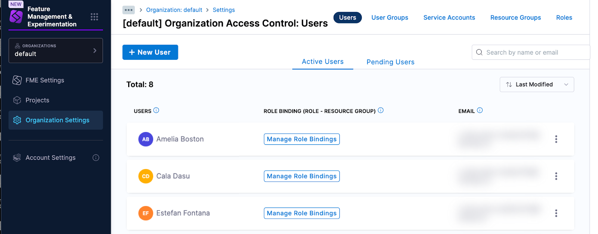
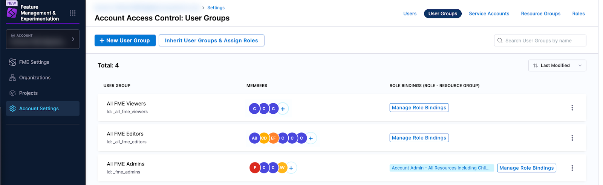
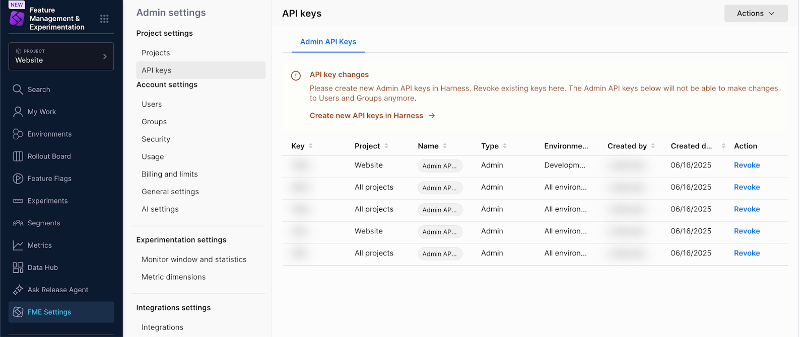
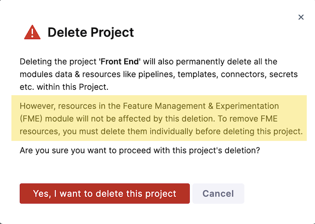

import Tabs from '@theme/Tabs';
import TabItem from '@theme/TabItem';

## Overview

This guide is intended to be used as a reference shortly after your migration into Harness to guide you through administrative tasks. It will also help you understand permissions in Harness after your Split-to-Harness migration. It explains how legacy **Split access restrictions** map to **Harness RBAC (role-based access control) settings** in two ways:

* Some RBAC principals, resource groups, and roles are created for you during migration of your `app.split.io` (legacy Split) account to `app.harness.io`. This mapping is explained in detail, and we show you where to find the new RBAC settings.
* Harness RBAC settings can mimic and provide control beyond what was possible with legacy Split access restrictions. This guide explains how to use RBAC to grant similar permissions to the legacy settings when creating users, user groups, API keys, and projects.

Harness recommends:

1. Using this guide to become familiar with the initial RBAC settings applied to your new Harness account.
1. Following this guide to work with the Harness RBAC principals and role bindings that were created for you during your migration.
1. Learning about the full potential of RBAC on the Harness platform, starting with [Platform access control](/docs/category/platform-access-control/) in the Harness documentation.

:::tip Read about Environment Scope (Admin API keys)
Creation of new environment-scoped Admin API keys in Harness post-migration will be available when the "Granular permissions in RBAC" [roadmap item](https://developer.harness.io/roadmap/#fme) is delivered. Existing environment-scoped Admin API keys continue to function as before, but cannot be cloned or rotated. To learn more, go to the [Environment Scope](#environment-scope) section.
:::

The following terminology is referenced in this guide:

* **Legacy Split**: Legacy Split refers to the application accessed through `app.split.io`.
* **Harness FME**: This refers to the legacy Split application once it has been migrated to `app.harness.io`. The migration preserves the application intact and converts it to a module within Harness called Feature Management and Experimentation (FME).
* **The Harness FME team**: The Split team is here referred to as the Harness FME team (renamed after Split was acquired by Harness), but it is the same people.
* **API keys**:
  * **Admin API keys**: Authentication tokens used to authorize [Split Admin API requests](https://docs.split.io/reference/introduction). These authentication tokens can be created on the Harness platform after migrating.
  * **SDK API keys**: Authentication tokens used to authorize FME SDK requests. SDK API keys are managed by the Harness FME module.
  * **API keys**: The Harness platform manages API keys and tokens within service accounts.* When “API keys” is not preceded by “Admin” or “SDK”, then this guide is referring to these Harness platform API key entities.

\* *In Harness, API keys can also be created at the [personal user scope](/docs/platform/automation/api/add-and-manage-api-keys/#create-personal-api-keys-and-tokens), but the migration script does not create personal access API keys and tokens, so these are outside the scope of this guide.*

## Users

This section explains:

* How RBAC applies to Harness users
* How to add new users with the same privileges as your legacy Split users

#### Users for Harness FME

When your Split account was migrated to Harness, a Harness user was created for each legacy Split user.

Here’s how Harness users work with RBAC:

Users can have role bindings that each assign a role (a set of permissions) over a resource group. Users can be created at the Harness account, organization, or project level.

When a user is created at the project level (in **Project Settings**), this user is automatically added to the Harness built-in **All Organization Users** and **All Account Users** user groups in the parent organization and account.

Likewise, a user created at the organization level (in **Organization Settings**) is automatically added to the **All Account Users** user group in the parent account.

By default, the **All Account Users** user group is assigned the role binding: **Account Viewer** role over **All Account Level Resources**. If that role binding is removed, your users may encounter an error when attempting to access the FME module.

### View your users

You can view your new Harness users (that correspond to your legacy Split users) in your Harness account settings. In the left navigation panel, click **Account Settings**, click **Access Control** at the top of the page, and click the **Users** tile.

The same users were also added at the organization level, and can be seen in your Harness organization settings. In the left navigation panel, click **Organization Settings**, click **Access Control** at the top of the page, and click the **Users** tile.

The users do not appear in the project-level Users lists (except for pre-migration restricted projects where users were individually granted access). Instead, users were added to user groups and it is these user groups that can be viewed in **Project Settings**.

No role bindings were added to your individual Harness users at the account or organization levels. Instead, role bindings were added to user groups. For more details, go to the [User Groups](#user-groups) section.

### Add a user

This section shows you how to add new Harness users and set up RBAC permissions that mimic your legacy Split permissions.

When you add a user at the account level, you can also add the user to an [FME user group](#fme-user-groups). Once a user is added to the Harness platform, it is easy to add the same user to any organization or project.

<Tabs>
<TabItem value="interactive" label="Interactive Guide">

To add a user to Harness that will have access to your (unrestricted) migrated FME projects, view the steps in the interactive guide:

<DocVideo src="https://app.tango.us/app/embed/e9c155c2-1d2d-4fbf-b5d6-7b59591668b6" title="Add a User in Harness" />

</TabItem>
<TabItem value="step" label="Step-by-step">

To add a user to Harness that will have access to your (unrestricted) migrated FME projects:

1. Begin adding the user at the Harness account level:

   - In the left navigation panel, click **Account Settings**, click **Access Control** at the top of the page, and click the **Users** tile.
   - Click **+ New User** to begin adding a new user.
   - Type the user email in the **Users (name or email)** textbox, and select **+ email you just typed** that appears below the textbox. (You can add multiple users at once by entering multiple email addresses.)
1. Apply permissions to the user by adding the user to a user group:
   - Click **Select User Group(s)**.
   - In the modal, check the FME user group that represents the legacy Split permissions you would like to mimic:
     
     - **All FME Admins** (equivalent to the legacy **Split Administrators** group)
     - **All FME Editors** (equivalent to the legacy **Split Editor** role)
     - **All FME Viewers** (equivalent to the legacy **Split Viewer** role)

1. Click **Apply** to finish adding the new user. The user will receive an invitation email to join the Harness account.

</TabItem>
</Tabs>

The RBAC permissions (that mimic legacy Split permissions) are set on the FME user group to which the new Harness user was added. You can learn more about these user group role bindings in the [User Groups](#user-groups) section.

:::tip
If you want to grant the user access to a restricted project, you’ll need to add the user directly to the project (in Project Settings) and assign the project-level role binding. Go to [Unrestricted and Restricted Projects](#unrestricted-and-restricted-projects) to learn more.
:::

### Delete a user

To delete a user in Harness, see [Delete users](/docs/platform/role-based-access-control/add-users/#delete-users) in the Harness platform documentation.

## User groups

This section explains:

* What Harness user groups were created when your legacy Split account was migrated to Harness, and what RBAC role bindings were assigned
* How to use Harness user groups to grant new users the same privileges as your legacy Split users

#### User Groups for Harness FME

When your Split account was migrated to Harness, a Harness user group was created for each legacy Split group.

Here’s how Harness user groups work with RBAC:

User groups hold users. User groups have role bindings that apply to all the users within the user group.

#### Roles

Harness roles are sets of permissions to perform specific operations on a resource group. 

#### Resource Groups

Harness resource groups define the resources (e.g. projects, pipelines, connectors, secrets, folders, users, etc.) that a user group (or user, or service account) can access.

#### Role Bindings

Role bindings are roles assigned to a user, user group, or service account over a resource group.

Resources live at the account, organization, or project levels, so resource groups are scope-specific. For example, a resource group can be **All resources** or **All resources and child scopes** (for the account, organization, or project).

:::tip RBAC is additive
The total expanse of a user's permissions and access is the **sum** of all the roles and resource groups from all user groups they belong to, as well as any roles and resource groups assigned directly to them as an individual user.
:::

### View your user groups

You can view legacy Split groups that were migrated to Harness in your Harness organization settings. In the left navigation panel, click **Organization Settings**, click **Access Control** at the top of the page, and click the **User Groups** tile.

The screenshot below shows a Harness user group that was created for a legacy Split group. This group is created and managed (meaning users can be added) at the organization level. Role bindings are created for this group (for specific projects) at the project level.

#### FME user groups

When your account was migrated to Harness, the migration script created new Harness FME user groups and assigned role bindings to replicate your legacy Split settings.

#### Role bindings at the account and organization levels

| Legacy Split setting | Harness user group | Harness scope   where the user group is created and managed | Role binding   Harness role + Harness resource group |
|---|---|---|---|
| Administrators   Legacy Split group | All FME Admins | Harness account | For a new Harness account:   Account Admin + All Resources Including Child Scopes    Organization Viewer + All Organization Level Resources    For a pre-existing Harness account:   Organization Admin + All Organization Level Resources |
| Editors   Legacy Split role | All FME Editors | Harness account |  Organization Viewer + All Organization Level Resources |
| Viewers   Legacy Split role | All FME Viewers | Harness account |  Organization Viewer + All Organization Level Resources |

The FME user groups were created at the Harness account scope (as shown in the screenshot below), and they are inherited at the organization scope and project scope.

:::info[Where are Role bindings assigned?]
Role bindings are assigned at the scope where they apply. For example:
  * The role binding **Account Admin + All Resources Including Child Scopes** is assigned in Account Settings.
  * The role binding **Organization Viewer + All Organization Level Resources** is assigned in Organization Settings.
  * Project-scoped role bindings are assigned in Project Settings.
:::

#### Role bindings at the project level

To grant similar permissions to your legacy Split settings, the new Harness FME user groups were inherited by Harness projects and the following role bindings were assigned:

      <table>
        <colgroup>
          <col style={{width: '35%'}} />
          <col style={{width: '15%'}} />
          <col style={{width: '19%'}} />
          <col style={{width: '13%'}} />
          <col style={{width: '18%'}} />
        </colgroup>
        <thead>
          <tr>
            <th rowspan="2" scope="col">
              Legacy Split setting
            </th>
            <th rowspan="2" scope="col">
              Harness user group
            </th>
            <th colspan="3" scope="col">
              <strong>Role binding</strong>  (role + resource group) assigned to the user group (and the scope where the role binding was assigned)
            </th>
          </tr>
          <tr>
            <th scope="col">
              Harness scope
            </th>
            <th scope="col">
              Harness role
            </th>
            <th scope="col">
              Harness resource group
            </th>
          </tr>
        </thead>
        <tbody>
          <tr>
            <td>
              

                Project   (any permission settings)
              

            </td>
            <td>
              All FME Admins
            </td>
            <td>
              Harness project
            </td>
            <td>
              

                Split FME Administrator Role
              

              

                Project Viewer
              

            </td>
            <td>
              All Project Level Resources   or   FME All Resources\*
            </td>
          </tr>
          <tr>
            <td>
              

                Project - Anyone can access   Legacy Split project permissions
              

            </td>
            <td>
              All FME Editors
            </td>
            <td>
              Harness project
            </td>
            <td>
              

                Split FME Manager Role
              

              

                Project Viewer
              

            </td>
            <td>
              All Project Level Resources   or   FME All Resources\*
            </td>
          </tr>
          <tr>
            <td>
              

                Project - Anyone can access   Legacy Split project permissions
              

            </td>
            <td>
              All FME Viewers
            </td>
            <td>
              Harness project
            </td>
            <td>
              Project Viewer
            </td>
            <td>
              All Project Level Resources   or   FME All Resources\*
            </td>
          </tr>
          <tr>
            <td>
              

                Legacy Split group   A group you created in Split   +   Editor   Legacy Split role (of all users in the group)
              

            </td>
            <td>
              

                Harness group   Created at the Harness organization level
              

            </td>
            <td>
              

                Harness project   if the project is not restricted OR the project is restricted but grants the group access
              

            </td>
            <td>
              

                Split FME Manager Role
              

              

                Project Viewer
              

            </td>
            <td>
              All Project Level Resources   or   FME All Resources\*
            </td>
          </tr>
          <tr>
            <td>
              

                Legacy Split group   A group you created in Split   +   Viewer   Legacy Split role (of at least one user in the group)\*\*
              

            </td>
            <td>
              

                Harness group   Created at the Harness organization level
              

            </td>
            <td>
              

                Harness project   if the project is not restricted OR the project is restricted but grants the group access
              

            </td>
            <td>
              Project Viewer
            </td>
            <td>
              All Project Level Resources   or   FME All Resources\*
            </td>
          </tr>
        </tbody>
      </table>

\* *If you were migrated to a Harness account on the Enterprise plan, then the **FME All Resources** project-level resource group was created and used in role bindings at the project level. Harness accounts on the Free plan do not have permissions to create resource groups, so the **All Project Level Resources** Harness built-in resource group was used instead.*

\*\* *Users may lose edit permissions for a restricted project:*

:::warning In legacy Split groups with both editors and viewers – Editors will lose permissions.
If a group in legacy Split had both editors and viewers (legacy roles) and the group was given access to a restricted project, then post-migration the Harness group will be assigned only the **Project Viewer** role. (This prevents viewers from gaining broader permissions upon migration.) The users that were legacy Split editors will no longer have edit permissions for the project.

Since RBAC is additive, you can assign edit permissions by adding the Harness user (with the legacy Editor role) at the project level and assigning the role binding: **Split FME Manager Role** role over the **All Project Level Resources** (or **FME All Resources**) resource group.
:::

#### Examples showing user group inheritance and role bindings

For an unrestricted project:

The Website project was an unrestricted project in legacy Split. After migration, the FME user groups (**All FME Admins**, **All FME Editors**, and **All FME Viewers**) are inherited and role bindings are assigned at the project level as shown above. (All role bindings are for the **All Project Level Resources** resource group, created on the Harness Free plan. On the Harness Enterprise plan, the **FME All Resources** resource group would be created and used instead.)

:::note[&nbsp;]
The **All Project Users** is a Harness managed group that is created on project creation, and users are automatically added to this group when added to the project.
:::

For a restricted project:

The API project was a restricted project in legacy Split. After migration, only the **All FME Admins** user group and another user group are inherited at the project level, because these were explicitly added to the legacy Split project.

### Add a user group

Harness recommends creating user groups at the organization (or account) level. You can then inherit the group at any project level (and assign role bindings at the project level).

:::tip Create groups for broader privileges at higher scopes
Create groups intended for broader privileges (like admins) at higher scopes, and those intended for a narrow range of visibility at lower scopes.

User groups can be inherited from higher scopes (e.g. a project can inherit a user group from an organization or account), but user groups cannot be inherited from lower scopes (e.g. an account cannot inherit a user group from an organization or project).
:::

To create a user group in Harness, see [Create user groups manually](/docs/platform/role-based-access-control/add-user-groups/#create-user-groups-manually) in the Harness platform documentation.

Refer to [Role bindings at the project level](#role-bindings-at-the-project-level) if you’d like to replicate legacy Split permissions using Harness RBAC settings.

### Delete a user group

To delete a user group in Harness, see [Delete user groups](/docs/platform/role-based-access-control/add-user-groups/#delete-user-groups) in the Harness platform documentation. The users within the user group will not be deleted.

:::danger Do not delete `All FME Admins`, `All FME Editors`, or `All FME Viewers`
Harness recommends that you do not delete the All FME Admins, All FME Editors, and All FME Viewers user groups, unless you fully understand the effect of the deletion: The role bindings associated with these user groups replicate your legacy Split user permissions and would be deleted and unassigned from your users.
:::

## Admin API Keys

#### Legacy Split Admin API keys

The Admin API Keys that you created before migration will continue to work after your account is migrated to Harness.

:::info
If you create a **new project in Harness** post-migration, your legacy Split Admin API keys will not be automatically granted access to the new project. To grant access, you can follow the steps to [Grant legacy Split Admin API key access to a new project](#grant-legacy-split-admin-api-key-access-to-a-new-project) in the Troubleshooting section.

*Concept: This is a difference in the legacy Split permissioning model and the Harness RBAC model (least privilege model). In Harness, new projects are restricted upon creation and all access permissions need to be granted manually at the project level. (The exception is if you use the All Resources Including Child Scopes resource group in your Account or Organization level role bindings, but this is not recommended.)*
:::

Post-migration, your legacy Split Admin API keys are listed in **FME Settings**.

### Revoke a legacy Split Admin API key

:::tip Avoid revoking environment-scoped Admin API keys
Until granular permissions at the object and environment level are implemented in Harness FME, you will not be able to create environment-scoped Admin API keys on the Harness platform. For that reason, you should avoid revoking environment-scoped Admin API keys at this time. See the [FME roadmap](https://developer.harness.io/roadmap/#fme) for “Granular permissions in RBAC” for timing.
:::

To revoke an Admin API key that was migrated from legacy Split:

1. In the left navigation panel, click the **Grid** icon, and click **Feature Management & Experimentation**.
1. Click **FME Settings**.
1. Click **API Keys**.
1. Select the **Admin API Keys** tab.
1. Find the row listing the Admin API key that you’d like to delete and click **Revoke** in the **Actions** column.
1. Type `REVOKE` in the Revoke API key modal and click **Revoke**. The key is deleted from the list on the **Admin API Keys** tab.

Post-migration, you can create new Admin API keys in Harness, as described in the following section.

#### Harness FME Admin API keys

This section explains:

* What RBAC principals were created when your legacy Split account was migrated to Harness
* How to use the new Harness RBAC principals to create new Admin API keys with the same privileges as your legacy Split Admin API keys

When your Split account is migrated to Harness, a service account is created for each legacy Split Admin API key. 

:::danger Do not delete service accounts linked with legacy Admin API keys
Each service account created by the migration script and its role bindings are linked with one of your legacy Split Admin API keys. The service account role bindings define the access granted to the Admin API key over Harness resources, and are necessary for the Admin API key to authorize your API requests after your migration to Harness.

This association between your legacy Split Admin API keys and service accounts is **not visually shown** in Harness. The service accounts do not appear to contain tokens (on the pages where they are managed in Harness); however, the tokens are the legacy Split Admin API keys (shown in FME Settings). It is best to delete the legacy Split Admin API key in FME Settings before deleting the associated service account; otherwise, if the service account is deleted before the Admin API key, then the Admin API key will not work.
:::

:::tip To find which Harness service account is linked with a legacy Split Admin API key:
You can look for the service account name that matches the name of your legacy Split Admin API key. This service account is internally linked to your Admin API key, and the role bindings of this service account are applied to your Admin API key.

In the left navigation panel, click **Account Settings** or **Organization Settings**, and click the **Service Accounts** tile. The name of the linked service account is the same as the name of your legacy Split Admin API key, with spaces removed.
:::

Here’s how Harness service accounts work:

Service accounts hold API keys. API keys hold tokens. Service accounts have role bindings that each assign a role (a set of permissions) to a resource group. The role bindings apply to all the tokens within the service account.

### View your service accounts

The service accounts were created at the Harness account scope (if no Harness account existed before the migration) or Harness organization scope (if you already had an existing Harness account, into which your legacy Split objects were merged).

To view service accounts in your Harness account settings, in the left navigation panel, click **Account Settings**, click **Access Control** at the top of the page, and click the **Service Accounts** tile. You will see all the service accounts and account-level role bindings.

You can also view service accounts in your Harness organization settings. In the left navigation panel, click **Organization Settings**, click **Access Control** at the top of the page, and click the **Service Accounts** tile. You will see the service accounts with organization-level role bindings.

To view service accounts in your Harness project settings, click **Project Settings**, click **Access Control** at the top of the page, and click the **Service Accounts** tile. You will see the service accounts with project-level role bindings.

### Create an Admin API key

You can use a service account to create a new Harness FME Admin API key. The steps below guide you to create an access token with privileges equivalent to a legacy Split Admin API key (except that service accounts with environment-scoped Admin API keys will not be available until the “Granular permissions in RBAC” [roadmap item](https://developer.harness.io/roadmap/#fme) is delivered).

:::info[How to use the Harness access token:]
After your migration, use the Harness access token:
* As the bearer token or x-api-key for legacy Split Admin API endpoints that are not deprecated. (The deprecated endpoints are replaced by Harness API endpoints for a migrated account.)
* As the x-api-key for Harness API endpoints.

For more information, go to [Authorization moves from Bearer Token to x-api-key](https://developer.harness.io/docs/feature-management-experimentation/split-to-harness/api-for-split-admins/#authorization-moves-from-bearer-token-to-x-api-key) in the FME documentation.
:::

<Tabs>
<TabItem value="interactive" label="Interactive Guide">

To create an Admin API key with the same permissions as your legacy Split Admin API key in your Harness account, view the steps in the interactive guide:

<DocVideo src="https://app.tango.us/app/embed/e76ab685-723c-4e39-964e-cff2c56df2d1" title="Generate an API Key and Token" />

</TabItem>
<TabItem value="step" label="Step-by-step">

To create an Admin API key with the same permissions as your legacy Split Admin API key in your Harness account:

1. In the left navigation panel, click **Account Settings** (or **Organization Settings**, if you had a pre-existing Harness account before migration).
1. Click the **Access Control** button at the top of the page.
1. Click the **Service Accounts** tile.
1. Click on the service account that corresponds to your pre-migration Admin API key.
1. Click **+ API Key**.
1. Enter a name for the new API key and click **Save**.
1. Click **+ Token**.
1. Enter a name for the new API key token, set an expiration, and click **Generate Token**.
1. Copy the token value somewhere safe.

</TabItem>
</Tabs>

:::tip[To create an Admin API key when you don't have a service account:]
If you don’t have a service account with role bindings set up, you can create a service account and role binding for Admin API keys scoped to all projects [(account or organization scope)](#account-or-organization-scope) or scoped to a specific project [(project scope)](#project-scope).
:::

#### Account or organization scope

This section provides steps to create a service account and role bindings for an Admin API key scoped to all existing projects in your Harness account or organization. You can follow these steps if you don’t have a service account created during migration or if you prefer not to use it.

:::warning All Resources Including Child Scopes (resource group) is not recommended
The steps in this section guide you to add an **Account Admin** role over **All Account Level Resources**, and then grant equivalent permissions at the organization and project levels.

It is not recommended to use the **Account Admin** role over **All Resources Including Child Scopes**. This resource group includes all child resources at the organization and project levels.

The **All Resources Including Child Scopes** is not recommended because it would grant permissions to access:
    - Any projects with restricted permissions (set up before migration)
    - All projects added to the account in the future
:::

To create an Admin API key scoped to all projects in your Harness account:

1. At the account level, create the service account and assign roles:
   - In the left navigation panel, click **Account Settings**.
   - Click the **Access Control** button at the top of the page.
   - Click the **Service Accounts** tile.
   - Click the **+ New Service Account** button.
   - Enter a name for the new service account and click **Save**. The service account is listed.
   - Click **Manage Role Bindings** to manage role bindings for the service account.
   - Click **+ Add**.
   - Select the **Account Admin** role and the **All Account Level Resources** resource group.
   - Click **Apply**. The role binding is added to the service account.

1. At the organization level, inherit the service account and assign roles:
   - In the left navigation panel, select the organization [where your Split legacy projects were migrated](#projects) (or where your FME objects are defined or will be defined).
   - Click **Organization Settings**.
   - Click the **Access Control** button at the top of the page.
   - Click the **Service Accounts** tile.
   - Click the **Inherit Service Accounts &amp; Assign Roles** button.
   - Select the service account created in Step 1. (When created at the account level, the service account is listed on the **Account** tab.)
   - Click **Apply Selected**.
   - Select the **Organization Admin** role.
   - Leave the **All Organization Level Resources** resource group selected.
   - Click **Save** or **Apply**. The service account and role binding are listed.

1. For each project: At the project level, inherit the service account and assign roles:
   - In the left navigation panel, select the project.
   - Click **Project Settings**.
   - Click the **Access Control** button at the top of the page.
   - Click the **Service Accounts** tile.
   - Click the **Inherit Service Accounts &amp; Assign Roles** button.
   - Select the service account created in Step 1. (When created at the account level, the service account is listed on the **Account** tab.)
   - Click **Apply Selected**.
   - Select the **Project Admin** role.
   - Leave the **All Project Level Resources** resource group selected (or select **FME All Resources**\*).
   - Click **Save** or **Apply**. The service account and role binding are listed.
   
1. Create the API key and token at the account level:
   - In the left navigation panel, click **Account Settings**.
   - Click the **Access Control** button at the top of the page.
   - Click the **Service Accounts** tile.
   - Click on the service account created in Step 1.
   - Click **+ API Key**.
   - Enter a name for the new API key and click **Save**.
   - Click **+ Token**.
   - Enter a name for the new API key token, set an expiration, and click **Generate Token**.
   - Copy the token value somewhere safe.

\* *The **FME All Resources** resource group was created if you were migrated to a Harness account on the Enterprise plan. If you were migrated to a Harness account on the Free plan, you should use the **All Project Level Resources** resource group.* 

  

:::tip Service accounts for <code>Admin API keys scoped to all projects</code> can also be created at the organization level
If you prefer, you can instead create the service account at the Harness organization level. Steps 1 and 4 would be done at the organization level, and Step 2 would be omitted. The **Organization Admin** role for **All Organization Level Resources** is required for the Admin API key to be granted permission to list Harness projects and Harness elements attached to projects.
:::

#### Project scope

This section provides steps to create a service account and role bindings for an Admin API key scoped to specific projects in your Harness account. You can follow these steps if you don’t have a service account created during migration or prefer not to use it.

To create an Admin API key scoped to a specific project in your Harness account:

1. At the account level, create the service account and assign roles:
   
   - In the left navigation panel, click **Account Settings**.
   - Click the **Access Control** button at the top of the page.
   - Click the **Service Accounts** tile.
   - Click the **+ New Service Account** button.
   - Enter a name for the new service account and click **Save**. The service account is listed.

1. At the project level, inherit the service account and assign roles:
   - In the left navigation panel, select the project.
   - Click **Project Settings**.
   - Click the **Access Control** button at the top of the page.
   - Click the **Service Accounts** tile.
   - Click the **Inherit Service Accounts &amp; Assign Roles** button.
   - Select the service account created in Step 1. (When created at the account level, the service account is listed on the **Account** tab.)
   - Click **Apply Selected**.
   - Select the **Project Admin** role.
   - Leave the **All Project Level Resources** resource group selected (or select **FME All Resources**\*).
   - Click **Save** or **Apply**. The service account and role binding are listed.

1. Create the API key and token at the account level:
   - In the left navigation panel, click **Account Settings**.
   - Click the **Access Control** button at the top of the page.
   - Click the **Service Accounts** tile.
   - Click on the service account created in Step 1.
   - Click **+ API Key**.
   - Enter a name for the new API key and click **Save**.
   - Click **+ Token**.
   - Enter a name for the new API key token, set an expiration, and click **Generate Token**.
   - Copy the token value somewhere safe.

\* *The **FME All Resources** resource group was created if you were migrated to a Harness account on the Enterprise plan. If you were migrated to a Harness account on the Free plan, you should use the **All Project Level Resources** resource group.* 

  

:::tip Service accounts for <code>Admin API keys scoped to specific projects</code> can also be created at the organization/project level

If you prefer, you can instead create the service account at the Harness organization or project level:

- **Organization level**: Steps 1 and 3 would be done at the organization level.
- **Project level**: Steps 1 and 3 would be done at the project level, and step 2 would be omitted. In step 1, you would apply the role binding: **Project Admin** role over **All Project Level Resources** (or **FME All Resources**).

If created at the project level, the API key would not be sharable (by inheriting) across multiple projects. You would only be able to use it in the project where it was created.
:::

#### Environment Scope

:::warning
Creating a new Admin API key scoped to specific FME environments in the Harness FME module is not yet possible using Harness RBAC.
:::

While it is currently not possible post-migration to create Admin API keys scoped to environments, we are working on extending the FME implementation of Harness RBAC to allow this functionality. The Harness FME team will release fine-grained access control for FME resources with the “Granular permissions in RBAC” [roadmap item](https://developer.harness.io/roadmap/#fme). At that time, you will be able to create custom resource groups in Harness that will grant access to specific FME environments within a project.

Currently, for FME resources, resource groups in Harness define RBAC access to *all* entities of a given type. This means that access to specific environments within a project cannot be configured; only access to *all* environments within a project can be granted or revoked.

Note that new API keys created in Harness cannot be scoped to specific FME environments of a project, even if you add the API key to a Harness service account linked to an environment-scoped legacy Split Admin API key.

:::info
Your legacy Split Admin API key (created pre-migration) scoped to specific environments will continue to work that way. The legacy API key will be authorized by the back-end servers, as before migration.
:::

### Delete an Admin API key

To delete an Admin API **token** that was created post-migration, see [Delete service account tokens](/docs/platform/automation/api/add-and-manage-api-keys/?token=sat#delete-tokens) in the Harness platform documentation. This will revoke the token used to authorize requests with the Harness back end.

To delete an Admin API **key** that was created post-migration, see [Edit service account API keys](/docs/platform/automation/api/add-and-manage-api-keys/?token=sat#delete-api-keys) in the Harness platform documentation. This will delete the API key and revoke all its tokens.

If you would like to revoke a legacy Split Admin API key (that was created pre-migration), see [Revoke a legacy Split API key](#revoke-a-legacy-split-admin-api-key).

### Rotate an API key token

To rotate an Admin API token that was created post-migration, see [Rotate service account tokens](/docs/platform/automation/api/add-and-manage-api-keys/?token=sat#rotate-tokens) in the Harness platform documentation.

If you would like to clone a legacy Split Admin API key (that was created pre-migration), see [Create an Admin API key](#create-an-admin-api-key) to create a new API key token in a Harness service account with privileges corresponding to the legacy Admin API key.

## SDK API keys

### Create an SDK API key

To create an SDK API key in your Harness account:

1. In the left navigation panel, click the Grid icon and click **Feature Management & Experimentation**.
1. Click **FME Settings**.
1. Click **Projects** under **Project Settings**.
1. Find the row listing the project to which you’d like to scope the SDK API key and click **View** in the **Actions** column.
1. Click the **Actions** button at the top right, and select **Create SDK API key**.
1. Enter a name, select the type, and select the environment for the SDK API key.
1. Click **Create API Key**.
1. Copy the access token and click **Close**. The new key appears in the first row on the **SDK API Keys** tab.

### Revoke an SDK API key

To revoke an SDK API key in your Harness account:

1. In the left navigation panel, click the Grid icon and click **Feature Management & Experimentation**.
1. Click **FME Settings**.
1. Click **Projects** under **Project Settings**.
1. Find the row listing the project for which you’d like to delete the SDK API key and click **View** in the **Actions** column.
1. Select the **SDK API Keys** tab.
1. Find the row listing the SDK API key that you’d like to delete and click **Revoke** in the **Actions** column.
1. Type `REVOKE` in the **Revoke API key** modal and click **Revoke**. The key is deleted from the list on the **SDK API Keys** tab.

### Clone an SDK API key

To clone an SDK API key in your Harness account:

1. In the left navigation panel, click the Grid icon and click **Feature Management & Experimentation**.
1. Click **FME Settings**.
1. Click **Projects** under **Project Settings**.
1. Find the row listing the project for which you’d like to clone the SDK API key and click **View** in the **Actions** column.
1. Select the **SDK API Keys** tab.
1. Find the row listing the SDK API key that you’d like to clone and click **Clone** in the **Actions** column.
1. Enter a name for the SDK API key and click **Clone API Key**.
1. Copy the access token and click **Close**. The new key appears in the first row on the **SDK API Keys** tab.

## Projects

In Harness, an account contains a set of [organizations](#what-is-a-harness-organization), and an organization contains a set of projects.

If your Split account is migrated to a Harness account on the Enterprise plan, a Harness organization named <strong> *legacy Split account name* FME</strong> is created, and your projects are created within this organization. On the Free plan, your projects are created in the **default** Harness organization in your Harness account. These Harness projects each internally link to your Harness FME projects.

### Create a project

<Tabs>
<TabItem value="interactive" label="Interactive Guide">

<DocVideo src="https://app.tango.us/app/embed/4c5d12d9-a82c-4a54-a54e-c0684ddc3475" title="Create a New Project" />

</TabItem>
<TabItem value="step" label="Step-by-step">

To create a new project in Harness:

1. In the left navigation panel, click the Grid icon and click **Feature Management & Experimentation**.
1. Click **FME Settings**.
1. Click **Projects** under **Projects Settings** to bring up the **Projects** page in Harness FME.
1. Click the **Create project** button at the top right. This brings you to the Harness organization's **Projects** page.
1. Click **+ New Project**.
1. Enter a name for the project and click **Save and Continue**.
1. Click **Save and Continue** again to close the modal. You can grant access to the project using **Access Control** in **Project Settings**.

</TabItem>
</Tabs>

#### Unrestricted and restricted projects

A new project in Harness will be restricted.

Until you grant access to your project using **Access Control** in your **Project Settings**, your project will be restricted to you (the project creator). Only you will be able to view or edit the project in Harness (and in Harness FME).

To grant access to your project, you can choose to follow the permission pattern of a legacy Split restricted project or unrestricted project. Initially, we recommend following one of these patterns. After some time, you may prefer to implement RBAC strategies aligned to your company policies and practices.

<Tabs>
<TabItem value="unrestricted" label="Unrestricted project">

To implement permissions similar to the legacy Split unrestricted project:

From your **Project Settings** inherit each of the [FME user groups](#fme-user-groups) and add the following project-level role bindings:
   
   - All FME Admins: **Split FME Administrator Role** - **FME All Resources**\*
   - All FME Editors: **Split FME Manager Role** - **FME All Resources**\*
   - All FME Viewers: **Project Viewer** - **FME All Resources**\*

Role bindings added at the project level grant access to the given project.

</TabItem>
<TabItem value="restricted" label="Restricted project">

To implement permissions similar to the legacy Split restricted project:

1. From your **Project Settings**, add or inherit one or more of the following RBAC principals:
   
   - Add **users** individually to the project, then assign role bindings directly to the individual user at the project level.
   - Inherit a **user group** (from the account or organization) and assign role bindings at the project level.
   - Inherit a **service account** with an API key and token (grants access to an Admin API key) and assign role bindings at the project level.

1. Apply a role binding for **FME All Resources**\* that assigns one of the following roles:

   - **Split FME Administrator Role** corresponds to the legacy Split Administrator permissions
   - **Split FME Manager Role** corresponds to the legacy Editor role
   - **Project Viewer** corresponds to the legacy Viewer role

</TabItem>
</Tabs>

\* *If you were migrated to a Harness account on the Free plan, you can use the **All Project Level Resources** resource group.* 

### Add an Admin API key (service account) to the project

To grant an Admin API key access to your project, we recommend you follow the steps in [Create an API key - Project scope](#project-scope):

- Steps 1-3 guide you to create a service account and grant **Project Admin** permissions to **All Project Level Resources** (or **FME All Resources**) of your project.
- Step 2 is the only step needed in the situation where the service account, API key, and token are already created.

### Delete a project

In the Harness FME module, you need to delete a project from the bottom-up. When all FME resources are deleted from the project, you can do a clean delete of the project from Harness.

If you do not delete the resources from within your project before deleting the project itself, the resources will continue to exist and continue to function (i.e. SDK keys remain active and flag evaluations will succeed) even after you delete the project itself. You'll see a warning about this in the second paragraph of the Delete Project dialog:

If you accidentally delete a project before deleting its resources, see the [Troubleshooting - FME project deletion](#fme-project-deletion) section.

<Tabs>
<TabItem value="interactive" label="Interactive Guide">

To cleanly delete a project in your Harness account:

1. First delete the following FME resources from your project:

   * Integrations
   * Feature flags
   * Segments
   * Metrics
   * Experiments
   * Traffic types
   * Admin API keys
   * SDK API keys
   * Environments

2. **When all FME resources are deleted from your project**, you can cleanly delete a project from the Harness Projects page:

<DocVideo src="https://app.tango.us/app/embed/f046a6bd-4c56-414d-9398-f83ebbeb57d5" title="Delete a Project" />

</TabItem>
<TabItem value="step" label="Step-by-step">

To cleanly delete a project in your Harness account:

1. First delete the following FME resources from your project:

   * Integrations
   * Feature flags
   * Segments
   * Metrics
   * Experiments
   * Traffic types
   * Admin API keys
   * SDK API keys
   * Environments

2. **When all FME resources are deleted from your project**, you can cleanly delete a project from the Harness Projects page:
   * Click the PROJECT (scope button) on the left navigation panel and click **Select Another Scope**.
   * On the **Projects** tab, click **Manage Projects**.
   * Find the tile listing the project that you’d like to delete, click the **More options (⋮)** menu, and select **Delete**.
     :::info
     The warning in the dialog does not reflect the state of your project's FME resources. You will still see the warning "However, resources in the Feature Management & Experimentation (FME) module…" even after you have deleted all FME resources from the project.
     :::
   * Click **Yes, I want to delete this project**.
   * Type the project’s name in the text field and click **Delete**.

</TabItem>
</Tabs>

## FAQs

### API keys

#### Can I restrict an Admin API key to an FME environment?

The environment scope of Admin API keys created in Harness post-migration will be available when the “Granular permissions in RBAC” [roadmap item](https://developer.harness.io/roadmap/#fme) is delivered. To learn more, go to [Admin API Keys - Environment Scope](#environment-scope).

### Harness entities

#### What is a Harness organization?

An organization is a Harness entity that fits into the Harness structure as shown below.

The migration script created Harness projects that correspond to legacy Split projects. These Harness projects are created in the **default** organization (on the Free plan) or in an organization named <strong> *legacy Split account name* FME</strong> (on the Enterprise plan).

#### What are Harness environments (resources) shown in Harness Project, Organization, or Account Settings?

There is a Harness platform resource type called [environments](/docs/continuous-delivery/x-platform-cd-features/environments/environment-overview/) found in Harness **Project Settings**, **Organization Settings**, and **Account Settings** as well as on the project **Overview** page (shown below in Harness unified view).

This Harness platform resource type is currently distinct and separate from environments defined for your project in Harness FME Settings (shown below).

The Harness platform resource and Harness FME object (both called environment) are currently not related and do not affect each other.

### Harness roles

#### What are the Harness FME View SDK API and Edit SDK API permissions?

The **View SDK API** and **Edit SDK API** checkboxes grant permission to view or edit SDK API keys in **FME Settings**.

The screenshot below shows the **Project** page shown to a user with permission to edit SDK API keys.

### Legacy Split pages

#### Where is the All environments page?

The **All environments** page is not shown in Harness.

Instead, you can view environments per project:

1. In the left navigation panel, click the **Grid** icon and click **Feature Management & Experimentation**.
1. Click **FME Settings**.
1. Click **Projects**.
1. Find the row listing the project with the environments you’d like to view and click **View** in the **Actions** column.
1. Select the **Environments** tab.

#### Where is the All traffic types page?

The **All traffic types** page is not shown in Harness.

Instead, you can view traffic types per project:

1. In the left navigation panel, click the **Grid** icon and click **Feature Management & Experimentation**.
1. Click **FME Settings**.
1. Click **Projects**.
1. Find the row listing the project with the traffic types you’d like to view and click **View** in the **Actions** column.
1. Select the **Traffic types** tab.

#### Where is the SDK API Keys tab?

The **SDK API Keys** tab has moved to the project page in **FME Settings**.

To view SDK API keys for a project:

1. In the left navigation panel, click the **Grid** icon and click **Feature Management & Experimentation**.
1. Click **FME Settings**.
1. Click **Projects**.
1. Find the row listing the project with the SDK API keys you’d like to view and click **View** in the **Actions** column.
1. Select the **SDK API Keys** tab.

## Troubleshooting

### FME module

#### Some of my users are seeing the error message "Unable to start the FME functionality" when navigating to a page within the Harness FME module

Your users may be lacking the role binding: **Account Viewer** role over **All Account Level Resources**. 

To resolve the error, and restore these users' access to the FME module, assign this role binding in **Account Settings** using one of the following methods:

* **Recommended:** Add this role binding to the **All Account Users** user group, by following the steps in [Assign roles and resource groups](https://developer.harness.io/docs/platform/role-based-access-control/add-user-groups#assign-roles-and-resource-groups) in the Harness platform documentation.
* Add this role binding to a group where the users are members (by following [Assign roles and resource groups](https://developer.harness.io/docs/platform/role-based-access-control/add-user-groups#assign-roles-and-resource-groups)) or to the users directly (by following [Edit direct assignments](https://developer.harness.io/docs/platform/role-based-access-control/add-users#edit-direct-assignments)).

### FME project deletion

#### My SDK feature flag evaluations work, but my FME project is not visible in Harness

Check with your Harness admin to be sure that the FME project does not exist in Harness. It could be that an admin somehow removed your view privileges.

If your Harness admin does not see your FME project on the Projects page in FME Settings, then the project may have been deleted in Harness without first deleting all FME project resources. You can take the steps in the next section (below).

#### What can I do if I deleted a project without first deleting all FME project resources?

Contact support@split.io and provide us with the workspace ID of your orphaned FME project and the name of the deleted project in Harness. We will advise you on your next steps.

### Legacy Split Admin API keys

#### My legacy Split Admin API key stopped working

Check if the corresponding service account exists in Harness:

1. In the left navigation panel, click **Account Settings**.
1. Click the **Access Control** button at the top of the page.
1. Click the **Service Accounts** tile.
1. Look for a service account that matches the name of your legacy Split Admin API key (with spaces removed).

If you found the corresponding service account, you can investigate that its role bindings are sufficient for the operation you are attempting.

If you did not find the corresponding service account, you can take the steps in the next section (below).

#### What can I do if I mistakenly deleted a service account that was linked with my legacy Split Admin API key?

Your legacy Split Admin API key will no longer authenticate your API requests.

Use the Split Admin API to [delete the Admin API key](https://docs.split.io/reference/delete-an-api-key) that no longer works, or contact support@split.io.

You can follow the steps to create an Admin API key with [organization or account scope](#account-or-organization-scope) or create an Admin API key with [project scope](#project-scope) to create a new Admin API key.

#### I created a new project, but my legacy Split Admin API key doesn't work for my new project

When you create a new project in Harness post-migration, you'll need to manually grant access to the service account that is linked with your legacy Split Admin API key.

##### Grant legacy Split Admin API key access to a new project

At the project level, grant access to the service account by assigning roles:

1. In the left navigation panel, click **Project Settings**.
1. Click the **Access Control** button at the top of the page.
1. Click the **Service Accounts** tile.
1. Click the **Inherit Service Accounts &amp; Assign Roles** button.
1. Under the  **Account** or **Organization** tab\*, click on the Harness service account corresponding to the legacy Split Admin API key (the name will match the name of the legacy key, shown in FME Settings, but without spaces).
1. Click **Apply Selected**.
1. Select the **Project Admin** role.
1. Leave the **All Project Level Resources** resource group selected (or select **FME All Resources**\*\*).
1. Click **Save** or **Apply**. The service account and role binding are listed.

\* *The service account is listed on the **Organization** tab if you were migrated into an existing Harness account. If you were migrated to a new Harness account created during migration, the service account is shown on the **Account** tab.*

\*\* *The **FME All Resources** resource group was created if you were migrated to a Harness account on the Enterprise plan. If you were migrated to a Harness account on the Free plan, you should use the **All Project Level Resources** resource group.*

