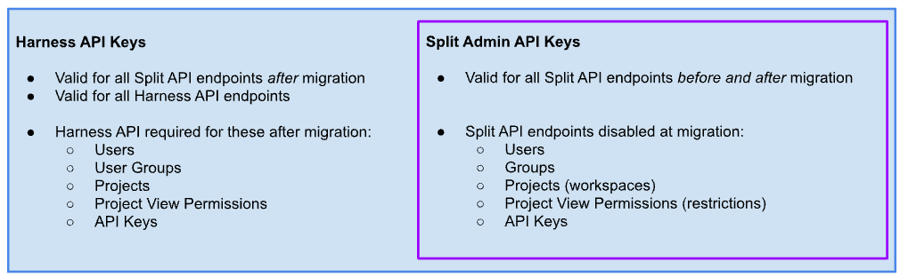

## Overview

This page provides an update to information originally shared via email on 2/21/25 regarding changes to Split Admin API Endpoints & Migration to Harness. Going forward, we will publish further updates here as needed. Our goal is to provide one place to look regarding this topic going forward.

> As of **2/26/25**: The “GET workspaces” API endpoint is no longer on the list of impacted API endpoints. We are retaining this endpoint to make this transition easier for you, our customer.    As of **3/11/25**: The Before and After Guide: API for Split Admins has been published.

## What’s Changing for the Split Admin API?

On your migration date, five Split Admin API endpoints will be disabled and replaced with new endpoints on the Harness platform. This is part of the migration of user, group, project, project view permissions, and Admin API key management to Harness’s standard platform features. These enhancements will give you greater account control and visibility.

:::tip Notes

- These changes to the Split Admin API do not affect your day-to-day feature flag evaluations within your applications.
- The Split Admin API is optional, so these changes only impact you if you use it to query administrative data or automate administrative tasks outside of the Split UI.
:::

## Am I impacted?

To help you determine if you need to take action, Harness took a sample of your Split Admin API usage between **January 24 – February 19**. We provided the results to all admins by email on Feb 21, 2025. We then made a change on Feb 26, 2025 to reduce the number of accounts impacted by 50%. These updated findings were sent to admins on Feb 27, 2025, and placed your account into one of four groups:

1. **No use of impacted API endpoints found**

We found no usage of the five impacted endpoints above in your account during the sample period. However, if you might only occasionally use these endpoints or were planning to start using them later, you may still be affected even though we did not detect such usage.

2. **Use limited to GET workspaces endpoint found - no longer an impacted endpoint**

Since the `GET` workspaces endpoint is no longer impacted and it was the only such endpoint we observed between **January 24 - February 19**, you no longer have an issue to resolve and your advice as of 2/27/25 is as follows:

We found no usage of the five impacted endpoints above in your account during the sample period. However, if you might only occasionally use these endpoints or were planning to start using them later, you may still be affected even though we did not detect such usage.

3. **Use of to-be-disabled GET (read only) endpoints found**

We found some usage of these five endpoints in your account between **January 24 – February 19**. The API calls observed were all `GET` operations. `GET` calls are used to retrieve information from Split but not make administrative changes.

If you do not update your API interactions before your migration date, any external systems that rely on these endpoints (such as dashboards or reports) will no longer be able to retrieve data.

Additionally, if you occasionally use Split Admin API operations to make administrative changes—but did not do so during the observed period—your ability to automate those changes will be disrupted if updates are not made.

4. **Use of endpoints that make changes found**

We found significant usage of these five endpoints in your account between **January 24 – February 19**. The API calls observed included both:

* **Information Retrieval**: Queries retrieving data from Split.
* **Administrative Actions**: Operations making changes to your Split account.

If you do not update your API interactions before your migration date, you may experience:

* **Loss of Data Access**: External systems (e.g., dashboards) relying on these endpoints will no longer be able to retrieve data.
* **Disruptions to Automated Updates**: Any automated processes that modify users, groups, projects, or permissions will need to be updated to ensure continued functionality.

## What to Do If Action Is Required

If your team has automation scripts that rely on any of these five Split Admin API endpoints, you’ll need to:

1. Update and test your automation to use the new Harness API endpoints before your migration date.
1. Be ready to switch to the updated code on your migration day.

The impacted endpoints:

* `/apiKeys` (Admin API Keys only—SDK API Key management remains unchanged)
* `/groups`
* `/restrictions` (Project View Permissions)
* `/users`
* `/workspaces` 

  * `GET` workspaces will remain available after migration
  * `POST`, `PATCH`, and `DELETE` workspaces will be disabled upon migration

## How We’ll Support You

* Admin access to your new Harness account will be provided by [DATE TBD].
* We released Before and After Guide: API for Split Admins on March 11th, 2025 to help you update your automation code. This [Postman collection](https://github.com/splitio/public-api-postman) contains both working examples and background information to help you focus on just the endpoints and actions you need to learn.
* Your CSM can provide a list of the specific endpoints and HTTP methods (`GET`, `PUT`, `POST`, `PATCH`, `DELETE`) used. However, they will not have access to request contents or know which of your scripts is calling them.

## FAQs

### Do my developers need to update Split SDKs in our applications?

No, this change does not affect the APIs used by Split SDKs or customer-deployed components like the Split Proxy, Synchronizer, or Evaluator.

### Are all Split Admin APIs moving to Harness?

No, only the above Admin API endpoints related to Authentication and Authorization are migrating.

### Do I need to share this with all developers in my organization?

No, only with teammates who write or maintain admin automation code for managing users, groups, projects, and permissions in Split.

### Will I need a Harness API Key to use the new Harness endpoints?

Yes. This diagram shows which endpoints would need a Harness API Key. 

### Where can I learn more?

Start with the [Before and After Guide: API for Split Admins](/docs/feature-management-experimentation/split-to-harness/api-for-split-admins). Also have a look at the [Split to Harness Migration Overview](/docs/feature-management-experimentation/split-to-harness) and [30 Seconds to Confidence: How Your Migration Will Work](/docs/feature-management-experimentation/split-to-harness/how-it-works). 

Still have questions? Contact your CSM or support@split.io.