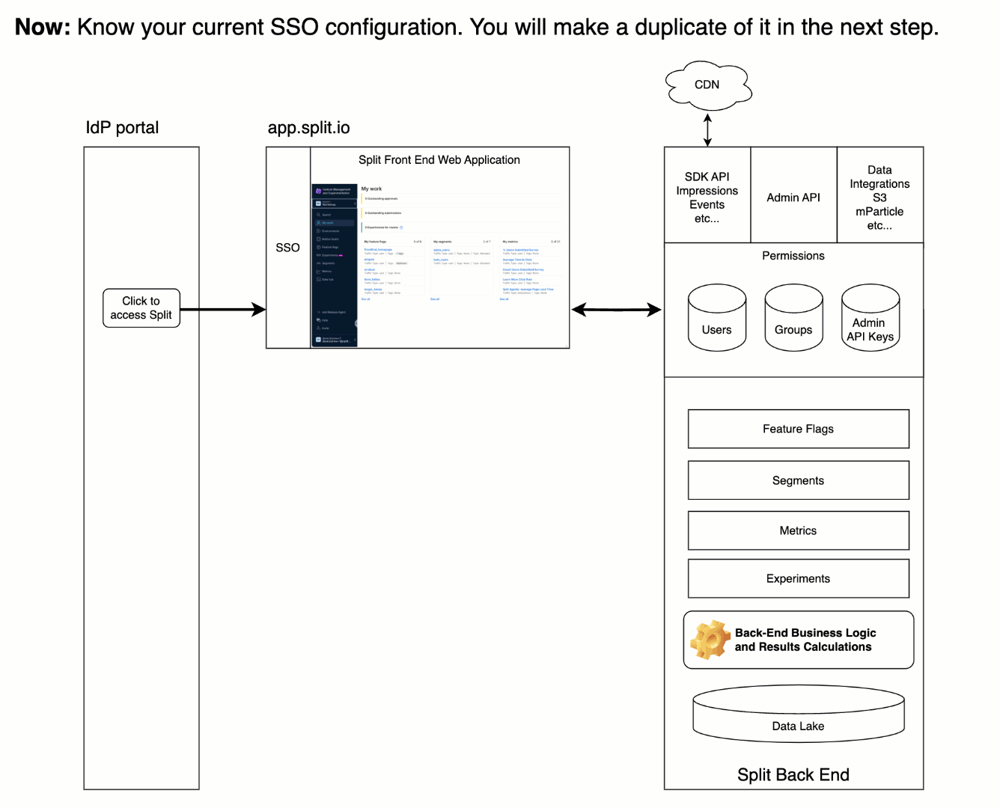

## Overview

The most important promise we made to you, our customer, in November 2024, when we announced plans to integrate Split into the Harness platform, was simple yet critical: **There will be no downtime for your applications**.

Your success drives ours. You depend on Split to control and measure your customer experience and maintain service stability—24/7. That’s why this migration was never going to be a high-stakes, late-night event. We would never ask you to take your applications offline, not even for a moment.

It all came down to a single question we posed to our product and engineering teams:

> Can you design a migration process that leverages feature management to rigorously validate in staging, conduct controlled testing in production, and seamlessly roll out to thousands of accounts—without ever causing downtime?

The answer, without hesitation, was **Yes**.

Psychological safety isn’t a small thing. In a transition like this, it’s everything. So, take 30 seconds to watch the animation below. It outlines exactly how these migrations will proceed in the coming weeks—powered by feature flags and real-time data. We’ll validate every step, move forward safely, and if needed, instantly revert any account to a known-good state.

This is how a migration should be done. And this is how we’re doing it for you. 