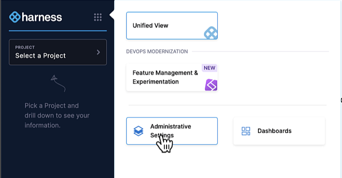

## Overview

This page walks you through inviting an IT colleague to your new Harness account.

## Create an Invitation

To create an invitation link:

1. Log into your Harness account.
1. Click **Account Settings**.
1. Scroll down to **Access Control** and click **Users**.
1. Click **+ New User** at the top left of the screen. The **New User(s)** dialog will appear.
1. Type in the email address of your IT colleague in the first field.
1. Click the **+** icon with your colleague’s email address that appears below the field.

   

1. Click **Select user Group(s)** in the next field.
1. Check the box next to **All FME Admins**.

   

1. Click the **Apply Selected** button.

   

1. Disregard the **Role Bindings** field and the `“There are no roles assigned to this User”` message it displays. Your new user will inherit role bindings from the group you selected above.
1. Click **Apply** to finish inviting the user.

   

## Colleague Accepts the Invite

Your colleague will receive an email from Harness `<noreply@harness.io>` similar to this one:

When they click **Accept Invite**, they are taken to this screen to enter their preferred display name and email, and to set their initial password:

## Colleague Navigates to Administrative Settings

After accepting the invite, your IT colleague should click the nine-box icon to the right of the Harness logo and then click the **Administrative Settings** button. They should not click the **Feature Management & Experimentation** button.

From here, proceed to the instructions in Before and After Guide: SSO for Split Admins.

