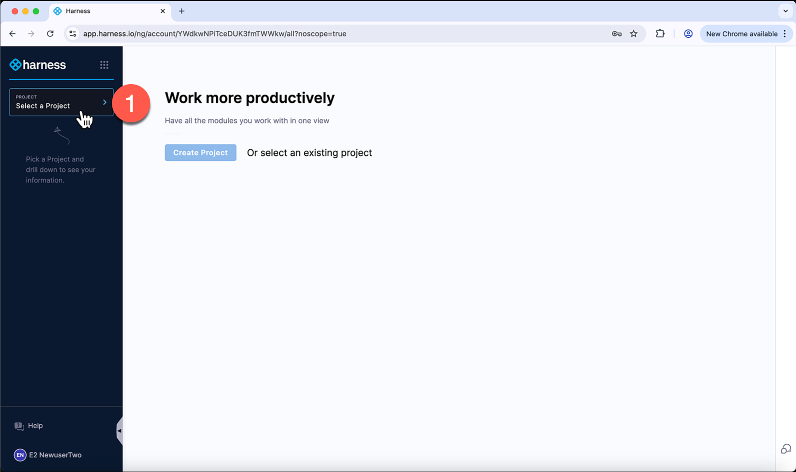
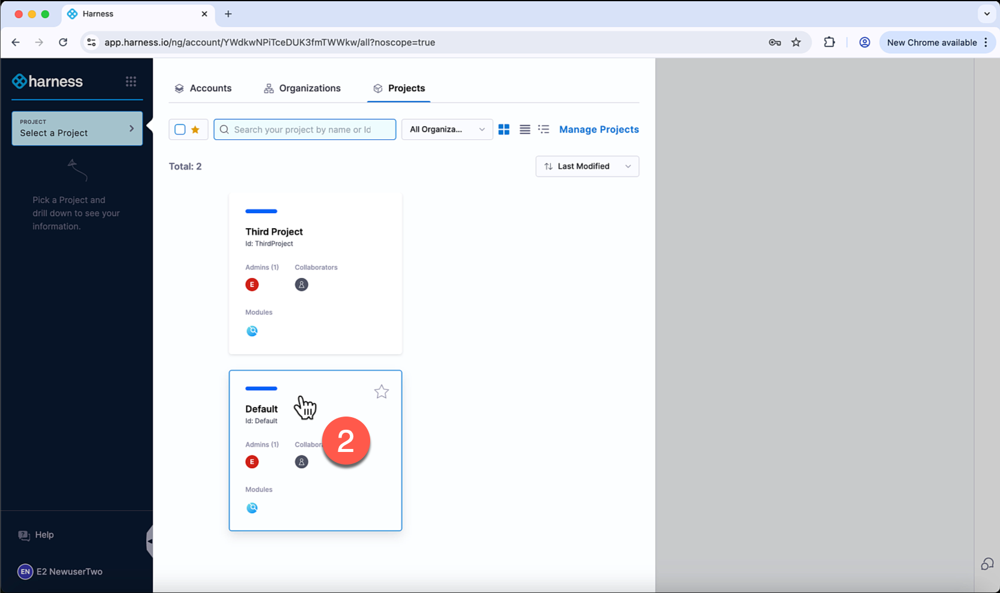
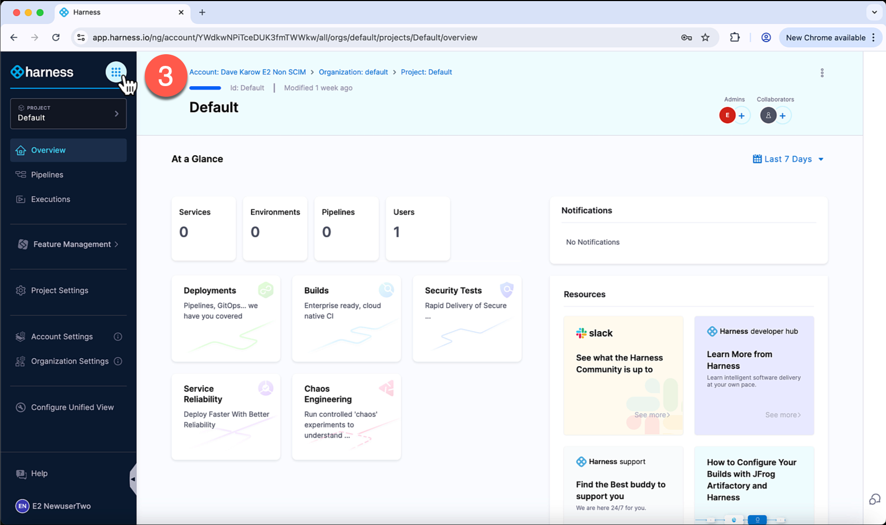
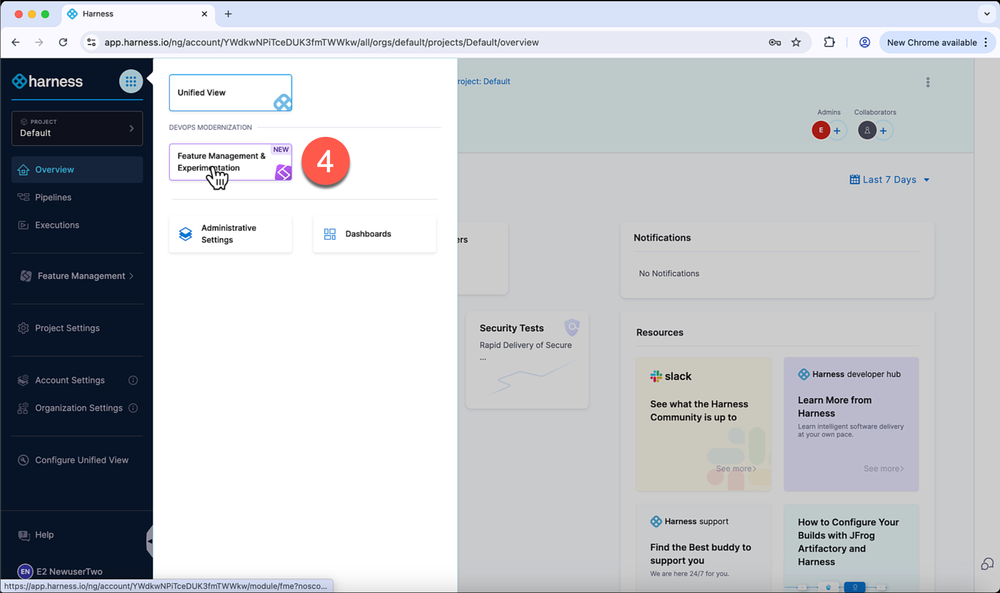
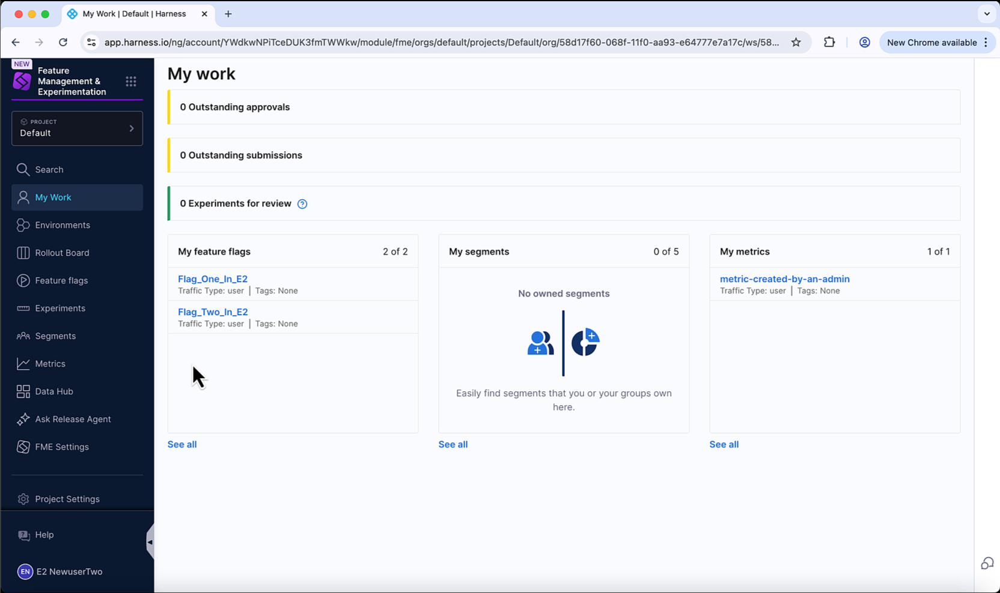
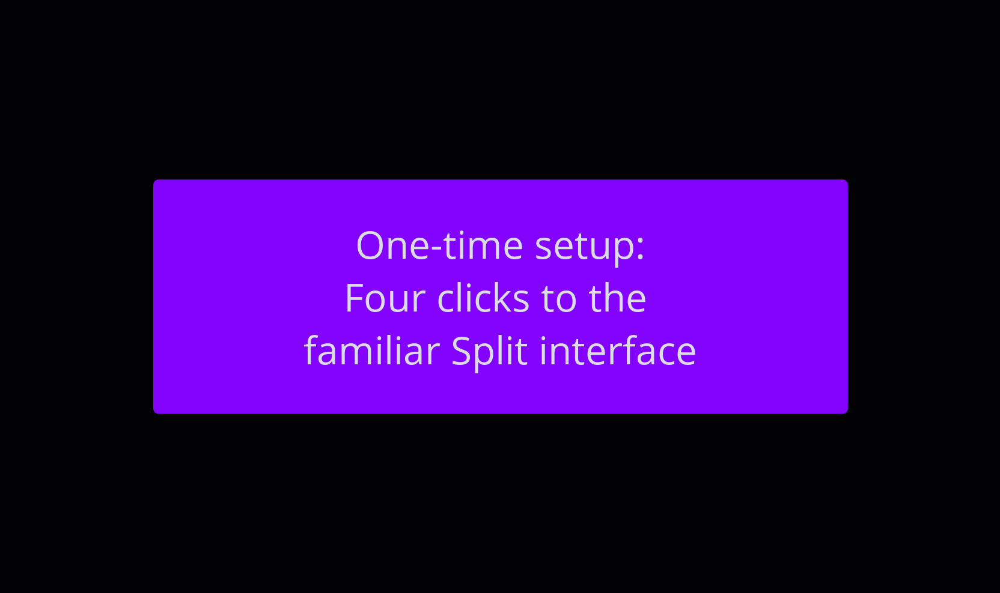

## Setup

Follow these one-time steps after your account has been migrated to Feature Management & Experimentation (FME) on Harness.

In order to set your account to display the left navigation you are familiar with from Split:

### Step 1: Click Select A Project

### Step 2: Choose A Project (Previously known as workspaces)

### Step 3: Click the Grid Icon (Next to the Harness logo)

### Step 4: Click Feature Management & Experimentation

That's it! This is where you will land directly on all future logins.

## Animation of the above

Here is an animation showing the above steps and the behavior on your next login:

