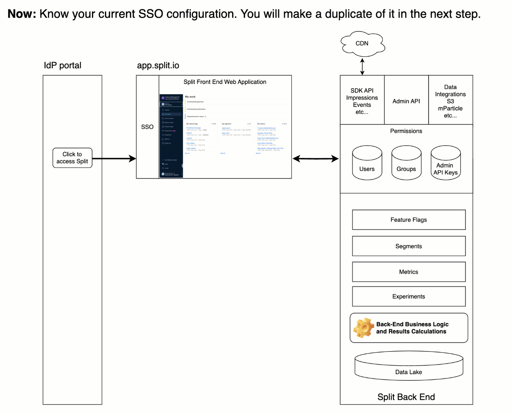
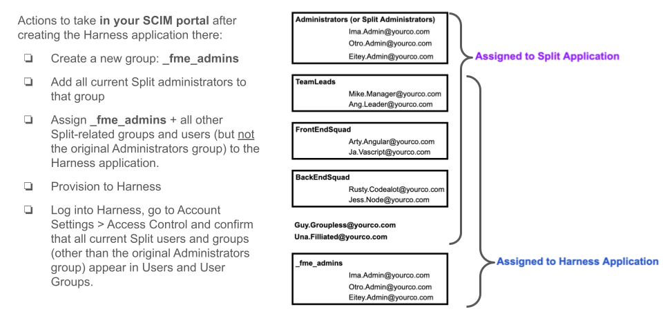
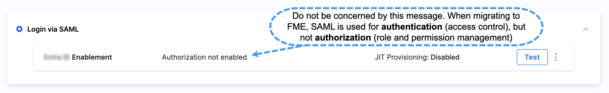

## Overview

The work in this guide (which is unrelated to RBAC) must be completed and tested before your migration date. The migration process will assign the appropriate role-based access control settings to users and objects for you. You can disregard any mention of assigning roles to users in the Harness SSO documentation.  

## Prerequisites

### For a New Harness Account

If you are migrating into a new Harness account, you will create a new SSO configuration for Harness that is identical to your current Split configuration. If you use SCIM, there is one exception to this rule: your Split Administrators will be in a new, differently named group. In the end, your goal is to ensure that you grant access to the FME module in `app.harness.io` for the same users and groups that exist in `app.split.io` today.

### For an Existing Harness Account

If you are migrating into an existing Harness account, your tasks are limited to assigning current Split users access to the Harness application and (if using SCIM) assigning Split-related groups to Harness as well.

* For SSO-only configurations: grant access to Harness for your existing Split users. The migration takes care of the rest.
* For SSO with SCIM configurations: perform the steps beginning with **Create**, **Populate**, and **Push the All FME Admins Group** below for [Okta](#scim-with-okta) or [Entra ID](#scim-with-entra-id).

## Before and After

Watch the 30-second animation below.  Note the order of steps and the way your users will access the application over time. 

:::tip Notes
- If you have portal "tiles" users click on to access applications: Consider hiding the `app.harness.io` tile ahead of your migration day, or labeling it to indicate your migration date. Users who access `app.harness.io` before migration will see either an "empty" portal without the Split (FME) application present (SCIM use case), or an error (SSO without SCIM use case).
- To preserve the instant revert capability seen in the animation above, do not disable your SSO configuration to `app.split.io` at the moment of migration. Users who attempt to use the `app.split.io` SSO after migration will be shown a message pointing them to `app.harness.io`, so it's OK to leave both SSO configurations active for some time. 
:::

## Tasks to Perform

### If Your Split Account Uses SSO Only

1. Log into Harness and your IdP in separate windows to add a new SSO application for app.harness.io to your IdP. See Configure SSO below.
1. Assign all of your current Split users to the SSO application for app.harness.io.
1. Notify your Harness CSM or support@split.io when the SSO steps are complete.

:::info SSO without SCIM
Do not create users or groups in `app.harness.io` ahead of time. The migration process will create users and groups in `app.harness.io` for you on migration day.
::: 

### If Your Split Account Uses SSO + SCIM

1. Log into Harness and your IdP in separate windows to add a new SSO application for app.harness.io to your IdP. See Configure SSO below.
1. Configure SCIM to provision users and groups in app.harness.io. See Configure SCIM below.
1. Notify your Harness CSM or support@split.io when the SSO and SCIM steps are complete.

:::info SSO + SCIM
Be sure to configure SCIM to continually sync changes for ALL users and groups to `app.harness.io` before migration day. If your account is configured for SCIM, the migration process will not create users and groups in `app.harness.io` for you other than the **All FME Admins** group containing your Split administrators. 

You must ensure that all of your Split users and groups are synced (and kept continually updated) before migration day. We lead you through the process below, but here is a single image you can print out as a checklist:

The group name `_fme_admins` is required.  You may change the name after confirming the first provisioning sync has established the immutable Group ID of `_fme_admins` on the Harness side.
:::

## Configure SSO

### SSO with Okta

Follow the directions and tips below instead of using web search to jump into the Harness documentation.

:::info SSO is configured in Account Settings
Be sure to start in **Account Settings** (not **Organization Settings** or **Project Settings**) in Harness.
:::

1. Create an [app integration in Okta](/docs/platform/authentication/single-sign-on-saml/#create-app-integration-in-okta) (opens a new tab).
1. Keep the [tips](#sso-with-okta-tips) below handy as you go through the steps.
1. Perform all steps up to and including: [Enable and test SSO with Okta](/docs/platform/authentication/single-sign-on-saml/#enable-and-test-sso-with-okta).
1. Do not perform the last step: [SAML authorization with Okta](/docs/platform/authentication/single-sign-on-saml/#saml-authorization-with-okta).

### SSO with Okta Tips

For the steps in [Create app integration in Okta](/docs/platform/authentication/single-sign-on-saml/#create-app-integration-in-okta):

* Step 8: In the **Name ID** format, select `EmailAddress`. Do not leave it as `Unspecified`.
* Step 9: For the **Application username**, accept default of **Okta username**.
* Step 10: Skip the **Attribute Statements** step.
* Step 11: Skip the **Group Attribute Statements** step.

For the steps in [Okta SAML metadata file](/docs/platform/authentication/single-sign-on-saml/#okta-saml-metadata-file):

* Identity Provider metadata XML: In Split, this XML was entered via copy/paste.
  
  * In Harness, you will download and upload a file.
  * The [instructions](/docs/platform/authentication/single-sign-on-saml/#okta-saml-metadata-file) in the Harness documentation above are straight-forward, and include a screenshot to help you find the download operation.

For the steps in SAML Authorization with Okta:

* Do not perform any of the steps in SAML Authorization with Okta. 

  * Group linking is not possible without SCIM in Split, so there is no reason to configure SAML Authorization in Harness as part of your migration.
  * Do not attempt to configure this setting prior to migrating from Split to Harness. Contact your Harness representative or support@split.io if you have questions.

### SSO with Okta FAQs

#### I see "Authorization not enabled" in Account Settings > Authentication > Login via SAML. Have I missed a step?

This is expected, and OK. When migrating to FME, SAML is used for authentication (access control), but not authorization (role and permission management).

#### Should I create a SAML app in Okta as the Harness documentation states, or use the pre-built Okta Integration Network (OIN) app for Harness?

Create the SAML app on Okta as shown above. The OIN Harness app is not recommended.

If your account uses SSO only, you are finished with SSO configuration. Notify your CSM or support@split.io. 

If your account uses SSO + SCIM, proceed to [SCIM with Okta](#scim-with-okta).

### SSO with Microsoft Entra ID

Follow the specific instructions below, rather than referencing the Harness docs. 

:::info
If you have searched or browsed your way to the Harness documentation for setting up SSO, disregard the [Users in over 150 groups](/docs/platform/authentication/single-sign-on-saml/#users-in-over-150-groups) section there. Follow the steps below instead.
:::

These instructions reference the `entra.microsoft.com` portal, also known as the “The new Microsoft Entra admin center"—if you are using an older interface, either adopt the instructions below or reach out to support@split.io for guidance.

#### Start in Entra Admin

1. In the left navigation, expand **Applications** and choose **Enterprise Applications**.
1. Click on **+ New Application**.
1. Type "Harness" in the search box.
1. Click on the Harness tile. A dialog appears on the right.
1. Edit the default name of “Harness” if you prefer, to add detail (optional).
1. Click **Create** in the dialog. The application is created and the screen refreshes to show Overview.
1. Click **Single Sign-on** under **Manage**.
1. Select **SAML**. The **Set up Single Sign-On with SAML** screen appears.
1. Click **Edit** in box number (1). The **Basic SAML Configuration** dialog appears.
1. The **Identifier (Entity ID)** should already be populated with "app.harness.io" (add it if not).
1. Leaving this dialog open, switch to another tab open to your Harness account.

#### Continue to Your Harness Account

1. Choose **Account Settings**.
1. Scroll down to **Security and Governance**.
1. Choose **Authentication**.
1. Scroll down and click **+ SAML Provider**.
1. The **Add SAML Provider** dialog appears.
1. Give it a descriptive name, such as “Entra ID SSO" or "Entra ID SSO for Migrated Split”.
1. Click the **Azure** button.
1. Copy the **ACS URL** that is provided in the first field.

#### Return to Entra Admin

1. In Entra ID, click the **add reply URL** link and paste the ACS URL you just copied from Harness into the field that appears.
1. Click **Save**.
1. Close the **Basic SAML Configuration** dialog by clicking the **x** icon on the top right.
1. You are prompted to test the single sign-on connection. Click **No, I'll test later**.
1. Scroll down to box (2) **Attributes & Claims**, click **Edit**.
1. Click on the **Unique User Identifier (Name ID)** entry. The **Manage claim** screen appears.
1. Confirm these fields have these settings:
   
   * **Name identifier format**: Email address
   * **Source**: Attribute
   * **Source attribute**: `user.userprincipalname`

1. Edit above fields if needed to match (it should be correct by default)
1. Click **Save** if you made changes. 
1. Click the **X** icon on the top right to exit the **Manage claim** screen.
1. Click the **X** icon on the top right to exit the **Attributes & Claims** screen. You are back on the **SAML-based Sign-on** screen.
1. Scroll down to box (3), **SAML Certificates**.
1. Find the **Federated Metadata XML** line and click **Download**.
1. Confirm that you have a new file in your downloads folder named `Harness.xml`. If you have repeated this step, be sure you know which file is the most recent. In that case, the file may have a name such as `Harness (1).xml`.

#### Return to Your Harness Account

You should still be on the **Add SAML Provider** dialog.

1. Click **Choose a file** where it says: **Upload the Identity Provider metadata XML downloaded from your app**. 
1. Browse to the `Harness.xml` file you downloaded from Entra ID.
1. Uncheck the **Enable Authorization** box. For more information, see the [FAQs](#sso-with-microsoft-entra-id-faqs) section.
1. Scroll down and click the **Add** button.

#### Test the configuration

Follow the steps under [Enable and test SSO with Azure](/docs/platform/authentication/single-sign-on-saml/#enable-and-test-sso-with-azure) in the Harness documentation.

### SSO with Microsoft Entra ID Tips

For SAML Authorization with Azure:

- Do not perform any of the steps in SAML Authorization with Azure. 

  * Group linking is not possible without SCIM in Split, so there is no reason to configure SAML Authorization in Harness as part of your migration.
  * Do not attempt to configure this setting prior to migrating from Split to Harness. Contact your Harness representative or support@split.io if you have questions.

### SSO with Microsoft Entra ID FAQs

#### I see "Authorization not enabled" in Account Settings > Authentication > Login via SAML. Have I missed a step?

A: This is expected, and OK. When migrating to FME, SAML is used for authentication (access control), but not authorization (role and permission management).

If your account uses SSO only, you are finished with SSO configuration. Notify your CSM or email support@split.io. 

If your account uses SSO + SCIM , proceed to [SCIM with Microsoft Entra ID](#scim-with-microsoft-entra-id).

## Configure SCIM

:::danger Update 4/04/25
Instructions for naming the All FME Admins group below were changed on 4/4/25.

To seamlessly inherit the All FME Admins group and its RBAC role, you will want to create a group on the SCIM side named after the group's permanent ID (`_fme_admins`), not its initial display name (`All FME Admins`).
:::

When you complete the work below to push all current Split users into Harness (either by assigning groups or individual users to the Harness app), these users will receive an email from the Harness platform with a subject of `You are successfully added to {account name} account`. 

That email will have a button that says `"ACCESS YOUR {ACCOUNT NAME} ACCOUNT"`. Your users are free to test that out, but before migration day, they will not find anything other than high-level Harness portal navigation. In other words, FME will not yet be there.

### SCIM with Okta

#### Create a Service Account, API Key and Token

* You will need a [Harness API key and unexpired token](/docs/platform/automation/api/add-and-manage-api-keys/) that has all **Users and User Groups** [permissions](/docs/platform/automation/api/api-permissions-reference/).
* We recommend using an API key associated with a [service account](/docs/platform/role-based-access-control/add-and-manage-service-account/).
* Make sure the service account has all **Users** and **User Groups** permissions.
* Save the token for use in the next step below.

#### Revisit Okta SSO Settings to Add and Authorize SCIM

In the SSO section above, you configured an Okta application for Harness. 

Now, we will revisit that configuration and add SCIM to it. 

Start by opening [Create an Okta app integration](/docs/platform/role-based-access-control/provision-users-with-okta-scim/#create-an-okta-app-integration) in the Harness documentation (opens in a new tab).

1. Skip ahead to Step 11: In your newly created app, select the **General** tab, and then under **App Settings**, select **Edit**.
1. Perform Steps 11 and 12.
1. Continue to the [Authorize the Okta integration](/docs/platform/role-based-access-control/provision-users-with-okta-scim/#authorize-the-okta-integration) procedure below Step 12.
1. Copy `YOUR_ACCOUNT_ID` from the URL of any page in your Harness account.
1. When prompted to enter **userName** as the unique identifier, enter **email** instead. While in most configurations, `userName` and `email` are the same, we want to avoid the risk of introducing a change between your Split unique identifier (which is `email`) and the Harness unique identifier.
1. Complete the remaining steps in **Authorize the Okta integration** using the API key token created above.

#### Create, Populate, and Push the All FME Admins Group

Your goal in configuring SCIM for Harness is to synchronize the same users and groups you have configured for Split but with one significant exception: Split Administrators. 

* In Split, the group containing your Split Administrators is called **Administrators**.
* When you are migrated to Harness, the group will be **All FME Admins** with an ID of `_fme_admins`.

The Split migration process has already placed all of your current Split Administrators into **All FME Admins** on the Harness side and granted this User Group the appropriate RBAC permissions.

To enforce ongoing management of that group from the Okta side, you must perform the following steps:

1. Create a new group in Okta named after the ID of the **All FME Admins** group: `_fme_admins`.
1. Add all of your current Split Administrators to the `_fme_admins` Okta group.
1. Assign and push the `_fme_admins` Okta group to the Harness application.

#### Assign Remaining Split-Assigned Groups to Harness

Once you have created the `new _fme_admins` group on the Okta side, the next step is to assign all current Split groups to Harness as well. Be very careful not to assign the "Administrators" group found in the Split application setup. You do not want that group pushed to Harness by Okta.  

Here are the steps:

1. Make a list of all groups currently assigned to the Split application in Okta.
1. Remove the "Administrators" group from that list (it was replaced by the `_fme_admins` group).
1. Assign the remaining groups in your list to the Harness application in Okta.
1. Push those groups to Harness.

#### Confirm Your Users and Groups Sync and Become SCIM-Managed

The last task is to verify that all Split users and groups now appear on the Harness side as SCIM-managed. Once you have done this, send an email to your Customer Success Manager or support@split.io with subject line, "SCIM Configured for [your account name]" so we know your account is ready for your migration day. 

If you run into any issues, let us know and we'll be happy to help!

### SCIM with Microsoft Entra ID

#### Create a Service Account, API Key and Token

* You will need a Harness API key and unexpired token that has all Users and User Groups permissions.
* We recommend using an API key associated with a service account
* Make sure the service account has all Users and User Groups permissions.
* Save the token for use in the next step below.

#### Follow Provisioning Steps in Harness Documentation

Start by referencing [Enable Microsoft Entra ID provisioning for Harness](/docs/platform/role-based-access-control/provision-users-and-groups-using-azure-ad-scim/#enable-microsoft-entra-id-provisioning-for-harness) (opens in a new tab).

Continue through to the steps up to, but not including the last line, where it says, `"After enabling Microsoft Entra ID provisioning for Harness, you must assign permissions to user groups in Harness."` The migration process has already assigned the appropriate permissions to the **All FME Admins** group. Wait to explore assigning roles to other User Groups until after your account has been migrated.

:::tip Disregard this sentence in the documentation
After enabling Microsoft Entra ID provisioning for Harness, you must assign permissions to user groups in Harness.
:::

#### Create, Populate, and Push the All FME Admins Group

Your goal in configuring SCIM for Harness is to synchronize the same users and groups you have configured for Split but with one significant exception: Split Administrators. 

* In Split, the group containing your Split Administrators is called **Administrators**.
* In Entra ID, the corresponding group is called `Split_Administrators` (or `split_administrators`).
* When you are migrated to Harness, the new group name will be **All FME Admins** initially on the Harness side, but you will want to create an Entra ID group named after the ID of that **All FME Admins** group: `_fme_admins`.

The Split migration process will place all of your current Split Administrators in a Harness User Group called **All FME Admins** and grant this User Group the appropriate RBAC permissions for you. All you need to do is configure SCIM to maintain that list (instead of `Split_Administrators`) going forward.  

Here are the steps:

1. Create a new group in Entra ID named after the ID of the **All FME Admins** group: `_fme_admins`.
1. Add all of your current Split Administrators to the `_fme_admins` Entra ID group.
1. Assign the `_fme_admins` Entra ID group to the Harness application.

#### Assign Remaining Split-Assigned Groups to Harness

Once you have created the new `_fme_admins` group on the Entra ID side, the next step is to assign all current Split groups to Harness as well. Be very careful not to assign the "Administrators" group found in the Split application setup. You do not want that group pushed to Harness by Entra ID.  

Here are the steps:

1. Make a list of all groups currently assigned to the Split application in Entra ID.
1. Remove the "Administrators" group from that list (it was replaced by the `_fme_admins` group).
1. Assign the remaining groups in your list to the Harness application in Entra ID.
1. Push those groups to Harness.

#### Confirm Your Users and Groups Sync and Become SCIM-Managed

The last task is to verify that all Split users and groups now appear on the Harness side as SCIM-managed. Once you have done this, send an email to your Customer Success Manager or support@split.io with subject line, "SCIM Configured for [your account name]" so we know your account is ready for your migration day. 

If you run into any issues, let us know and we'll be happy to help!

#### SSO or SCIM With Other

Need help configuring SSO or SCIM for an IdP not listed here? Drop us a line at support@split.io.
