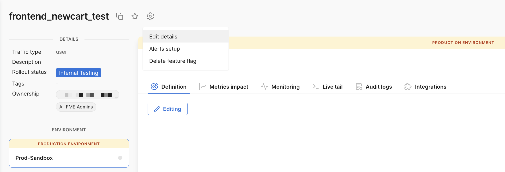
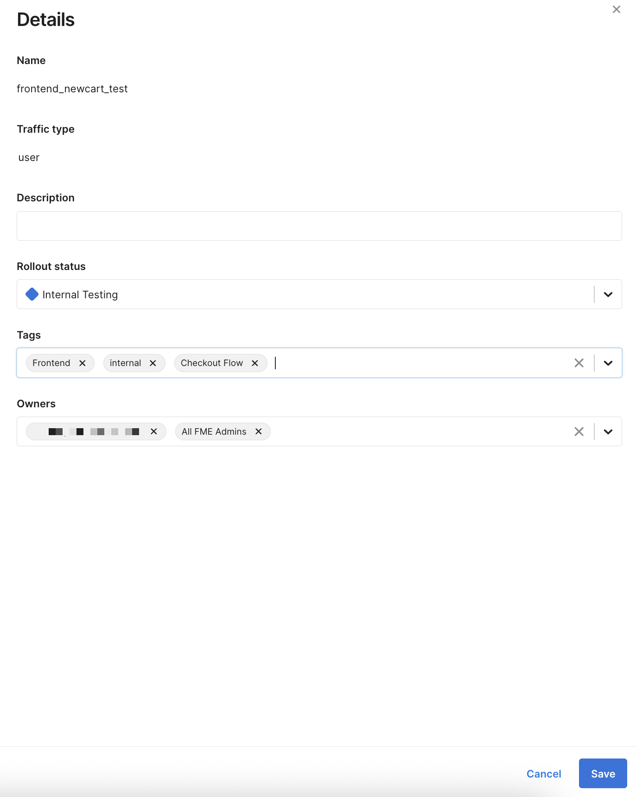
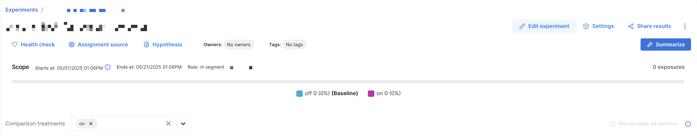
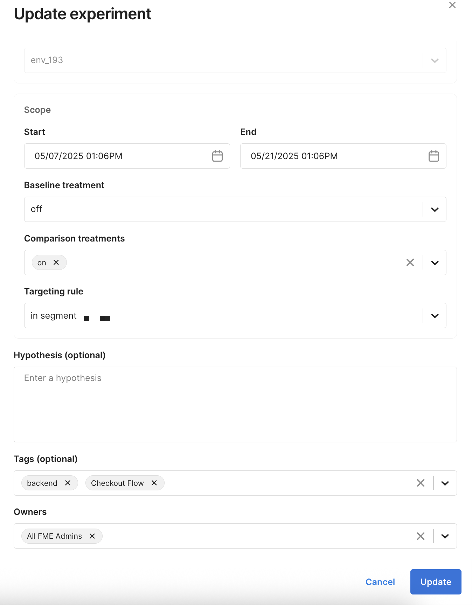
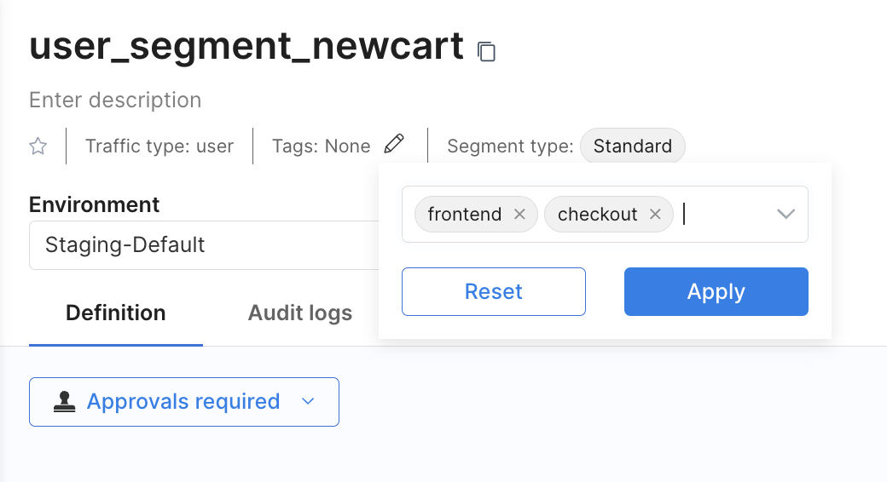
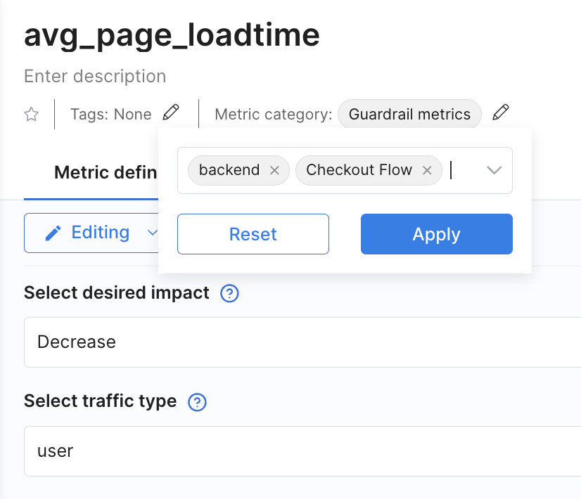
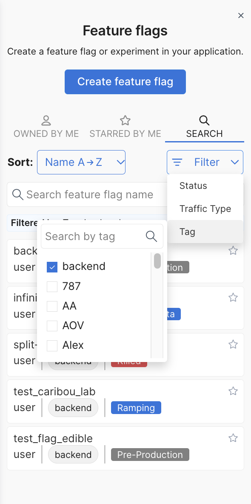
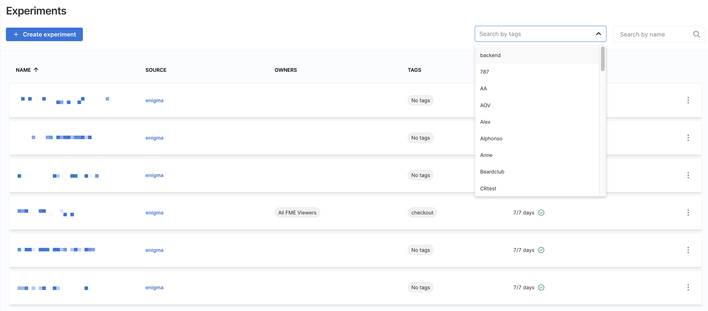
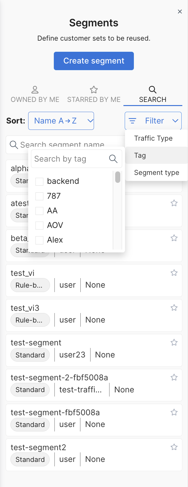
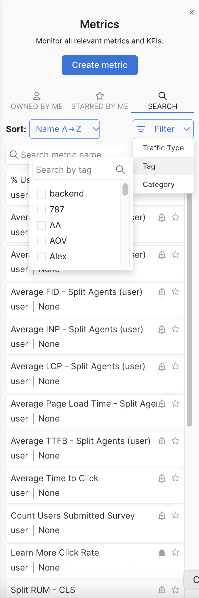

Use tags to organize and manage your [feature flags](/docs/feature-management-experimentation/getting-started/overview/create-a-feature-flag), [segments](/docs/feature-management-experimentation/feature-management/targeting/segments), [metrics](/docs/feature-management-experimentation/getting-started/overview/create-a-metric), and [experiments](/docs/feature-management-experimentation/getting-started/overview/create-an-experiment) in Harness FME. Tags can represent a particular team or feature release, e.g., _reporting team_, _front end_, or _geo search release_.

Harness recommends creating tags that are specific to your workflow. For example: 

| Category                         | Description                                                                                     | Example tags                                   |
|----------------------------------|-------------------------------------------------------------------------------------------------|------------------------------------------------|
| By team                          | Identify the responsible team.                                                                  | `front end`, `infrastructure`, `web`, `mobile` |
| By feature release               | Group flags associated with a specific release.                                                 | `reporting`, `new permissioning`, `contact database migration` |
| By feature flag type             | Categorize flags related to paywalls or whether they're permanent or temporary.                | `paywall`, `permanent`, `temporary`            |
| By experiment purpose or scope   | Group experiments related to onboarding, checkout flows, or other test initiatives.             | `onboarding`, `checkout`, `retention-test`     |

## Adding tags
 
You can add tags to feature flags, segments, metrics, and experiments. Tag names are case sensitive, and tags are shared across projects. The process is similar across all FME objects, but the UI controls differ slightly.

Allowed characters for tag names include the following:

* Letters: `a-z`, `A-Z`
* Numbers: `0-9`
* Separators: `-`, `_`, `:`

import Tabs from '@theme/Tabs';
import TabItem from '@theme/TabItem';

<Tabs queryString="fme-object-tags">
<TabItem value="ff" label="Feature Flags">

1. Navigate to the **Feature Flags** page in Harness FME and select a feature flag. 
1. Click the **Gear** icon next to the feature flag title and select **Edit details**. 
   
   

1. In the **Tags** field of the side panel, select an existing tag or enter a tag name. 

   

1. Click **Save**.

</TabItem>
<TabItem value="experiment" label="Experiments">

1. Navigate to the **Experiments** page in Harness FME and select an experiment. 
1. Click **Edit experiment** next to **Settings**. 
   
   

1. In the **Tags** field of the side panel, select an existing tag or enter a tag name. 

   

1. Click **Update**.

</TabItem>
<TabItem value="segment" label="Segments">

1. Navigate to the **Segments** page in Harness FME and select a segment. 
1. Click the **Edit** icon next to the **Tags** field under the segment name. 
1. Select an existing tag or enter a tag name. 

   

1. Click **Apply**.

</TabItem>
<TabItem value="metric" label="Metrics">

1. Navigate to the **Metrics** page in Harness FME and select a metric. 
1. Click the **Edit** icon next to the **Tags** field under the metric name. 
1. Select an existing tag or enter a tag name. 

   

1. Click **Apply**.

</TabItem>
</Tabs>

## Removing tags

You can remove tags from any feature flag, segment, metric, or experiment. 

<Tabs queryString="fme-object-tags">
<TabItem value="ff" label="Feature Flags">

1. Navigate to the **Feature Flags** page in Harness FME and select a feature flag. 
1. Click the **Gear** icon next to the feature flag title and select **Edit details**. 
   
   

1. In the **Tags** field of the side panel, delete individual tags or click **X** to remove all. 

   

1. Click **Save**.

</TabItem>
<TabItem value="experiment" label="Experiments">

1. Navigate to the **Experiments** page in Harness FME and select an experiment. 
1. Click **Edit experiment** next to **Settings**. 
   
   

1. In the **Tags** field of the side panel, delete individual tags or click **X** to remove all. 

   

1. Click **Update**.

</TabItem>
<TabItem value="segment" label="Segments">

1. Navigate to the **Segments** page in Harness FME and select a segment. 
1. Click the **Edit** icon next to the **Tags** field under the segment name. 
1. Delete individual tags. 

   

1. Click **Apply**.

</TabItem>
<TabItem value="metric" label="Metrics">

1. Navigate to the **Metrics** page in Harness FME and select a metric. 
1. Click the **Edit** icon next to the **Tags** field under the metric name. 
1. Delete individual tags. 

   

1. Click **Apply**.

</TabItem>
</Tabs>

## Filtering by tags
 
Use tags to narrow feature flags, segments, metrics, or experiments to only the objects that match one or more tags.

<Tabs queryString="fme-object-tags">
<TabItem value="ff" label="Feature Flags">

1. Navigate to the **Feature Flags** page in Harness FME. 
1. In the list view, click **Filter** under the **Search** tab and select **Tag**. 
   
   

1. Select one or more tags to filter the list. 

</TabItem>
<TabItem value="experiment" label="Experiments">

1. Navigate to the **Experiments** page in Harness FME. 
1. Click **Search by tags** and select one or more tags to filter the list.  
   
   

</TabItem>
<TabItem value="segment" label="Segments">

1. Navigate to the **Segments** page in Harness FME. 
1. In the list view, click **Filter** under the **Search** tab and select **Tags**. 

   

1. Select one ore more tags to filter the list. 

</TabItem>
<TabItem value="metric" label="Metrics">

1. Navigate to the **Metrics** page in Harness FME. 
1. In the list view, click **Filter** under the **Search** tab and select **Tags**. 

   

1. Select one ore more tags to filter the list. 

</TabItem>
</Tabs>