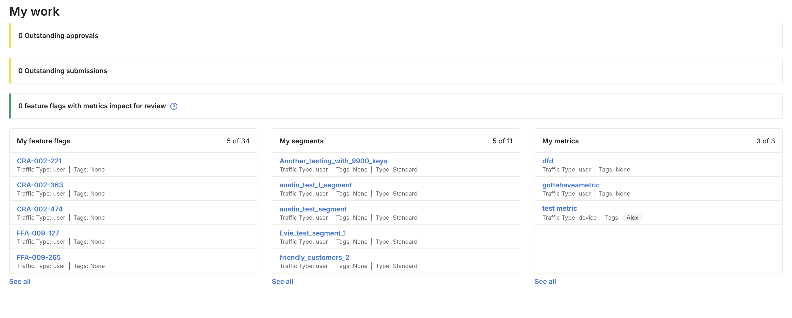
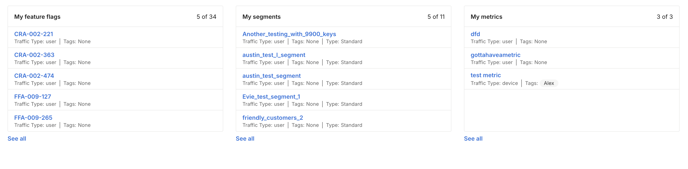

## Overview

The My work page provides you a high-level view of any outstanding tasks to take care of within a feature flag as well as a view of any feature flags, segments, and metrics that you own.

## Outstanding approvals and submissions

This section highlights feature flags and segments across all environments in your project that require your approval or were submitted by you. 

You can click into any of these pending changes:

* Outstanding approvals: Allows you to approve or reject.
* Outstanding submissions: Allows you to withdraw the change if you're the submitter and no longer want this change to go forward.

## Feature flags with metrics for review

This section highlights any experimental results that are ready for review. If the feature flag version was created within the last 45 days, a feature flag using percentage-based rollout displays here once the review period is reached.

## My feature flags, segments, and metrics

If you own any feature flags, segments, or metrics, they appear on this section for quick navigation links to see the objects you own.

