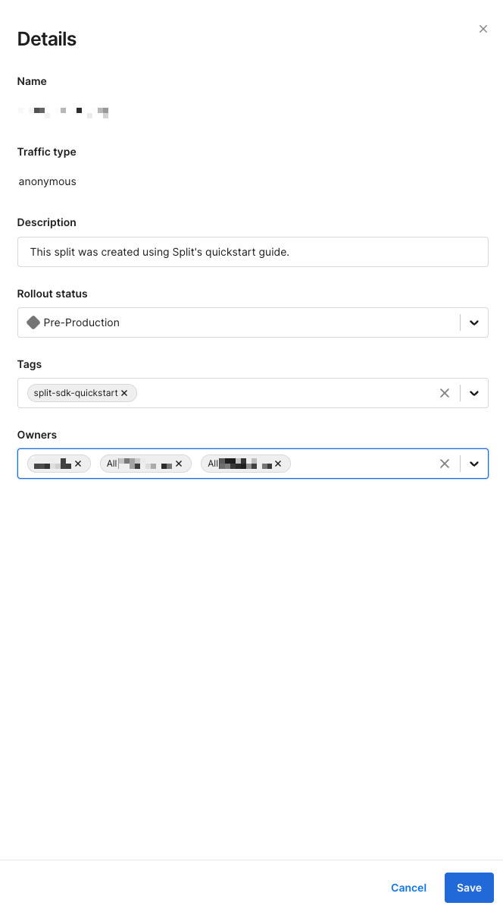
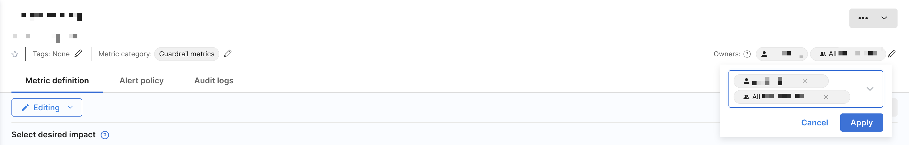

## Overview

In addition to [tags](/docs/feature-management-experimentation/management-and-administration/tags/), owners allow you to organize and manage feature flags, segments, and metrics across the Split user interface. 

You can use owners to:

- Filter feature flags, segments, and metrics in the browse panes to those **owned by me**.
- Restrict editing of a specific feature flag, segment, or metric to its owners by setting **Restrict who can edit** to `Owners`:

  * For feature flags, click on the **Gear** icon and click **Edit details**. In the Owners section, add groups or individuals, then click **Save**.
  * For segments and metrics, navigate to the **Owners** section on the top right corner or click the **Editing** dropdown on the **Definition** tab. Select **Restrict who can edit** and add groups or individuals in the **Editors** field, then click **Apply**.

:::tip
Ownership alone is for organization and filtering purposes. It does not grant edit rights. To give owners edit rights, select **Restrict who can edit** to owners in one of the above locations. Owners will still be able to edit if they already have broader environment-level rights.
:::

When you add owners and set **Restrict who can edit** to owners, those owners are automatically included as editors for that specific flag in all environments. This helps you simplify permissions while preventing others without environment- or project-level edit rights from making changes.

| Scenario                                 | Owner has edit rights?            |
|------------------------------------------|------------------------------------|
| Owner only, **Anyone can edit**          | ❌ No (organizational only)         |
| Owner only, **Restrict who can edit** (Owners)   | ✅ Yes for that object in all environments |
| Owner + environment-level editor rights  | ✅ Yes through environment permissions   |

Harness recommends using groups where possible as owners. When you onboard new teammates, their Split instance includes several feature flags owned by their team.

## Adding or removing owners

:::info
Only current owners can change owners for a feature flag, segment, or metric.
:::

To change the owner for a feature flag:

1. Click the Gear icon next to the feature flag name and select **Edit details**. The **Details** panel appears.
   
   

1. In the **Owners** field, either begin entering to select an existing group or user or use the down arrow to display a list of owners.
1. Select the desired owners and click **Save**.

To change the owner for a segment or a metric:

1. Navigate to a segment or metric.
1. Use the **Owners** field in the top-right or go to the **Definition** tab and click the **Editing** pencil icon.
   
   

1. Select **Restrict who can edit** and add groups or users in the **Owners** field.
1. Click **Apply**.

## Filter by

Owners are useful when you locate those items in the **Owned by me** list. To find items in this list, in the feature flag view list, click **Owned by me**. 

The feature flags, segments, and metrics that you own directly or indirectly as part of a group display.