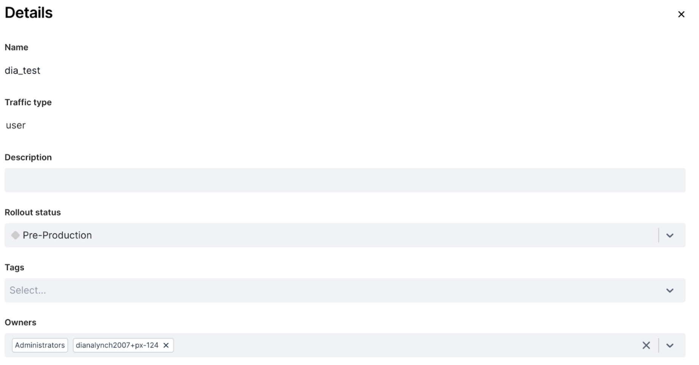
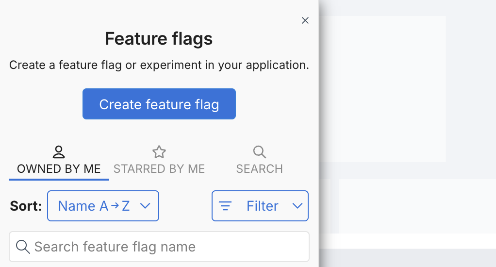

## Overview

In addition to [tags](/docs/feature-management-experimentation/management-and-administration/tags/), use owners to organize and manage feature flags, segments, and metrics across the Split user interface. 

Use owners to isolate feature flags, segments, and metrics in the browse panes to those owned by me and simplify permissions by providing owners with edit rights for a single feature flag across all environments by toggling permissions On. When toggled on, permissions inherit owners as editors.

Harness recommends using groups where possible as owners. When you onboard new teammates, their Split instance includes several feature flags owned by their team.

## Adding or removing owners

:::info
Only current owners can change owners for a feature flag, segment, or metric.
:::

To change the owner for a feature flag, segment, or metric:

1. Click the Gear icon next to the feature flag name and select **Edit details**. The **Details** panel appears.
   
   

1. In the **Owners** field, either begin entering to select an existing group or user or use the down arrow to display a list of owners.
1. Select the desired owners and click **Save**.

## Filter by

Owners are useful when you locate those items in the **Owned by me** list. To find items in this list, in the feature flag view list, click **Owned by me**. 

The feature flags, segments, and metrics that you own directly or indirectly as part of a group display.