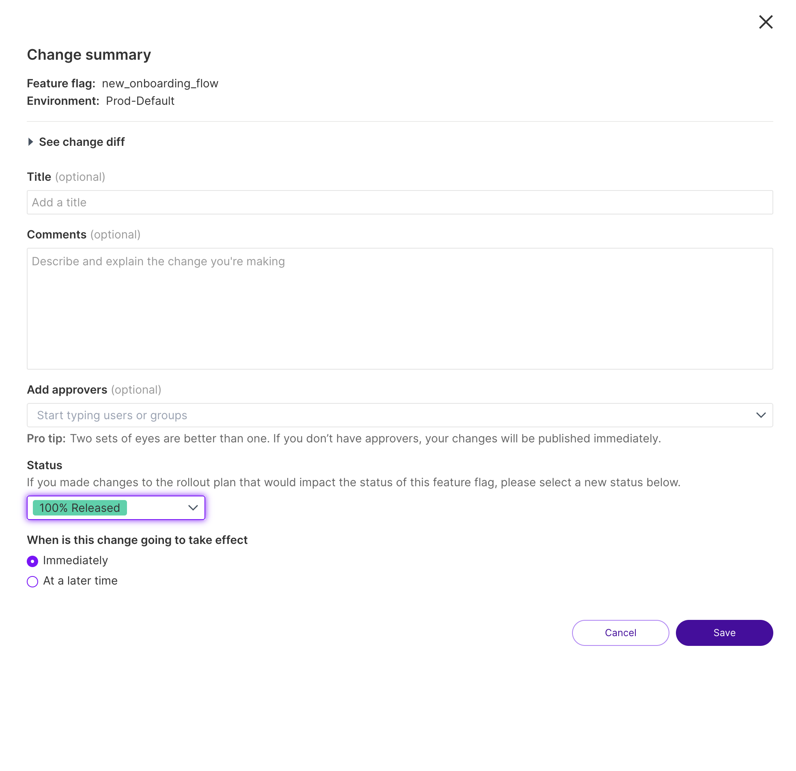

## Overview

You can assign a status to each feature flag when creating or updating targeting rules. Statuses provide a way for teams to indicate which stage of a release or rollout a feature is in at any given moment, and as a way for teammates to filter their feature flags to see only the ones that are in a particular stage of the internal release process.

## Change the status of a feature flag

When you review the Change summary page for saving or submitting a change for a feature flag definition, you can change the status of a particular flag. 

To change a status:

1. After submitting a change to the rollout plan of a feature flag, on the Change summary page, in the Status field, select the desired status, e.g., Internal testing.

    :::tip
    If you create a new feature flag, the default is `Pre-production`. For any existing flag, it keeps its existing status.
    :::

   

1. To decide when this change takes effect selection, you can either select:

   * Immediately: The change takes effect once you save change
   * At a later time: The change takes effect on a specified date and time

1. After you make a selection, click **Save** to save your changes.

If you want to change the status of that feature flag without changing the rollout plan, you can mark it as permanent or removed from the code, or to assign a status if you forgot to do so when you changed your targeting rules. To change the status, do the following:

1. Select the feature flag you want to assign a new status to.
1. In the **Details** section, click the gear icon and select **Edit details**. The Details panel appears.

   

1. In the **Rollout status** field, click the down arrow and select a new status. 
1. Click the **Save** button to save your changes.

## Display and filter your statuses

Once you assign statuses to your feature flags, you can then display and filter them to view the ones within the browse area that are relevant to you. To display and filter your flags, do the following:

1. From the left navigation, click **Feature flags**. A list of feature flags and their associated status badges appear.

1. From the feature flag list view, select **Filter** and then **Status**. The list of filters displays.

   

1. Select the desired statuses that you want to view. The selected statuses display in the browse area.

## Status definitions

The following statuses are available:

* **Pre-Production** (grey): Indicates feature flags where code for the feature isn’t pushed to production.

* **0% in Production** (grey): Indicates feature flags where code for the feature is pushed to prod but not turned on for anyone.

* **Killed** (red): Indicates feature flags that are moved to the default treatment due to an issue or bug.

* **Internal Testing** (blue): Indicates feature flags that have only been turned on for users that are employees or contractors.

* **External Beta** (blue): Indicates feature flags that have been turned on for a few external beta customers that have been pre-selected or chosen for early access to a feature.

* **Ramping** (blue): Indicates feature flags that are turned on for a small percentage of users to make sure no performance issues or larger issues come up.

* **Experimenting** (blue): Indicates feature flags that have are ramped for max power in an experiment to get results as quickly as possible.

* **100% Released** (green): Indicates feature flags that have been moved to be fully on for all customers.

* **Removed from Code** (white): Indicates feature flags that have been removed from the codebase.

* **Permanent** (white): Indicates feature flags that are set to be permanent circuit breakers in the application.