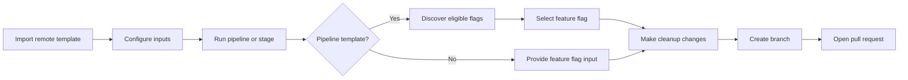

<CTABanner
  buttonText="Explore the Beta"
  title="Remote Feature Flag Cleanup Templates for Harness FME are in beta!"
  tagline="Try remote cleanup templates for automated feature flag cleanup workflows. Share feedback with your CSM or account manager."
  link="https://developer.harness.io/docs/feature-management-experimentation/fme-support"
  closable={true}
  target="_self"
/>

Remote Feature Flag Cleanup templates help you identify and remove stale <Tooltip id="fme.openfeature.feature-flag">feature flags</Tooltip> from your codebase. These remote templates automate feature flag cleanup by generating pull requests (PRs) with the proposed code changes. The templates are maintained in the [Harness Community GitHub repository](https://github.com/harness-community/solutions-architecture/tree/main/fme).

| Type | Use case |
|---|---|
| **Pipeline** | Use when you want automated discovery, flag selection, and cleanup generation. |
| **Stage** | Use when you already know which feature flag should be removed and only need the cleanup workflow. |

Each execution generates a single pull request for a single feature flag cleanup.



## Import a template

The following templates are available for use in your [Harness pipelines](/docs/feature-management-experimentation/pipelines/).

| Template | Path |
|---|---|
| Pipeline (Harness Code) | [`fme/templates/Pipeline/Feature_Flag_Cleanup/v1.yaml`](https://github.com/harness-community/solutions-architecture/blob/main/fme/templates/Pipeline/Feature_Flag_Cleanup/v1.yaml) |
| Pipeline (GitHub) | [`fme/templates/Pipeline/Feature_Flag_Cleanup_Github/v1.yaml`](https://github.com/harness-community/solutions-architecture/blob/main/fme/templates/Pipeline/Feature_Flag_Cleanup_Github/v1.yaml) |
| Stage (Harness Code) | [`fme/templates/Stage/Feature_Flag_Cleanup/v1.yaml`](https://github.com/harness-community/solutions-architecture/blob/main/fme/templates/Stage/Feature_Flag_Cleanup/v1.yaml) |
| Stage (GitHub) | [`fme/templates/Stage/Feature_Flag_Cleanup_Github/v1.yaml`](https://github.com/harness-community/solutions-architecture/blob/main/fme/templates/Stage/Feature_Flag_Cleanup_Github/v1.yaml) |

To import a remote template: 

1. From the Harness FME navigation menu, navigate to **Project Settings** > **Templates**.
1. Click **New Template**.
1. Select either **Pipeline** or **Stage** depending on the template type you want to import.
1. Enter a name for the template.
1. Optionally, include a description and any tags for the template.
1. Add a version label for the template.
1. Optionally, upload a logo for the template.
1. Select where you'd like to save the template to: `Project`, `Organization`, or `Account`.
1. Select **Remote** under `How do you want to set up your template?`.
1. Select **Third-party Git provider** and specify a [Git connector](/docs/category/code-repo-connectors/), [repository, Git branch, and the YAML path](/docs/platform/templates/create-a-remote-pipeline-template/#create-a-remote-pipeline-template). 
1. Click **Start**.
1. Save the template and reference it in your Harness pipeline.

## Required inputs

The following runtime inputs are required when configuring the remote templates:

<details>
<summary>Pipeline Template (Harness Code)</summary>

| Input | Description |
|---|---|
| `HARNESS_API_TOKEN` | API token used to access the Harness Code repository. |
| `REPO_NAME` | Name of the repository that contains the feature flag code references. |
| `FME_ADMIN_APIKEY` | FME Admin API key used to retrieve feature flag metadata. |
| `FME_PROJECT_ID` | FME project identifier used during discovery. |
| `FEATURE_FLAG_SELECTION_CRITERIA` | Natural-language criteria used to identify cleanup candidates. |
| `LLM_AUTH_TOKEN` | Authentication token used by the cleanup code agent. |

</details>

<details>
<summary>Pipeline Template (GitHub)</summary>

| Input | Description |
|---|---|
| `REPO_URL` | URL of the GitHub repository that contains the feature flag code references. |
| `REPO_BRANCH` | Repository branch used as the base branch for cleanup changes. |
| `REPO_API_TOKEN` | API token used to authenticate with GitHub. |
| `REPO_USERNAME` | GitHub username associated with the API token. |
| `FME_ADMIN_APIKEY` | FME Admin API key used to retrieve feature flag metadata. |
| `FME_PROJECT_ID` | FME project identifier used during discovery. |
| `FEATURE_FLAG_SELECTION_CRITERIA` | Natural-language criteria used to identify cleanup candidates. |
| `LLM_AUTH_TOKEN` | Authentication token used by the cleanup code agent. |

</details>

<details>
<summary>Stage Template (Harness Code)</summary>

| Input | Description |
|---|---|
| `HARNESS_API_TOKEN` | API token used to access the Harness Code repository. |
| `REPO_NAME` | Name of the repository that contains the feature flag code references. |
| `FME_ADMIN_APIKEY` | FME Admin API key used to retrieve feature flag metadata. |
| `FME_PROJECT_ID` | FME project identifier associated with the feature flag. |
| `FEATURE_FLAG` | Name of the feature flag to remove. |
| `TREATMENT` | Treatment value to inline during cleanup (for example: `on`, `off`, or `variant_a`). |
| `REASON` | Explanation for why the feature flag is safe to remove. |
| `LLM_AUTH_TOKEN` | Authentication token used by the cleanup code agent. |

</details>

<details>
<summary>Stage Template (GitHub)</summary>

| Input | Description |
|---|---|
| `REPO_URL` | URL of the GitHub repository that contains the feature flag code references. |
| `REPO_BRANCH` | Repository branch used as the base branch for cleanup changes. |
| `REPO_API_TOKEN` | API token used to authenticate with GitHub. |
| `REPO_USERNAME` | GitHub username associated with the API token. |
| `FME_ADMIN_APIKEY` | FME Admin API key used to retrieve feature flag metadata. |
| `FME_PROJECT_ID` | FME project identifier associated with the feature flag. |
| `FEATURE_FLAG` | Name of the feature flag to remove. |
| `TREATMENT` | Treatment value to inline during cleanup (for example: `on`, `off`, or `variant_a`). |
| `REASON` | Explanation for why the feature flag is safe to remove. |
| `LLM_AUTH_TOKEN` | Authentication token used by the cleanup code agent. |

</details>

## Selection criteria

`FEATURE_FLAG_SELECTION_CRITERIA` defines which feature flags should be considered eligible for cleanup.

Write the criteria as a short, explicit sentence describing the desired cleanup conditions. Some examples include:

```text
Flags that are 100% rolled out in production
Flags that are 100% rolled out in all environments
Flags with rollout status 100% released
Flags that are no longer targeted to any segments
Flags with the tag 'ready_for_cleanup'
```

## Use a pipeline template

Use a <Tooltip id="fme.pipelines.pipeline-template">pipeline template</Tooltip> when you want the workflow to discover and suggest cleanup candidates automatically.

1. Import a pipeline template.
1. Configure the required [runtime inputs](#required-inputs).
1. Run the pipeline.
1. Select a feature flag from the generated candidate list.
1. Review and merge the generated pull request.

<details>
<summary>What happens during the pipeline execution? </summary>

1. **The cleanup agent discovers eligible feature flags.**

   The pipeline begins by cloning the repository, retrieving feature flag metadata, applying the selection criteria, and generating a list of eligible cleanup candidates.

   Candidate flags are written to a JSON file (typically `ff_eligible.json`). This file is used to populate the feature flag selection step later in the workflow.

1. **The cleanup agent selects a feature flag.**

   After discovery is complete, the pipeline pauses for manual approval.

   The selection dropdown is populated using values from `ff_eligible.json`. Each option includes the feature flag name, selected treatment, and generated cleanup reason. The selected value is stored as a runtime variable and passed into the cleanup stage.

1. **The cleanup agent opens a pull request.**

   The cleanup stage clones the repository, constructs a cleanup prompt using the selected inputs, applies code changes locally, creates a new branch, commits and pushes the changes, and opens a pull request using the repository provider API.

</details>

### Cleanup behavior

The cleanup agent attempts to remove feature flag conditionals, inline the selected treatment, and remove unused feature flag references.

:::tip Review Generated Pull Requests
The cleanup templates generate proposed code changes automatically. Always review generated pull requests before merging changes into production branches.
:::

For example:

```javascript title="Before Flag Cleanup"
if (isEnabled("checkout_flag")) {
  newFlow()
} else {
  oldFlow()
}
```

```javascript title="After ('TREATMENT=on')"
newFlow()
```

Each execution generates a new branch, a single commit, and a pull request containing the code changes and the reason for cleanup.

## Use a stage template

Stage templates are useful when feature flag cleanup is part of a larger engineering workflow. You can provide the required cleanup inputs directly, including `FEATURE_FLAG`, `TREATMENT`, `REASON`, and more.

Common use cases include removing flags after a rollout reaches 100%, cleaning up flags after an experiment concludes, removing flags during migrations from another feature flag provider, and adding cleanup to scheduled technical debt workflows.

1. Import a stage template.
1. Configure the required [runtime inputs](#required-inputs).
1. Run the stage.
1. Review and merge the generated pull request.

<details>
<summary>What happens during the stage execution? </summary>

**The cleanup agent opens a pull request.**

The cleanup stage clones the repository, constructs a cleanup prompt using the selected inputs, applies code changes locally, creates a new branch, commits and pushes the changes, and opens a pull request using the repository provider API.

</details>

### Cleanup behavior

The [stage template](/docs/platform/templates/add-a-stage-template) follows the same cleanup workflow used by the pipeline template, but skips feature flag discovery, candidate generation, and manual feature flag selection. Because the feature flag is already identified, the workflow proceeds directly to cleanup and pull request generation.

Each execution generates a new branch, a single commit, and a pull request containing the code changes and the reason for cleanup.