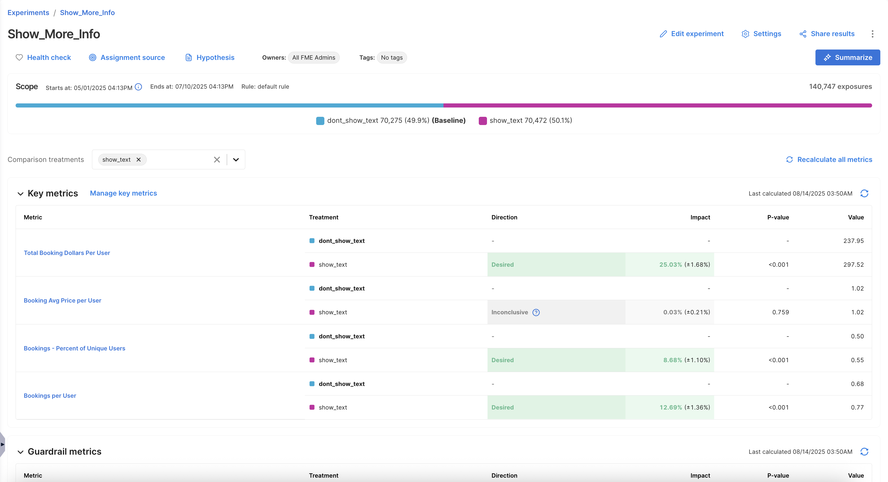
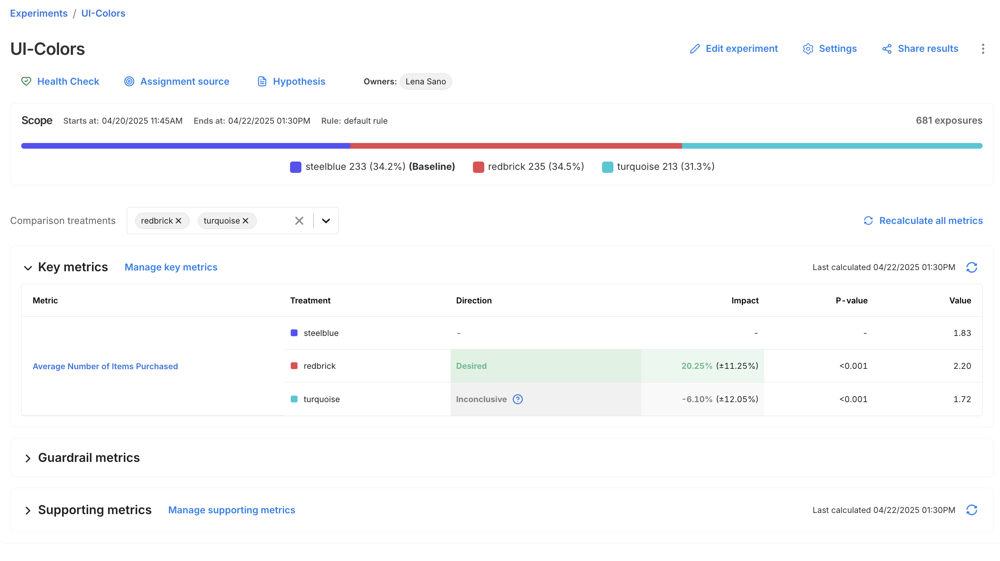
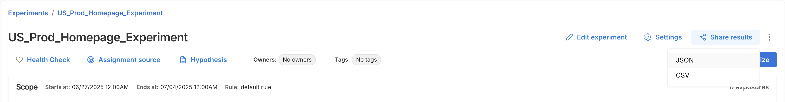

<CTABanner
  buttonText="Request Access"
  title="Warehouse Native Experimentation is GA!"
  tagline="Run Harness FME experiments directly in your data warehouse. Contact Sales or your account manager to enable access."
  link="https://developer.harness.io/docs/feature-management-experimentation/fme-support"
  closable={true}
  target="_self"
/>

Understanding how your experiment is performing, and whether it's driving meaningful impact, is key to making confident, data-informed product decisions. The experiment results on the **Experiments** page allow you to interpret metrics derived directly from your <Tooltip id="fme.warehouse-native.data-warehouse">data warehouse</Tooltip>, assess experiment health, and share validated outcomes with stakeholders.

## View experiment results

Review key experiment metrics and overall significance in Harness FME.

Explore [how each metric performs](/docs/feature-management-experimentation/warehouse-native/experiment-results/analyze#metric-values-charts) across treatments, inspect query-based data directly from your warehouse, and understand how results are calculated based on your metric definitions.

## Analyze experiment results

Drill down into experiment details to validate setup, confirm metric source alignment, and investigate user or account-level behavior.

Use [detailed metric breakdowns](/docs/feature-management-experimentation/warehouse-native/experiment-results/analyze#experiment-metric-details) to identify anomalies or confirm expected outcomes.

## Share results

Click **Share results** to download experiment metrics and statistical summaries in CSV or JSON format for further analysis or collaboration with your team.

You can also share experiment results directly within Harness FME to maintain visibility across product, data, and engineering teams.