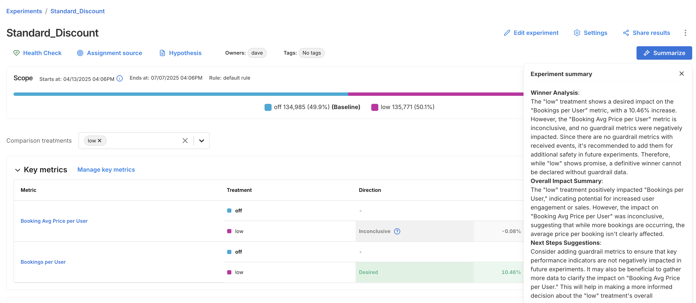

## Overview

You can view your experiment results from the **Experiments** page. This page provides a centralized view of all experiments and allows you to quickly access performance metrics, significance levels, and summary details for each treatment group.

Click into any experiment to view detailed results, including the following:

* Experiment metadata, such as:
  
  - Experiment name, owners, and tags
  - Start and end dates
  - Active targeting rule
  - Total number of exposures
  - Treatment group assignment counts and percentages

* Treatment comparison, including:

  - The baseline treatment (e.g. `off`)
  - One or more comparison treatments (e.g. `low`)

## Use AI Summarize 

For faster interpretation of experiment outcomes, the Experiments page includes an **AI Summarize** button. This analyzes key and guardrail metric results to generate a summary of your experiment, making it easier to share results and next steps with your team.

The summary is broken into three sections:

* **Winner Analysis**: Highlights whether a clear winner emerged across key metrics and guardrails.
* **Overall Impact Summary**: Summarizes how the treatment impacted user behavior or business outcomes.
* **Next Steps Suggestion**: Recommends what to do next, whether to iterate, roll out, or revisit your setup.

## Manually recalculating metrics

You can manually run calculations on-demand by clicking the Recalculate button. Recalculations can be run for key metrics only, or for all metrics (key, guardrail, and supporting). **Most recalculations take up to five minutes, but can take longer, depending on the size of your data and the length of your experiment.**

Reasons you may choose to recalculate metrics:

* If you create or modify a metric after the last updated metric impact calculation, recalculate to get the latest results.
* If you assign a metric to the Key metrics or Supporting metrics groups, recalculate to populate results for those metrics.
* If the current version of this feature flag was created more than 28 days ago, recalculate to update results with the most recent data. Note that FME’s data retention period is 90 days. The influence of data points prior to 90 days are lost, even if the feature flag version is older than 90 days.

The **Recalculate** button will be disabled when:

* **No impressions for this version are received within the current retention period (i.e., the last 90 days).** To enable the recalculation, check that the SDK is correctly initialized in your code and verify that the metric event was sent.
* **A forced recalculation is already scheduled.** A calculation is in progress.  You can click the Recalculate button again, as soon as the currently running calculation finishes.

## Concluding on interim data

Although we show the statistical results for multiple interim points, we caution against drawing conclusions from interim data. Each interim point at which the data is analyzed has its own chance of bringing a false positive result, so looking at more points brings more chance of a false positive. For more information about statistical significance and false positives, see [Statistical significance](/docs/feature-management-experimentation/release-monitoring/metrics/statistical-significance/). 

If you were to look at all the p-values from the interim analysis points and claim a significant result if any of those were below your significance threshold, then you would have a substantially higher false positive rate than expected based on the threshold alone. For example, you would have far more than a 5% chance of seeing a falsely significant result when using a significance threshold of 0.05, if you concluded on any significant p-value shown in the metric details and trends view. This is because there are multiple chances for you to happen upon a time when the natural noise in the data happened to look like a real impact. 

For this reason, it is good practice to only draw conclusions from your experiment at the predetermined conclusion point(s), such as at the end of the review period. 

### Interpreting the line chart and trends

The line chart provides a visualization of how the measured impact has changed since the beginning of the feature flag. This may be useful for gaining insights on any seasonality or for identifying any unexpected sudden changes in the performance of the treatments. 

However it is important to remember that there will naturally be noise and variation in the data, especially when the sample size is low at the beginning of a feature flag, so some differences in the measured impact over time are to be expected. 

Additionally, since the data is cumulative, it may be expected that the impact changes as the run time of your feature flag increases. For example, the fraction of users who have done an event may be expected to increase over time simply because the users have had more time to do the action.

### Example Interpretation

The image below shows the impact over time line chart for an example A/A test, a feature flag where there is no true difference between the performance of the treatments. Despite there being no difference between the treatments, and hence a constant true impact of zero, the line chart shows a large measured difference at the beginning, and an apparent trend upwards over time. 

This is due only to noise in the data at the early stages of the feature flag when the sample size is low, and the measured impact moving towards the true value as more data arrives.

Note also that in the chart above there are 3 calculation buckets for which the error margin is entirely below zero, and hence the p-values at those points in time would imply a statistically significant impact. This is again due to noise and the unavoidable chance of false positive results.

If you weren't aware of the risk of peeking at the data, or of considering multiple evaluations of your feature flag at different points in time, then you may have concluded that a meaningful impact had been detected. However, by following the recommended practice of concluding only at the predetermined end time of your feature flag you would eventually have seen a statistically inconclusive result as expected for an A/A test. 

If you have questions or need help troubleshooting, contact [support@split.io](mailto:support@split.io).
