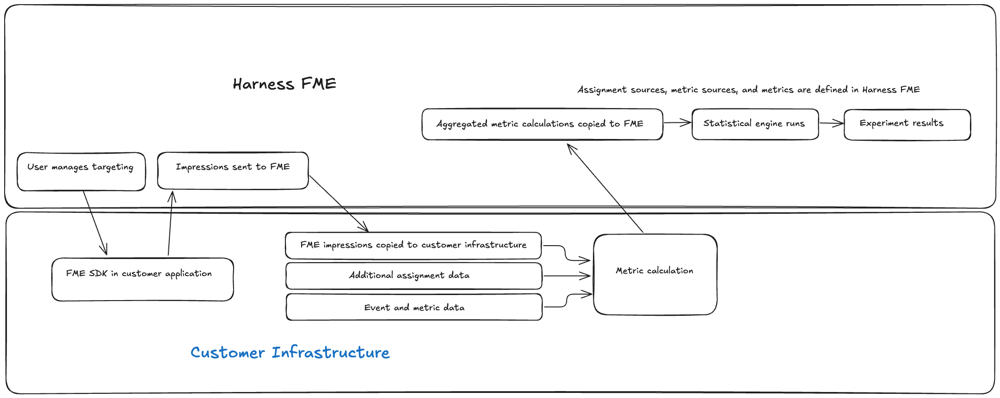
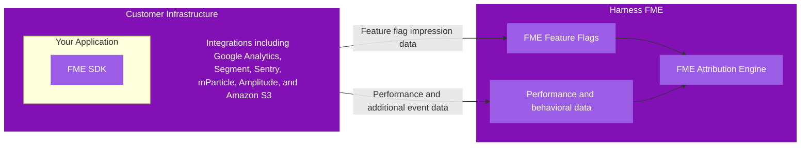
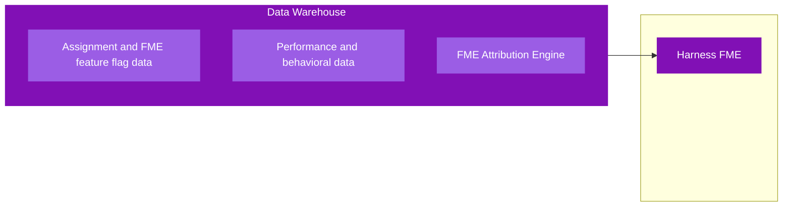

<CTABanner
  buttonText="Request Access"
  title="Warehouse Native is in beta!"
  tagline="Get early access to run Harness FME experiments directly in your data warehouse."
  link="https://developer.harness.io/docs/feature-management-experimentation/fme-support"
  closable={true}
  target="_self"
/>

## Overview

Warehouse Native enables [experimentation](/docs/feature-management-experimentation/experimentation/setup/) workflows, from targeting and assignment to analysis, and provides a statistical engine for analyzing existing experiments with measurement tools like CUPED in Harness Feature Management & Experimentation (FME).

## How Warehouse Native works

Warehouse Native runs experimentation jobs directly in your <Tooltip id="fme.warehouse-native.data-warehouse">data warehouse</Tooltip> by using your existing data to calculate metrics and enrich experiment analyses. 

The data model is designed around two two primary types of data: **assignment data** and **performance/behavioral data**, which power the FME statistical engine in your warehouse. 

Key components include:

- **Assignment data**: Tracks user or entity assignments to experiments. This includes metadata about the experiment.
- **Performance and behavioral data**: Captures metrics, events, and user behavior relevant to the experiment.
- **Experiment metadata**: Contains definitions for experiments, including the experiment ID, name, start/end dates, traffic allocation, and grouping logic.
- **Metric definitions**: Defines how metrics are computed in the warehouse, including aggregation logic, denominators, and optional CUPED adjustments. These definitions ensure analyses are standardized across experiments.

### Cloud Experimentation

<Tooltip id="fme.warehouse-native.cloud-experimentation">Cloud Experiments</Tooltip> are executed and analyzed within Harness FME, which collects feature flag impressions and performance data from your application and integrations. For more information, see the [Cloud Experimentation documentation](/docs/feature-management-experimentation/experimentation).

### Warehouse Native

<Tooltip id="fme.warehouse-native.warehouse-native">Warehouse Native Experiments</Tooltip> are executed directly in your data warehouse, leveraging assignment and behavioral data from Harness FME to calculate metrics and run statistical analyses at scale. 

## Get started

To start using Warehouse Native Experimentation:

1. [Connect Harness FME](/docs/feature-management-experimentation/integrations) to your data warehouse.
1. Prepare your [assignment](/docs/feature-management-experimentation/warehouse-native/setup/assignment-sources) and [metric source tables](/docs/feature-management-experimentation/warehouse-native/setup/metric-sources) in your data warehouse.
1. Configure your [assignment and metric sources](/docs/feature-management-experimentation/warehouse-native/setup) in Harness FME.
1. Define your [metrics](/docs/feature-management-experimentation/warehouse-native/metrics/) and [create experiments](/docs/feature-management-experimentation/warehouse-native/setup/experiments) in Harness FME.

Once you've created metric definitions and started running experiments in your data warehouse, you can access analyses in Harness FME. 