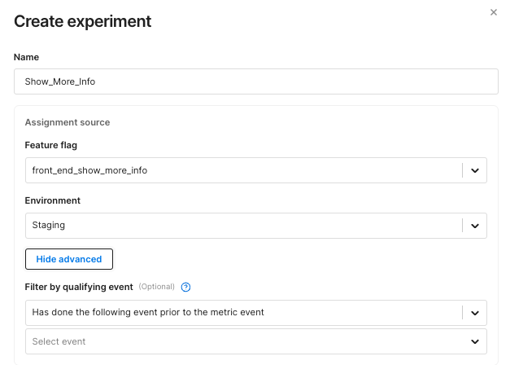

<CTABanner
  buttonText="Request Access"
  title="Warehouse Native is in beta!"
  tagline="Get early access to run Harness FME experiments directly in your data warehouse."
  link="https://developer.harness.io/docs/feature-management-experimentation/fme-support"
  closable={true}
  target="_self"
/>

## Overview

### Interactive guide

This interactive guide will walk you through setting up an experiment for the first time.

<DocVideo src="https://app.tango.us/app/embed/1e1ad9f0-85b8-427a-8331-f35f7685c1eb?hideAuthorAndDetails=true" title="Create an Experiment" />

### Step-by-step guide

Setting up an experiment follows these steps:

1. Navigate to the Experiments section on your navigation panel and click **+ Create experiment**.

1. Give your experiment a name and select a feature flag and environment in the **Assignment Source** section:

   * Choose a feature flag that has targeting active (not killed).
   * Choose an environment for which the feature flag definition is initiated (valid environments are enabled in the dropdown).

1. Optionally, click **Show advanced** and define an entry event filter in the **Filter by qualifying event** section. 
   
   
   
   :::info
   The entry event filter can only be defined during experiment creation. To make changes, create a new experiment.
   :::

   * Select a filter (e.g. `Has done the following event prior to the metric event`) and a qualifying event from the dropdown menus. 
   * Only users who trigger this event are counted as exposures.
   * The filter applies globally to all metrics; if a [metric already has its own filter](/docs/feature-management-experimentation/experimentation/metrics/setup/filtering/#applying-a-filter), both must be satisfied.

1. Define the scope of your experiment by setting a start and end time, a baseline treatment, comparison treatments, and a targeting rule.

   * Choose a start date on or after the date the feature flag was created.
   * The targeting rule can be any rule with percentage distribution (other rules are disabled in the dropdown). The `default rule` listed in the Targeting rule dropdown is the last rule in the Targeting rules section of a feature flag definition.

      :::note
      Based on your feature flag definition, the following fields are pre-populated by default: the start time is the timestamp of the flag’s current version, the end time is determined by your default review period, the baseline treatment is the flag’s default treatment, and the comparison treatments are all other treatments defined by the flag.
      :::

1. Write an optional hypothesis, add any additional owners, and apply tags to help categorize your experiment (for example, by team, status, or feature area). Then click **Create**.

1. Add key and supporting metrics to your experiment. Guardrail metrics will be measured automatically for every experiment.
