Harness Cloud Cost Management (CCM) detects cost anomalies for your Kubernetes clusters and cloud accounts. Cloud cost anomaly detection can be used as a tool to keep cloud costs under control. It also provides alerting capability (email and Slack) so that the stakeholders are notified of each anomaly that is detected.

## Before You Begin

* [Cloud Cost Management Overview](/docs/first-gen/cloud-cost-management/concepts-ccm/b-cloud-cost-management-overview.md)
* [Cost Explorer Walkthrough](/docs/first-gen/cloud-cost-management/concepts-ccm/a-cost-explorer-walkthrough.md)

## What is Cost Anomaly Detection?

Cost anomaly detection points you to what you should be paying attention to to keep your cloud costs under control. Whenever there is a significant increase in your cloud cost, an alert is triggered. This helps to keep track of potential waste and unexpected charges. It also keeps an account of the recurring events (seasonalities) that happen on a daily, weekly, or monthly basis.

CCM cost anomaly compares the previous cloud cost spends with the current spending to detect the cost anomalies. If the actual cost incurred deviates substantially from the expected cost then it can be a potential cost anomaly.

## How Cost Anomaly Detection Works?

CCM uses statistical anomaly detection techniques and Forecasting at scale to determine the cost anomalies. These methods can detect various types of anomalies, such as a one-time cost spike, gradual, or consistent cost increases.

CCM analyzes 15 to 60 days of data to predict the cost. If the predicted cost and the actual cost incurred deviates beyond the fixed parameters (as described in the anomaly detection techniques), it is marked as the cost anomaly.

For example, you run a compute-intensive job that gets kicked off every Monday morning. The algorithm picks up the pattern and updates its model. Based on these learnings the predictions are made for what might happen in the future. Anything that does not align with these predictions is a potential anomaly.

:::note
The anomaly detection techniques are run every 24 hours and the alert is triggered for any anomaly that is detected.#### Anomaly Detection Techniques
:::

One of the challenges of anomaly detection is reducing the number of false positives and noisy alerts. To avoid this, CE uses the following prediction techniques to detect the cost anomalies:

### Absolute Difference Method

This method takes the absolute difference between the two variables in the dataset. CCM considers the actual and predicted cost as two variables. If the difference between the actual and predicted costs exceeds $75, then the cost is considered as a potential anomaly.

`Actual cost - Predicted Cost > $75`

For example, the actual cost of your cloud resource is $120 and the predicted cost was $25.

The difference between the actual and predicted is $120 - $21 = $99 which is greater than the $75 fixed amount.

Hence, it is a potential cost anomaly.

### Relative Method

In this method, if the actual cost is minimum 1.25 times higher than the predicted cost, then it is a potential cost anomaly.

`Actual Cost / Predicted Cost >= 1.25X`

For example, the difference between the actual and predicted is 120 / 21 = 5.71 which is higher than the fixed 1.25x value.

Hence, it is a potential cost anomaly.

### Probability Method

In this method, the algorithm uses a probability of 99% within a range to predict the cost.

For example, the actual cost is predicted to be in the range of 10-14$ with a 99% probability. Anything that deviates from this range is a potential cost anomaly.

## View Cost Anomalies

CCM detects anomalies for the following:

* **Clusters**: Kubernetes Clusters, Namespaces, and Workloads
* **AWS**: Service and Account
* **GCP**: Products, Projects, and SKUs

### View Cost Anomalies From the Overview Tab

The **Overview** page displays all the cost anomalies for your Clusters (Kubernetes Clusters, Namespaces, and Workloads), AWS (Service and Account), and GCP (Products, Projects, and SKUs).

To view cost anomalies from the **Overview** tab, perform the following steps:

1. In **Cloud Cost Management**, click **Explorer**.
2. In **Overview**, click **Cloud**. The bell icon is displayed for the cloud resources for which the anomalies are detected.
   
     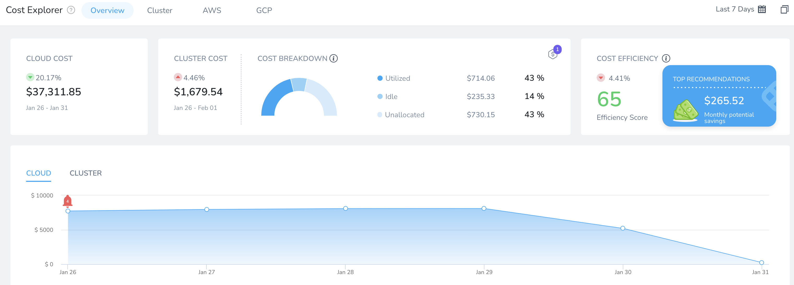
3. Click the bell icon to view the list of the anomalies. It displays the following information:
	1. **Cost Anomaly**: Deviation from the expected and actual cost. For more information, see **Anomaly Detection Techniques**.
	2. **Expected Cost**: Expected cost as per the algorithm.
	3. **Actual Cost**: Actual cost incurred.
	4. **Resource Details**: The details of the resource where the anomaly has occurred.
   
   
     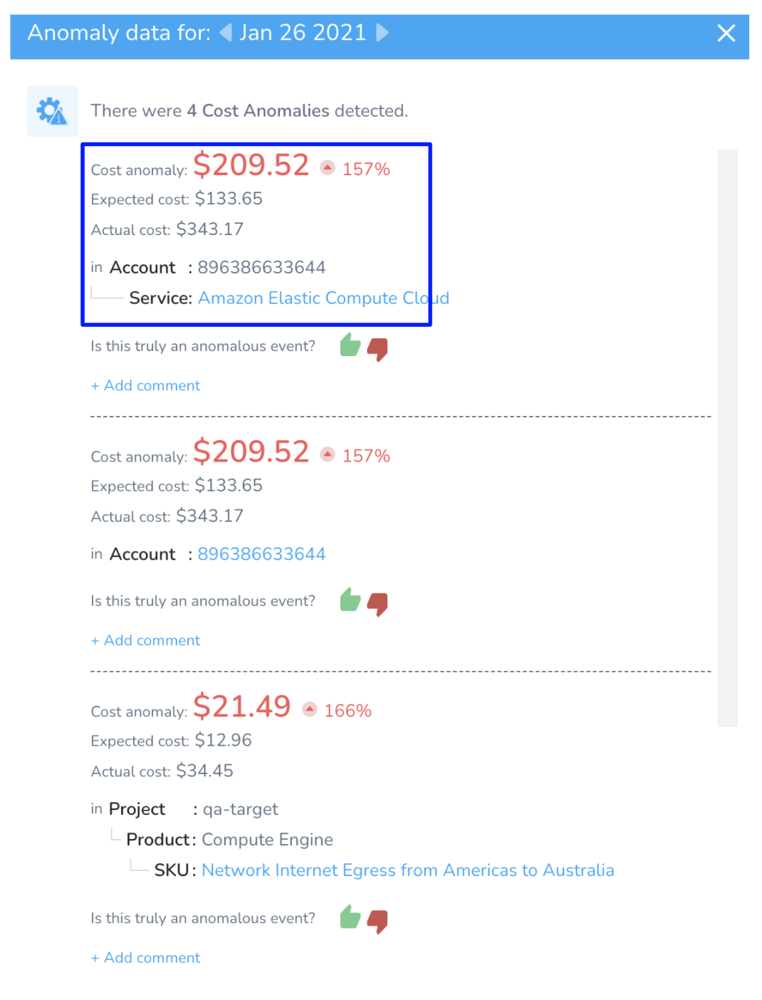
4. Click on the resource to view the details.
   
     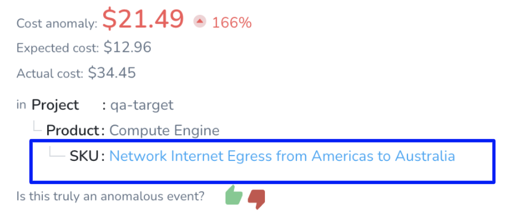
5. The details are displayed. For more information, see [Root Cost Analysis](/docs/first-gen/cloud-cost-management/root-cost-analysis/perform-root-cause-analysis.md).
   
     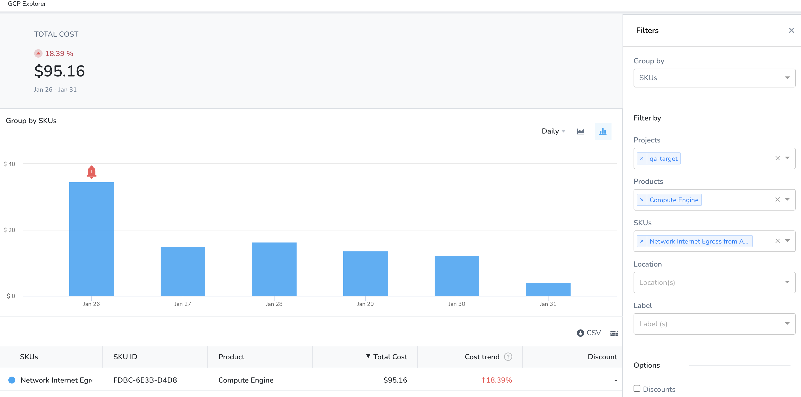
6. Click **thumbs up** or **thumbs down** to determine if this is truly an anomalous event.
   
     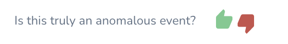
	 
	 As you evaluate your anomalies, you can submit your assessment on each anomaly. This helps you to keep track of the anomalies that you have already evaluated. It also helps CE **Anomaly Detection Techniques** to learn and improve the algorithm to be more tailored to your assessments.  
  
Once you have submitted your feedback and wish to change your assessment, click **reset**.

  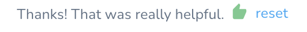
7. Click **Add comment** to enter any comment. You can choose to edit your comment later.

### View Cost Anomalies for Cluster

You can view anomalies for the clusters, workloads, and namespaces. To view the anomalies impacting your cloud cost, perform the following steps:

1. In **Cloud Cost Management**, click **Explorer**,and then click **Cluster** in the top navigation.
2. Select the **date range** for the costs you want to view anomalies.
3. In **Group by** select, **Cluster**. The bell icon is displayed for the clusters for which the anomalies are detected.
   
     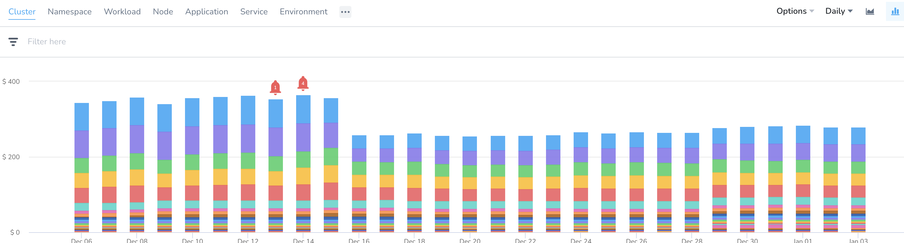
	 
	 Cluster tab includes anomalies for the cluster, namespaces, and workloads. You can **Group by**, **Namespace** or **Workload** to view anomalies only for the workload or namespaces.
	 
	   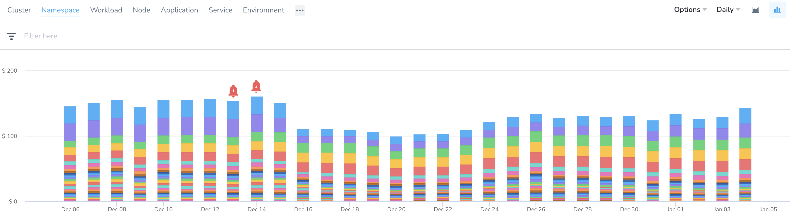
4. Click the bell icon to view the details of the anomalies. All the anomalies for the cluster are listed.
5. Click **thumbs up** or **thumbs down** to determine if this is truly an anomalous event.  
  
As you evaluate your anomalies, you can submit your assessment on each anomaly. This helps you to keep track of the anomalies that you have already evaluated. It also helps CE cost anomaly detection models to learn and improve the algorithm to be more tailored to your assessments.  
  
Once you have submitted your feedback and wish to change your assessment, click **reset**.
6. Click **Add comment** to enter any comment. You can choose to edit your comment later.

### View Cost Anomalies for AWS

You can view anomalies for the service and account. To view the anomalies impacting your cloud cost, perform the following steps:

1. In **Cloud Cost Management**, click **Explorer**,and then click **AWS** in the top navigation.
2. Select the **date range** for the costs you want to view anomalies.
3. In **Group by** select, **Service.** The bell icon is displayed for the Service for which the anomalies are detected.
   
     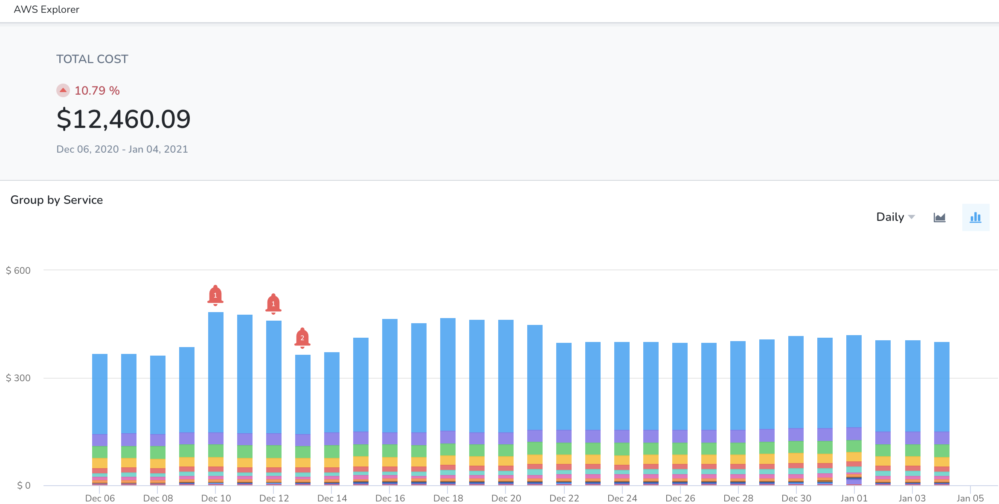
	 
	 You can **Group by**, **Account** to view anomalies for the accounts.
	 
	   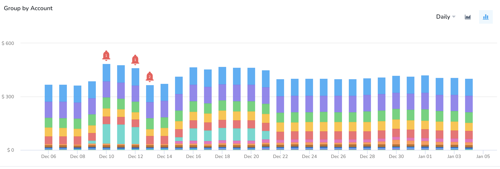
4. Click the bell icon to view the details of the anomalies.
5. Click **thumbs up** or **thumbs down** to determine if this is truly an anomalous event.  
  
As you evaluate your anomalies, you can submit your assessment on each anomaly. This helps you to keep track of the anomalies that you have already evaluated. It also helps CE cost anomaly detection models to learn and improve the algorithm to be more tailored to your assessments.  
  
Once you have submitted your feedback and wish to change your assessment, click **reset**.
6. Click **Add comment** to enter any comment. You can choose to edit your comment later.

### View Cost Anomalies for GCP

You can view anomalies for the products, projects, and SKUs. To view the anomalies impacting your cloud cost, perform the following steps:

1. In **Cloud Cost Management**, click **Explorer**,and then click **GCP** in the top navigation.
2. Select the **date range** for the costs you want to see anomalies.
3. In **Group by** select, **Products.** The bell icon is displayed for the Products for which the anomalies are detected.
   
     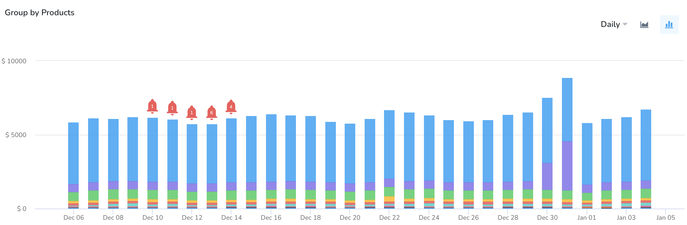
	 
	 You can **Group by**, **Projects** or **SKUs** to view anomalies for the projects or SKUs.
4. Click the bell icon to view the details of the anomalies.
5. Click **thumbs up** or **thumbs down** to determine if this is truly an anomalous event.  
  
As you evaluate your anomalies, you can submit your assessment on each anomaly. This helps you to keep track of the anomalies that you have already evaluated. It also helps CCM cost anomaly detection models to learn and improve the algorithm to be more tailored to your assessments.  
  
Once you have submitted your feedback and wish to change your assessment, click **reset**.
6. Click **Add comment** to enter any comment. You can choose to edit your comment later.

