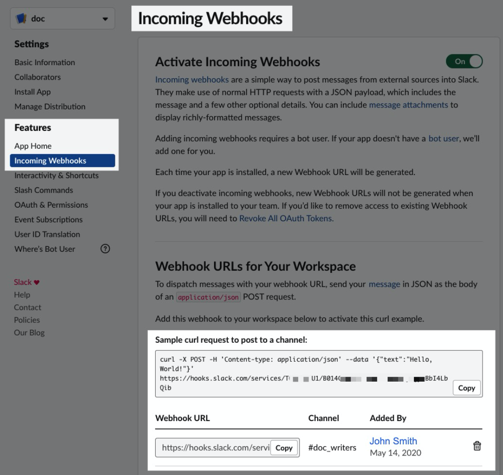
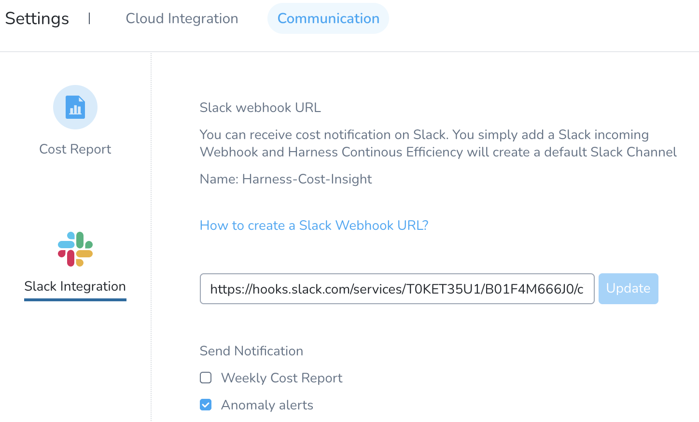
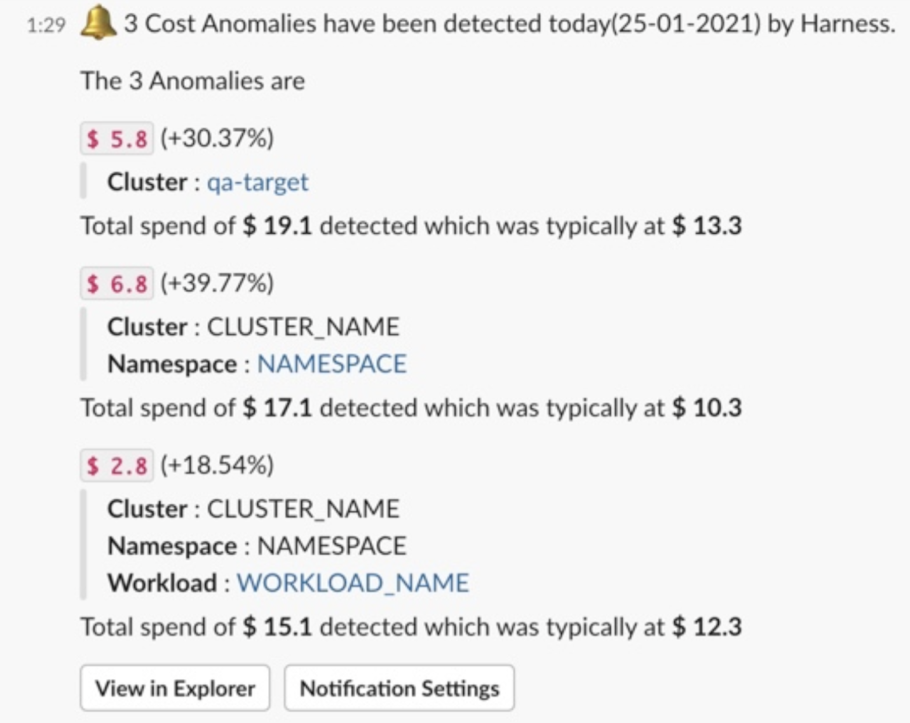

Cloud cost anomaly detection can be used as a tool to keep cloud costs under control. You can specify a communication strategy to receive alerts for each anomaly that is detected. The anomaly alert can be sent to a Slack channel.

### Before You Begin

* [Detect Cloud Cost Anomalies with CCM (formerly CE)](/docs/first-gen/cloud-cost-management/ccm-anomaly-detection/detect-cost-anomalies-with-ce.md)

### Set Up Slack Notifications

You can receive your alert report for the cost anomalies in your Slack channel. You simply need to add a Slack Incoming Webhook URL in Harness. Perform the following steps to configure your slack channel: 

1. In **Cloud Cost Management**, in **Settings**, click **Communication**.
2. In **Slack Integration**, enter the Slack Webhook URL of the channel to which you want to send the weekly cost report and click **Update**.
	1. Follow the steps in Slack documentation for creating a Slack app, selecting your channel, and creating a webhook:  [Sending messages using Incoming Webhooks](https://api.slack.com/messaging/webhooks).  
	  
	When you are done, you'll have a webhook that looks something like this:
	
	  
	2. Copy the Webhook URL.
3. In **Slack Integration**, enter the Slack Webhook URL of the channel to which you want to send the weekly cost report and click **Update**.
4. In **Send Notification**, select the checkbox **Anomaly alerts**.
   
     
	 
	 Now you will receive your cost anomaly alerts in the configured Slack channel.
	 

:::note
If you have more than three cost anomalies, only the top three anomalies are listed in the Slack notification.
:::

	 
  	   
		
	     

5. Click **View in Explorer** to view the details. For more information, see [Root Cost Analysis](/docs/first-gen/cloud-cost-management/root-cost-analysis/perform-root-cause-analysis.md).
6. Click **Notification Settings** to modify the notification settings. Follow the steps in **Set Up Slack Notifications** to edit the notification settings.

