Harness CCM Budgets allow you to set custom budgets and receive alerts when your costs exceed (or are forecasted to exceed) your budget. You can create budgets for Harness Applications and clusters.

You can monitor your budgets and compare actual costs to your budgets and forecasts. See [Using the Budget Dashboard](/docs/first-gen/cloud-cost-management/ccm-budgets/create-a-budget.md#using-the-budget-dashboard).

### Before You Begin

* [Cloud Cost Management Overview](/docs/first-gen/cloud-cost-management/concepts-ccm/b-cloud-cost-management-overview.md)
* [Set Up Cost Visibility for Kubernetes](/docs/first-gen/cloud-cost-management/setup-cost-visibility/enable-continuous-efficiency-for-kubernetes.md)
* [Set Up Cost Visibility for Kubernetes Using an Existing Delegate](/docs/first-gen/cloud-cost-management/setup-cost-visibility/enable-ce-by-adding-a-delegate.md)

## Step 1: Set Your Monthly Budget

1. In **Cloud Cost Management**, click **Budgets**, and then click **Create Budget**.
   
     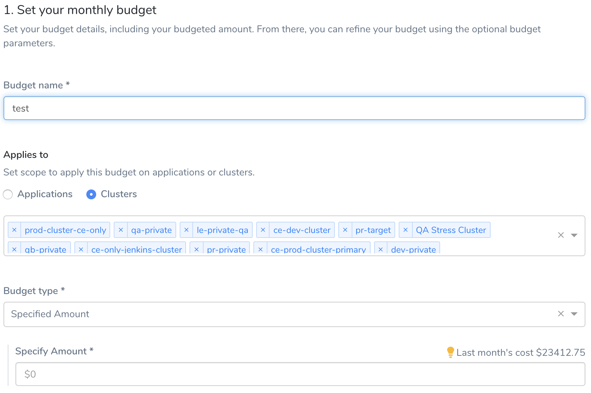
2. Enter **Budget name**.
3. In **Applies to**, you can set the scope for the budget. Select **Applications**, **Clusters**, or **Perspectives** to monitor.
	1. If you selected Applications, in **Environment type**, select the type of Harness Environment for Applications, or **Select All**.  
	  
	Harness separates Environments into two types, **Production** and **Non-Production**. This helps you set different budgets for development and production resources.
	
	  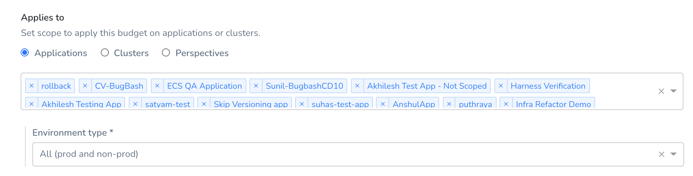

	2. If you select **Clusters**, select the clusters for this budget.
	3. If you select **Perspectives**, select the perspective for this budget.
4. In **Budget Type**, select a **Budget type**.
* **Specified Amount**: Enter the amount that you want to set as the budget limit.
* **Previous Month Spend**: Sets the previous month spent as your Budget.
  
    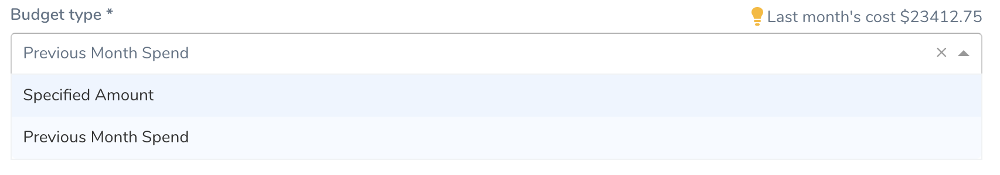
5. Click **Next**.

:::note
If you select **Applications** and are using Kubernetes, ensure that you are deploying a workload. If you are deploying another object type, such as a CRD ScaledObject, Harness does not track instances.  
As an alternative, you can use **Clusters** to track your object.
:::

## Step 2: Configure Alert

1. Set a threshold for the **Percentage of Budget** based on the **Actual Cost** or **Forecasted Cost**. Harness sends alerts when the Actual Cost or Forecasted Cost exceeds the threshold.  
  
Harness will send an alert to Harness User Groups when the actual or forecasted cost exceeds a percentage of your monthly budget. For example, if today is Oct 11th then the Actual Cost is the spend from Oct 1st to Oct 10th. The Forecasted Cost is the Actual Cost until Oct 10th plus the projected cost from the 11th to 31st, based on the spend pattern of previous months.

  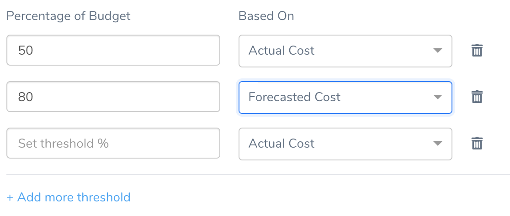
2. Add email addresses to receive budget notifications.
   
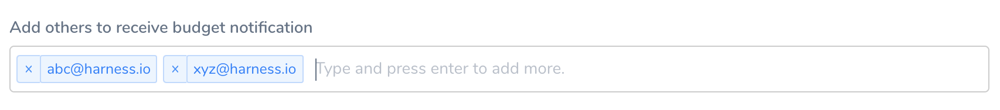
3. Select the Harness **User Group**(s) to receive the email alerts. For information on setting up email alerts for User Groups, see [Manage User Notifications](/docs/first-gen/cloud-cost-management/ccm-anomaly-detection/set-up-notifications-for-cost-anomalies.md).  
  
You can receive budget notifications in your Slack channels. You simply add a Slack Incoming Webhook into a Harness User Groups' Notification Settings. See [Send Notifications Using Slack](/docs/first-gen/cloud-cost-management/ccm-anomaly-detection/set-up-notifications-for-cost-anomalies.md#set-up-slack-notifications).  

  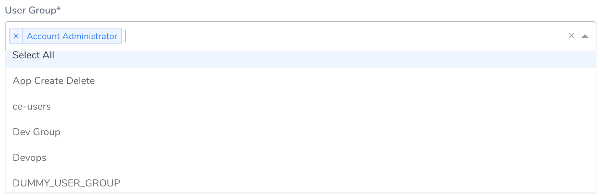
4. Click **Submit**.

## Using the Budget Dashboard

The **Budgets** dashboard shows a summary of your budgets. By default, all your budgets are sorted based on the time created at.

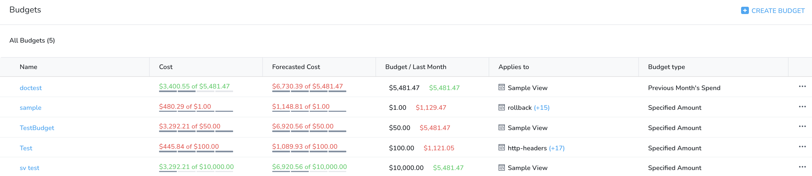

The dashboard includes the following information:

* **Name**: Name of the budget.
* **Cost**: Your actual cost compared to your budgeted cost. The staggered line indicates the percentage range, 0-25%, 25-50%, 50-75%, and 75-100%.
* **Forecasted Cost**: Your forecasted cost compared to your budgeted cost. Forecasted costs are predictions based on your historical cost data. The Forecasted Cost is the actual cost plus the projected cost, based on the spend pattern of previous months.
* **Budget/Last Month**: Your budgeted cost compared to your budgeted cost in the previous month.
* **Applies to**: The specified scope for a budget (Applications, clusters, or perspectives).
* **Budget type**: The budgeted amount type. The amount can be specified or can be set to the previous month's spend.

### Read Your Budget

The **Budgets** dashboard further shows you the details of your selected budget at a glance. Select a budget from the list to view the following information:

* **Actual Vs. Budgeted**: The actual incurred cost compared to your budgeted cost.
* **Budget Details**: The budget type, specified scope, and set threshold percentage for the budget.
* **Budget History**: The monthly history of your budget. The dashboard displays the data as a chart and table. You can view, understand, and analyze your budget using either of them.
	+ **Remaining monthly budget**: The budget remaining for the current month.
	+ **Current Month Cost**: The cost incurred in the current month.
	+ **Actual**: The actual incurred cost.
	+ **Budgeted**: The budgeted amount.
	+ **Budget variance**: The difference between the budgeted and actual cost in percentage and dollars. The variance data is available only in the tabular format.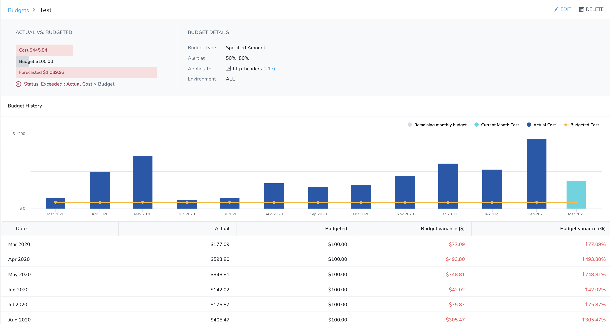You can also Edit, Clone, and Delete a budget from the dashboard.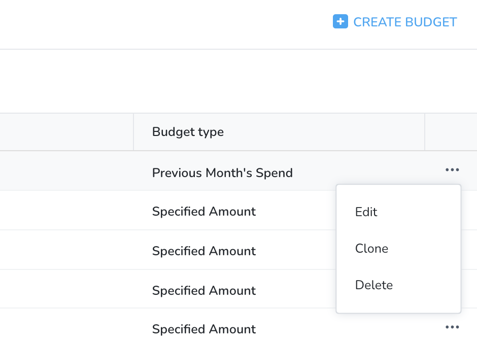

### Edit a Budget

To edit a budget:

1. Click **Edit**.
2. The Budget settings appear. Follow the steps in [Set Your Monthly Budget](/docs/first-gen/cloud-cost-management/ccm-budgets/create-a-budget.md#step-1-set-your-monthly-budget) and [Configure Alert](/docs/first-gen/cloud-cost-management/ccm-budgets/create-a-budget.md#step-2-configure-alert) to edit the details of the budget.

### Clone a Budget

When you clone a budget, all its settings are cloned. You simply add a new name. Once it is cloned, you can edit it just as you would any budget.

To clone a budget:

1. Click **Clone**. **Clone Budget** settings appear.
2. Enter the **Budget name** and click **Clone**.
   
     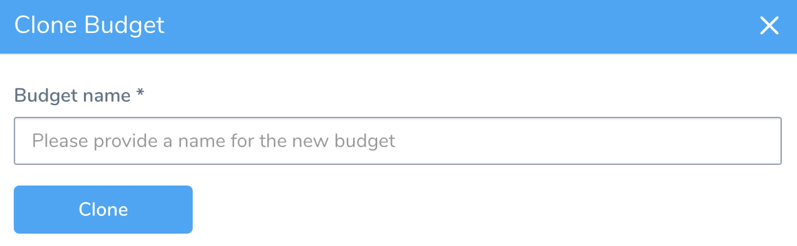

The cloned budget is displayed in the dashboard.

### Delete a Budget

Once a budget is deleted, it cannot be restored.

To delete a budget:

1. Click **Delete**.
2. Click **Confirm Delete**.
   
     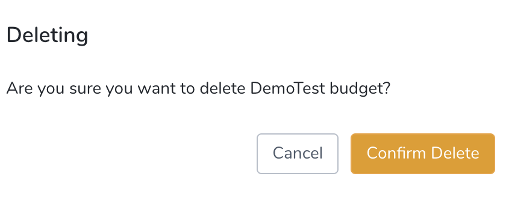

The budget no longer appears in the dashboard.

