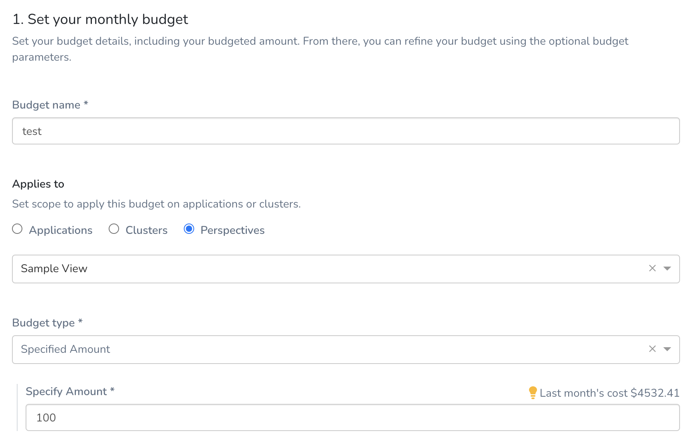
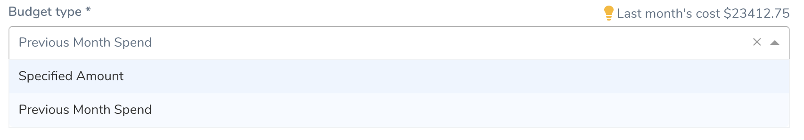
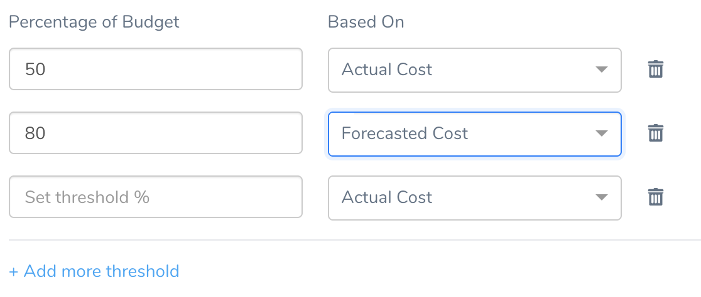
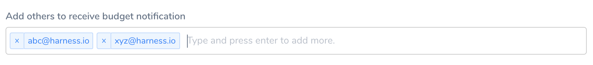
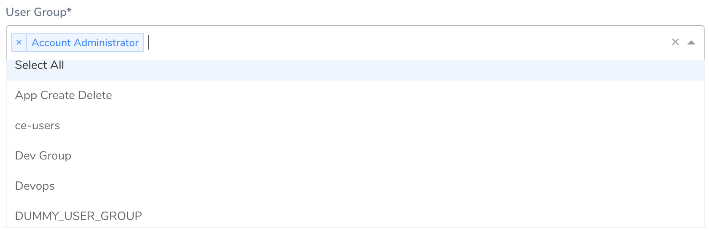
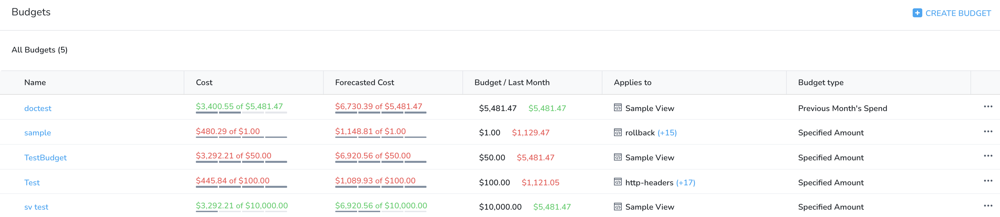

Perspectives allow you to set custom budgets and receive alerts when your costs exceed (or are forecasted to exceed) your budget.

### Before You Begin

* [Create Cost Perspectives](/docs/first-gen/cloud-cost-management/ccm-perspectives/perspectives.md)
* [Share Your Cost Perspective Report](/docs/first-gen/cloud-cost-management/ccm-perspectives/share-report-in-cost-perspectives.md)

### Step 1: Set Your Perspective Budget

1. In **Cloud Cost Management**, click **Budgets**, and then click **Create Budget**.
2. In **Budget name**, enter the name for your budget.
   
     
3. In **Applies to**, select **Perspectives**.
4. Select your Perspective from the drop-down list for which you want to set a budget.
5. In **Budget type**, select abudget type.
	* **Specified Amount**: Enter the amount that you want to set as the budget limit.
	* **Previous Month Spend**: Sets the previous month spent as your budget.
  
  
6. Click **Next**.

### Step 2: Configure Alert

1. Set a threshold for the **Percentage of Budget** based on the **Actual Cost** or **Forecasted Cost**. Harness sends alerts when the Actual Cost or Forecasted Cost exceeds the threshold.  
  
Harness will send an alert to the specified email addresses and Harness User Groups when the actual or forecasted cost exceeds a percentage of your monthly budget. For example, if today is Oct 11th then the Actual Cost is the spend from Oct 1st to Oct 10th. The Forecasted Cost is the Actual Cost until Oct 10th plus the projected cost from the 11th to 31st, based on the spend pattern of previous months.

  
2. Add email addresses to receive budget notifications.
   

3. Click **Show more options**.
4. Select the Harness **User Group**(s) to receive the email alerts. For information on setting up email alerts for User Groups, see **Manage User Notifications**.
   
     
5. Click **Submit**.  
Your budget is listed in the budget dashboard.

### Using the Budget Dashboard

The **Budgets** dashboard shows a summary of your budgets. By default, all your budgets are sorted based on the time created at.

For more information, see [Using the Budget Dashboard](/docs/first-gen/cloud-cost-management/ccm-budgets/create-a-budget.md#using-the-budget-dashboard).

