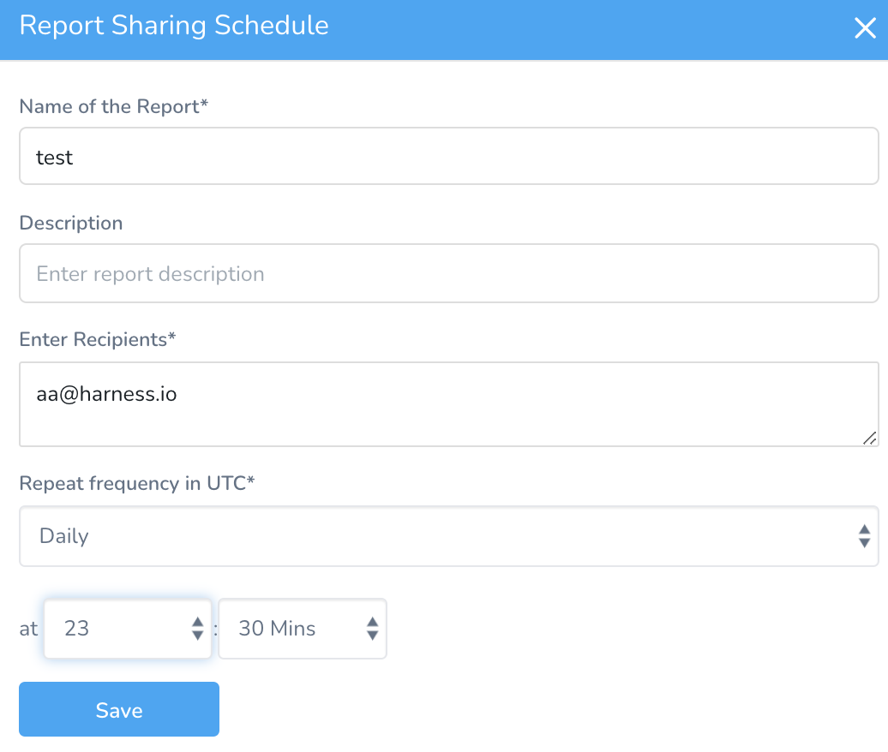
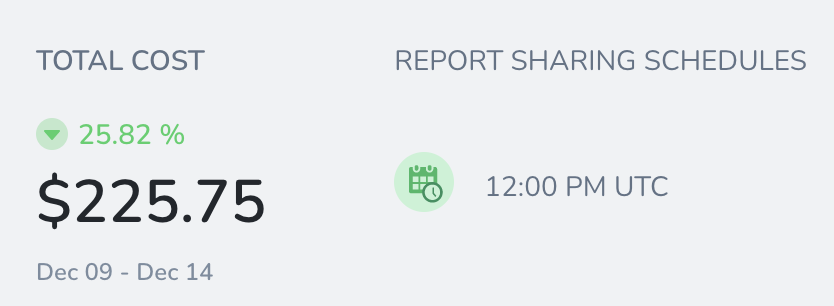
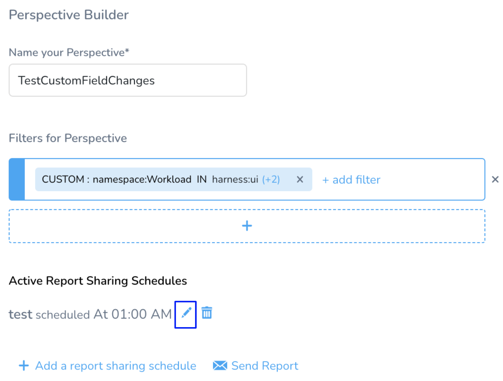
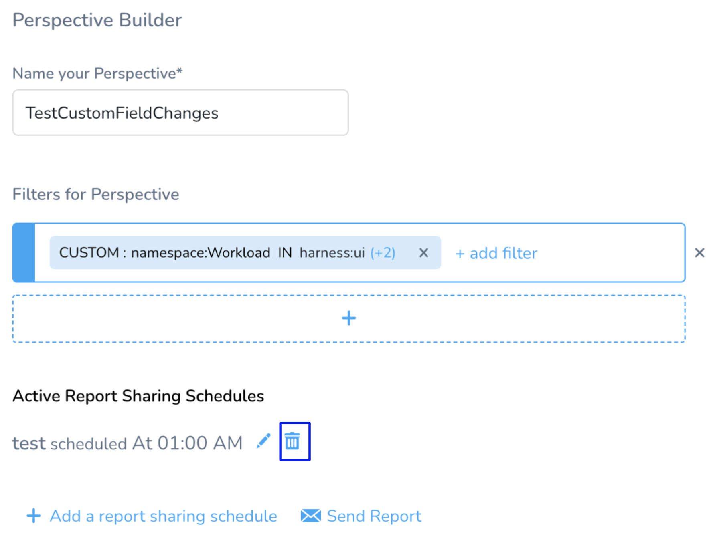

You can share the cost report of your Perspective with your stakeholders. Create a daily, weekly, monthly, or custom (using CRON expression) report sharing schedule. The report is sent as per the set frequency.

## Create a Report Sharing Schedule

You can create a schedule for sharing the cost report of your Perspective. Perform the following steps to create a schedule:

1. In **Perspective** **Builder**, click **Add a report sharing schedule**.
2. In **Name of the Report**, enter a name for your Perspective report.
3. In **Enter Recipients**, enter an email ID of the recipient.You can add up to 50 email IDs for sharing the report schedule. Email IDs are separated by a comma.
4. In **Repeat frequency in UTC**, select the **frequency** for sharing the report. All the schedules are executed in Universal Time Coordinated (UTC).
	1. **Daily**: Select the time from the drop-down list.In minutes, you can select zero or thirty minutes only.
	2. **Weekly**: Select the day and time from the drop-down list.
	3. **Monthly**: Select date and time from the drop-down list.
	4. **Custom CRON Expression**: Enter Cron expression to create a schedule. For a Cron expression calculator and examples, see  [Cron Expression Generator & Explainer](https://www.freeformatter.com/cron-expression-generator-quartz.html).
5. Click **Save**.
   
     

The report schedule is displayed in the Perspective.

   

You can also edit or delete the report sharing schedule.

## Edit a Report Sharing Schedule

To edit your report sharing schedule, perform the following steps:

1. Click **Edit**.
   
     
2. The **Report Sharing Schedule** settings appear. Follow the steps in [Create a Report Sharing Schedule](/docs/first-gen/cloud-cost-management/ccm-perspectives/share-report-in-cost-perspectives.md) to edit the details of the schedule.

## Delete a Report Sharing Schedule

Once a schedule is deleted, it cannot be restored. To delete your report sharing schedule, perform the following steps:

1. Click **Delete**.
   
     
2. Click **Confirm Delete**.

The schedule no longer appears in the Perspective Builder.

