Harness Cloud Cost Management (CCM) provides recommendations for your Kubernetes clusters. These recommendations show you resource optimization opportunities to potentially reduce your monthly spending.

The recommendations are computed by analyzing the past utilization of CPU and memory of your workload. The implementation uses a histogram method to compute the recommendations.


:::note
Before using recommendations in your cluster environment, ensure that you evaluate their impact thoroughly. The person reviewing the recommendations should be able to understand the impacts identified in the recommendations, as well as the impact on the infrastructure and business.  
  
Using recommendations without proper assessment could result in unexpected changes, such as issues with system performance or poor reliability.
:::


## How are Recommendations Computed?

In Harness CCM, the recommendations are computed by analyzing the past utilization of CPU and memory of your workload. The implementation uses a histogram method to compute the recommendations. The computation also adds a 15% buffer to the recommended resources. The recommendations are categorized as the following:

* Cost Optimized
* Performance Optimized
* Custom

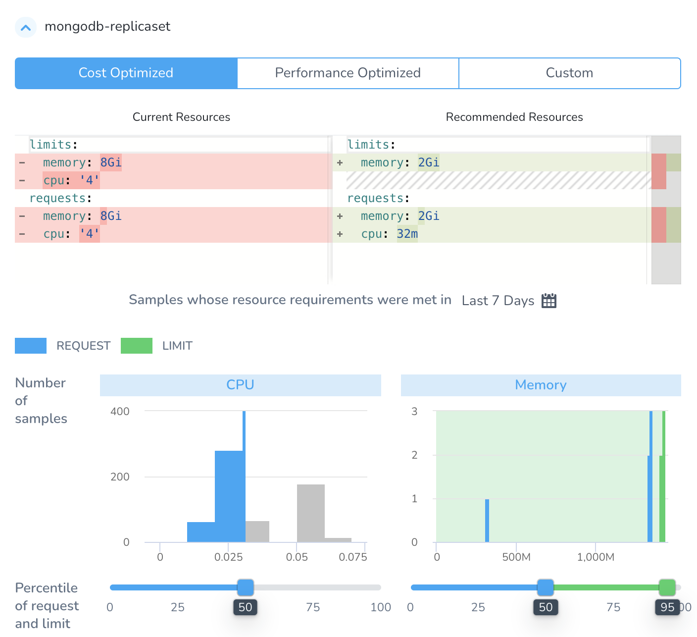

### Cost Optimized

The cost-optimized recommendations are computed as the following:

* The lower bound is based on the 50th percentiles of CPU samples and memory peaks.
* There is no upper bound for CPU samples and memory peaks are based on the 95th percentile. It is recommended not to set the upper bound for the CPU samples, because the CPU is considered a compressible resource. If your application starts hitting the CPU limits, Kubernetes starts throttling the pods.
* There is no limit set for the CPU. This is to avoid the throttling of the workloads when there is a spike in CPU usage. The usage of the CPU may go up in certain conditions, for example during the pod start. In such a scenario, the CPU can burst and get the required additional resources.

Since the recommendations are computed using the 50th percentile of the CPU samples and memory peaks, this may potentially lead to system performance issues. Before using cost-optimized recommendations, ensure that you evaluate the recommendation's impact thoroughly.

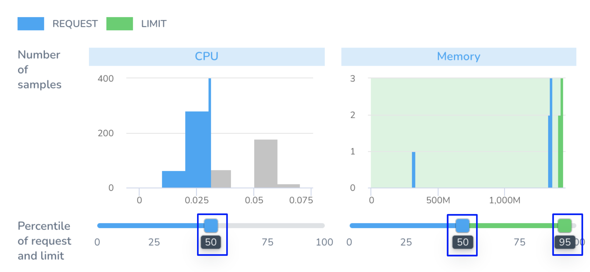

### Performance Optimized

The performance-optimized recommendations are computed using the 95th percentile of CPU samples and memory peaks. Because of which the probability of having any effect on the performance is minimum. However, the cost may go high for the resources that are optimized using this method.

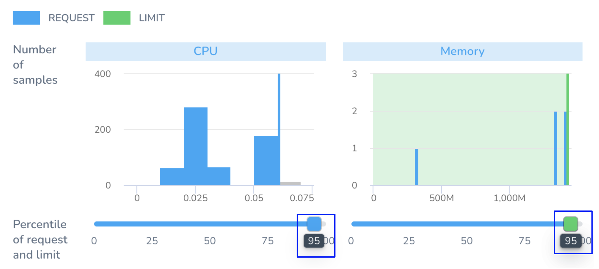

### Custom

The custom option allows you to customize your recommendations by selecting the percentile for CPU and memory sample requests and limit. You can increase or decrease the request and limit coverage of the CPU and memory samples.

Simply drag the slider to adjust the percentile. The slider indicates the percentile of all the CPU and memory samples that are covered to compute the resource recommendations.

Based on your selection, the recommendations for your workload are made.

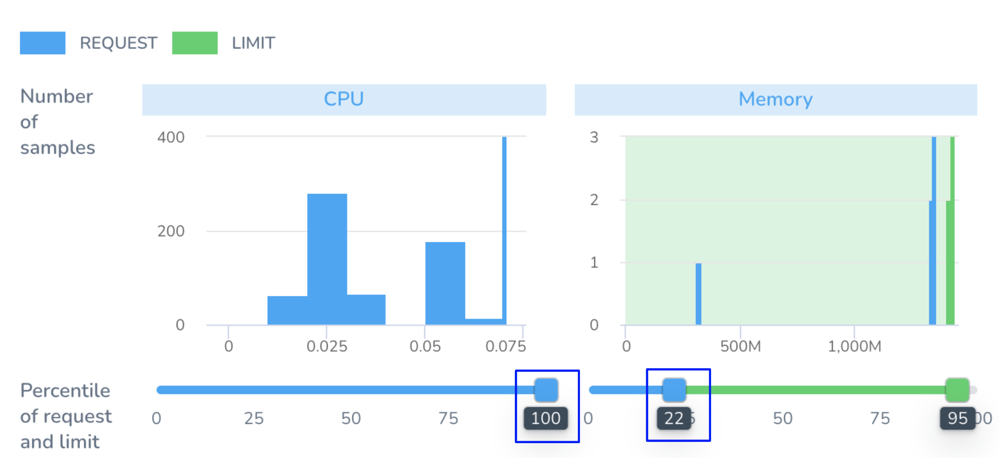

### Examples

Let's try to understand how the recommendations are computed using the following examples:

#### Example A: Cost Optimized

The following example illustrates how the resources can be optimized using the cost-optimized recommendations:

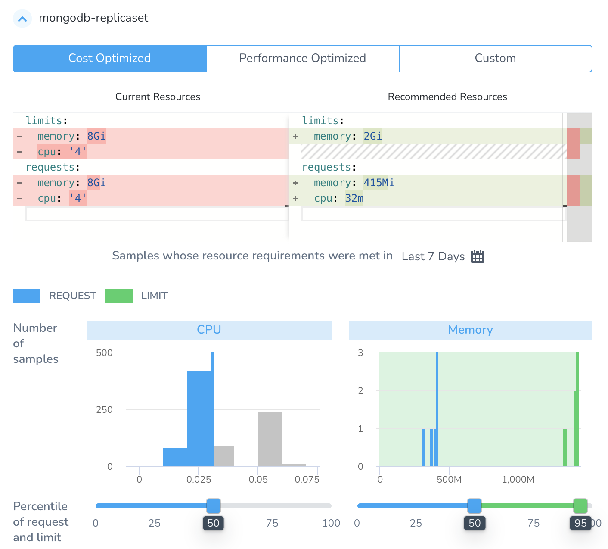
```
Workload Name:  mongodb-replicaset  
 Current Resources:  
  limits:  
    memory: 8Gi  
    cpu: '4'  
   requests:  
     memory: 8Gi  
     cpu: '4'  
   
 Recommended Resources:  
  limits:  
    memory: 2Gi  
  requests:  
    memory: 415Mi  
    cpu: 32m 
```
The current resources are provisioned using `8Gi memory` and `4 CPU`, but the recommended resources require only `415Mi memory` and `32m CPU` for requests.

The cost-optimized recommendations are made by covering 0.025 of all CPU samples and about 400m requests and 1400m limits of memory samples. The coverage is indicated by the position of the slider and the resulting samples are displayed in the histogram distribution.

#### Example B: Performance Optimized

The following example illustrates how the resources can be optimized using the performance-optimized recommendations:

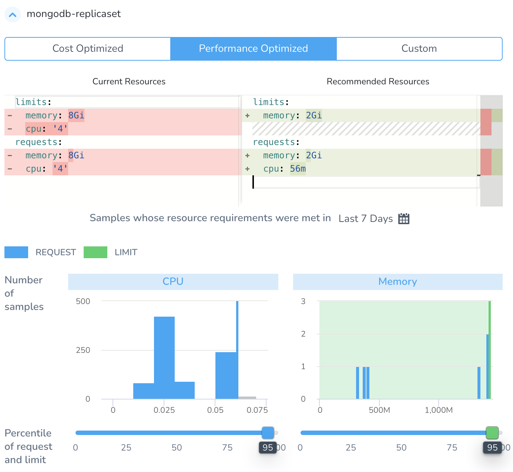
```
Workload Name:  mongodb-replicaset  
 Current Resources:  
  limits:  
    memory: 8Gi  
    cpu: '4'  
   requests:  
     memory: 8Gi  
     cpu: '4'  
   
 Recommended Resources:  
  limits:  
    memory: 2Gi  
  requests:  
    memory: 2Gi  
    cpu: 56m 
```
The current resources are provisioned using `8Gi memory` and `4 CPU`, but the recommended resources require only `2Gi memory` and `56m CPU` for requests.

The performance-optimized recommendations are made by covering about 0.06 CPU samples and about 400m requests and 1400m limits of memory samples. The coverage is indicated by the position of the slider and the resulting samples are displayed in the histogram distribution.

#### Example C: Custom

In Custom you can drag the slider to adjust the request and limit coverage of the CPU and memory samples.

For example, you set the histogram to cover 64th percentile of CPU, 25th percentile of the memory request, and 100th percentile of memory limit sample:


  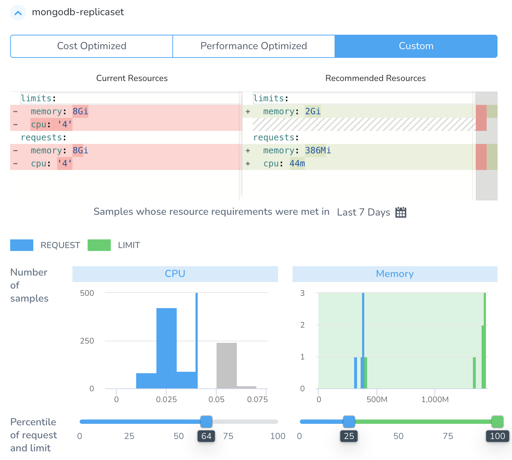


```
Workload Name:  mongodb-replicaset  
 Current Resources:  
  limits:  
    memory: 8Gi  
    cpu: '4'  
   requests:  
     memory: 8Gi  
     cpu: '4'  
  Recommended Resources  
   limits:  
     memory: 2Gi  
   requests:  
     memory: 386Mi  
     cpu: 44m
```
The current resources are provisioned using `8Gi memory` and `4 CPU`, but the recommended resources require only `386Mi memory` and `44m CPU` for requests.

The custom recommendations are made by covering about 0.04 CPU samples and about 400m requests and 1400m limits of memory samples. The coverage is indicated by the position of the slider and the resulting samples are displayed in the histogram distribution.

### View Recommendations

You can view recommendations for your cluster from the Cost Explorer **Overview** and **Cluster** tab. Cost Explorer makes recommendations to optimize your workloads to potentially reduce your monthly cloud cost.


:::note
Once you enable CCM, it may take up to 48 hours for the recommendations to appear in the Cost Explorer. It depends on the time at which CCM receives the utilization data for the workload.
:::


#### Step: View Recommendations From the Overview Tab

The **Overview** page displays the top recommendations for your Kubernetes clusters. To view recommendations from the **Overview** tab, perform the following steps:

1. In **Cloud Cost Management**, click **Explorer**.
2. In **Overview**, click **TOP RECOMMENDATIONS**.
   
    
    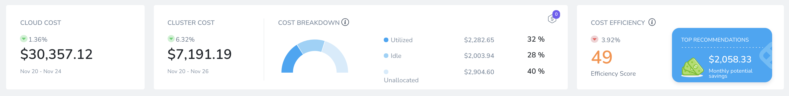
   
   
   The top **Recommended Actions** are listed. The list is sorted based on the highest potential savings.
   
   
:::note
The Overview page lists the recommendations only if the monthly cost-saving is greater than 20$. However, you can view all the recommendations for that workload in the workloads detail view under the [Cluster](/docs/first-gen/cloud-cost-management/ccm-recommendations/recommendations.md#step-view-recommendations-from-the-cluster-tab) tab.
:::

   
  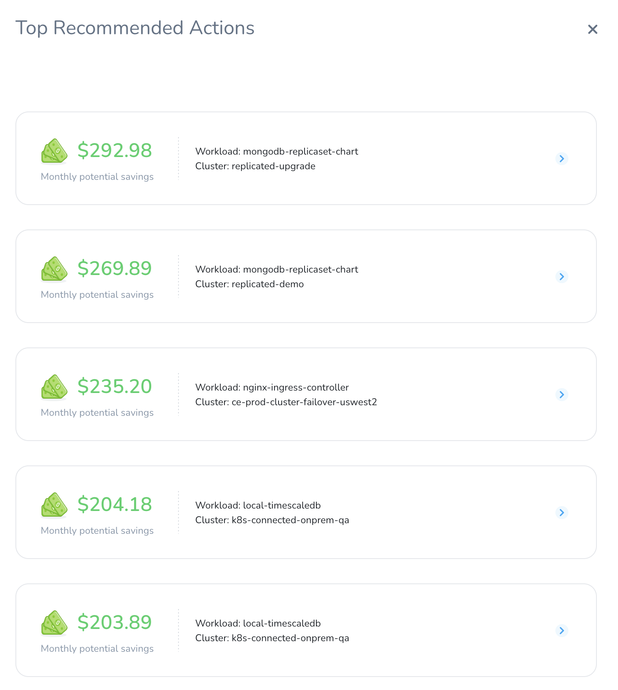


3. Click on the Recommended Action for which you want to view the details. You can also use the right arrow button.
   
     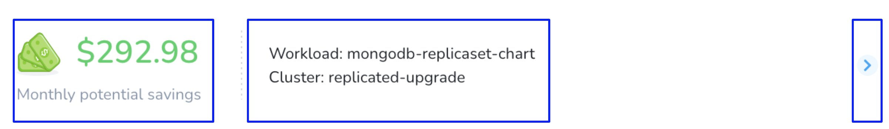
     
  The **Recommended Actions** are displayed. In this example, the recommendation engine has analyzed 4 days of data. Based on the analysis the recommended actions are provided to optimize your resources to potentially save $292.98 on the monthly bill.
  
  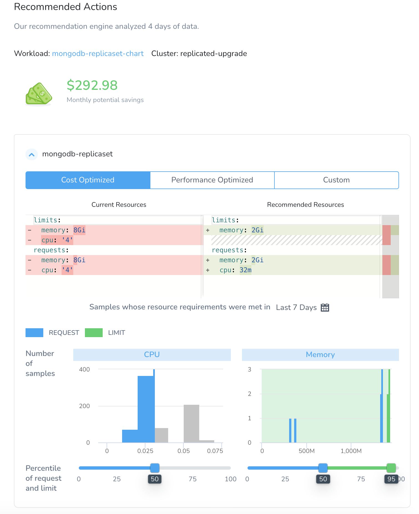

4. Click on the **Workload** to view further granular details. Alternatively, click **<-** arrow to go back.
   
     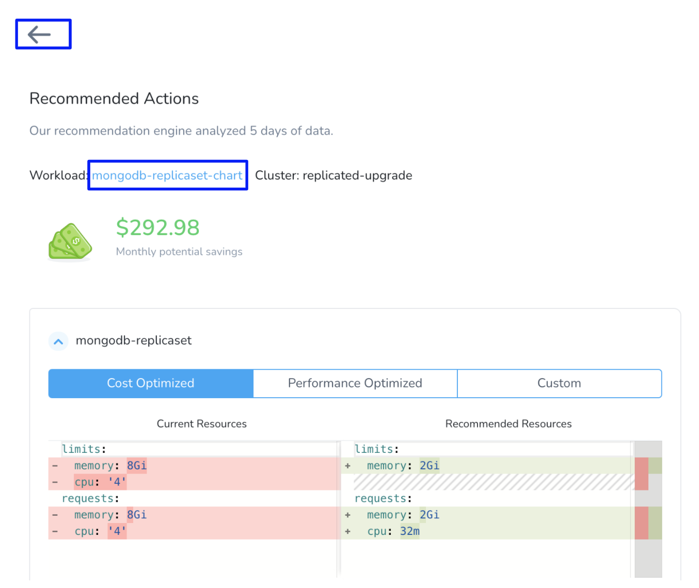
   
   The root cost analysis for the selected workload is displayed. For more information, see [Root Cost Analysis for Workloads](/docs/first-gen/cloud-cost-management/root-cost-analysis/analyze-cost-trends-for-aws.md).
   
      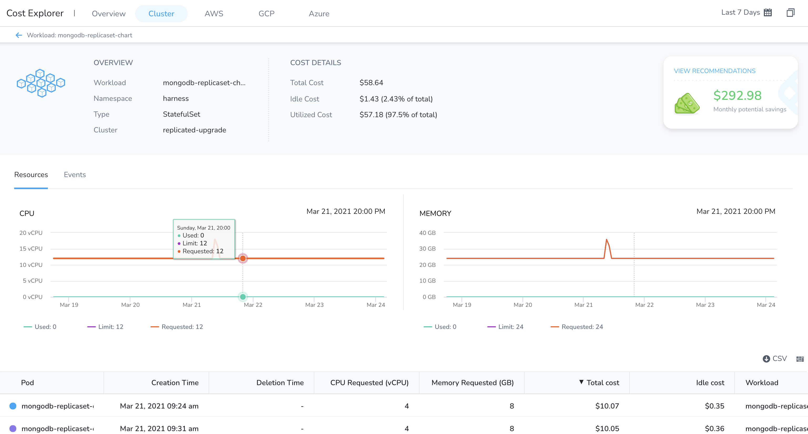

You can use this information to optimize your resources to potentially reduce your monthly cloud costs.

#### Cost Optimized

Perform the following steps to view the [cost-optimized](/docs/first-gen/cloud-cost-management/ccm-recommendations/recommendations.md#cost-optimized) recommendations:

1. In **Recommended Actions**, select **Cost Optimized**.
2. In **Recommended Resources**, the recommended CPU and memory limits and requests are listed.  
  
Since the recommendations are computed using the 50th percentile of the CPU samples and memory peaks, this may lead to system performance issues. Before using cost-optimized recommendations, ensure that you evaluate the recommendation's impact thoroughly.

  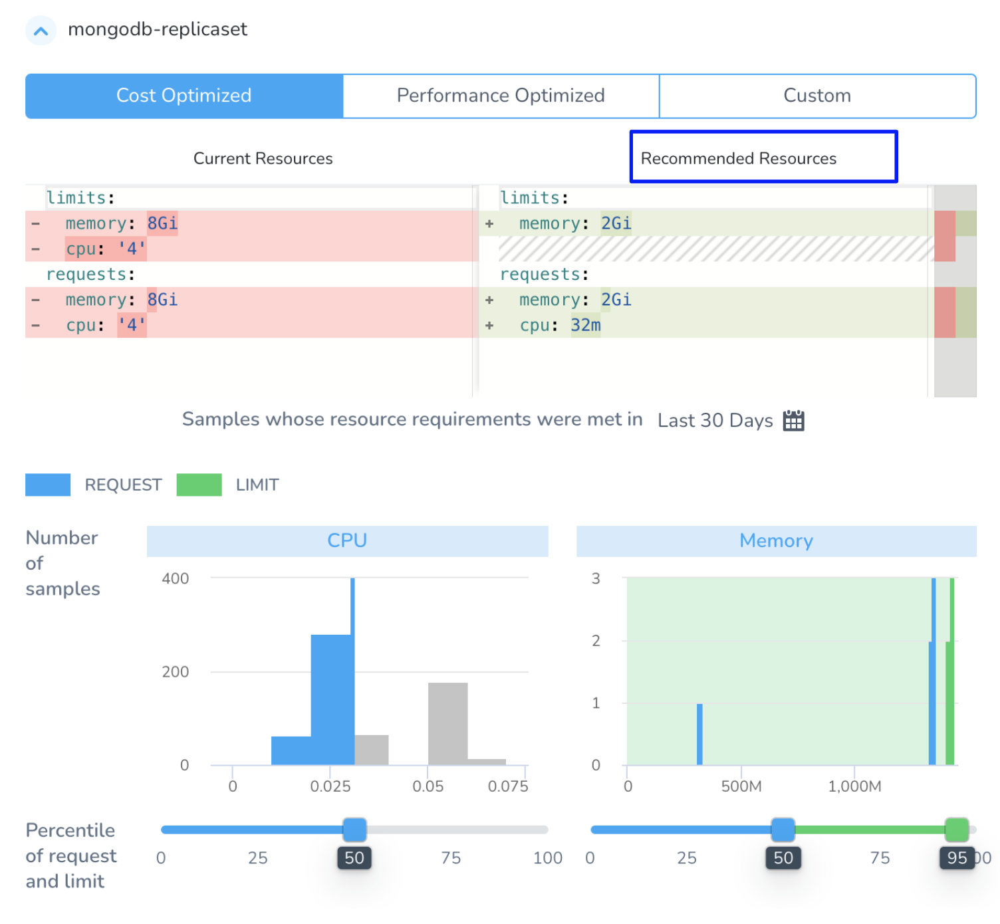
3. The graph displays the number of CPU and memory samples and the percentile at which the recommendations are computed. Drag the slider to increase or decrease the request and limit coverage of the CPU and memory samples. The slider indicates the percentile of all the CPU and memory samples that are covered to compute the resource recommendations.  
  
As you drag the slider in **Cost Optimized** to change the percentile of CPU and memory request and limit, you will view the [Custom recommendations](/docs/first-gen/cloud-cost-management/ccm-recommendations/recommendations.md#custom).

#### Performance Optimized

Perform the following steps to view the [performance-optimized](/docs/first-gen/cloud-cost-management/ccm-recommendations/recommendations.md#performance-optimized) recommendations:

1. In **Recommended Actions**, select Performance **Optimized**.
2. In **Recommended Resources**, the recommended CPU and memory limits and requests are listed.  
  
The performance-optimized recommendations are computed using the 95th percentile of CPU samples and memory peaks. Because of which the probability of having any performance issue is minimum. However, the cost may go high for the resources that are optimized using this method.

  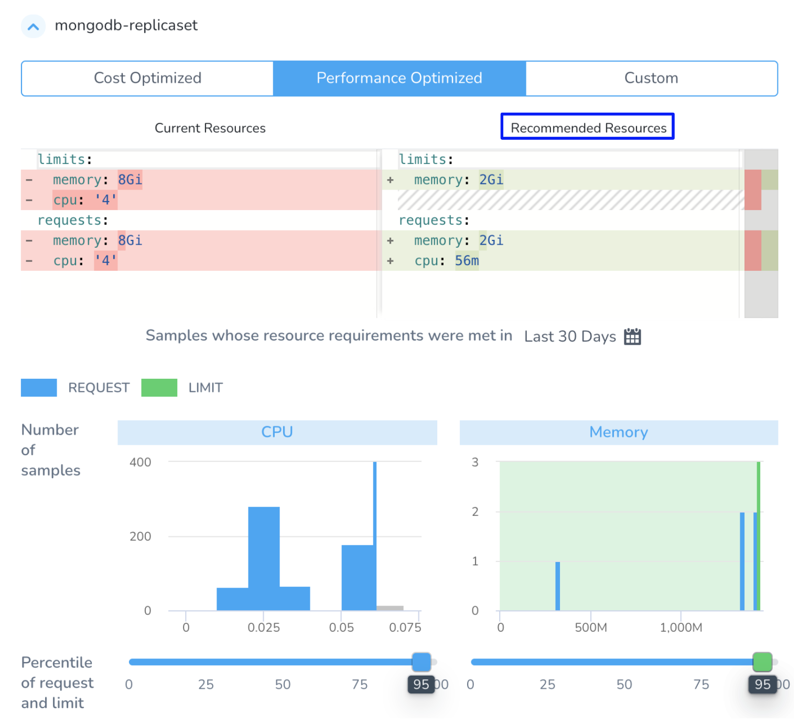

3. The graph displays the number of CPU and memory samples and the percentile at which the recommendations are computed. Drag the slider to increase or decrease the request and limit coverage of the CPU and memory samples. The slider indicates the percentile of all the CPU and memory samples that are covered to compute the resource recommendations.  
  
As you drag the slider in **Performance Optimized** to change the percentile request and limit, you will view the [Custom recommendations](/docs/first-gen/cloud-cost-management/ccm-recommendations/recommendations.md#custom).

#### Custom

The **Custom** option allows you to customize your recommendations by selecting the CPU and memory sample requests. Perform the following steps to view the [custom](/docs/first-gen/cloud-cost-management/ccm-recommendations/recommendations.md#custom) recommendations:

1. In **Recommended Actions**, select **Custom**.
2. Drag the slider to increase or decrease the percentile of request and limit. The recommended CPU and memory limits and requests are listed.

### Step: View Recommendations From the Cluster Tab

To view recommendations from the **Cluster** tab, perform the following steps:

1. In **Cloud Cost Management**, click **Explorer** and then click **Cluster**.
2. Select the **date range** for the costs you want to analyze.
3. In **Group by**, select **Workload**to list all the workloads. Use the **Filter** settings to select a specific workload. You can also use the search option to search from the available workloads.
   
     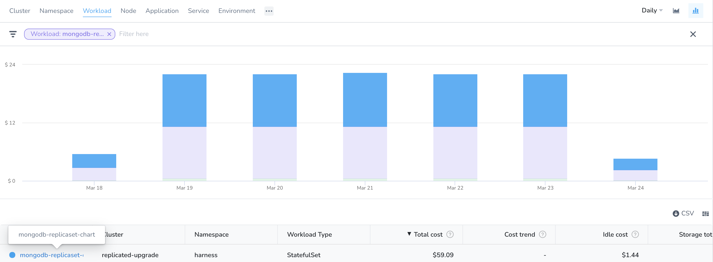
4. Click on the workload for which you want to view the recommendations and click **VIEW RECOMMENDATIONS**.
     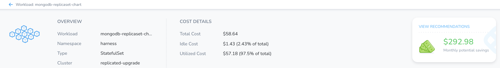
     
  The **Recommended Actions** are displayed. See [Cost Optimized](/docs/first-gen/cloud-cost-management/ccm-recommendations/recommendations.md#cost-optimized), [Performance Optimized](/docs/first-gen/cloud-cost-management/ccm-recommendations/recommendations.md#performance-optimized), and [Custom](/docs/first-gen/cloud-cost-management/ccm-recommendations/recommendations.md#custom).  
  
In this example, the recommendation engine has analyzed 4 days of data. Based on the analysis the recommended actions are provided to optimize your resources to potentially save $292.98 on the monthly bill.

  

You can use this information to optimize your resources to potentially reduce your monthly cloud costs.

