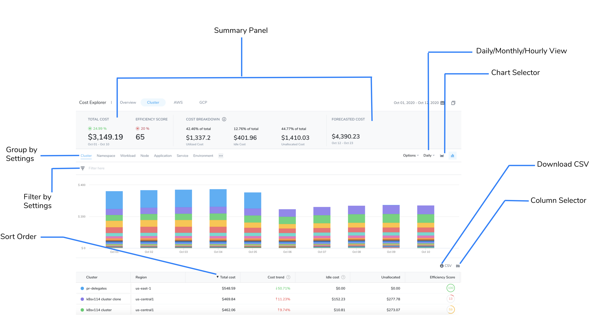
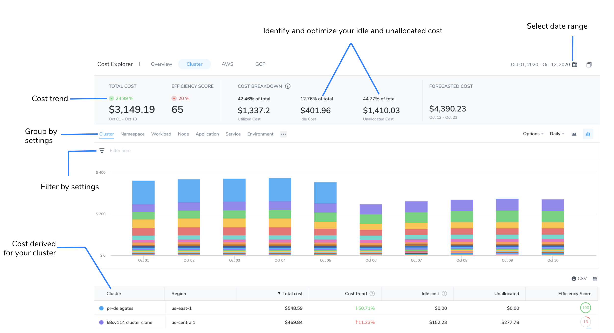
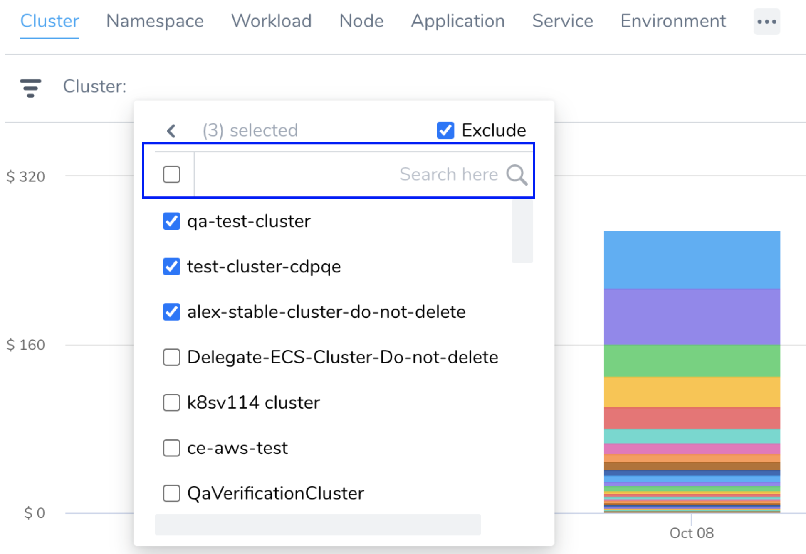
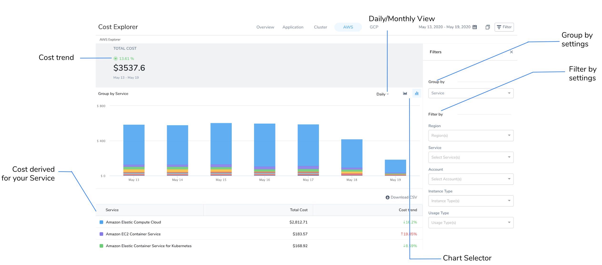
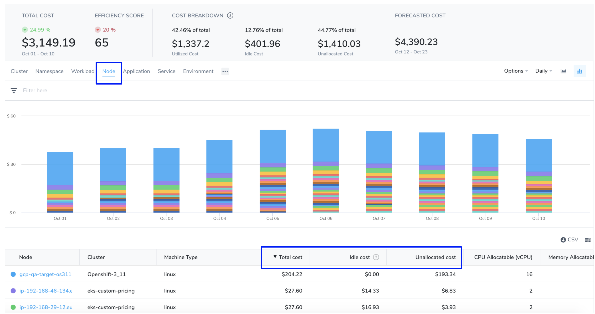
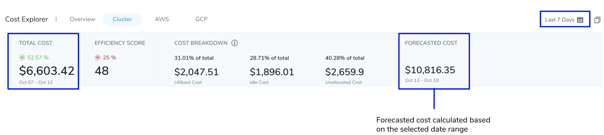
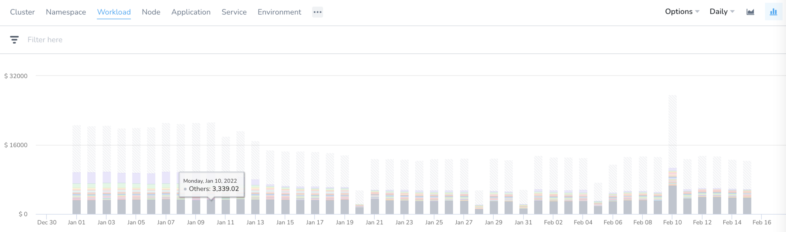
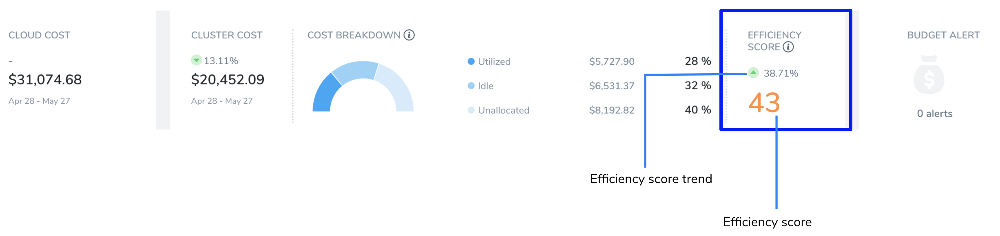

Harness Cloud Cost Management (CCM) Cost Explorer allows you to view, understand, and analyze your cloud costs in a simple and intuitive interface.

On the **Overview** tab, the dashboard provides a quick summary of your cloud and cluster spend. On the **Cluster**, **AWS**, **GCP**, and **Azure** tabs get deep insights into your resource usage, cost drivers, and cost trends.

The following are the key features of Cost Explorer:

* Filter your data by Harness Application, Service, Environment, and Tags.
* Filter your data by Kubernetes or ECS cluster, namespace, node, workload, and label.
* Filter your data by AWS region, account, instance type, and usage type.
* Filter your data by GCP product, project, SKU, and region.
* Filter your data by Azure region, product, label, resource group, etc.
* View the cost breakdown of your resources. For example, total, idle, utilized, and unallocated costs.
* View forecasted cost based on the historical data.
* View hourly, daily, weekly, or monthly granular details.
* View an Efficiency Score: a measurement of how cost-optimized your resource usage is across your clusters.


### Visual Summary
<!-- Video:
https://harness-1.wistia.com/medias/rpv5vwzpxz-->
<docvideo src="https://www.youtube.com/watch?v=sXftHXhSlo0" />

### Reading the Cost Explorer Data

The **Cost Explorer** displays data as a chart and table. You can view, understand, and analyze your usage and cost data using either of them.

* Specify a different chart display style using the **Line Chart**/**Bar Chart** selector. You can also choose the **Daily/Monthly/Hourly** view.
* Change the sort order of the data in the table by clicking on the column header. The direction of the arrow indicates if you are sorting largest to smallest (down arrow) or smallest to largest (up arrow). To reverse the sort order on the selected column, click the column header again.
* The **Group by** setting determines what data will be presented in the chart and the table. You have multiple options available to customize your Cost Explorer view including filters and other settings. Your view changes depending on the filter selections you choose.
* The summary bar above the chart provides a summary of the total cost, cost breakdown, forecasted cost, and cost trend.
* Download the CSV format of the report for your reference.
  
    

### Cost Explorer Overview

Get a summary of your total spend by Harness Application and cluster from the **Cost Explorer Overview** tab. The **Overview** tab displays the following information based on the selected date range:

* Total cluster cost
* Cost breakdown
* Budget alert
* Efficiency score
* Top recommendations
* Top Application by spend
* Top cluster by spend
* Top cloud accounts by spend


### Cost Explorer by Cluster

The **Cost Explorer Cluster** tab displays the following information based on the selected date range:

* **All Clusters**: Displays the total cost, cost breakdown, and cost trend.
* **Group by** and **Filter by**: The **Group by** and **Filter by** settings determine what data will be presented in the chart and the table. Based on your selection the data is populated.
* **Idle cost** and **Total cost**: Displays the idle or total cost for your selected cluster.
  
    
* **Search**: You can filter and customize your result using the search option.
	+ Enter the keywords in the search field.
	+ Use the checkbox to select multiple options.
 
   
* **Exclude**: Allows to exclude the specific options.
* **Supported Group by** and **Filter Combination**: You can customize your cloud cost view by using different group by and filter combinations. The following options are supported by the group and filter settings:  


| **Group By** | **Filter** |
| --- | --- |
| Application, Service, Environment, Tag, Cloud Provider | Application, Service, Environment, and Cloud Provider |
| Workload and Namespace | Workload, Namespace, Node, Cluster, and Label |
| Node | Node and Cluster |
| ECS Service, Task, and LaunchType | ECS Service, Task, Launch Type, and Cluster |


:::note
If you select an unsupported combination, **invalid combination of group by and filters** error is thrown.
:::

### Cost Explorer AWS

The **Cost Explorer AWS** tab displays the following information based on the selected date range:

* **AWS total cost**: Displays the total AWS cost and cost trend.
* **Group by Service**, **Account**, **Instance Type**, **Usage Type**, and **Region**: The **Group by** setting determines what data will be presented in the chart and the table. Based on your selection the data is populated.
  
    

### Cost Explorer GCP

The **Cost Explorer GCP** tab displays the following information based on the selected date range:

* **GCP total cost**: Displays the total GCP cost and cost trend.
* **Group by Project**, **Product**, **SKUs**, and **Region**: The **Group by** setting determines what data will be presented in the chart and the table. Based on your selection the data is populated.

### Cost Explorer Azure

The **Cost Explorer Azure** tab displays the following information based on the selected date range:

* **Azure total cost**: Displays the total Azure cost and cost trend.
* **Group By Azure**, **Region**, **Product**, and Label: The **Group By** setting determines what data will be presented in the chart and the table. Based on your selection the data is populated.

### Key Cost Concepts

This section defines different CE cost concepts.


:::note
For ECS clusters, you can replace nodes with container instances and pods with tasks.#### Node Cost
:::

Node cost is calculated based on the public pricing API of the cloud platform.



Here is an example of how node cost is calculated based on the following node specification:


| | |
| --- | --- |
| **Operating system** | Linux |
| **Region** | us-central1 |
| **Instance family** | n1-standard-4 |
| **Instance Category** | ON\_DEMAND |

As per the cloud platform pricing, the per hour price of  n1-standard-4 in us-central1 is $0.1900.

Here is the formula:


```
Cost for 24 hours = 24 * 0.1900 = $4.56.
```
Typically nodes are the same size. If they are running for a full day and are the same size, the cost will be the same.#### Pod cost

Pod cost is a ratio of the cost of the node it is running on. The price is equally distributed among CPU and memory. The following formula is used to calculate the pod cost:


```
Hourly pod cost = ((podCPU/nodeCPU) * nodeCPUPricePerHour) + ((podMemory/nodeMemory)) * nodeMemoryPricePerHour)
```
Here is an example of a pod cost calculation:


```
Pod Resources = (cpuUnits: 1024, memoryMB: 4096)  
Node Resource = (cpuUnits: 4096, memoryMB: 15360) n1-standard-4  
Node Resource = (cpuUnits: 4096, memoryMB: 15360) n1-standard-4  
Pod cost = ((1024/4096)  * 0.095 ) + ((4096/15360)) *  0.095) = 0.0490833333
```
#### System Cost

System cost is calculated by subtracting the total cost of the node from the allocatable resource cost.

Allocatable on a Kubernetes node is defined as the amount of compute resources that are available for pods. For more information, see [Reserve Compute Resources for System Daemons](https://kubernetes.io/docs/tasks/administer-cluster/reserve-compute-resources/) in Kubernetes.


Here is the formula:


```
System cost = total cost of node - allocatable resource cost
```
System cost is used when calculating Unallocated Cost, described below.

#### Unallocated Cost

Unallocated cost is applicable for nodes only. There is no concept of unallocated costs for pods.Unallocated cost is the cost of unallocated node resources in a Kubernetes cluster or unallocated container instances in an ECS cluster.


```
Unallocated cost of node = node cost - the cumulative sum of pod costs running on that node - system cost of the node
```

```
Unallocated cost of cluster = sum of the node’s unallocated cost running in the cluster
```
#### Idle Cost

Idle cost is the cost of idle resources (CPU and memory) allocated to a Kubernetes pod or an Amazon ECS task but is not utilized.

Here is an example of pod idle cost calculation:


```
Instance cost = 75$, CPU cost = 25$,  Memory cost = 50$  
Avg cpu util = 75%, Avg memory util = 25%  
  
CPU Idle cost = (25) * (1 - .75) = 6.25  
Memory Idle cost = (50) * (1 - .25) = 37.50  
  
Idle Cost= 6.25 + 37.50 = 43.75$ 
```
Node Idle cost = Cost of unutilized resources - unallocated resource

Here is an example of node idle cost calculation:


```
Instance cost = 75$, CPU cost = 25$,  Memory cost = 50$  
Avg cpu util = 75% , Avg memory util = 75%  
CPU Idle cost = (25) * (1 - .75) = 6.25  
Memory Idle cost = (50) * (1 - .75) = 12.5  
  
Unallocated cost of cpu = 2.5$, Memory = 10$  
  
Idle Cost = 6.25 + 12.50 - 2.5 - 10 = 6.25$
```
#### Total Cost

For Kubernetes clusters, the total cost is the sum of all the node costs. For ECS clusters, the sum of all container instances.

#### Utilized Cost

Utilized cost is the cost estimate for the utilized node or pod resources.


```
Utilized cost = Total cost - node idle cost - unallocated cost
```
#### Forecasted Cost

Forecasted costs are predictions based on your historical cost data. The forecasted date is applicable only where historical data exists. If there is insufficient data to compute the forecast, the value is not displayed. The forecasted cost is predicted for the same future time period as your selected date range.



The following table lists some of the examples for forecasted cost calculation. In this example, the current date is considered as **March 30, 2020.**


| **Selected** **Date Range** | **Forecasted Date Range** |
| --- | --- |
| Predefined date range, for example, Last 7 days, Last 30 days, Last month, and so on | Calculated for the next 7 days, next 30 days, or next month based on the selected date range |
| Custom date range, for example, March 25 - 30 (6 days) | March 31 - April 5 (next 6 days) |
| Future date range, for example, March 25 - April 3 (invalid date range) | Not applicable |
| Past date range, for example, March 1 -15 | Not applicable |

#### Cost Trend

The cost trend is calculated based on the previous spending. It can be calculated only if the previous data is available. 

#### Others Cost

The cluster dashboard can list data for up to 100 resources. If there are more than 100 resources in your environment, the details of these resources are clubbed and displayed as one single entity as **Others**. These clusters are generally very small that they would not be visually discernible. For more information, see [Group By and Filter Options](/docs/first-gen/cloud-cost-management/root-cost-analysis/analyze-cost-trends-across-clusters.md#group-by-and-filter-options).



#### Efficiency Score

A measure of how cost-optimized your resource usage is across your clusters. It is derived from the total and idle (and or unallocated) spend of your resources. Efficiency score and trend is displayed on the Overview page as the following:



Efficiency score display uses the following visual cues:

* **Green (Healthy)**: 61 - 100 range; indicates that the cost of your resources across clusters is well optimized
* **Orange (Medium)**: 31- 60 range; indicates that the cost of your resources across clusters can be optimized better
* **Red (Poor)**: 0 - 30 range; indicates that the cost of your resources are not well optimized and needs immediate attention

The efficiency score is the deviation of actual utilization from the expected utilization baseline.


```
Expected utilization baseline = utilized resources (100 - x - y)%,   
where  x% is allowed unallocated cost and y% is allowed idle cost
```
Here is an example:


```
Allowed unallocated resources = 5% of the total cost  
  
Allowed idle resources = 30% of the total cost  
  
Utilized resources baseline defined = 65%  
  
If the utilization is 58% of total cost, then the efficiency score =   
[1 - [(65-58)/65]] * 100 ~ [89 efficiency score]
```
### Context and Visibility

Cost Explorer provides context and visibility into the following:


- Cluster 
- Namespace
- Workload 
- Node 
- Application  
- Harness Service 
- Environment 
- Region 
- Usage Type 
- Account 
- Service 
- Instance Type 
- Products 
- Project 
- SKUs

 


