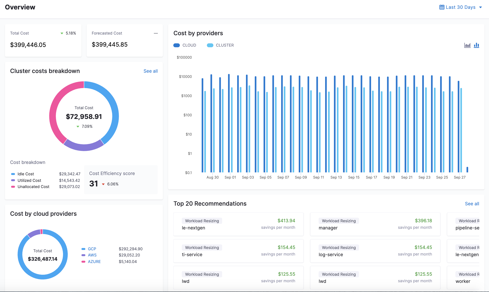
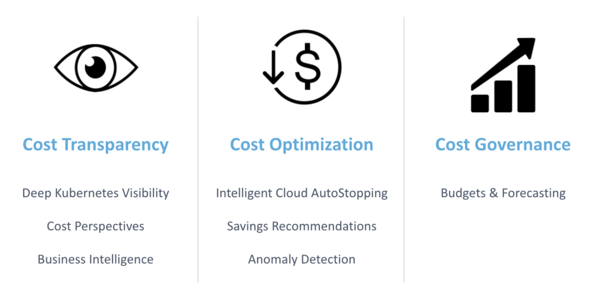

Harness Cloud Cost Management (CCM) is an intelligent cloud cost management solution for FinOps, Infrastructure, and Engineering teams. Harness CCM provides:

* Complete cost transparency across engineering and finance with robust business intelligence (BI)
* Ability to reduce wasted cloud costs by up to 75% with Intelligent Cloud AutoStopping

## What is Cloud Cost Management?

Harness Cloud Cost Management (CCM) is a simplified cloud cost management tool for FinOps, Infrastructure, and Engineering teams.

### Cost Transparency

From the CFO to the engineer, CCM provides contextually relevant visibility into cloud costs so that they can be understood at any level of the organization, from high-level business intelligence to the individual resource level. 

Costs across AWS, GCP, Azure, and Kubernetes (K8s) are all easily accessible, and using Cloud Cost Business Intelligence the data can be presented for any necessary scenario across engineers, budget owners, financial management, or executives.

Actionable insights into your workloads & clusters’ utilized, idle and unallocated resources. Correlate costs due to deployments, changes in replica count, CPU or memory configurations, cost events and specific lines of code, etc.

### Cost Optimization

Implementing cost savings shouldn’t be tedious for engineers. For manual cost savings recommendations across K8s workloads and nodes, Harness provides built-in validation and cost vs. performance customization so engineers can skip straight to implementation. And with Intelligent Cloud AutoStopping, engineers can **automate** idle resource management across AWS, GCP, Azure, and K8s without taking on any risk. 

In scenarios where cloud costs unexpectedly spike, CCM has FinOps and engineering teams covered with anomaly detection, which surfaces issues and their origins as soon as they happen, so customers can avoid pricey cost snowballs they won’t see until the end of the month.

### Cost Governance

Creating cost predictability requires process, policy, and collaboration. Tagging resources to create visibility is a big pain point for customers that CCM obviates. With budgeting and forecasting capabilities, Harness CCM keeps teams accountable for their spend and helps them proactively avoid budget overruns. 

## Why Harness' Cloud Cost Management?

Harness Cloud Cost Management provides the following benefits:

* Automatically shuts down idle VMs and containers, and dynamically runs them on spot instances with no interruptions, reducing costs by up to 75%.
* Provides deep Kubernetes cost visibility & root cost analysis, and recommends ways to optimize idle/unallocated cloud spend, making containers a first-class citizen in cloud cost management.
* Intelligently achieve cost attribution, showback, and chargeback by mapping organizational hierarchies to teams and projects with a modern BI experience, ultimately driving accountability.

Some of the unique challenges that CCM addresses are:

* **Getting engineers to take action** – Cutting down the effort required for an engineer to implement an optimization by surfacing the most important information as it’s needed. In other cases, this means automating menial tasks like turning off compute instances that can rack up big bills over time.
* **Accurate forecasting** – Aligning cost centers to budgets and providing an accurate forecasting model that helps budget owners understand how they’re trending, and when they need to take action.
* **Reducing waste or unused resources** – Providing tailored recommendations for where to optimize the infrastructure based on idle or unallocated resources. Using Cloud AutoStopping to automate detection and shutdown of idle resources to minimize wastage.
* **Container costs** – Visibility into container costs across all cloud providers and Kubernetes, showing utilized, idle, and unallocated costs. Recommendations at the Node and Workload level to optimize container costs.
* **Aligning Finance to tech teams** – Using Cloud Cost Business Intelligence and Perspectives to create cost transparency across the organization. Doing Budgeting & Forecasting to get teams on the same page about cost expectations vs. reality. Enforcing cost management policies at the infrastructure level to avoid issues altogether.

## CCM Coverage

The following section lists where you can use CCM:

* Cloud Platforms
	+ AWS
	+ GCP
	+ Azure
* Container Orchestration
	+ Kubernetes: EKS (AWS), GKE (GCP), AKS (Azure)
	+ ECS Clusters
* Harness SaaS

Harness Connected On-Prem and Harness Disconnected On-Prem are not supported.### Supported Kubernetes Management Platform

The following section lists the support for Kubernetes management platform for CCM:

| **Technology** | **Supported Platform** | **Pricing** |
| --- | --- | --- |
| OpenShift 3.11 | GCP | GCP |
| OpenShift 4.3 | AWSOn-Prem | AWSCustom-rate\* |
| Rancher | AWS | Custom-rate\*\* |
| Kops (Kubernetes Operations) | AWS | AWS |
| Tanzu Kubernetes Grid Integrated Edition (TKGI) | On-Prem | Custom-rate\*\*\* |

\*Cost data is supported for On-Prem OpenShift 4.3. This uses a custom rate.

\*\*Cost data is supported for K8s workloads on AWS managed by Rancher, but the cost falls back to the custom rate.

\*\*\*Cost is computed using a custom rate. This can be modified by Harness on request.

## Feature Support Matrix

This section lists the feature support matrix for the supported cloud platforms:

### AWS Service

|  | **Inventory Dashboard** | **Recommendations** | **AutoStopping** |
| --- | --- | --- | --- |
| **EC2** | Yes | Coming soon | Yes (With Spot Orchestration) |
| **ECS** | Yes | Coming soon | Yes |
| **EKS** | Yes | Yes | Yes |
| **RDS** | Yes | No | Yes |
| **EBS** | Yes | No | No |
| **Snapshots** | Yes | No | NA |
| **Elastic** **IPs** | Yes | No | NA |
| **ASGs** | No | No | Yes (With Spot Orchestration) |

### GCP Product

|  | **Inventory Dashboard** | **Recommendations** | **AutoStopping** |
| --- | --- | --- | --- |
| **GCE VMs** | Yes | Coming soon | Coming soon |
| **GKE** | Yes | Yes | Yes |

### Azure Product

|  | **Inventory Dashboard** | **Recommendations** | **AutoStopping** |
| --- | --- | --- | --- |
| **Virtual Machine** | Coming soon | Coming soon | Yes (With Spot Orchestration) |
| **AKS** | Yes | Yes | Yes |

## CCM Data Retention Policy

CCM is available in three different editions to meet different users' needs:

* Free
* Team
* Enterprise

CCM has a data retention policy per edition. After this period, the data is cleared out and no longer available.

| **Free** | **Team** | **Enterprise** |
| --- | --- | --- |
| 1 month | 5 Years | 5 Years |

The hourly granularity of cluster data is retained for 14 days, post that CCM retains daily granularity of the data.### Blog Post

The following blog post walks you through Kubernetes Cost Analysis:

[**Kubernetes Cost Analysis**](https://harness.io/blog/kubernetes-cost-analysis/)

