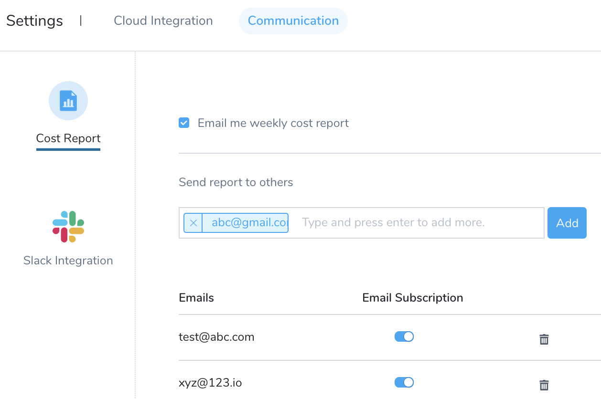

You can specify a communication strategy to receive your consolidated Harness Cloud Cost Management (CCM) weekly cost report. The cost report can be sent to an email address or you can set [Slack notifications](/docs/first-gen/cloud-cost-management/cost-report/set-up-slack-notifications.md).

### Step: Send Weekly Cost Report Using Email

You can receive your weekly cost report to your email address. Perform the following steps to add your email address:

1. In **Cloud Cost Management**, in **Settings**, click **Communication**.
2. In **Cost Report**, select the checkbox **Email me weekly cost report**.
   
   
3. In **Send report to others**, enter the email address to which you want to receive the weekly cost report and click **Add**.
4. Turn on the **Email Subscription** to receive the weekly cost report. To delete the subscription, select the **trashcan** icon or turn off the **Email Subscription**. Selecting the trashcan icon deletes the subscription as well as removes the email address from the list.  
  
Now you will receive your weekly cost report to your email address.

  

