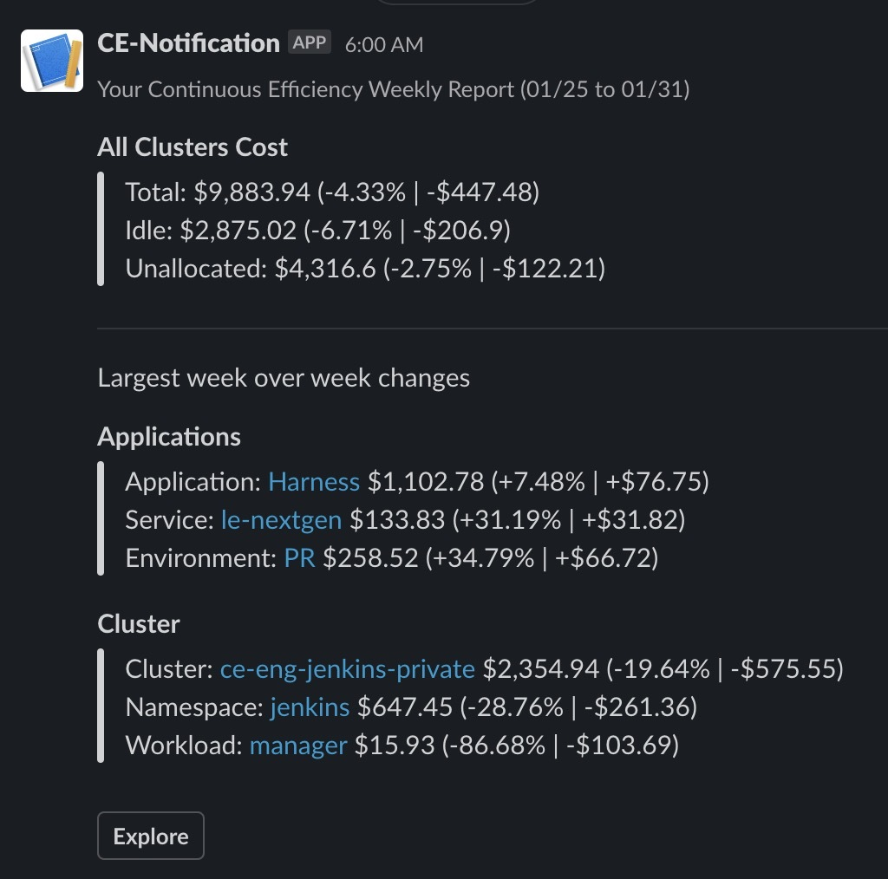

You can specify a communication strategy to receive your consolidated Harness Cloud Cost Management (CCM) weekly cost report. The cost report can be sent to an [email address](/article/bkmsz6bi79-set-communications) and a slack channel.

### Before You Begin

* [Cloud Cost Management Overview](/article/rr85306lq8-continuous-efficiency-overview)
* [Cost Explorer Overview](/article/bpo4erm04r-navigating-through-cost-explorer)
* [Analyze Cost for Kubernetes](/article/4rq26sszja-analyze-cost-trends-across-clusters)
* [Analyze Cost for AWS](/article/244q2uv4or-analyze-cost-trends-for-aws)
* [Analyze Cost for GCP](/article/oo4vs4exhz-analyze-cost-for-gcp)

### Step: Send Weekly Cost Report Using Slack

You can receive your weekly cost report in your Slack channel. You simply need to add a Slack Incoming Webhook URL in Harness. Perform the following steps to configure your slack channel:  

1. In **Cloud Cost Management**, in **Settings**, click **Communication**.
2. In **Slack Integration**, enter the Slack Webhook URL of the channel to which you want to send the weekly cost report and click **Update**.
	1. Follow the steps in Slack documentation for creating a Slack app, selecting your channel, and creating a webhook:  [Sending messages using Incoming Webhooks](https://api.slack.com/messaging/webhooks).  
	  
	When you are done, you'll have a webhook that looks something like this:
	2. Copy the Webhook URL.
3. In **Slack Integration**, enter the Slack Webhook URL of the channel to which you want to send the weekly cost report and click **Update**.
4. In **Send Notification**, select the checkbox **Weekly Cost Report**.  
  
Now you will receive your weekly cost report in the configured Slack channel.

