Harness Cloud Cost Management (CCM) is a solution that provides engineers and DevOps granular detail of their resource consumption hourly. CCM is designed to bring cloud cost analysis and management into the hands of the engineers consuming cloud resources.

Harness CCM trial edition is a free 15-day trial of almost all Harness Professional features. During the trial period, you can enable Cloud Cost Management for a maximum of two clusters and one cloud account (AWS or GCP).

Once the trial period ends, it provides an additional 15-days grace period. However, during the grace period, you will not be able to drill down into the details of your costs.

Whether you are new to Harness or an existing Harness user, feel free to take Harness CCM out for a spin.

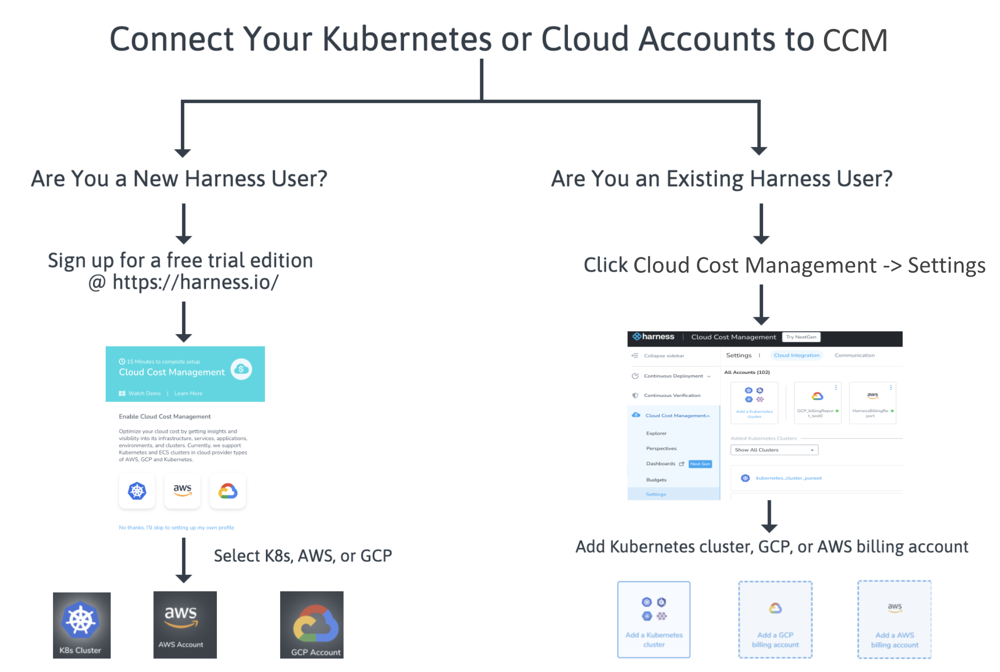


## Existing User


:::note
You need to have Harness Account Administrator permissions to sign up for the CCM trial edition. 
:::

If you are an existing Harness user and want to sign up for the CCM trial edition, perform the following steps:

1. In **Cloud Cost Management**, click **Settings**.
2. In **Cloud Integration**, select the Kubernetes cluster or cloud account for which you want to enable Cloud Cost Management. You can add the following:
	1. **Kubernetes**: In your Kubernetes cluster the Harness Delegate may or may not be installed.
		1. If you do not have a Delegate installed in your target infrastructure, see [Set Up Cost Visibility for Kubernetes](/docs/first-gen/cloud-cost-management/setup-cost-visibility/enable-continuous-efficiency-for-kubernetes.md).
		2. If the Delegate is already running in the Kubernetes cluster that you want to monitor, see **Is Harness Delegate Running in Your Kubernetes Cluster?** section.
	2. **AWS**: For detailed instructions, see [Set Up Cost Visibility for AWS](/docs/first-gen/cloud-cost-management/setup-cost-visibility/enable-continuous-efficiency-for-aws.md).
	3. **GCP**: For detailed instructions, see [Set Up Cost Visibility for GCP](/docs/first-gen/cloud-cost-management/setup-cost-visibility/enable-cloud-efficiency-for-google-cloud-platform-gcp.md).
   
     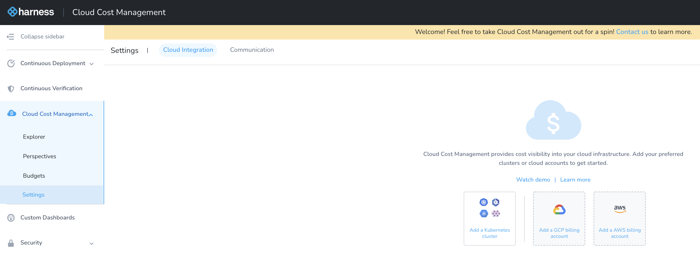

## Set Up Cost Visibility for Kubernetes

Harness Cloud Cost Management (CCM) monitors the cloud costs of your Kubernetes clusters, namespaces, nodes, workloads, and labels.

Once you enable CCM, for the first cluster the data is available within a few minutes for viewing and analysis. However, you will not see the idle cost because of the lack of utilization data. CCM generates the last 30 days of the cost data based on the first events.  
  
From the second cluster onwards, it takes about 2–3 hours for the data to be available for viewing and analysis.

1. In **Cloud Cost Management**, click **Settings**.
2. In **Cloud Integration**, click **Add a Kubernetes cluster**.
   
     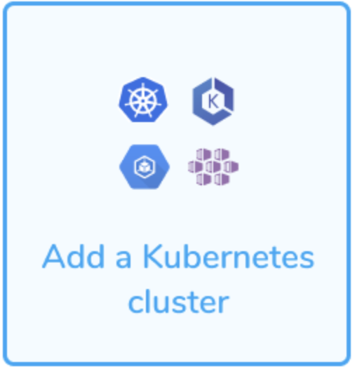
3. In **Download Delegate**, enter the name that will appear in CCM Explorer to identify this cluster.
   
     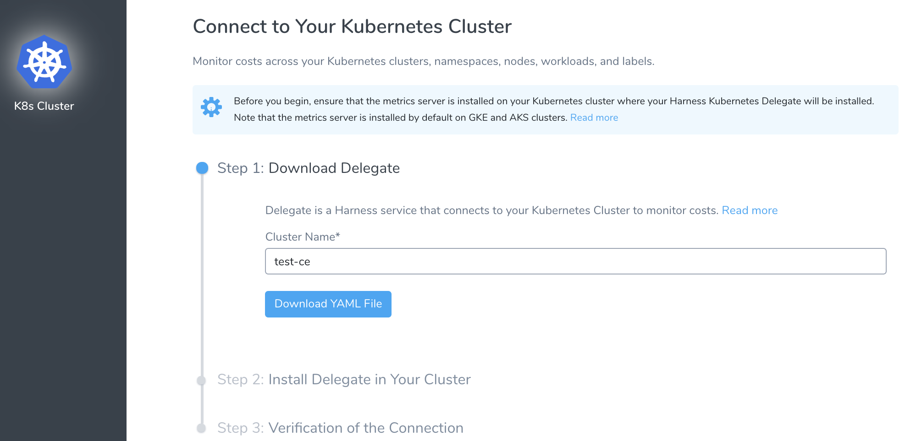
4. Click **Download YAML file**.  

:::note
The YAML file has all the access defined to enable the Harness Kubernetes Delegate to monitor your cluster costs. It also has the Service account details to install and run the Harness Kubernetes Delegate with ClusterRole to access resource metrics.
:::
5. In the Terminal you used to connect to the Kubernetes cluster, run the following command:  
  
`kubectl apply -f ~/Downloads/harness-delegate-kubernetes.yaml`  

:::note
Ensure that you are connected to the Kubernetes cluster.
:::
6. Click **Done**.  
  
Once the Delegate is connected to your Kubernetes cluster, the status turns green.

  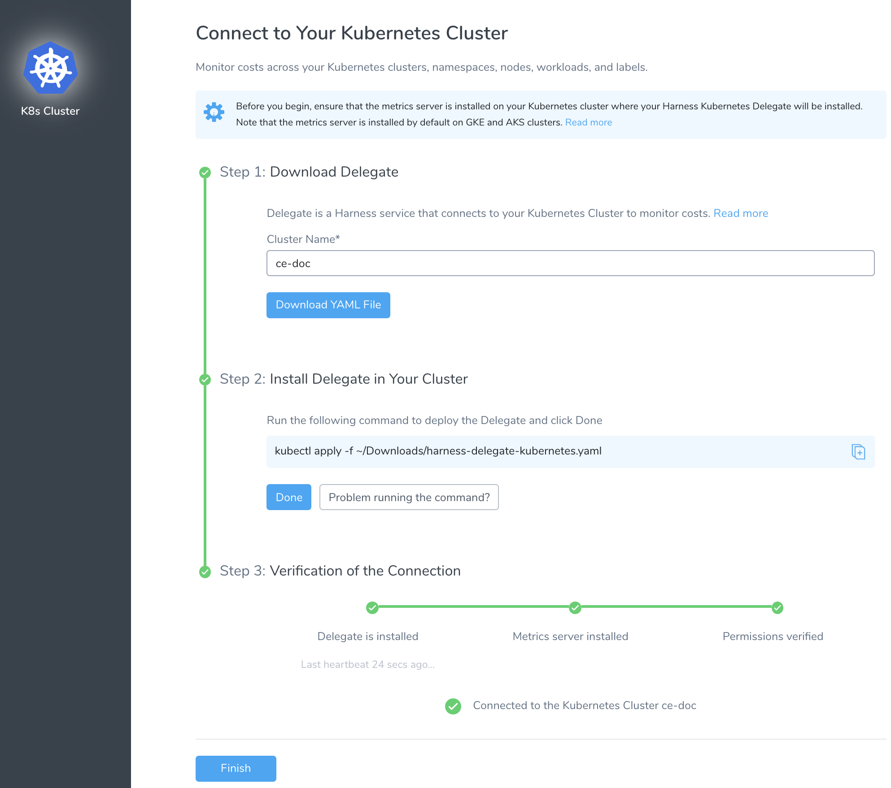
7. Click **Finish**.  
  
The Kubernetes cluster is now listed under **Added Kubernetes Clusters**. Once CCM has data, the cluster is listed in **Cost Explorer**.

### Is Harness Delegate Running in Your Kubernetes Cluster?

Harness Cloud Cost Management (CCM) monitors the cloud costs of your Kubernetes clusters, namespaces, nodes, workloads, and labels. This topic describes how to enable Cloud Cost Management (CCM) for Kubernetes using an existing Harness Delegate.

* **Provide** **CCM Permissions to Harness Delegate**: If the Delegate is already running in the Kubernetes cluster that you want to monitor, the Service account you used to install and run the Harness Kubernetes Delegate is granted a special `ClusterRole` for accessing the resource metrics. For more information, see **Provide CCM Permissions to Harness Delegate** section.
* **Use Single Harness Delegate to Access Multiple Kubernetes Clusters**: You can use a single Harness Delegate to access multiple Kubernetes clusters. To do so, you need to enter specific credentials manually. 
  
    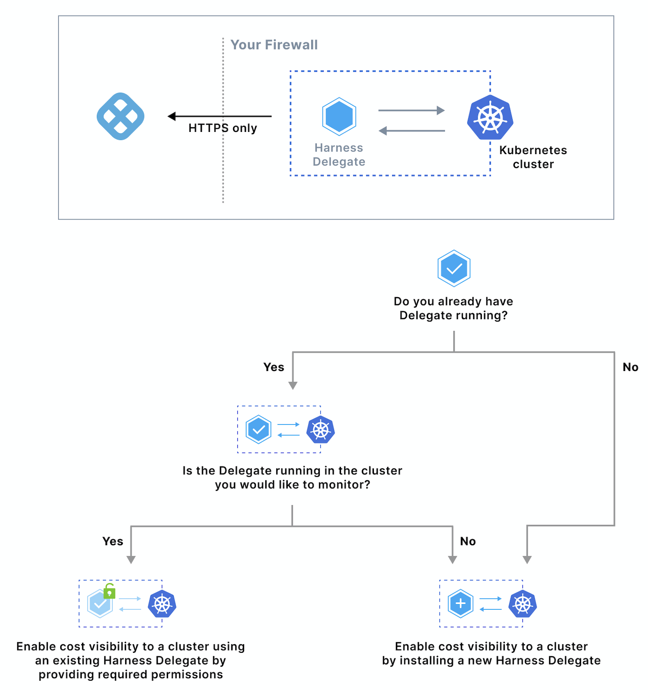

### Prerequisites

* Each Kubernetes cluster you want to monitor must have a Harness Delegate and Cloud Provider associated with it.
* Before enabling CCM for Kubernetes, you must ensure the utilization data for pods and nodes is available. To do so, perform the following steps:

#### Step 1: Install Kubernetes Metrics Server

Metrics Server must be running on the Kubernetes cluster where your Harness Kubernetes Delegate is installed.

Metrics Server is a cluster-wide aggregator of resource usage data. It collects resource metrics from kubelets and exposes them in the Kubernetes API server through Metrics API. For more information, see [Installing the Kubernetes Metrics Server](https://docs.aws.amazon.com/eks/latest/userguide/metrics-server.html) from AWS.

Metrics Server is installed by default on GKE and AKS clusters, however, you need to install it on the AWS EKS cluster.To install metrics server on your EKS clusters, run the following command:


```
kubectl apply -f https://github.com/kubernetes-sigs/metrics-server/releases/download/v0.3.6/components.yaml
```
#### Step 2: Provide CCM Permissions to Harness Delegate

Bind the cluster-admin ClusterRole to a user account. Next, you will use this user account to create a ClusterRole and bind it to the Service account used by the Delegate.

1. Bind a user account to the user in cluster-admin ClusterRole. You will use this user account to create a ClusterRole and bind it to the Harness Kubernetes Delegate Service account later.  
  

```
kubectl create clusterrolebinding cluster-admin-binding \  
--clusterrole cluster-admin \  
--user <firstname.lastname@example.com>
```
2. Obtain the Service account name and namespace used by the Harness Kubernetes Delegate. By default, when you installed the Kubernetes Delegate, the following were used:  
  

```
name: default  
namespace: harness-delegate
```
If you have changed these, obtain the new name and namespace.

3. Download the [ce-default-k8s-cluster-role.yaml](https://raw.githubusercontent.com/harness/continuous-efficiency/master/config/ce-default-k8s-cluster-role.yaml) file from Harness.  
  
The `Subjects` section of the ClusterRoleBinding is configured with the default Delegate Service account name (`default`) and namespace (`harness-delegate`).  
  
If you have changed these defaults, update the ce-default-k8s-cluster-role.yaml file before running it.

4. Once you have downloaded the file, connect to your Kubernetes cluster and run the following command in your Kubernetes cluster:  
  

```
kubectl apply -f ce-default-k8s-cluster-role.yaml
```
5. Verify that you have all the required permissions for the Service account using the following commands:  

```
kubectl auth can-i watch pods   
--as=system:serviceaccount:<your-namespace>:<your-service-account>   
--all-namespaces  
kubectl auth can-i watch nodes   
--as=system:serviceaccount:<your-namespace>:<your-service-account>   
--all-namespaces
```
  

```
kubectl auth can-i get nodemetrics   
--as=system:serviceaccount:<your-namespace>:<your-service-account>   
--all-namespaces  
kubectl auth can-i get podmetrics   
--as=system:serviceaccount:<your-namespace>:<your-service-account>   
--all-namespaces
```
  
Here is an example showing the commands and output using the default Delegate Service account name and namespace:  
  

```
$ kubectl auth can-i watch pods --as=system:serviceaccount:harness-delegate:default --all-namespaces  
yes  
$ kubectl auth can-i watch nodes --as=system:serviceaccount:harness-delegate:default --all-namespaces                                                                      
yes  
$ kubectl auth can-i watch nodemetrics --as=system:serviceaccount:harness-delegate:default --all-namespaces                                                                
yes  
$ kubectl auth can-i watch podmetrics --as=system:serviceaccount:harness-delegate:default --all-namespaces   
yes
```

### Step: Enable Cloud Cost Management

To enable CCM in your cloud environment, you simply need to enable it on the Harness Kubernetes Cloud Provider that connects to your target cluster.

Once you enable CCM, for the first cluster the data is available immediately for viewing and analysis. However, you will not see the idle cost because of the lack of utilization data. CCM generates the last 30 days of the cost data based on the first events.  
  
From the second cluster onwards, it takes about 2-3 hours for the data to be available for viewing and analysis.
1. In **Cloud Cost Management**, click **Settings**.
2. In **Cloud Integration**, in **Added Kubernetes Clusters**, select the Kubernetes cluster for which you want to enable Cloud Cost Management.  
You can also click **Enable Cloud Cost Management**.

  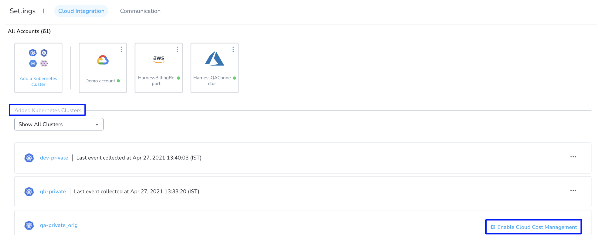
3. In **Display Name**, enter the name that will appear in CCM Explorer to identify this cluster. Typically, this is the cluster name.
   
     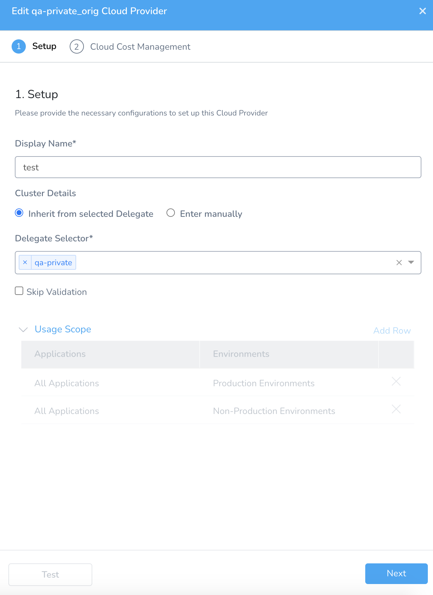
4. In **Cluster Details**, select:
	1. **Inherit from selected Delegate**: (Recommended) Select this option if the Kubernetes cluster is the same cluster where the Harness delegate was installed.
		1. **Delegate Name**: Select the Delegate.
	2. **Enter manually**: In this option, the Cloud Provider uses the credentials that you enter manually. The Delegate uses these credentials to send deployment tasks to the cluster. The Delegate can be outside or within the target cluster.Use this option, if you wish to use a single Delegate to access multiple Kubernetes clusters. To do so, you need to enter specific credentials manually.
		1. **Master Url**: The Kubernetes master node URL. The easiest method to obtain the master URL is using kubectl:  
		`kubectl cluster-info`
5. Click **Next**.
6. Select the checkbox **Enable Cloud Cost Management** and click **Submit**.
   
     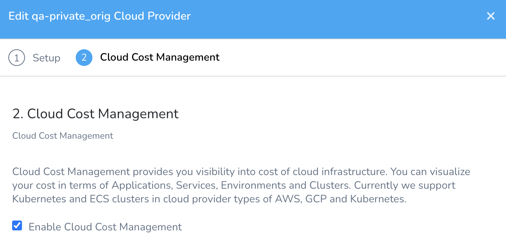  
The Kubernetes Cloud Provider is now listed under **Efficiency Enabled**.  

  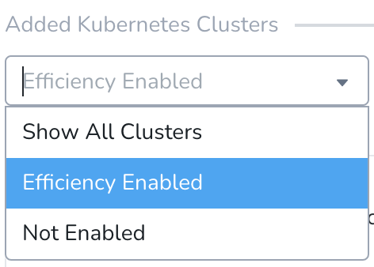

Once CCM has data, the cluster is listed in **Cost Explorer**. The cluster is identified by the **Display Name** you used in the Kubernetes Cloud Provider.

### Set Up Cost Visibility for GCP

Harness Cloud Cost Management (CCM) monitors cloud costs using your GCP products, projects, SKUs, and location. As a first step, you connect Harness to your GCP account to get insights into your cloud infrastructure and GCP services, Compute Engine Cloud Storage, BigQuery, etc. 

1. In **Cloud Cost Management**, click **Settings**.
2. In **Cloud Integration**, click **Add a GCP billing account**.
   
     
3. For detailed instructions on how to enable CCM for your GCP account, see [Set Up Cost Visibility for GCP](/docs/first-gen/cloud-cost-management/setup-cost-visibility/enable-cloud-efficiency-for-google-cloud-platform-gcp.md).

### Set Up Cost Visibility for AWS

Harness Cloud Cost Management (CCM) monitors cloud costs using your Amazon Web Services (AWS). Connect your AWS account to Harness to get insights into your expenses across your cloud infrastructure and AWS services, such as EC2, S3, RDS, Lambda, and so on.

1. In **Cloud Cost Management**, click **Settings**.
2. In **Cloud Integration**, click **Add a AWS billing account**.
   
     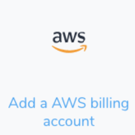
3. For detailed instructions on how to enable CCM for your AWS services (such as EC2, S3, RDS, Lambda, and so on), see [Set Up Cost Visibility for AWS](/docs/first-gen/cloud-cost-management/setup-cost-visibility/enable-continuous-efficiency-for-aws.md).

